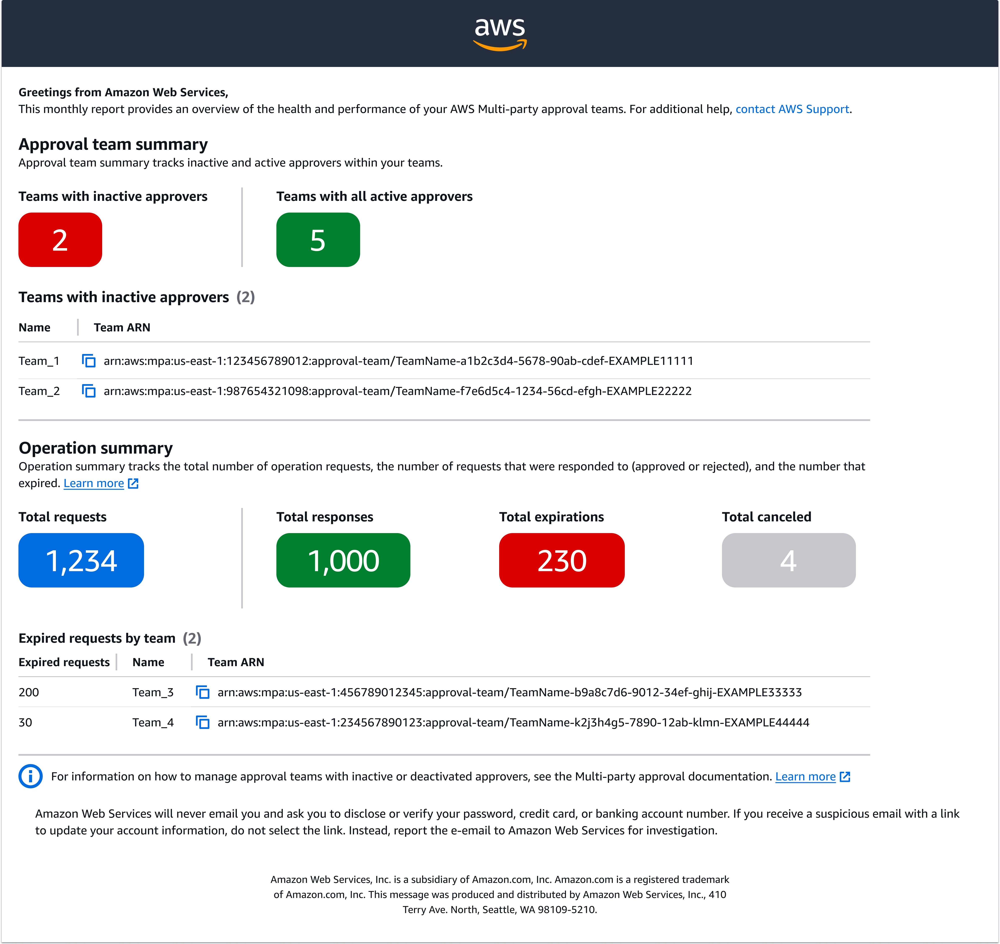

# Team health for Multi-party approval

To help you understand Multi-party approval, this topic describes statuses for Multi-party approval and the monthly report sent to Multi-party approval administrators.

###### Topics

- [Team and workflow status](#team-health-state-status "#team-health-state-status")
- [Monthly team report](#team-health-report "#team-health-report")

## Team and workflow status

The health for an approval team is indicated by its _team status_ (called `Status` in the APIs) and its _workflow status_ (called `StatusCode` in the APIs).

**Team status:** Indicates if a team is functional. This provides the Multi-party approval admin with information about whether a team can respond to requested operations.

**Workflow status:** Provides information about the workflows that are affecting or can affect the team. For example, the state might display `ACTIVE` and the status might display `UPDATE_PENDING_APPROVAL`. This means that the team is functional, but that the Multi-party approval admin has requested team updates and the time window for approvers to respond to the request is still open.

### Team status

The following is a list of team statuses.

| Team status | Description                                                                                                                                              | Functional state |
| ----------- | -------------------------------------------------------------------------------------------------------------------------------------------------------- | ---------------- |
| Active      | Team can respond to requested operations.                                                                                                                | Functional       |
| Pending     | The time window for the initial set of approvers to accept the team invitations is still open, or AWS is still validating the configuration of the team. | Not Functional   |
| Inactive    | Multi-party approval admin must update the team for it to become functional.                                                                             | Not Functional   |

### Workflow status

The following is a list of workflow statuses.

| Team status               | Workflow status                                                                                                                                                                                                                   | Description                                                                                                                                                                                                                                                                                                                                                                                                                                                                 |
| ------------------------- | --------------------------------------------------------------------------------------------------------------------------------------------------------------------------------------------------------------------------------- | --------------------------------------------------------------------------------------------------------------------------------------------------------------------------------------------------------------------------------------------------------------------------------------------------------------------------------------------------------------------------------------------------------------------------------------------------------------------------- |
| Active                    | Update pending approval                                                                                                                                                                                                           | Updates to the team are pending approval. If approved, the updates will be applied. If rejected, The Multi-party approval admin can resubmit updates for approval, and try again. The approval session expires after 24 hours. Inviting new approvers can extend the time window up to 48 hours: 24 hours for the approval session and 24 hours for newly invited approvers to respond to the team invitation. The team remains active throughout the update process. |
| Update pending activation | Updates to the team are pending because invitations have been sent to new approvers and are awaiting responses. Invitations expire after 24 hours. The team remains active throughout the update process.                   |
| Update failed approval    | Updates to the team failed because the update request did not meet the approval threshold. The Multi-party approval admin can resubmit updates for approval, and try again.                                                    |
| Update failed validation  | Updates to the team failed because the configuration of the team was invalid. For example, the identity information for an approver was invalid. The Multi-party approval admin can edit the list of approvers, and try again. |
| Update failed activation  | Updates to the team failed because at least one newly invited approver declined the team invitation. The Multi-party approval admin can edit the list of approvers, and try again.                                             |
| Delete pending approval   | Request to delete the team is pending approval. The delete request expires after 24 hours. The team remains active until the delete request is approved.                                                                    |
| Delete failed approval    | Request to delete the team failed because it did not meet the approval threshold.                                                                                                                                                 |
| Pending                   | Validating                                                                                                                                                                                                                        | Team is pending because AWS is validating the configuration of the team.                                                                                                                                                                                                                                                                                                                                                                                                    |
| Pending activation        | Team is pending because invitations have been sent to approvers and are awaiting responses. Invitations expire after 24 hours.                                                                                                 |
| Inactive                  | Failed validation                                                                                                                                                                                                                 | Team is inactive because the configuration of the team was invalid. For example, the identity information for an approver was invalid. The Multi-party approval admin can edit the list of approvers, and try again.                                                                                                                                                                                                                                                     |
| Failed activation         | Team is inactive because at least one invited approver declined the team invitation. The Multi-party approval admin can edit the list of approvers, and try again.                                                             |

## Monthly team report

As a Multi-party approval admin, the monthly team report is sent to you to help you maintain the health of your approval teams. You receive an email for the management account that you used to set up Multi-party approval.

| Section               | Details                                                                                                                                                                                            |
| --------------------- | -------------------------------------------------------------------------------------------------------------------------------------------------------------------------------------------------- |
| Approval team summary | • Number of teams with all active approvers • Number of teams with inactive approvers • List of team names and Amazon Resource Names (ARNs) for teams with inactive approvers                |
| Operation summary     | • Number of total requested operations • Number of total responses to requested operations • Number of total expired requested operations • Number of total canceled requested operations |

_Figure 3: Diagram depicting the Multi-party approval monthly team report._
