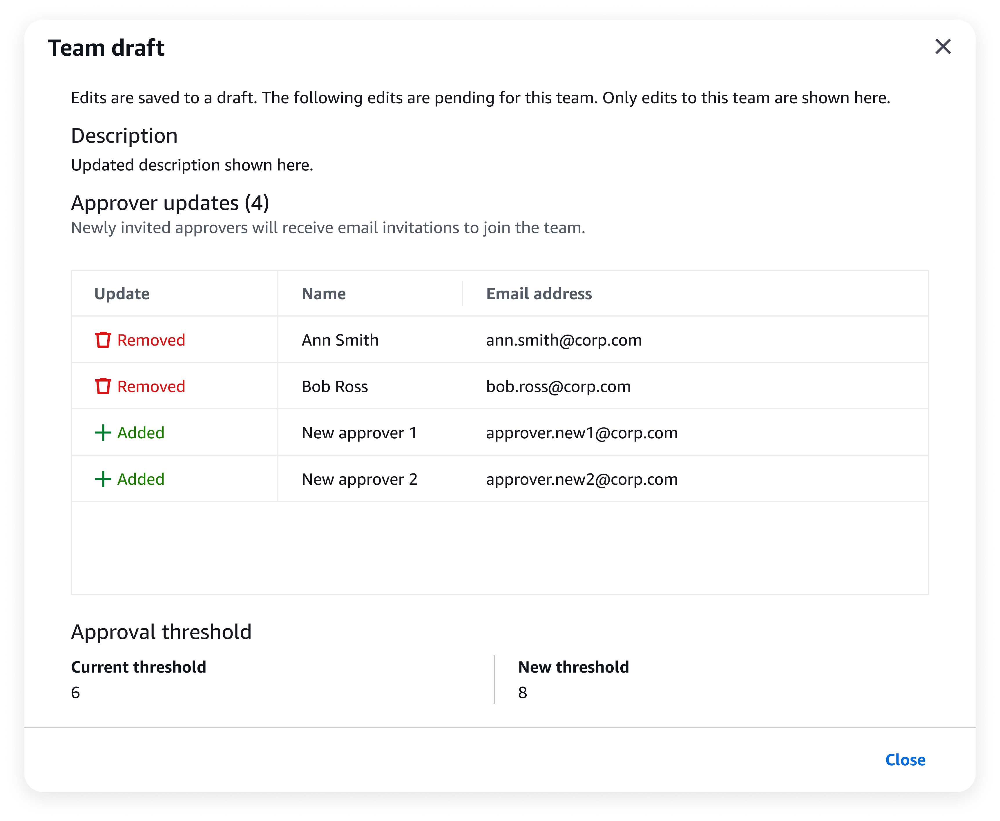

# Update an approval team

When you sign in to your organization's management account, you can request to update your approval
teams by navigating to the Multi-party approval console.

As the Multi-party approval administrator, you can request to update the team description, approval threshold, and approvers assigned to a team. This creates an approval session for the request.

## Update an approval team

To update a team, complete the following steps.

**Minimum permissions**

To update a team, you need permission to run the following actions:

- `mpa:UpdateApprovalTeam`

If you are using the AWS Management Console, you also need permission to run the following actions:

- `kms:Decrypt`
- `organizations:DescribeOrganization`
- `organizations:ListDelegatedAdministrators`
- `sso:DescribeInstance`
- `sso:GetSharedSsoConfiguration`
- `sso:ListInstances`
- `sso-directory:DescribeUsers`
- `sso-directory:SearchUsers`

AWS Management Console

###### To update a team

1. Open the Organizations console at [https://console.aws.amazon.com/organizations/](https://console.aws.amazon.com/organizations/ "https://console.aws.amazon.com/organizations/").
2. On the left navigation, choose **Multi-party approval**.
3. On the **Team** column, select a team to view its details.
4. On the team page, choose **Edit**.
5. On the **Edit approval team** page, you can update the following information:
   - **Description:** Description for the team.
   - **Approvers**: Choose **Assign approvers** to open a dialog box for selecting IAM Identity Center users to add or remove from the team. Teams must have at least three approvers
   - **Minimum required approvals**: Minimum number of approvals needed for a protected operation to run. It is recommended to set an approval threshold below the total number of approvers. The approval threshold must be at least two.

6. After you have finished updating your information, choose **Edit**.

AWS CLI & AWS SDKs

###### To update a team

You can use one of the following operations:

- AWS CLI: [list-instances](../../../cli/latest/reference/sso-admin/list-instances.md "../../../cli/latest/reference/sso-admin/list-instances.md"), [list-users](../../../cli/latest/reference/identitystore/list-users.md "../../../cli/latest/reference/identitystore/list-users.md"), [list-approval-teams](../../../cli/latest/reference/mpa/list-approval-teams.md "../../../cli/latest/reference/mpa/list-approval-teams.md") and [update-approval-team](../../../cli/latest/reference/mpa/update-approval-team.md "../../../cli/latest/reference/mpa/update-approval-team.md")
  1.  (If assigning new approvers) Run the following command to return a list of Amazon Resource Names (ARNs) for your IAM Identity Center instances:

  ```
  `$` `C:\>` **aws sso-admin list-instances**
  ```

  This returns the `IdentityStoreId` you need to get user IDs (Step 2). 2. (If assigning new approvers) Run the following command to return a list of user IDs from the identity store of your choice:

  ```
  `$` `C:\>` **aws identitystore list-users --identity-store-id `identitystoreId`**
  ```

  This returns the `UserId` you need for `PrimaryIdentityId` (Step 5). 3. (If assigning new approvers) Run the following command to return the Amazon Resource Name (ARN) for your Multi-party approval identity source:

  ```
  `$` `C:\>` **aws mpa list-identity-sources**
  ```

  This returns the `IdentitySourceArn` you need for `PrimaryIdentitySourceArn` (Step 5). 4. Run the following command to return a list of Amazon Resource Names (ARNs) for teams:

  ```
  `$` `C:\>` **aws mpa list-approval-teams**
  ```

  This returns the `Arn` you need for `arn` (Step 5). 5. Run the following command to update a team:

  ```
  `$` `C:\>` **aws mpa update-approval-team \
   --arn arn:aws:mpa:`region`:`123456789012`:approval-team/`TeamName-a1b2c3d4-5678-90ab-cdef-EXAMPLE11111` \
   --description "`Description for my team`" \
   --approval-strategy '{"MofN":{"MinApprovalsRequired":`integer`}}' \
   --approvers '[{"PrimaryIdentityId":"`544894e8-80c1-707f-60e3-3ba6510dfac1`","PrimaryIdentitySourceArn":"arn:aws:mpa:`region`:`123456789012`:identity-sources/IamIdentityCenter"}]'**
  ```

      + **`arn`**: Amazon Resource Name (ARN) for the team.
      + **`description`** (Optional): Description for the team.
      + **`approval-strategy`** (Optional): Contains an `ApprovalStrategy` object. Currently, only `MofNApprovalStrategy` is supported. This object specifies the minimum number of approvals (M) required for a total number of approvers (N). The integer you specify is the approval threshold.
       It is recommended to set an approval threshold below the total number of approvers.
      + **`approvers`** (Optional): List of approvers. Each approver requires:


      	- **`PrimaryIdentitySourceArn`**: Amazon Resource Name (ARN) for the Multi-party approval identity source.
      	- **`PrimaryIdentityId`**: ID for the approver you want to assign to the team.

- AWS SDKs: [ListInstances](../../../singlesignon/latest/APIReference/API_ListInstances.md "../../../singlesignon/latest/APIReference/API_ListInstances.md"), [ListUsers](../../../singlesignon/latest/IdentityStoreAPIReference/API_ListUsers.md "../../../singlesignon/latest/IdentityStoreAPIReference/API_ListUsers.md"), [ListApprovalTeams](../APIReference/API_ListApprovalTeams.md "../APIReference/API_ListApprovalTeams.md"), and [UpdateApprovalTeam](../APIReference/API_UpdateApprovalTeam.md "../APIReference/API_UpdateApprovalTeam.md")

###### What to do next

After you request to update a team, you can monitor the team status in the Multi-party approval console or using the AWS CLI & AWS SDKs.
For more information, see [View team](admin-view-team.md "admin-view-team.md"). To cancel an update, see [Cancel session](cancel-session.md "cancel-session.md").

## Updates and team drafts

When you request to update a team, Multi-party approval creates a team draft which contains the proposed changes.



_Figure 1: Team draft as displayed in the Multi-party approval console._

### Workflows for drafts

The following are the workflows for team drafts.

- When you request to update a team, the draft enters an _update pending approval_ state. This starts a 24-hour approval session.
- If the update is approved, the edits in the draft are applied to the team. The team now operates with the applied changes.
- If the update is rejected, the draft enters an _update failed approval_ state. You can delete the draft, or re-edit for approval and try again.
- If the update includes inviting new approvers, the draft will enter a _update pending activation_ state if the update is approved. The team remains functional while newly invited approvers have 24 additional hours to respond to the team invitation.
- If at least one newly invited approver declines the team invitation or the invitation expires, the draft enters an _update failed activation_ state. You can delete the draft, or re-edit for approval and try again.

For more information about statuses, see [Team health](team-health.md "team-health.md").

### Interacting with drafts

AWS Management Console

###### To view a draft

1. Open the Organizations console at [https://console.aws.amazon.com/organizations/](https://console.aws.amazon.com/organizations/ "https://console.aws.amazon.com/organizations/").
2. On the left navigation, choose **Multi-party approval**.
3. On the **Multi-party approval** console, you can view a list of your teams.
4. On the **Team** column, select team with the draft you want to view.
5. On the team page, select **View draft** in the alert banner.

AWS CLI & AWS SDKs
**To view a draft**

You can follow the steps for the AWS CLI & AWS SDKs in [View team](admin-view-team.md "admin-view-team.md") to view a draft. The `PendingUpdate` object represents the team draft, if applicable.

This object appears as part of the [GetApprovalTeam](../APIReference/API_GetApprovalTeam.md "../APIReference/API_GetApprovalTeam.md") API response when there is a pending update for a team. It contains all the proposed changes that are awaiting approval or activation.

AWS Management Console

###### To delete a draft

1. Open the Organizations console at [https://console.aws.amazon.com/organizations/](https://console.aws.amazon.com/organizations/ "https://console.aws.amazon.com/organizations/").
2. On the left navigation, choose **Multi-party approval**.
3. On the **Multi-party approval** console, you can view a list of your teams.
4. On the **Team** column, select team with the draft you want to delete.
5. On the team page, select **Cancel draft** in the alert banner, if applicable.
6. On the team page, select **Delete draft** in the alert banner.

AWS CLI & AWS SDKs
**To delete a draft**

The method to delete a draft depends on its current state. For more information, see [Team health](team-health.md "team-health.md").

Use the [CancelSession](../APIReference/API_CancelSession.md "../APIReference/API_CancelSession.md") API for drafts in the following pending state:

- Update pending approval

You can follow the steps for the AWS CLI & AWS SDKs in [Cancel session](cancel-session.md "cancel-session.md"). When you use APIs to cancel the session associated with the draft, the draft is deleted.

Use the [DeleteInactiveApprovalTeamVersion](../APIReference/API_DeleteInactiveApprovalTeamVersion.md "../APIReference/API_DeleteInactiveApprovalTeamVersion.md") API for drafts in the following failed states:

- Update failed approval
- Update failed validation
- Update failed activation

You can follow the steps for the AWS CLI & AWS SDKs in [Delete team](delete-team.md "delete-team.md") for inactive teams. An inactive team is a draft which failed to become the active team version. Use the `VersionID` for the `PendingUpdate` object, which represents the team draft.

## Considerations

**Updates require team approval**

Updates to an active team must be approved by the team. Updates that include inviting new approvers require both team approval and for every newly invited approver to accept the team invitation.

**One update at a time**

Multi-party approval allows only one update to a team at a time. Previous updates must be canceled before you try additional updates.

**Updating teams with inactive approvers**

If there are enough active approvers in a team to meet the approval threshold,
the team can continue to operate. This includes removing inactive approvers, assigning new approvers, or adjusting the approval threshold.

If there are not enough active approvers, see [Team recovery](troubleshooting.md#team-recovery "troubleshooting.md#team-recovery").
