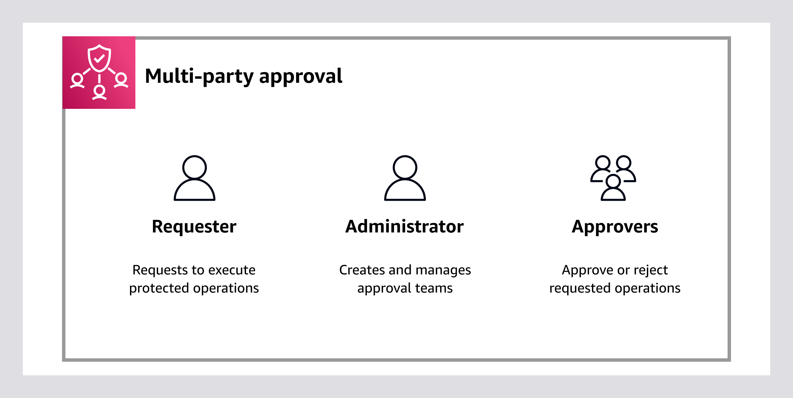
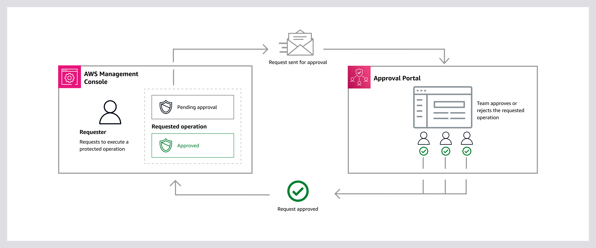

# What is Multi-party approval?

**Security through approval**

Multi-party approval is a capability of [AWS Organizations](https://aws.amazon.com/organizations "https://aws.amazon.com/organizations") that allows you to protect a predefined list of operations through a distributed approval process.
Use Multi-party approval to establish approval workflows and transform security processes into team-based decisions.

_Figure 1: Diagram depicting the job functions for Multi-party approval._

| Requester                                                                                                                                                                                                                                                                                                                                                                           | Administrator                                                                                                                                                                                                                                                                                                                                                                                                                                                                                                                                      | Approver                                                                                                                                                                                                                                                                                                                                                                                                                       |
| ----------------------------------------------------------------------------------------------------------------------------------------------------------------------------------------------------------------------------------------------------------------------------------------------------------------------------------------------------------------------------------- | -------------------------------------------------------------------------------------------------------------------------------------------------------------------------------------------------------------------------------------------------------------------------------------------------------------------------------------------------------------------------------------------------------------------------------------------------------------------------------------------------------------------------------------------------- | ------------------------------------------------------------------------------------------------------------------------------------------------------------------------------------------------------------------------------------------------------------------------------------------------------------------------------------------------------------------------------------------------------------------------------ |
| • Makes a request to execute a [protected operation](mpa-concepts.md#mpa-protected-operation "mpa-concepts.md#mpa-protected-operation") • Waits for the associated [approval team](mpa-concepts.md#mpa-team-term "mpa-concepts.md#mpa-team-term") to review the requested operation • Understands that a protected operation requires team approval before it can be executed | • Creates approval teams by inviting [AWS IAM Identity Center users](../../../singlesignon/latest/userguide/identities.md "../../../singlesignon/latest/userguide/identities.md") • Manages approval teams by requesting [team updates](update-team.md "update-team.md") or to [delete a team](delete-team.md "delete-team.md"). Requests by the admin require team approval to take effect • Understands that an approval team becomes [active](team-health.md "team-health.md") only if every invited approver accepts the team invitation | • Receives email notifications when a requester attempts to execute a protected operation • Uses the link in the email notification to visit the [Multi-party approval portal](mpa-concepts.md#mpa-portal "mpa-concepts.md#mpa-portal") • [Responds to requested operations](respond-request.md "respond-request.md") and [views operation history](view-operation-history.md "view-operation-history.md") in the portal |

## Example scenario: Protect logically air-gapped vaults

You can use Multi-party approval with AWS Backup. AWS Backup offers logically air-gapped vaults, which are backup vaults with increased security features.
For more information,
see [Logically air-gapped vault](../../../aws-backup/latest/devguide/logicallyairgappedvault.md "../../../aws-backup/latest/devguide/logicallyairgappedvault.md") in the _AWS Backup Developer Guide_.

When a logically air-gapped vault is protected with Multi-party approval, a request to create a restore access backup vault must go through an [approval session](mpa-concepts.md#mpa-session "mpa-concepts.md#mpa-session").
This means that the `CreateRestoreAccessVault` operation will require team approval before it can be executed.
In Figure 2, this is represented with `CreateRestoreAccessVault` as the requested operation in the dotted box in a pending approval state. The approval session for the requested operation takes place in the [approval portal](mpa-concepts.md#mpa-portal "mpa-concepts.md#mpa-portal").

If the access request is approved, AWS Backup creates a restore access backup vault in the requester's account.
This restore access backup vault is the requester's connection to the logically air-gapped vault.
In Figure 2, this is represented with the requested operation in the dotted box moving from pending approval to approved.

For more information, see [How Multi-party approval works](how-it-works.md "how-it-works.md"). To get started, see [Set up Multi-party approval](setting-up.md "setting-up.md").

_Figure 2: Diagram depicting how Multi-party approval works. You can also use the AWS CLI & AWS SDKs instead of the AWS Management Console._

## When to use Multi-party approval

When Multi-party approval is beneficial

- You need to align with the Zero Trust principle of "never trust, always verify"
- You need to make sure that the right humans have access to the right things in the right way
- You need distributed decision-making for sensitive or critical operations
- You need to protect against unintended operations on sensitive or critical resources
- You need formal reviews and approvals for auditing or compliance reasons

When Multi-party approval might not be the best choice

- For standalone AWS accounts that don't use AWS Organizations and IAM Identity Center
- For operations that require immediate execution without delay
- For scenarios where the overhead of managing approval teams and workflows isn't justified by the risk

## What operations are currently supported with Multi-party approval

| AWS service                                                                 | Benefits of using with Multi-party approval                                                                                                                                                                                                                                                                                                                            | Protected operation                                                                                                                                                                                                                                                                                                                                                                                                                                                                                                                                                                                                                                                                                                                                                                                                     | Learn more                                                                                                                                                                                                                                   |
| --------------------------------------------------------------------------- | ---------------------------------------------------------------------------------------------------------------------------------------------------------------------------------------------------------------------------------------------------------------------------------------------------------------------------------------------------------------------- | ----------------------------------------------------------------------------------------------------------------------------------------------------------------------------------------------------------------------------------------------------------------------------------------------------------------------------------------------------------------------------------------------------------------------------------------------------------------------------------------------------------------------------------------------------------------------------------------------------------------------------------------------------------------------------------------------------------------------------------------------------------------------------------------------------------------------- | -------------------------------------------------------------------------------------------------------------------------------------------------------------------------------------------------------------------------------------------- |
| [AWS Backup](https://aws.amazon.com/backup "https://aws.amazon.com/backup") | An an AWS Backup customer, you can use Multi-party approval to grant approval capabilities of some operations to a group of trusted individuals who can collaboratively approve access to a logically air-gapped vault from a separately-created recovery account in the case of suspected malicious activity that may compromise use of the primary account. | [`CreateRestoreAccessBackupVault`](../../../aws-backup/latest/devguide/API_CreateRestoreAccessBackupVault.md "../../../aws-backup/latest/devguide/API_CreateRestoreAccessBackupVault.md") [`AssociateBackupVaultMpaApprovalTeam`](../../../aws-backup/latest/devguide/API_AssociateBackupVaultMpaApprovalTeam.md "../../../aws-backup/latest/devguide/API_AssociateBackupVaultMpaApprovalTeam.md") [`DisassociateBackupVaultMpaApprovalTeam`](../../../aws-backup/latest/devguide/API_DisassociateBackupVaultMpaApprovalTeam.md "../../../aws-backup/latest/devguide/API_DisassociateBackupVaultMpaApprovalTeam.md") [`RevokeRestoreAccessBackupVault`](../../../aws-backup/latest/devguide/API_RevokeRestoreAccessBackupVault.md "../../../aws-backup/latest/devguide/API_RevokeRestoreAccessBackupVault.md") | For more information, see [Multi-party approval for logically air-gapped vaults](../../../aws-backup/latest/devguide/multipartyapproval.md "../../../aws-backup/latest/devguide/multipartyapproval.md") in the _AWS Backup Developer Guide_. |

## Required services

Multi-party approval requires [AWS Organizations](https://aws.amazon.com/organizations "https://aws.amazon.com/organizations") and [AWS IAM Identity Center](https://aws.amazon.com/iam/identity-center "https://aws.amazon.com/iam/identity-center").
