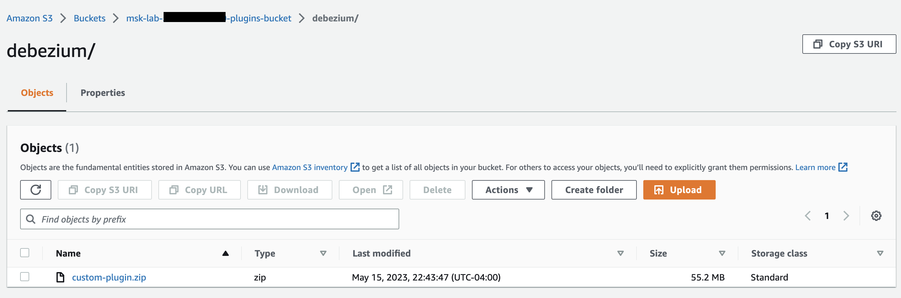

# Tutorial: Externalizing sensitive information using config

providers

This example shows how to externalize sensitive information for Amazon MSK Connect using an open
source configuration provider. A configuration providers lets you specify variables instead of
plaintext in a connector or worker configuration, and workers running in your connector resolve
these variables at runtime. This prevents credentials and other secrets from being stored in
plaintext. The configuration provider in the example supports retrieving configuration
parameters from AWS Secrets Manager, Amazon S3 and Systems Manager (SSM). In [Step 2](#msk-connect-config-providers "#msk-connect-config-providers"), you can see how to set up storage and
retrieval of sensitive information for the service that you want to configure.

## Considerations

Consider the following while using the MSK config provider with Amazon MSK Connect:

- Assign appropriate permissions when using the config providers to the IAM Service Execution Role.
- Define the config providers in worker configurations and their implementation in the connector configuration.
- Sensitive configuration values can appear in connector logs if a plugin does not
  define those values as secret. Kafka Connect treats undefined configuration values the
  same as any other plaintext value. To learn more, see [Preventing secrets from appearing in connector
  logs](msk-connect-logging.md#msk-connect-logging-secrets "msk-connect-logging.md#msk-connect-logging-secrets").
- By default, MSK Connect frequently restarts a connector when the connector uses a
  configuration provider. To turn off this restart behavior, you can set the
  `config.action.reload` value to `none` in your connector
  configuration.

## Create a custom plugin and upload to S3

To create a custom-plugin, create a zip file that contains the connector and the
msk-config-provider by running the following commands on your local machine.

###### To create a custom plugin using a terminal window and Debezium as the

connector

Use the AWS CLI to run commands as a superuser with
credentials that allow you to access your AWS S3 bucket. For information on installing
and setting up the AWS CLI, see [Getting started with the AWS CLI](../../../cli/latest/userguide/cli-chap-getting-started.md "../../../cli/latest/userguide/cli-chap-getting-started.md") in the _AWS Command Line Interface User Guide_. For information on using the AWS CLI with Amazon S3, see [Using Amazon S3 with the AWS CLI](../../../cli/latest/userguide/cli-services-s3.md "../../../cli/latest/userguide/cli-services-s3.md") in the _AWS Command Line Interface User Guide_.

1. In a terminal window, create a folder named `custom-plugin` in your workspace using the
   following command.

```
mkdir custom-plugin && cd custom-plugin
```

2. Download the latest stable release of the **MySQL Connector
   Plug-in** from the [Debezium
   site](https://debezium.io/releases/ "https://debezium.io/releases/") using the following command.

```
wget https://repo1.maven.org/maven2/io/debezium/debezium-connectormysql/
2.2.0.Final/debezium-connector-mysql-2.2.0.Final-plugin.tar.gz
```

Extract the downloaded gzip file in the `custom-plugin` folder using
the following command.

```
tar xzf debezium-connector-mysql-2.2.0.Final-plugin.tar.gz
```

3. Download the [MSK config provider zip file](https://github.com/aws-samples/msk-config-providers/releases/download/r0.4.0/msk-config-providers-0.4.0-with-dependencies.zip "https://github.com/aws-samples/msk-config-providers/releases/download/r0.4.0/msk-config-providers-0.4.0-with-dependencies.zip") using the following command.

```
wget https://github.com/aws-samples/msk-config-providers/releases/download/r0.4.0/msk-config-providers-0.4.0-with-dependencies.zip
```

Extract the downloaded zip file in the `custom-plugin` folder using the
follwoing command.

```
unzip msk-config-providers-0.4.0-with-dependencies.zip
```

4. Zip the contents of the MSK config provider from the above step and the custom
   connector into a single file named `custom-plugin.zip`.

```
zip -r ../custom-plugin.zip *
```

5. Upload the file to S3 to be referenced later.

```
aws s3 cp ../custom-plugin.zip s3:<`S3_URI_BUCKET_LOCATION`>
```

6. On the Amazon MSK console, under the **MSK Connect** section, choose
   **Custom Plugin**, then choose **Create custom
   plugin** and browse the
   **s3:<`S3_URI_BUCKET_LOCATION`>** S3
   bucket to select the custom plugin ZIP file you just uploaded.

 7. Enter `debezium-custom-plugin` for the plugin name. Optionally, enter a
description and choose **Create Custom Plugin**.


## Configure parameters and permissions for different providers

You can configure parameter values in these three services:

- Secrets Manager
- Systems Manager Parameter Store
- S3 - Simple Storage Service

Choose one of the tabs below for instructions on setting up parameters and relevant
permissions for that service.

Configure in Secrets Manager

###### To configure parameter values in Secrets Manager

1. Open the [Secrets Manager
   console](https://console.aws.amazon.com/secretsmanager/ "https://console.aws.amazon.com/secretsmanager/").
2. Create a new secret to store your credentials or secrets. For instructions, see [Create an AWS Secrets Manager secret](../../../secretsmanager/latest/userguide/create_secret.md "../../../secretsmanager/latest/userguide/create_secret.md") in the _AWS Secrets Manager User Guide_.
3. Copy your secret's ARN.
4. Add the Secrets Manager permissions from the following example policy to your [Service execution role](msk-connect-service-execution-role.md "msk-connect-service-execution-role.md"). Replace the example ARN, `arn:aws:secretsmanager:`us-east-1`:`123456789012`:secret:`MySecret-1234``, with the ARN of your secret.
5. Add worker configuration and connector instructions.

```
`{
 "Version":"2012-10-17",
 "Statement": [
 {
 "Effect": "Allow",
 "Action": [
 "secretsmanager:GetResourcePolicy",
 "secretsmanager:GetSecretValue",
 "secretsmanager:DescribeSecret",
 "secretsmanager:ListSecretVersionIds"
 ],
 "Resource": [
 "arn:aws:secretsmanager:`us-east-1`:`123456789012`:secret:`MySecret-1234`"
 ]
 }
 ]
 }`

```

6. For using the Secrets Manager configuration provider, copy the following lines of code to the worker configuration textbox in Step 3:

```
# define name of config provider:

config.providers = secretsmanager

# provide implementation classes for secrets manager:

config.providers.secretsmanager.class = com.amazonaws.kafka.config.providers.SecretsManagerConfigProvider

# configure a config provider (if it needs additional initialization), for example you can provide a region where the secrets or parameters are located:

config.providers.secretsmanager.param.region = us-east-1

```

7. For the secrets manager configuration provider, copy the following lines of code in the connector configuration in Step 4.

```
#Example implementation for secrets manager variable
database.user=${secretsmanager:MSKAuroraDBCredentials:username}
database.password=${secretsmanager:MSKAuroraDBCredentials:password}
```

You may also use the above step with more configuration providers.

Configure in Systems Manager Parameter Store

######

To configure parameter values in Systems Manager Parameter Store

1. Open the [Systems Manager
   console](https://console.aws.amazon.com/systems-manager/ "https://console.aws.amazon.com/systems-manager/").
2. In the navigation pane, choose **Parameter Store**.
3. Create a new parameter to store in the Systems Manager. For instructions, see [Create a Systems Manager parameter (console)](../../../systems-manager/latest/userguide/parameter-create-console.md "../../../systems-manager/latest/userguide/parameter-create-console.md") in the AWS Systems Manager User Guide.
4. Copy your parameter's ARN.
5. Add the Systems Manager permissions from the following example policy to your [Service
   execution role](msk-connect-service-execution-role.md "msk-connect-service-execution-role.md"). Replace
   `<arn:aws:ssm:us-east-1:123456789000:parameter/MyParameterName>` with the ARN of
   your parameter.

```
`{
 "Version":"2012-10-17",
 "Statement": [
 {
 "Sid": "VisualEditor0",
 "Effect": "Allow",
 "Action": [
 "ssm:GetParameterHistory",
 "ssm:GetParametersByPath",
 "ssm:GetParameters",
 "ssm:GetParameter"
 ],
 "Resource": "`arn:aws:ssm:us-east-1:123456789000:parameter/MyParameterName`"
 }
 ]
 }`

```

6. For using the parameter store configuration provider, copy the following lines of code to the worker configuration textbox in Step 3:

```
# define name of config provider:

config.providers = ssm

# provide implementation classes for parameter store:

config.providers.ssm.class = com.amazonaws.kafka.config.providers.SsmParamStoreConfigProvider

# configure a config provider (if it needs additional initialization), for example you can provide a region where the secrets or parameters are located:

config.providers.ssm.param.region = us-east-1

```

7. For the parameter store configuration provider copy the following lines of code in the connector configuration in Step 5.

```
#Example implementation for parameter store variable
schema.history.internal.kafka.bootstrap.servers=${`ssm::MSKBootstrapServerAddress`}

```

You may also bundle the above two steps with more configuration providers.

Configure in Amazon S3

###### To configure objects/files in Amazon S3

1. Open the [Amazon S3
   console](https://console.aws.amazon.com/s3/ "https://console.aws.amazon.com/s3/").
2. Upload your object to a bucket in S3. For instructions, see [Uploading objects](../../../AmazonS3/latest/userguide/upload-objects.md "../../../AmazonS3/latest/userguide/upload-objects.md").
3. Copy your object's ARN.
4. Add the Amazon S3 Object Read permissions from the following example policy to your [Service execution role](msk-connect-service-execution-role.md "msk-connect-service-execution-role.md"). Replace the example ARN, `arn:aws:s3:::`<MY_S3_BUCKET/path/to/custom-plugin.zip>``, with the ARN of your object.

```
`{
 "Version":"2012-10-17",
 "Statement": [
 {
 "Sid": "VisualEditor0",
 "Effect": "Allow",
 "Action": "s3:GetObject",
 "Resource": "arn:aws:s3:::`<MY_S3_BUCKET/path/to/custom-plugin.zip>`"
 }
 ]
 }`

```

5. For using the Amazon S3 configuration provider, copy the following lines of code to the worker configuration text-box in Step 3:

```
# define name of config provider:

config.providers = s3import
# provide implementation classes for S3:

config.providers.s3import.class = com.amazonaws.kafka.config.providers.S3ImportConfigProvider


```

6. For the Amazon S3 configuration provider, copy the following lines of code to the connector configuration in Step 4.

```
#Example implementation for S3 object

database.ssl.truststore.location = ${s3import:us-west-2:my_cert_bucket/path/to/trustore_unique_filename.jks}

```

You may also bundle the above two steps with more configuration
providers.

## Create a custom worker configuration with information about your configuration provider

1. Select **Worker configurations** under the **Amazon MSK Connect** section.
2. Select **Create worker configuration**.
3. Enter `SourceDebeziumCustomConfig` in the Worker Configuration Name textbox. The Description is optional.
4. Copy the relevant configuration code based on the providers desired, and paste it in the **Worker configuration** textbox.
5. This is an example of the worker configuration for all the three providers:

```
key.converter=org.apache.kafka.connect.storage.StringConverter
key.converter.schemas.enable=false
value.converter=org.apache.kafka.connect.json.JsonConverter
value.converter.schemas.enable=false
offset.storage.topic=offsets_my_debezium_source_connector

# define names of config providers:

config.providers=secretsmanager,ssm,s3import

# provide implementation classes for each provider:

config.providers.secretsmanager.class    = com.amazonaws.kafka.config.providers.SecretsManagerConfigProvider
config.providers.ssm.class               = com.amazonaws.kafka.config.providers.SsmParamStoreConfigProvider
config.providers.s3import.class          = com.amazonaws.kafka.config.providers.S3ImportConfigProvider

# configure a config provider (if it needs additional initialization), for example you can provide a region where the secrets or parameters are located:


config.providers.secretsmanager.param.region = us-east-1
config.providers.ssm.param.region = us-east-1

```

6. Click on Create worker configuration.

## Create the connector

1. Create a new connector using the instructions in [Create a new connector](mkc-create-connector.md "mkc-create-connector.md").
2. Choose the `custom-plugin.zip` file that you uploaded to your S3 bucket in [Create a custom plugin and upload to S3](#msk-connect-config-providers-create-custom-plugin "#msk-connect-config-providers-create-custom-plugin") as the source for the
   custom plugin.
3. Copy the relevant configuration code based on the providers desired, and paste them in the Connector configuration field.
4. This is an example for the connector configuration for all the three providers:

```
#Example implementation for parameter store variable
schema.history.internal.kafka.bootstrap.servers=${`ssm::MSKBootstrapServerAddress`}

#Example implementation for secrets manager variable
database.user=${secretsmanager:MSKAuroraDBCredentials:username}
database.password=${secretsmanager:MSKAuroraDBCredentials:password}

#Example implementation for Amazon S3 file/object
database.ssl.truststore.location = ${s3import:us-west-2:my_cert_bucket/path/to/trustore_unique_filename.jks}

```

5. Select **Use a custom configuration** and choose **SourceDebeziumCustomConfig** from the **Worker Configuration** dropdown.
6. Follow the remaining steps from instructions in [Create connector](mkc-create-connector.md "mkc-create-connector.md").
