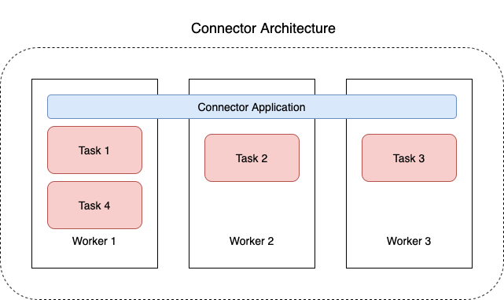

# Understand connectors

A connector integrates external systems and Amazon services with Apache Kafka by
continuously copying streaming data from a data source into your Apache Kafka cluster, or
continuously copying data from your cluster into a data sink. A connector can also perform
lightweight logic such as transformation, format conversion, or filtering data before
delivering the data to a destination. Source connectors pull data from a data source and
push this data into the cluster, while sink connectors pull data from the cluster and push
this data into a data sink.

The following diagram shows the architecture of a connector. A worker is a Java virtual machine (JVM) process that runs the connector logic. Each worker creates a set of tasks that run in parallel threads and do the
work of copying the data. Tasks don't store state, and can therefore be started, stopped, or
restarted at any time in order to provide a resilient and scalable data pipeline.

