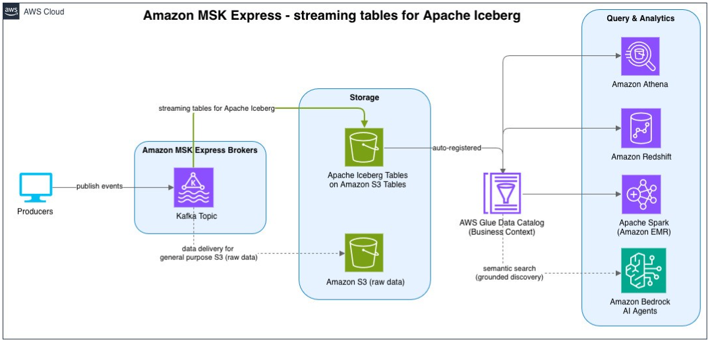

# Amazon MSK Data Delivery

With Amazon MSK data delivery, you can deliver Apache Kafka data from Amazon MSK Express brokers directly to Amazon S3, without connectors or additional infrastructure to manage. Amazon MSK Express automatically handles scaling, retries, and backpressure, and manages routine operations such as capacity scaling and version upgrades without introducing delivery gaps. Because these are native broker capabilities, they add no broker egress throughput, so you avoid the incremental infrastructure costs that scaling connector-based pipelines typically incurs and match capacity to actual workload demand rather than provisioning for peak. Each capability supports throughput of up to 10 GB/s.

The two capabilities are:

- **Data delivery to streaming tables for Apache Iceberg** — Amazon MSK Express brokers continuously materialize Apache Kafka topics as Apache Iceberg tables on Amazon S3 Tables. Intelligent inline compaction eliminates the performance impact of small files and keeps query performance predictable without sacrificing data freshness, while built-in coordination resolves concurrent writer conflicts across high-throughput consumers. Amazon S3 Tables automatically handles ongoing table maintenance, including compaction, snapshot expiration, and unreferenced file cleanup.
- **Data delivery to Amazon S3 general purpose buckets** — Amazon MSK Express brokers deliver Apache Kafka data in the source format to Amazon S3 general purpose buckets for downstream processing, with end-to-end reliability for mission-critical workloads. This is the easiest and most reliable way to land Kafka data in Amazon S3 for use cases such as log archival, compliance retention, Kafka replay, and training AI/ML models — use cases where you might otherwise build self-managed connector pipelines that grow costly and operationally complex as workloads scale.

###### Topics

- [Data flow](#msk-data-delivery-data-flow "#msk-data-delivery-data-flow")
- [Benefits](#msk-data-delivery-benefits "#msk-data-delivery-benefits")
- [Destination types at a glance](#msk-data-delivery-destination-types "#msk-data-delivery-destination-types")
- [How it works](#msk-data-delivery-how-it-works "#msk-data-delivery-how-it-works")
- [Requirements](#msk-data-delivery-requirements "#msk-data-delivery-requirements")
- [Integrations](#msk-data-delivery-integrations "#msk-data-delivery-integrations")
- [Common use cases](#msk-data-delivery-use-cases "#msk-data-delivery-use-cases")
- [Key concepts](msk-data-delivery-concepts.md "msk-data-delivery-concepts.md")
- [Get started with Amazon MSK Data Delivery](msk-data-delivery-getting-started.md "msk-data-delivery-getting-started.md")
- [IAM permissions for Channel](msk-data-delivery-iam.md "msk-data-delivery-iam.md")
- [Manage Channels](msk-data-delivery-manage.md "msk-data-delivery-manage.md")
- [Iceberg behaviors (S3 Tables destination)](msk-data-delivery-iceberg.md "msk-data-delivery-iceberg.md")
- [S3 bucket output key template](msk-data-delivery-output-key-template.md "msk-data-delivery-output-key-template.md")
- [Security for Channel](msk-data-delivery-security.md "msk-data-delivery-security.md")
- [Monitoring Channel](msk-data-delivery-monitoring.md "msk-data-delivery-monitoring.md")
- [Logging for Channel](msk-data-delivery-logging.md "msk-data-delivery-logging.md")
- [Best practices for Channel](msk-data-delivery-bestpractices.md "msk-data-delivery-bestpractices.md")
- [Troubleshooting Channel](msk-data-delivery-troubleshooting.md "msk-data-delivery-troubleshooting.md")

## Data flow

The following diagram shows how records flow from an Amazon MSK Express broker topic through a Data Delivery channel to your destination, with unprocessable records routed to a dead-letter queue.

## Benefits

- **No infrastructure to manage** — No connectors or compute clusters. You configure a channel and the service handles delivery, scaling, and fault tolerance.
- **No broker impact** — A channel reads from the topic without consuming broker throughput or affecting producer and consumer workloads.
- **Scales with your data** — Data delivery throughput of up to 10 GB/s can be supported without any manual scaling.
- **Data freshness in minutes** — Delivered data is available for querying or processing within 5 to 15 minutes of being produced to the topic.
- **Built-in error handling** — Unprocessable records are routed to a dead-letter queue with error context, so delivery continues uninterrupted.

## Destination types at a glance

|                          | S3 Tables (Iceberg)                                                  | S3 (General Purpose)                        |
| ------------------------ | -------------------------------------------------------------------- | ------------------------------------------- |
| Destination              | Managed Iceberg table in an S3 Table bucket                          | Objects in a general-purpose S3 bucket      |
| Input formats            | JSON or JSON\_SCHEMA\_GSR                                            | JSON, ByteArray, String                     |
| AWS Glue Schema Registry | Required                                                             | Not required                                |
| Output                   | Apache Iceberg tables; Parquet files with ZSTD or Snappy compression | Objects (optional GZIP or ZSTD compression) |
| Partitioning             | Time-based                                                           | Object key template (time placeholders)     |
| Schema evolution         | Not supported                                                        | Not applicable                              |
| Dead-letter queue (DLQ)  | Required                                                             | Required                                    |

## How it works

To establish a table on Iceberg or to deliver data to a general-purpose S3 bucket, you create a **Channel**. You create a Channel on an Amazon MSK Provisioned cluster that uses Express brokers. The Channel reads records from a Kafka topic and delivers them to the configured destination:

- For **S3 Tables (Iceberg)**, the Channel converts JSON records using a schema in the AWS Glue Schema Registry, writes them as Apache Parquet data files, and registers them in a new Iceberg table stored in an S3 Table bucket.
- For an **S3 bucket**, the Channel writes records (JSON, ByteArray, or String) as objects to a general-purpose S3 bucket, using a configurable output key template.

Records that cannot be processed are routed to a required dead-letter queue (DLQ) S3 bucket.

###### Note

A Channel does **not** backfill previously produced data — only data produced after enablement is delivered. For the S3 Tables destination, a Channel creates a **new** Iceberg table for each configuration; delivery to existing Iceberg tables is not supported.

## Requirements

### Common to both destinations

- An Amazon MSK Provisioned cluster with **MSK Express brokers**. Standard brokers and Amazon MSK Serverless are **not** supported.
- At least one Kafka topic.
- An Amazon S3 bucket for the dead-letter queue (DLQ). This is **required**.
- An IAM service role that the Channel assumes to deliver data.
- Data freshness configured between 5 and 15 minutes.

### S3 Tables (Iceberg) destination

- Topic data in **JSON** (plain JSON, with a GSR schema ARN) or **JSON\_SCHEMA\_GSR** (GSR-serialized JSON with an embedded schema ID).
- A schema registered in the AWS Glue Schema Registry that matches your topic data.
- An Amazon S3 Table bucket in the same AWS Region as your Amazon MSK cluster.
- For the minimum 5-minute data freshness, the topic should produce at least 2.4 MB/s of uncompressed data. For lower-throughput topics, use a higher data freshness value (up to 15 minutes).

### S3 bucket destination

- Topic data in **JSON**, **ByteArray**, or **String** format.
- A general-purpose Amazon S3 bucket for delivery.

## Integrations

- **MSK Express brokers** — the data source.
- **Amazon S3 Tables** — managed Iceberg destination.
- **Amazon S3** — general-purpose object destination.
- **AWS Glue Schema Registry** — source of truth for record schemas (Iceberg destination).
- **Amazon CloudWatch** — metrics and operational logs.
- **AWS CloudTrail** — API audit logging.
- **AWS KMS** — optional customer-managed encryption at rest.

## Common use cases

- Continuously land Kafka streaming data into queryable Iceberg tables for analytics (Athena, Spark, and other engines).
- Archive Kafka topic data to S3 for storage, replay, or downstream batch processing.
- Build a streaming lakehouse on S3 Tables without managing compaction or a delivery service.
- Fan out a single topic to multiple destinations without adding broker load.

For the API specification, see `CreateChannel`, `DescribeChannel`, `UpdateChannel`, `DeleteChannel`, and `ListChannels` in the _Amazon MSK API Reference_.
