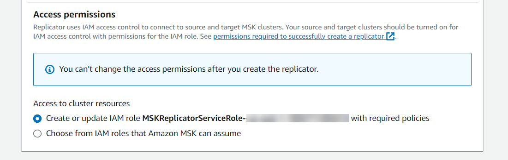

# Create replicator using the

AWS console in the target cluster Region

The following section explains the step-wise console workflow for creating a
replicator.

**Replicator details**

1. In the AWS Region where your target MSK cluster is located, open the
   Amazon MSK console at [https://console.aws.amazon.com/msk/home?region=us-east-1#/home/](https://console.aws.amazon.com/msk/home?region=us-east-1#/home/ "https://console.aws.amazon.com/msk/home?region=us-east-1#/home/").
2. Choose **Replicators** to display the list of
   replicators in the account.
3. Choose **Create replicator**.
4. In the **Replicator details** pane, give the new
   replicator a unique name.

## Choose your

source cluster

The source cluster contains the data you want to copy to a target MSK
cluster.

1. In the **Source cluster** pane, choose the AWS
   Region where the source cluster is located.

You can look up a cluster’s Region by going to **MSK Clusters** and looking at the **Cluster** details ARN. The Region name is embedded in
the ARN string. In the following example ARN, `ap-southeast-2` is the
cluster region.

```
arn:aws:kafka:ap-southeast-2:123456789012:cluster/cluster-11/eec93c7f-4e8b-4baf-89fb-95de01ee639c-s1
```

2. Enter the ARN of your source cluster or browse to choose your source
   cluster.
3. Choose subnet(s) for your source cluster.

The console displays the subnets available in the source cluster’s
Region for you to select. You must select a minimum of two subnets. For a same-region MSK Replicator, the subnets that you select set to access the source cluster and the subnets to access the target cluster must be in the same Availability Zone. 4. Choose security group(s) for the MSK Replicator to access your source cluster.

    * For cross-region replication (CRR), you do not need to provide security group(s) for your source cluster.
    * For same region replication (SRR), go to the Amazon EC2 console at https://console.aws.amazon.com/ec2/ and ensure that the security groups you will provide for the Replicator have outbound rules to allow traffic to your source cluster's security groups. Also, ensure that your source cluster's security groups have inbound rules that allow traffic from the Replicator security groups provided for the source.


    ###### To add inbound rules to your source cluster’s security group:


    	1. In the AWS console, go to your source cluster’s details by selecting the the **Cluster name**.
    	2. Select the **Properties tab**, then scroll down to the **Network settings** pane to select the name of the **Security group** applied.
    	3. Go to the inbound rules and select **Edit inbound rules**.
    	4. Select **Add rule**.
    	5. In the **Type** column for the new rule, select **Custom TCP**.
    	6. In the **Port range** column, type `9098`. MSK Replicator uses IAM access control to connect to your cluster which uses port 9098.
    	7. In the **Source** column, type the name of the security group that you will provide during Replicator creation for the source cluster (this may be the same as the MSK source cluster's security group), and then select **Save rules**.


    ###### To add outbound rules to Replicator’s security group provided for the source:


    	1. In the AWS console for Amazon EC2, go to the security group that you will provide during Replicator creation for the source.
    	2. Go to the outbound rules and select **Edit outbound rules**.
    	3. Select **Add rule**.
    	4. In the **Type** column for the new rule, select **Custom TCP**.
    	5. In the **Port range** column, type `9098`. MSK Replicator uses IAM access control to connect to your cluster which uses port 9098.
    	6. In the **Source** column, type the name of the MSK source cluster’s security group, and then select **Save rules**.

###### Note

Alternately, if you do not want to restrict traffic using your security groups, you can add inbound and outbound rules allowing All Traffic.

1. Select **Add rule**.

2. In the **Type** column, select **All Traffic**.

3. In the Source column, type `0.0.0.0/0`, and then select **Save rules**.

## Choose your

target cluster

The target cluster is the MSK provisioned or serverless cluster to which the source data is copied.

###### Note

MSK Replicator creates new topics in the target cluster with an auto-generated prefix added to the topic name. For instance, MSK Replicator replicates data in
“`topic`” from the source cluster to a new topic in the
target cluster called `<sourceKafkaClusterAlias>.topic`.
This is to distinguish topics that contain data replicated from source
cluster from other topics in the target cluster and to avoid data being
circularly replicated between the clusters. You can find the prefix that
will be added to the topic names in the target cluster under the
**sourceKafkaClusterAlias** field using
`DescribeReplicator` API or the **Replicator
details** page on the MSK Console. The prefix in the target
cluster is `<sourceKafkaClusterAlias>`.

1. In the **Target cluster** pane, choose the AWS Region where the target
   cluster is located.
2. Enter the ARN of your target cluster or browse to choose your target cluster.
3. Choose subnet(s) for your target cluster.

The console displays subnets available in the target cluster’s Region for you to select. Select a minimum of two subnets. 4. Choose security group(s) for the MSK Replicator to access your target cluster.

The security groups available in the target cluster’s
Region are displayed for you to select. The chosen security group is
associated with each connection. For more information
about using security groups, see the [Control traffic
to your AWS resources using security groups](../../../vpc/latest/userguide/vpc-security-groups.md "../../../vpc/latest/userguide/vpc-security-groups.md") in the
_Amazon VPC User Guide_.

    * For both cross region replication (CRR) and same region replication (SRR), go to the Amazon EC2
     console at [https://console.aws.amazon.com/ec2/](https://console.aws.amazon.com/ec2/ "https://console.aws.amazon.com/ec2/") and ensure that the
     security groups you will provide to the Replicator have outbound
     rules to allow traffic to your target cluster's security groups.
     Also ensure that your target cluster's security groups have
     inbound rules that accept traffic from the Replicator security
     groups provided for the target.


    ###### To add inbound rules to your target cluster’s security
     group:


    	1. In the AWS console, go to your target cluster’s details by selecting the the **Cluster name**.
    	2. Select the **Properties** tab, then scroll down to the Network settings pane to select the name of the **Security group** applied.
    	3. Go to the inbound rules and select **Edit inbound rules**.
    	4. Select **Add rule**.
    	5. In the **Type** column for the new rule, select **Custom TCP**.
    	6. In the **Port range** column, type `9098`. MSK Replicator uses IAM access control to connect to your cluster which uses port 9098.
    	7. In the **Source** column, type the name of the security group that you will provide during Replicator creation for the target cluster (this may be the same as the MSK target cluster's security group), and then select **Save rules**.


    ###### To add outbound rules to Replicator’s security group provided for the target:


    	1. In the AWS console, go to the security group that you will provide during Replicator creation for the target.
    	2. Select the **Properties** tab, then scroll down to the Network settings pane to select the name of the **Security group** applied.
    	3. Go to the outbound rules and select **Edit outbound rules**.
    	4. Select **Add rule**.
    	5. In the **Type** column for the new rule, select **Custom TCP**.
    	6. In the **Port range** column, type `9098`. MSK Replicator uses IAM access control to connect to your cluster which uses port 9098.
    	7. In the **Source** column, type the name of the MSK target cluster’s security group, and then select **Save rules**.

###### Note

Alternately, if you do not want to restrict traffic using your security groups, you can add inbound and outbound rules allowing All Traffic.

1. Select **Add rule**.

2. In the **Type** column, select **All Traffic**.

3. In the Source column, type `0.0.0.0/0`, and then select **Save rules**.

## Configure replicator settings

and permissions

1. In the **Replicator settings** pane, specify the
   topics you want to replicate using regular expressions in the allow and
   deny lists. By default, all topics are replicated.

###### Note

MSK Replicator only replicates up to 750 topics in sorted order.
If you need to replicate more topics, we recommend that you create a
separate Replicator. Go to the AWS console Support Center and
[create a support
case](https://console.aws.amazon.com/support/home#/ "https://console.aws.amazon.com/support/home#/") if you need support for more than 750 topics per
Replicator. You can monitor the number of topics being replicated
using the "TopicCount" metric. See [Amazon MSK Standard broker quota](limits.md#msk-provisioned-quota "limits.md#msk-provisioned-quota"). 2. By default, MSK Replicator starts replication from the
_latest_ (most recent) offset in the selected
topics. Alternatively, you can start replication from the
_earliest_ (oldest) offset in the selected topics
if you want to replicate existing data on your topics. Once the
Replicator is created, you can’t change this setting. This setting
corresponds to the [`startingPosition`](../../1.0/apireference-replicator/v1-replicators-replicatorarn.md#v1-replicators-replicatorarn-model-replicationstartingposition "../../1.0/apireference-replicator/v1-replicators-replicatorarn.md#v1-replicators-replicatorarn-model-replicationstartingposition") field in the [`CreateReplicator`](../../1.0/apireference-replicator/v1-replicators.md#CreateReplicator "../../1.0/apireference-replicator/v1-replicators.md#CreateReplicator") request and [`DescribeReplicator`](../../1.0/apireference-replicator/v1-replicators-replicatorarn.md#DescribeReplicator "../../1.0/apireference-replicator/v1-replicators-replicatorarn.md#DescribeReplicator") response APIs. 3. Choose a topic name configuration:

    * `PREFIXED` topic name replication (**Add prefix to topics name** in console): The default setting. MSK Replicator replicates “topic1” from the source cluster to a new topic in the target cluster with the name `<sourceKafkaClusterAlias>.topic1`.
    * Identical topic name replication (**Keep the same topics name** in console): Topics from the source cluster are replicated with identical topic names in the target cluster.

This setting corresponds to the `TopicNameConfiguration` field in the `CreateReplicator` request and `DescribeReplicator` response APIs. See [How Amazon MSK Replicator works](msk-replicator-how-it-works.md "msk-replicator-how-it-works.md").

###### Note

By default, MSK Replicator creates new topics in the target cluster with an auto-generated prefix added to the topic name. This is to distinguish topics that contain data replicated from source cluster from other topics in the target cluster and to avoid data being circularly replicated between the clusters. Alternatively, you can create a MSK Replicator with Identical topic name replication (**Keep the same topics name** in console) so that topic names are preserved during replication. This configuration reduces the need for you to reconfigure client applications during setup and makes it simpler to operate multi-cluster streaming architectures. 4. By default, MSK Replicator copies all metadata including topic
configurations, Access Control Lists (ACLs) and consumer group offsets
for seamless failover. If you are not creating the Replicator for
failover, you can optionally choose to turn off one or more of these
settings available in the **Additional settings**
section.

###### Note

MSK Replicator does not replicate write ACLs since your producers
should not be writing directly to the replicated topic in the target
cluster. Your producers should write to the local topic in the
target cluster after failover. See [Perform a planned failover to the
secondary AWS Region](msk-replicator-perform-planned-failover.md "msk-replicator-perform-planned-failover.md") for
details. 5. In the **Consumer group replication** pane, specify
the consumer groups you want to replicate using regular expressions in
the allow and deny lists. By default, all consumer groups are
replicated. 6. In the **Compression** pane, you can optionally
choose to compress the data written to the target cluster. If you’re
going to use compression, we recommend that you use the same compression
method as the data in your source cluster. 7. In the **Access permissions** pane do either of the
following:

    1. Select **Create or update IAM role with required
     policies**. MSK console will automatically attach
     the necessary permissions and trust policy to the service
     execution role required to read and write to your source and
     target MSK clusters.


    
    2. Provide your own IAM role by selecting **Choose from
     IAM roles that Amazon MSK can assume**. We recommend
     that you attach the `AWSMSKReplicatorExecutionRole`
     managed IAM policy to your service execution role, instead of
     writing your own IAM policy.


    	1. Create the IAM role that the Replicator will use to
    	 read and write to your source and target MSK clusters
    	 with the below JSON as part of the trust policy and the
    	 `AWSMSKReplicatorExecutionRole` attached
    	 to the role. In the trust policy, replace the
    	 placeholder <yourAccountID> with your actual
    	 account ID.


    	JSON


    	```
    	`{
    	 "Version":"2012-10-17",
    	 "Statement": [
    	 {
    	 "Effect": "Allow",
    	 "Principal": {
    	 "Service": "kafka.amazonaws.com"
    	 },
    	 "Action": "sts:AssumeRole",
    	 "Condition": {
    	 "StringEquals": {
    	 "aws:SourceAccount": "<yourAccountID>"
    	 }
    	 }
    	 }
    	 ]
    	}`

    	```

8. In the **Replicator tags** pane, you can optionally
   assign tags to the MSK Replicator resource. For more information, see [Tag an Amazon MSK cluster](msk-tagging.md "msk-tagging.md"). For a cross-region MSK Replicator, tags are synced to the remote Region
   automatically when the Replicator is created. If you change tags after
   the Replicator is created, the change is not automatically synced to the
   remote Region, so you’ll need to sync local replicator and remote
   replicator references manually.
9. Select **Create**.

If you want to restrict `kafka-cluster:WriteData` permission, refer
to the _Create authorization policies_ section of [How IAM access control for Amazon MSK works](iam-access-control.md#how-to-use-iam-access-control "iam-access-control.md#how-to-use-iam-access-control"). You'll need to add
`kafka-cluster:WriteDataIdempotently` permission to both the
source and target cluster.

It takes approximately 30 minutes for the MSK Replicator to be successfully
created and transitioned to RUNNING status.

If you create a new MSK Replicator to replace one that you deleted, the new
Replicator starts replication from the latest offset.

If your MSK Replicator has transitioned to a FAILED status, refer to the
troubleshooting section [Troubleshooting MSK Replicator](msk-replicator-troubleshooting.md "msk-replicator-troubleshooting.md").
