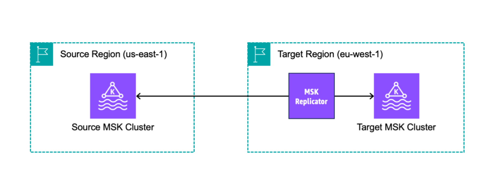

# How Amazon MSK Replicator works

To get started with MSK Replicator, you need create a new Replicator in your target
cluster’s AWS Region. MSK Replicator automatically copies all data from the cluster in
the primary AWS Region called _source_ to the cluster
in the destination region called _target_. Source and
target clusters can be in the same or different AWS Regions. You will need to create
the target cluster if it does not already exist.

When you create a Replicator, MSK Replicator deploys all required resources in the
target cluster’s AWS Region to optimize for data replication latency. Replication latency varies based on many factors, including the network distance between the AWS Regions of your MSK clusters, the throughput capacity of your source and target clusters, and the number of partitions on your source and target clusters. MSK Replicator automatically scales the underlying resources so that you can replicate data on-demand without having to monitor or scale capacity.

## Data replication

By default, MSK Replicator copies all data asynchronously from the latest offset in the source cluster topic partitions to the target cluster. If the "Detect and copy new topics" setting is turned on, MSK Replicator automatically detects and copies new topics or topic partitions to the target cluster. However, it may take up to 30 seconds for the Replicator to detect and create the new topics or topic partitions on the target cluster. Any messages produced to the source topic before the topic has been created on the target cluster will not be replicated. Alternatively, you can [configure your Replicator during creation](msk-replicator-prepare-cluster.md "msk-replicator-prepare-cluster.md") to start replication from the earliest offset in the source cluster topic partitions if you want to replicate existing messages on your topics to the target cluster.

MSK Replicator does not store your data. Data is consumed from your source cluster, buffered in-memory and written to the target cluster. The buffer is cleared automatically when the data is either successfully written or fails after retries. All the communication and data between MSK Replicator and your clusters are always encrypted in-transit. All MSK Replicator API calls like `DescribeClusterV2`, `CreateTopic`, `DescribeTopicDynamicConfiguration` are captured in AWS CloudTrail. Your MSK broker logs will also reflect the same.

MSK Replicator creates topics in the target cluster with a Replicator Factor of 3. If you need to, you can modify the replication factor directly on the target cluster.

## Metadata replication

MSK Replicator also supports copying the metadata from the source cluster to the target cluster. The metadata includes topic configuration, Access Control Lists (ACLs), and consumer groups offsets. Like data replication, metadata replication also happens asynchronously. For better performance, MSK Replicator prioritizes data replication over metadata replication.

The following table is a list of Access Control Lists (ACLs) that MSK Replicator copies.

| Operation         | Research | APIs allowed                                             |
| ----------------- | -------- | -------------------------------------------------------- | -------------------------------------------------------------------------------------------------------------------------------------------------------------------------------------------------------------------------------------------------------------------------------------------------------------------------------------------------------------------------------------------------------------------------------------------------------------------------------------------------------------------------------------------------------------------------------------------------------------------------------------------------------------------------------------------------------------------------------------------------------------------------------------------------------------------------------------------------------------------------------------------------------------------------------------------------------------------------------------------------------------------------------------------------------------------------------------------------------------------------------------------------------------------------------------------------------------------------------------------------------------------------------------------------------------------------------------------------------------------------------------------------------------------------------------------------------------------------------------------------------------------------------------------------------------------------------------------------------------------------------------------------------------------------------------------------------------------------------------------------------------------------------------------------------------------------------------------------------------------------------------------------------------------------------------------------------------------------------------------------------------------------------------------------------------------------------------------------------------------------------------------------------------------------------------------------------------------------------------------------------------------------------------------------------------------------------------------------------------------------------------------------------------------------------------------------------------------------------------------------------------------------------------------------------------------------------------------------------------------------------------------------------------------------------------------------------------------------------------------------------------------------------------------------------------------------------------------------------------------------------------------------------------------------------------------------------------------------------------------------------------------------------------------------------------------------------------------------------------------------------------------------------------------------------------------------------------------------------------------------------------------------------------------------------------------------------------------------------------------------------------------------------------------------------------------------------------------------------------------------------------------------------------------------------------------------------------------------------------------------------------------------------------------------------------------------------------------------------------------------------------------------------------------------------------------------------------------------------------------------------------------------------------------------------------------------------------------------------------------------------------------------------------------------------------------------------------------------------------------------------------------------------------------------------------------------------------------------------------------------------------------------------------------------------------------------------------------------------------------------------------------------------------------------------------------------------------------------------------------------------------------------------------------------------------------------------------------------------------------------------------------------------------------------------------------------------------------------------------------------------------------------------------------------------------------------------------------------------------------------------------------------------------------------------------------------------------------------------------------------------------------------------------------------------------------------------------------------------------------------------------------------------------------------------------------------------------------------------------------------------------------------------------------------------------------------------------------------------------------------------------------------------------------------------------------------------------------------------------------------------------------------- |
| Alter             | Topic    | CreatePartitions                                         |
| AlterConfigs      | Topic    | AlterConfigs                                             |
| Create            | Topic    | CreateTopics, Metadata                                   |
| Delete            | Topic    | DeleteRecords, DeleteTopics                              |
| Describe          | Topic    | ListOffsets, Metadata, OffsetFetch, OffsetForLeaderEpoch |
| DescribeConfigs   | Topic    | DescribeConfigs                                          |
| Read              | Topic    | Fetch, OffsetCommit, TxnOffsetCommit                     |
| Write (deny only) | Topic    | Produce, AddPartitionsToTxn                              | MSK Replicator copies LITERAL pattern type ACLs only for resource type Topic. PREFIXED pattern type ACLs and other resource type ACLs are not copied. MSK Replicator also does not delete ACLs on the target cluster. If you delete an ACL on the source cluster, you should also delete on the target cluster at the same time. For more details on Kafka ACLs resource, pattern and operations, see [https://kafka.apache.org/documentation/#security_authz_cli](https://kafka.apache.org/documentation/#security_authz_cli "https://kafka.apache.org/documentation/#security_authz_cli"). MSK Replicator replicates only Kafka ACLs, which IAM access control does not use. If your clients are using IAM access control to read/write to your MSK clusters, you need to configure the relevant IAM policies on your target cluster as well for seamless failover. This is also true for both Prefixed as well as Identical topic name replication configurations. As part of consumer groups offsets syncing, MSK Replicator optimizes for your consumers on the source cluster which are reading from a position closer to the tip of the stream (end of the topic partition). If your consumer groups are lagging on the source cluster, you may see higher lag for those consumer groups on the target as compared to the source. This means after failover to the target cluster, your consumers will reprocess more duplicate messages. To reduce this lag, your consumers on the source cluster would need to catch up and start consuming from the tip of the stream (end of the topic partition). As your consumers catch up, MSK Replicator will automatically reduce the lag.  ## Topic name configuration MSK Replicator has two topic name configuration modes: _Prefixed_ (default) or _Identical_ topic name replication. ###### Prefixed topic name replication By default, MSK Replicator creates new topics in the target cluster with an auto-generated prefix added to the source cluster topic name, such as `<sourceKafkaClusterAlias>.topic`. This is to distinguish the replicated topics from others in the target cluster and to avoid circular replication of data between the clusters. For example, MSK Replicator replicates data in a topic named “topic” from the source cluster to a new topic in the target cluster called <sourceKafkaClusterAlias>.topic. You can find the prefix that will be added to the topic names in the target cluster under the **sourceKafkaClusterAlias** field using `DescribeReplicator` API or the **Replicator** details page on the MSK console. The prefix in the target cluster is <sourceKafkaClusterAlias>. To make sure your consumers can reliably restart processing from the standby cluster, you need to configure your consumers to read data from the topics using a wildcard operator `.*`. For example, your consumers would need to consume using .`*topic1` in both AWS Regions. This example would also include a topic such as `footopic1`, so adjust the wildcard operator according to your needs. You should use the MSK Replicator which adds a prefix when you want to keep replicator data in a separate topic in the target cluster, such as for active-active cluster setups. ###### Identical topic name replication As an alternative to the default setting, Amazon MSK Replicator allows you to create a Replicator with topic replication set to Identical topic name replication (**Keep the same topics name** in console). You can create a new Replicator in the AWS Region which has your target MSK cluster. Identically-named replicated topics let you avoid reconfiguring clients to read from replicated topics. Identical topic name replication (**Keep the same topics name** in console) has the following advantages:  • Allows you to retain identical topic names during the replication process, while also automatically avoiding the risk of infinite replication loops.  • Makes setting up and operating multi-cluster streaming architectures simpler, since you can avoid reconfiguring clients to read from the replicated topics.  • For active-passive cluster architectures, Identical topic name replication functionality also streamlines the failover process, allowing applications to seamlessly failover to a standby cluster without requiring any topic name changes or client reconfigurations.  • Can be used to more easily consolidate data from multiple MSK clusters into a single cluster for data aggregation or centralized analytics. This requires you to create separate Replicators for each source cluster and the same target cluster.  • Can streamline data migration from one MSK cluster to another by replicating data to identically named topics in the target cluster. Amazon MSK Replicator uses Kafka headers to automatically avoid data being replicated back to the topic it originated from, eliminating the risk of infinite cycles during replication. A header is a key-value pair that can be included with the key, value, and timestamp in each Kafka message. MSK Replicator embeds identifiers for source cluster and topic into the header of each record being replicated. MSK Replicator uses the header information to avoid infinite replication loops. You should verify that your clients are able to read replicated data as expected. |
