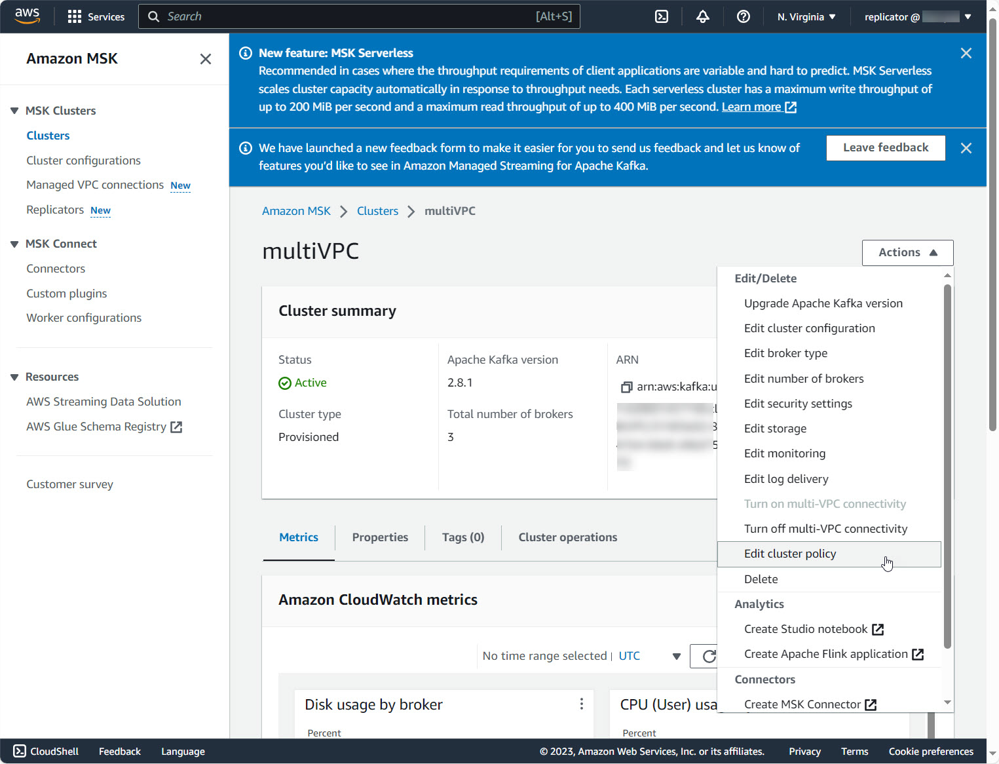

# Prepare source and target clusters

Before creating an MSK Replicator, you need to prepare both a source cluster and a target cluster. This section covers the requirements for setting up replication between Amazon MSK clusters (Provisioned or Serverless).

###### Note

MSK Replicator also supports replication between self-managed Apache Kafka clusters and Amazon MSK Provisioned clusters. If you are migrating from a self-managed Kafka deployment, see [Migrate from non-MSK Apache Kafka clusters to Amazon MSK Provisioned](msk-replicator-migrate-external.md "msk-replicator-migrate-external.md") and [Set up prerequisites for MSK Replicator with self-managed Apache Kafka clusters](msk-replicator-external-prereqs.md "msk-replicator-external-prereqs.md") for the prerequisites specific to self-managed clusters.

## Prepare the source cluster

If you already have an MSK source cluster, make sure that it meets the requirements described in this section. Otherwise, follow these steps to create an MSK Provisioned or Serverless source cluster.

1. Create an MSK Provisioned or Serverless cluster with [IAM access control turned on](create-iam-access-control-cluster-in-console.md "create-iam-access-control-cluster-in-console.md") in the source Region. Your source cluster must have a minimum of three brokers.
2. For a cross-region MSK Replicator, if the source is a Provisioned cluster, configure it with multi-VPC private connectivity turned on for IAM access control schemes. Note that the unauthenticated auth type is not supported when multi-VPC is turned on. You do not need to turn on multi-VPC private connectivity for other authentication schemes (mTLS or SASL/SCRAM). You can configure multi-VPC private connectivity in the console cluster details **Network settings** or with the `UpdateConnectivity` API. See [Cluster owner turns on multi-VPC](mvpc-cluster-owner-action-turn-on.md "mvpc-cluster-owner-action-turn-on.md"). If your source cluster is an MSK Serverless cluster, you do not need to turn on multi-VPC private connectivity.

For a same-region MSK Replicator, the MSK source cluster does not require multi-VPC private connectivity and the cluster can still be accessed by other clients using the unauthenticated auth type. 3. For cross-region MSK Replicators, you must attach a resource-based permissions policy to the source cluster. This allows MSK to connect to this cluster for replicating data. You can do this using the CLI or AWS Console procedures below. See also, [Amazon MSK resource-based policies](security_iam_service-with-iam.md "security_iam_service-with-iam.md"). You do not need to perform this step for same-region MSK Replicators.

Console: create resource policy
Update the source cluster policy with the following JSON. Replace the placeholder with the ARN of your source cluster.

```
`{
 "Version":"2012-10-17",
 "Statement": [
 {
 "Effect": "Allow",
 "Principal": {
 "Service": [
 "kafka.amazonaws.com"
 ]
 },
 "Action": [
 "kafka:CreateVpcConnection",
 "kafka:GetBootstrapBrokers",
 "kafka:DescribeClusterV2"
 ],
 "Resource": "arn:aws:kafka:`us-east-1`:`123456789012`:cluster/`myCluster`/`abcd1234-5678-90ab-cdef-1234567890ab-1`"
 }
 ]
}`

```

Use the **Edit cluster policy** option under the **Actions** menu on the cluster details page.



CLI: create resource policy
Note: If you use the AWS console to create a source cluster and choose the option to create a new IAM role, AWS attaches the required trust policy to the role. If you want MSK to use an existing IAM role or if you create a role on your own, attach the following trust policies to that role so that MSK Replicator can assume it. For information about how to modify the trust relationship of a role, see [Modifying a Role](../../../IAM/latest/UserGuide/id_roles_manage_modify.md "../../../IAM/latest/UserGuide/id_roles_manage_modify.md").

1. Get the current version of the MSK cluster policy using this command. Replace placeholders with the actual cluster ARN.

```
aws kafka get-cluster-policy —cluster-arn <Cluster ARN>
{
"CurrentVersion": "K1PA6795UKM GR7",
"Policy": "..."
}
```

2. Create a resource-based policy to allow MSK Replicator to access your source cluster. Replace the placeholder with the actual source cluster ARN.

```
aws kafka put-cluster-policy --cluster-arn "<sourceClusterARN>" --policy '{
"Version": "2012-10-17",
"Statement": [
{
  "Effect": "Allow",
  "Principal": {
    "Service": [
      "kafka.amazonaws.com"
    ]
  },
  "Action": [
    "kafka:CreateVpcConnection",
    "kafka:GetBootstrapBrokers",
    "kafka:DescribeClusterV2"
  ],
  "Resource": "<sourceClusterARN>"
}
]
}'
```

## Prepare the target cluster

Create an MSK target cluster (Provisioned or Serverless) with IAM access control turned on. The target cluster does not require multi-VPC private connectivity. The target cluster can be in the same AWS Region or a different Region as the source cluster. Both the source and target clusters must be in the same AWS account. Your target cluster must have a minimum of three brokers.
