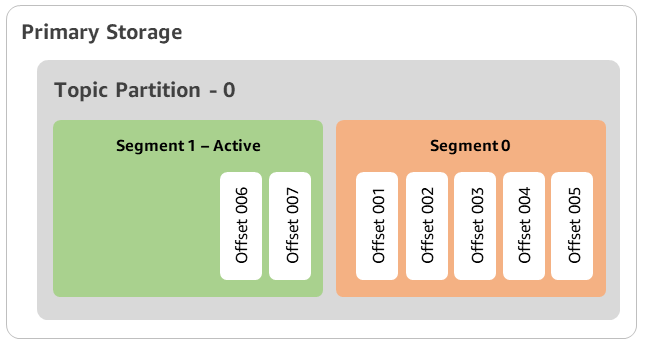
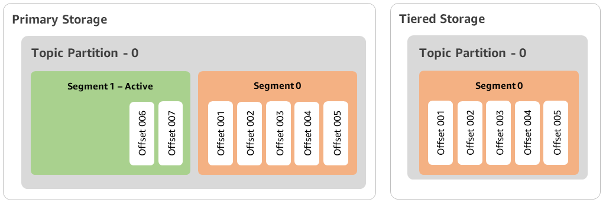
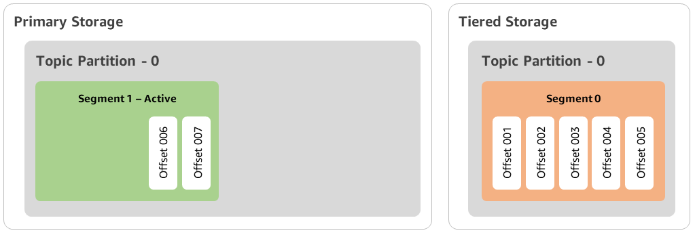
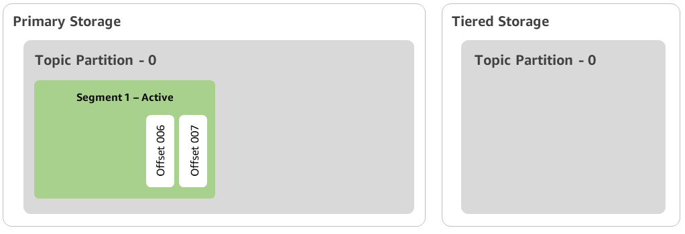

# How log segments are copied to

tiered storage for a Amazon MSK topic

When you enable tiered storage for a new or existing topic, Apache Kafka copies
closed log segments from primary storage to tiered storage.

- Apache Kafka only copies closed log segments. It copies all messages
  within the log segment to tiered storage.
- Active segments are not eligible for tiering. The log segment size
  (segment.bytes) or the segment roll time (segment.ms) controls the rate of
  segment closure, and the rate Apache Kafka then copies them to tiered
  storage.
  Retention settings for a topic with tiered storage enabled are different from
  settings for a topic without tiered storage enabled. The following rules control the
  retention of messages in topics with tiered storage enabled:

- You define retention in Apache Kafka with two settings: log.retention.ms
  (time) and log.retention.bytes (size). These settings determine the total
  duration and size of the data that Apache Kafka retains in the cluster.
  Whether or not you enable tiered storage mode, you set these configurations
  at the cluster level. You can override the settings at the topic level with
  topic configurations.
- When you enable tiered storage, you can additionally specify how long the
  primary high-performance storage tier stores data. For example, if a topic
  has overall retention (log.retention.ms) setting of 7 days and local
  retention (local.retention.ms) of 12 hours, then the cluster primary
  storage retains data for only the first 12 hours. The low-cost storage tier
  retains the data for the full 7 days.
- The usual retention settings apply to the full log. This includes its
  tiered and primary parts.
- The local.retention.ms or local.retention.bytes settings control the
  retention of messages in primary storage. When data has reached primary
  storage retention setting thresholds (local.retention.ms/bytes) on a full
  log, Apache Kafka copies the data in primary storage to tiered storage. The
  data is then eligible for expiration.
- When Apache Kafka copies a message in a log segment to tiered storage, it
  removes the message from the cluster based on retention.ms or
  retention.bytes settings.

## Example Amazon MSK tiered storage

scenario

This scenario illustrates how an existing topic that has messages in primary
storage behaves when tiered storage is enabled. You enable tiered storage on
this topic by when you set remote.storage.enable to `true`. In this
example, retention.ms is set to 5 days and local.retention.ms is set to 2 days.
The following is the sequence of events when a segment expires.

###### Time T0 - Before you enable tiered storage.

Before you enable tiered storage for this topic, there are two log
segments. One of the segments is active for an existing topic partition 0.

###### Time T1 (< 2 days) - Tiered storage enabled. Segment 0 copied to

tiered storage.

After you enable tiered storage for this topic, Apache Kafka copies log
segment 0 to tiered storage after the segment meets initial retention
settings. Apache Kafka also retains the primary storage copy of segment 0. The active
segment 1 is not eligible to copy over to tiered storage yet. In this
timeline, Amazon MSK doesn't apply any of the retention settings yet for any of the
messages in segment 0 and segment 1. (local.retention.bytes/ms,
retention.ms/bytes)

###### Time T2 - Local retention in effect.

After 2 days, primary retention settings take effect for the segment 0
that Apache Kafka copied to the tiered storage. The setting of
local.retention.ms as 2 days determines this. Segment 0 now expires from the
primary storage. Active segment 1 is neither eligible for expiration nor
eligible to copy over to tiered storage yet.

###### Time T3 - Overall retention in effect.

After 5 days, retention settings take effect, and Kafka clears log
segment 0 and associated messages from tiered storage. Segment 1 is neither
eligible for expiration nor eligible to copy over to tiered storage yet
because it is active. Segment 1 is not yet closed, so it is ineligible for
segment roll.

