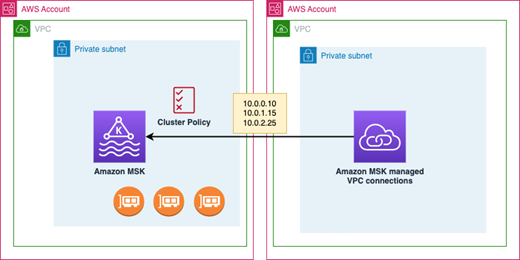

# Get started using multi-VPC private connectivity

###### Topics

- [Step 1: On the MSK cluster in
  Account A, turn on multi-VPC connectivity for IAM auth scheme on the
  cluster](mvpc-cluster-owner-action-turn-on.md "mvpc-cluster-owner-action-turn-on.md")
- [Step 2: Attach a cluster policy to the MSK cluster](mvpc-cluster-owner-action-policy.md "mvpc-cluster-owner-action-policy.md")
- [Step 3: Cross-account user actions to
  configure client-managed VPC connections](mvpc-cross-account-user-action.md "mvpc-cross-account-user-action.md")
  This tutorial uses a common use case as an example of how you can use
  multi-VPC connectivity to privately connect an Apache Kafka client to an MSK
  cluster from inside AWS, but outside VPC of the cluster. This process requires
  the cross-account user to create a MSK managed VPC connection and configuration
  for each client, including required client permissions. The process also
  requires the MSK cluster owner to enable PrivateLink connectivity on the MSK
  cluster and select authentication schemes to control access to the
  cluster.

In different parts of this tutorial, we choose options that apply to this example. This doesn't mean that they're the only options that work for setting up an MSK cluster or client instances.

The network configuration for this use case is as follows:

- A cross-account user (Kafka client) and an MSK cluster are in the same
  AWS network/Region, but in different accounts:
  - MSK cluster in Account A
  - Kafka client in Account B

- The cross-account user will connect privately to the MSK cluster using IAM
  auth scheme.
  This tutorial assumes that there is a provisioned MSK cluster created with
  Apache Kafka version 2.7.1 or higher. The MSK cluster must be in an ACTIVE state
  before beginning the configuration process. To avoid potential data loss or
  downtime, clients that will use multi-VPC private connection to connect to the
  cluster should use Apache Kafka versions that are compatible with the
  cluster.

The following diagram illustrates the architecture of Amazon MSK multi-VPC
connectivity connected to a client in a different AWS account.

