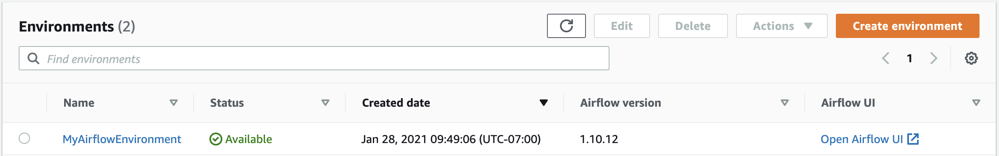

# Accessing Apache Airflow

Amazon MWAA lets you access your Apache Airflow environment using multiple methods: the Apache Airflow user interface (UI) console, the Apache Airflow CLI, and the Apache Airflow REST API.
You can use the Amazon MWAA console to access and invoke a DAG in your Apache Airflow UI, or use Amazon MWAA APIs to get a token and invoke a DAG. This section describes
the permissions needed to access the Apache Airflow UI, how to generate a token to make Amazon MWAA API calls directly in your command shell, and the supported commands
in the Apache Airflow CLI.

###### Topics

- [Prerequisites](#access-airflow-ui-prereqs "#access-airflow-ui-prereqs")
- [Open the Apache Airflow UI](#access-airflow-ui-onconsole "#access-airflow-ui-onconsole")
- [Log in to Apache Airflow](#airflow-access-and-login "#airflow-access-and-login")
- [Create a Apache Airflow webserver access token](call-mwaa-apis-web.md "call-mwaa-apis-web.md")
- [Setting up a custom domain for the Apache Airflow webserver](configuring-custom-domain.md "configuring-custom-domain.md")
- [Creating an Apache Airflow CLI token](call-mwaa-apis-cli.md "call-mwaa-apis-cli.md")
- [Using the Apache Airflow REST API](access-mwaa-apache-airflow-rest-api.md "access-mwaa-apache-airflow-rest-api.md")
- [Apache Airflow CLI command reference](airflow-cli-command-reference.md "airflow-cli-command-reference.md")

## Prerequisites

The following section describes the preliminary steps required to use the commands and scripts in this section.

### Access

- AWS account access in AWS Identity and Access Management (IAM) to the Amazon MWAA permissions policy in [Apache Airflow UI access policy: AmazonMWAAWebServerAccess](access-policies.md#web-ui-access "access-policies.md#web-ui-access").
- AWS account access in AWS Identity and Access Management (IAM) to the Amazon MWAA permissions policy [Full API and console access policy: AmazonMWAAFullApiAccess](access-policies.md#full-access-policy "access-policies.md#full-access-policy").

### AWS CLI

The AWS Command Line Interface (AWS CLI) is an open source tool that you can use to interact with AWS services using commands in your command-line shell. To complete the steps on this page, you need the following:

- [AWS CLI – Install version 2](../../../cli/latest/userguide/install-cliv2.md "../../../cli/latest/userguide/install-cliv2.md").
- [AWS CLI – Quick configuration with `aws configure`](../../../cli/latest/userguide/cli-chap-configure.md "../../../cli/latest/userguide/cli-chap-configure.md").

## Open the Apache Airflow UI

The following image displays the link to your Apache Airflow UI on the Amazon MWAA console.

## Log in to Apache Airflow

You need [Apache Airflow UI access policy: AmazonMWAAWebServerAccess](access-policies.md#web-ui-access "access-policies.md#web-ui-access") permissions for your AWS account in AWS Identity and Access Management (IAM) to access your Apache Airflow UI.

###### To access your Apache Airflow UI

1. Open the [Environments](https://console.aws.amazon.com/mwaa/home#/environments "https://console.aws.amazon.com/mwaa/home#/environments") page on the Amazon MWAA console.
2. Choose an environment.
3. Choose **Open Airflow UI**.
