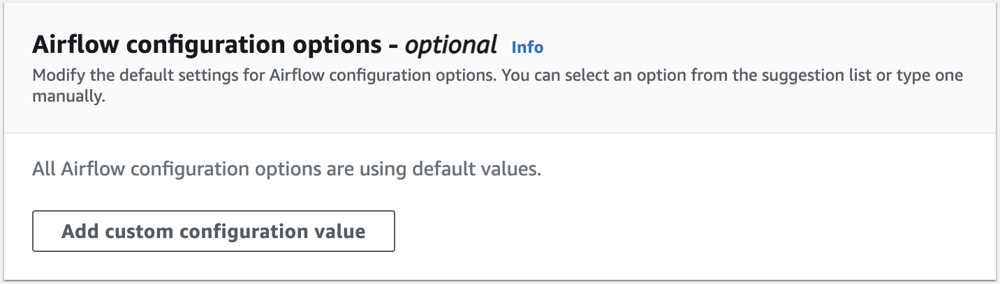
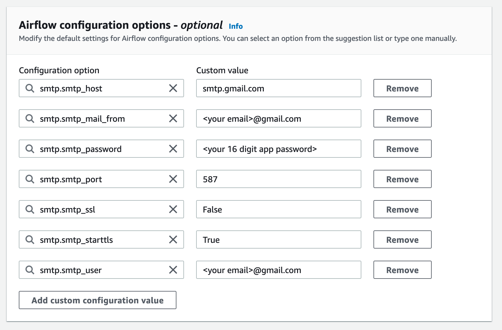

# Using Apache Airflow configuration options on Amazon MWAA

Apache Airflow configuration options can be attached to your Amazon Managed Workflows for Apache Airflow environment as environment variables. You can choose from the suggested dropdown list
or specify custom configuration options for your Apache Airflow version on the Amazon MWAA console. This topic describes the Apache Airflow configuration options available
and how to use these options to override Apache Airflow configuration settings on your environment.

###### Contents

- [Prerequisites](configuring-env-variables.md#configuring-env-variables-prereqs "configuring-env-variables.md#configuring-env-variables-prereqs")
- [How it works](configuring-env-variables.md#configuring-env-variables-how "configuring-env-variables.md#configuring-env-variables-how")
- [Using configuration options to load plugins](configuring-env-variables.md#configuring-2.0-airflow-override "configuring-env-variables.md#configuring-2.0-airflow-override")
- [Configuration options overview](configuring-env-variables.md#configuring-env-variables-customizing "configuring-env-variables.md#configuring-env-variables-customizing")
  - [Apache Airflow configuration options](configuring-env-variables.md#configuring-env-variables-airflow-ref "configuring-env-variables.md#configuring-env-variables-airflow-ref")
  - [Apache Airflow reference](configuring-env-variables.md#configuring-env-variables-reference-options "configuring-env-variables.md#configuring-env-variables-reference-options")
  - [Using the Amazon MWAA console](configuring-env-variables.md#configuring-env-variables-console-add "configuring-env-variables.md#configuring-env-variables-console-add")

- [Configuration reference](configuring-env-variables.md#configuring-env-variables-reference "configuring-env-variables.md#configuring-env-variables-reference")
  - [Email configurations](configuring-env-variables.md#configuring-env-variables-email "configuring-env-variables.md#configuring-env-variables-email")
  - [Task configurations](configuring-env-variables.md#configuring-env-variables-tasks "configuring-env-variables.md#configuring-env-variables-tasks")
  - [Scheduler configurations](configuring-env-variables.md#configuring-env-variables-scheduler "configuring-env-variables.md#configuring-env-variables-scheduler")
  - [Worker configurations](configuring-env-variables.md#configuring-env-variables-workers "configuring-env-variables.md#configuring-env-variables-workers")
  - [Webserver configurations](configuring-env-variables.md#configuring-env-variables-webserver "configuring-env-variables.md#configuring-env-variables-webserver")
  - [Triggerer configurations](configuring-env-variables.md#configuring-env-variables-webserver "configuring-env-variables.md#configuring-env-variables-webserver")

- [Examples and sample code](configuring-env-variables.md#configuring-env-variables-code "configuring-env-variables.md#configuring-env-variables-code")
  - [Example DAG](configuring-env-variables.md#configuring-env-variables-dag "configuring-env-variables.md#configuring-env-variables-dag")
  - [Example email notification settings](configuring-env-variables.md#configuring-env-variables-email "configuring-env-variables.md#configuring-env-variables-email")

- [What's next?](configuring-env-variables.md#configuring-env-variables-next-up "configuring-env-variables.md#configuring-env-variables-next-up")

## Prerequisites

You'll need the following before you can complete the steps on this page.

- **Permissions** — Your AWS account must have been granted access by your administrator to the [AmazonMWAAFullConsoleAccess](access-policies.md#console-full-access "access-policies.md#console-full-access")
  access control policy for your environment. In addition, your Amazon MWAA environment must be permitted by your [execution role](mwaa-create-role.md "mwaa-create-role.md") to access the AWS resources used by your environment.
- **Access** — If you require access to public repositories to install dependencies directly on the webserver, your environment must be configured with
  **public network** webserver access. For more information, refer to [Apache Airflow access modes](configuring-networking.md "configuring-networking.md").
- **Amazon S3 configuration** — The [Amazon S3 bucket](mwaa-s3-bucket.md "mwaa-s3-bucket.md") used to store your DAGs, custom plugins in `plugins.zip`,
  and Python dependencies in `requirements.txt` must be configured with _Public Access Blocked_ and _Versioning Enabled_.

## How it works

When you create an environment, Amazon MWAA attaches the configuration settings you specify on the Amazon MWAA console in **Airflow configuration options** as environment variables to the AWS Fargate container for your environment. If you're using a setting of the same name in `airflow.cfg`, the options you specify on the Amazon MWAA console override the values in `airflow.cfg`.

While we don't expose the `airflow.cfg` in the Apache Airflow UI of an Amazon MWAA
environment by default, you can change the Apache Airflow configuration options directly on
the Amazon MWAA console, including setting `webserver.expose_config` to expose the
configurations.

## Using configuration options to load plugins

By default in Apache Airflow v2 and later, plugins are configured to be "lazily" loaded using the `core.lazy_load_plugins : True` setting.
If you're using custom plugins, you must add `core.lazy_load_plugins : False` as an Apache Airflow configuration option to load
plugins at the start of each Airflow process to override the default setting.

## Configuration options overview

When you add a configuration on the Amazon MWAA console, Amazon MWAA writes the configuration as an environment variable.

- **Listed options**. You can choose from one of the configuration settings available for your Apache Airflow version in the dropdown list. For example, `dag_concurrency` : `16`. The configuration setting is translated to your environment's Fargate container as `AIRFLOW__CORE__DAG_CONCURRENCY : 16`
- **Custom options**. You can also specify Airflow configuration options that are not listed for your Apache Airflow version in the dropdown list. For example, `foo.user` : `YOUR_USER_NAME`. The configuration setting is translated to your environment's Fargate container as `AIRFLOW__FOO__USER : YOUR_USER_NAME`

### Apache Airflow configuration options

The following image depicts where you can customize the **Apache Airflow configuration options** on the Amazon MWAA console.

### Apache Airflow reference

For a list of configuration options supported by Apache Airflow, refer to [Configuration Reference](https://airflow.apache.org/docs/apache-airflow/stable/configurations-ref.html "https://airflow.apache.org/docs/apache-airflow/stable/configurations-ref.html")
in the _Apache Airflow reference guide_. To access the options for the version of Apache Airflow you are running on Amazon MWAA, select the version from the drop down list.

### Using the Amazon MWAA console

The following procedure walks you through the steps of adding an Airflow configuration option to your environment.

1. Open the [Environments](https://console.aws.amazon.com/mwaa/home#/environments "https://console.aws.amazon.com/mwaa/home#/environments") page on the Amazon MWAA console.
2. Choose an environment.
3. Choose **Edit**.
4. Choose **Next**.
5. Choose **Add custom configuration** in the **Airflow configuration options** pane.
6. Choose a configuration from the dropdown list and enter a value, or enter a custom configuration and enter a value.
7. Choose **Add custom configuration** for each configuration you want to add.
8. Choose **Save**.

## Configuration reference

The following section contains the list of available Apache Airflow configurations in the dropdown list on the Amazon MWAA console.

### Email configurations

The following list displays the Airflow email notification configuration options available on Amazon MWAA for Apache Airflow v2 and v3.

We recommend using port 587 for SMTP traffic. By default, AWS blocks outbound SMTP traffic on port 25 of all Amazon EC2 instances. If you want to send outbound traffic on port 25, you can [request for this restriction to be removed](https://aws.amazon.com/premiumsupport/knowledge-center/ec2-port-25-throttle/ "https://aws.amazon.com/premiumsupport/knowledge-center/ec2-port-25-throttle/").

| Airflow configuration option                                                      | Description                                                                                                                                                                                                                                                                                                                                                                                                                                                                                                                                                                                                 | Example value                       |
| --------------------------------------------------------------------------------- | ----------------------------------------------------------------------------------------------------------------------------------------------------------------------------------------------------------------------------------------------------------------------------------------------------------------------------------------------------------------------------------------------------------------------------------------------------------------------------------------------------------------------------------------------------------------------------------------------------------- | ----------------------------------- | ------------------------------------------------------------------------------------------------------------------------------------------------------------------------------------------------------------------------------------------------------------------------------------------------------------------------------------------------------------------------------------------------------------------------------------------------------------------------------------------------------------------------------------------------------------------------------------------------------------------------------------------------------------------------------------------------------------------------------------------------------------------------------------------------------------------------------------------------------------------------------------------------------------------------------------------------------------------------------------------------------------------------------------------------------------------------------------------------------------------------------------------------------------------------------------------------------------------------------------------------------------------------------------------------------------------------------------------------------------------------------------------------------------------------------------------------------------------------------------------------------------------------------------------------------------- |
| email.email_backend                                                               | The Apache Airflow utility used for email notifications in [email_backend](https://airflow.apache.org/docs/apache-airflow/2.0.2/configurations-ref.html#email-backend "https://airflow.apache.org/docs/apache-airflow/2.0.2/configurations-ref.html#email-backend").                                                                                                                                                                                                                                                                                                                                        | airflow.utils.email.send_email_smtp |
| smtp.smtp_host                                                                    | The name of the outbound server used for the email address in [smtp_host](https://airflow.apache.org/docs/apache-airflow/2.0.2/configurations-ref.html#smtp-host "https://airflow.apache.org/docs/apache-airflow/2.0.2/configurations-ref.html#smtp-host").                                                                                                                                                                                                                                                                                                                                                 | localhost                           |
| smtp.smtp_starttls                                                                | Transport Layer Security (TLS) is used to encrypt the email over the internet in [smtp_starttls](https://airflow.apache.org/docs/apache-airflow/2.0.2/configurations-ref.html#smtp-starttls "https://airflow.apache.org/docs/apache-airflow/2.0.2/configurations-ref.html#smtp-starttls").                                                                                                                                                                                                                                                                                                                  | False                               |
| smtp.smtp_ssl                                                                     | Secure Sockets Layer (SSL) is used to connect the server and email client in [smtp_ssl](https://airflow.apache.org/docs/apache-airflow/2.0.2/configurations-ref.html#smtp-ssl "https://airflow.apache.org/docs/apache-airflow/2.0.2/configurations-ref.html#smtp-ssl").                                                                                                                                                                                                                                                                                                                                     | True                                |
| smtp.smtp_port                                                                    | The Transmission Control Protocol (TCP) port designated to the server in [smtp_port](https://airflow.apache.org/docs/apache-airflow/2.0.2/configurations-ref.html#smtp-port "https://airflow.apache.org/docs/apache-airflow/2.0.2/configurations-ref.html#smtp-port").                                                                                                                                                                                                                                                                                                                                      | 587                                 |
| smtp.smtp_mail_from                                                               | The outbound email address in [smtp_mail_from](https://airflow.apache.org/docs/apache-airflow/2.0.2/configurations-ref.html#smtp-mail-from "https://airflow.apache.org/docs/apache-airflow/2.0.2/configurations-ref.html#smtp-mail-from").                                                                                                                                                                                                                                                                                                                                                                  | myemail@domain.com                  | ### Task configurations The following list displays the configurations available in the dropdown list for Airflow tasks on Amazon MWAA for Apache Airflow v2 and v3.                                                                                                                                                                                                                                                                                                                                                                                                                                                                                                                                                                                                                                                                                                                                                                                                                                                                                                                                                                                                                                                                                                                                                                                                                                                                                                                                                                                          |
| Airflow configuration option                                                      | Description                                                                                                                                                                                                                                                                                                                                                                                                                                                                                                                                                                                                 | Example value                       |
| ---                                                                               | ---                                                                                                                                                                                                                                                                                                                                                                                                                                                                                                                                                                                                         | ---                                 |
| core.default_task_retries                                                         | The number of times to retry an Apache Airflow task in [default_task_retries](https://airflow.apache.org/docs/apache-airflow/2.0.2/configurations-ref.html#default-task-retries "https://airflow.apache.org/docs/apache-airflow/2.0.2/configurations-ref.html#default-task-retries").                                                                                                                                                                                                                                                                                                                       | 3                                   |
| core.parallelism                                                                  | The maximum number of task instances that can run simultaneously across the entire environment in parallel ([parallelism](https://airflow.apache.org/docs/apache-airflow/2.0.2/configurations-ref.html#parallelism "https://airflow.apache.org/docs/apache-airflow/2.0.2/configurations-ref.html#parallelism")).                                                                                                                                                                                                                                                                                            | 40                                  | ### Scheduler configurations The following list displays the Apache Airflow scheduler configurations available in the dropdown list on Amazon MWAA for Apache Airflow v2 and v3.                                                                                                                                                                                                                                                                                                                                                                                                                                                                                                                                                                                                                                                                                                                                                                                                                                                                                                                                                                                                                                                                                                                                                                                                                                                                                                                                                                              |
| Airflow configuration option                                                      | Description                                                                                                                                                                                                                                                                                                                                                                                                                                                                                                                                                                                                 | Example value                       |
| ---                                                                               | ---                                                                                                                                                                                                                                                                                                                                                                                                                                                                                                                                                                                                         | ---                                 |
| scheduler.catchup_by_default                                                      | Tells the scheduler to create a DAG run to "catch up" to the specific time interval in [catchup_by_default](https://airflow.apache.org/docs/apache-airflow/2.0.2/configurations-ref.html#catchup-by-default "https://airflow.apache.org/docs/apache-airflow/2.0.2/configurations-ref.html#catchup-by-default").                                                                                                                                                                                                                                                                                             | False                               |
| scheduler.scheduler_zombie_task_threshold NoteNot available in Apache Airflow v3. | Tells the scheduler whether to mark the task instance as failed and reschedule the task in [scheduler_zombie_task_threshold](https://airflow.apache.org/docs/apache-airflow/2.0.2/configurations-ref.html#scheduler-zombie-task-threshold "https://airflow.apache.org/docs/apache-airflow/2.0.2/configurations-ref.html#scheduler-zombie-task-threshold").                                                                                                                                                                                                                                                  | 300                                 | ### Worker configurations The following list displays the Airflow worker configurations available in the dropdown list on Amazon MWAA for Apache Airflow v2 and v3.                                                                                                                                                                                                                                                                                                                                                                                                                                                                                                                                                                                                                                                                                                                                                                                                                                                                                                                                                                                                                                                                                                                                                                                                                                                                                                                                                                                           |
| Airflow configuration option                                                      | Description                                                                                                                                                                                                                                                                                                                                                                                                                                                                                                                                                                                                 | Example value                       |
| ---                                                                               | ---                                                                                                                                                                                                                                                                                                                                                                                                                                                                                                                                                                                                         | ---                                 |
| celery.worker_autoscale                                                           | The maximum and minimum number of tasks that can run concurrently on any worker using the [Celery Executor](https://airflow.apache.org/docs/apache-airflow/2.0.2/executor/celery.html "https://airflow.apache.org/docs/apache-airflow/2.0.2/executor/celery.html") in [worker_autoscale](https://airflow.apache.org/docs/apache-airflow/2.0.2/configurations-ref.html#worker-autoscale "https://airflow.apache.org/docs/apache-airflow/2.0.2/configurations-ref.html#worker-autoscale"). Value must be comma-separated in the following order: `max_concurrency,min_concurrency`.                           | 16,12                               | ### Webserver configurations The following list displays the Apache Airflow webserver configurations available in the dropdown list on Amazon MWAA for Apache Airflow v2 and v3.                                                                                                                                                                                                                                                                                                                                                                                                                                                                                                                                                                                                                                                                                                                                                                                                                                                                                                                                                                                                                                                                                                                                                                                                                                                                                                                                                                              |
| Airflow configuration option                                                      | Description                                                                                                                                                                                                                                                                                                                                                                                                                                                                                                                                                                                                 | Example value                       |
| ---                                                                               | ---                                                                                                                                                                                                                                                                                                                                                                                                                                                                                                                                                                                                         | ---                                 |
| webserver.default_ui_timezone NoteNot available in Apache Airflow v3.             | The default Apache Airflow UI datetime setting in [default_ui_timezone](https://airflow.apache.org/docs/apache-airflow/2.0.2/configurations-ref.html#default-ui-timezone "https://airflow.apache.org/docs/apache-airflow/2.0.2/configurations-ref.html#default-ui-timezone"). NoteSetting the `default_ui_timezone` option does not change the time zone in which your DAGs are scheduled to run. To change the time zone for your DAGs, you can use a custom plugin. For more information, refer to [Changing a DAG's timezone on Amazon MWAA](samples-plugins-timezone.md "samples-plugins-timezone.md"). | America/New_York                    | ### Triggerer configurations The following list displays the Apache Airflow [triggerer](https://airflow.apache.org/docs/apache-airflow/stable/authoring-and-scheduling/deferring.html "https://airflow.apache.org/docs/apache-airflow/stable/authoring-and-scheduling/deferring.html") configurations available on Amazon MWAA for Apache Airflow v2 and v3.                                                                                                                                                                                                                                                                                                                                                                                                                                                                                                                                                                                                                                                                                                                                                                                                                                                                                                                                                                                                                                                                                                                                                                                                  |
| Airflow configuration option                                                      | Description                                                                                                                                                                                                                                                                                                                                                                                                                                                                                                                                                                                                 | Example value                       |
| ---                                                                               | ---                                                                                                                                                                                                                                                                                                                                                                                                                                                                                                                                                                                                         | ---                                 |
| mwaa.triggerer_enabled                                                            | Used for activating and deactivating the triggerer on Amazon MWAA. By default, this value is set to `True`. If set to `False`, Amazon MWAA will not start any triggerer processes on schedulers.                                                                                                                                                                                                                                                                                                                                                                                                            | True                                |
| triggerer.default_capacity (in v2) triggerer.capacity (in v3)                     | Defines the number triggers each triggerer can run in parallel. On Amazon MWAA, this capacity is set per each triggerer and per each scheduler as both components run alongside each other. The default per scheduler is set to `60`, `125`, `250`, `500`, and `1000` for small, medium and large, xlarge, and 2xlarge instances, respectively.                                                                                                                                                                                                                                                             | 125                                 | ## Examples and sample code ### Example DAG You can use the following DAG to print your `email_backend` Apache Airflow configuration options. To run in response to Amazon MWAA events, copy the code to your environment's DAGs folder on your Amazon S3 storage bucket. ``from airflow.decorators import dag from datetime import datetime def print_var(**kwargs): email_backend = kwargs['conf'].get(section='email', key='email_backend') print("email_backend") return email_backend @dag( dag_id="print_env_variable_example", schedule_interval=None, start_date=datetime(`yyyy`, `m`, `d`), catchup=False, ) def print_variable_dag(): email_backend_test = PythonOperator( task_id="email_backend_test", python_callable=print_var, provide_context=True ) print_variable_test = print_variable_dag()`` ### Example email notification settings The following Apache Airflow configuration options can be used for a Gmail.com email account using an app password. For more information, refer to [Sign in using app passwords](https://support.google.com/mail/answer/185833?hl=en-GB "https://support.google.com/mail/answer/185833?hl=en-GB") in the _Gmail Help reference guide_.  ## What's next?  • Learn how to upload your DAG folder to your Amazon S3 bucket in [Adding or updating DAGs](configuring-dag-folder.md "configuring-dag-folder.md"). |
