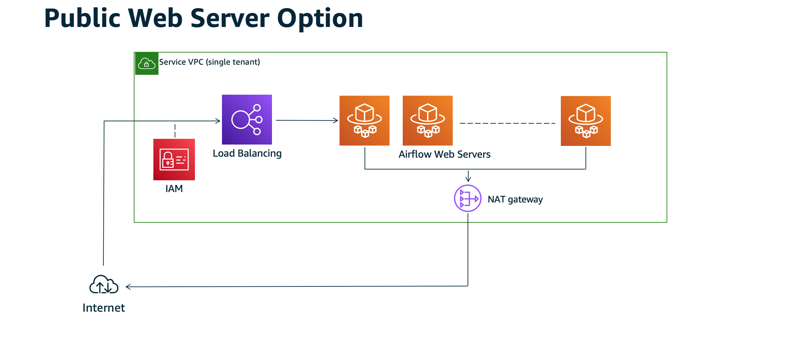
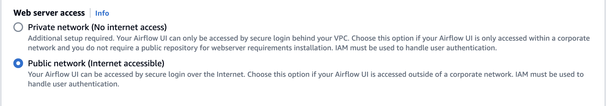

# Apache Airflow access modes

The Amazon Managed Workflows for Apache Airflow console contains built-in options to configure private or public routing to the Apache Airflow webserver on your environment. This guide describes the access modes available for the Apache Airflow webserver on your Amazon Managed Workflows for Apache Airflow environment, and the additional resources you'll need to configure in your Amazon VPC if you choose the private network option.

###### Contents

- [Apache Airflow access modes](configuring-networking.md#configuring-networking-onconsole "configuring-networking.md#configuring-networking-onconsole")
  - [Public network](configuring-networking.md#webserver-options-public-network-onconsole "configuring-networking.md#webserver-options-public-network-onconsole")
  - [Private network](configuring-networking.md#webserver-options-private-network "configuring-networking.md#webserver-options-private-network")

- [Access modes overview](configuring-networking.md#configuring-networking-access-overview "configuring-networking.md#configuring-networking-access-overview")
  - [Public network access mode](configuring-networking.md#access-overview-public "configuring-networking.md#access-overview-public")
  - [Private network access mode](configuring-networking.md#access-overview-private "configuring-networking.md#access-overview-private")

- [Setup for private and public access modes](configuring-networking.md#access-network-choose "configuring-networking.md#access-network-choose")
  - [Setup for public network](configuring-networking.md#access-network-public "configuring-networking.md#access-network-public")
  - [Setup for private network](configuring-networking.md#access-network-private "configuring-networking.md#access-network-private")

- [Accessing the VPC endpoint for your Apache Airflow webserver (private network access)](configuring-networking.md#configuring-access-vpce "configuring-networking.md#configuring-access-vpce")

## Apache Airflow access modes

You can choose private or public routing for your Apache Airflow webserver. To enable private routing, choose **Private network**. This limits user access to an Apache Airflow webserver within an Amazon VPC. To enable public routing, choose **Public network**. This allows users to access the Apache Airflow webserver over the internet.

### Public network

The following architectural diagram depicts an Amazon MWAA environment with a public webserver.

The public network access mode allows the Apache Airflow UI to be accessed over the internet by users granted access to the
[IAM policy for your environment](access-policies.md "access-policies.md").

The following image depicts where to find the **Public network** option on the Amazon MWAA console.

### Private network

The following architectural diagram depicts an Amazon MWAA environment with a private webserver.

The private network access mode limits access to the Apache Airflow UI to users _within your Amazon VPC_ that have been granted access to the
[IAM policy for your environment](access-policies.md "access-policies.md").

When you create an environment with private webserver access, you must package all of your dependencies in a Python wheel archive (`.whl`), then
reference the `.whl` in your `requirements.txt`. For instructions on packaging and installing your dependencies
using wheel, refer to [Managing dependencies using Python wheel](best-practices-dependencies.md#best-practices-dependencies-python-wheels "best-practices-dependencies.md#best-practices-dependencies-python-wheels").

The following image depicts where to find the **Private network** option on the Amazon MWAA console.

## Access modes overview

This section describes the VPC endpoints (AWS PrivateLink) created in your Amazon VPC when you choose the **Public network** or **Private network** access mode.

### Public network access mode

If you chose the **Public network** access mode for your Apache Airflow webserver, network traffic is publicly routed over the internet.

- Amazon MWAA creates a VPC interface endpoint for your Amazon Aurora PostgreSQL metadata database. The endpoint is created in the Availability Zones mapped to your private subnets and is independent from other AWS accounts.
- Amazon MWAA then binds an IP address from your private subnets to the interface endpoints. This is designed to support the best practice of binding a single IP from each Availability Zone of the Amazon VPC.

### Private network access mode

If you chose the **Private network** access mode for your Apache Airflow webserver, network traffic is privately routed _within your Amazon VPC_.

- Amazon MWAA creates a VPC interface endpoint for your Apache Airflow webserver, and an interface endpoint for your Amazon Aurora PostgreSQL metadata database. The endpoints are created in the Availability Zones mapped to your private subnets and is independent from other AWS accounts.
- Amazon MWAA then binds an IP address from your private subnets to the interface endpoints. This is designed to support the best practice of binding a single IP from each Availability Zone of the Amazon VPC.

To learn more, refer to [Example use cases for an Amazon VPC and Apache Airflow access mode](networking-about.md#networking-about-network-usecase "networking-about.md#networking-about-network-usecase").

## Setup for private and public access modes

The following section describes the additional setup and configurations you'll need based on the Apache Airflow access mode you've chosen for your environment.

### Setup for public network

If you choose the **Public network** option for your Apache Airflow webserver, you can begin using the Apache Airflow UI after you create your environment.

You'll need to take the following steps to configure access for your users, and permission for your environment to use other AWS services.

1. **Add permissions**. Amazon MWAA needs permission to use other AWS services. When you create an environment, Amazon MWAA creates a [service-linked role](mwaa-slr.md "mwaa-slr.md") that allows it to use certain IAM actions for Amazon Elastic Container Registry (Amazon ECR), CloudWatch Logs, and Amazon EC2.

You can add permission to use additional actions for these services, or to use other AWS services by adding permissions to your execution role. To learn more, refer to [Amazon MWAA execution role](mwaa-create-role.md "mwaa-create-role.md"). 2. **Create user policies**. You might need to create multiple IAM policies for your users to configure access to your environment and Apache Airflow UI. To learn more, refer to [Accessing an Amazon MWAA environment](access-policies.md "access-policies.md").

### Setup for private network

If you choose the **Private network** option for your Apache Airflow webserver, you'll need to configure access for your users, permission for your environment to use other AWS services, and create a mechanism to access the resources in your Amazon VPC from your computer.

1. **Add permissions**. Amazon MWAA needs permission to use other AWS services. When you create an environment, Amazon MWAA creates a [service-linked role](mwaa-slr.md "mwaa-slr.md") that allows it to use certain IAM actions for Amazon Elastic Container Registry (Amazon ECR), CloudWatch Logs, and Amazon EC2.

You can add permission to use additional actions for these services, or to use other AWS services by adding permissions to your execution role. To learn more, refer to [Amazon MWAA execution role](mwaa-create-role.md "mwaa-create-role.md"). 2. **Create user policies**. You might need to create multiple IAM policies for your users to configure access to your environment and Apache Airflow UI. To learn more, refer to [Accessing an Amazon MWAA environment](access-policies.md "access-policies.md"). 3. **Enable network access**. You'll need to create a mechanism in your Amazon VPC to connect to the VPC endpoint (AWS PrivateLink) for your Apache Airflow webserver. For example, by creating a VPN tunnel from your computer using an AWS Client VPN.

## Accessing the VPC endpoint for your Apache Airflow webserver (private network access)

If you've chosen the **Private network** option, you'll need to create a mechanism in your Amazon VPC to access the VPC endpoint (AWS PrivateLink) for your Apache Airflow webserver. We recommend using the same Amazon VPC, VPC security group, and private subnets as your Amazon MWAA environment for these resources.

To learn more, refer to [Managing access for VPC endpoints](vpc-vpe-access.md "vpc-vpe-access.md").
