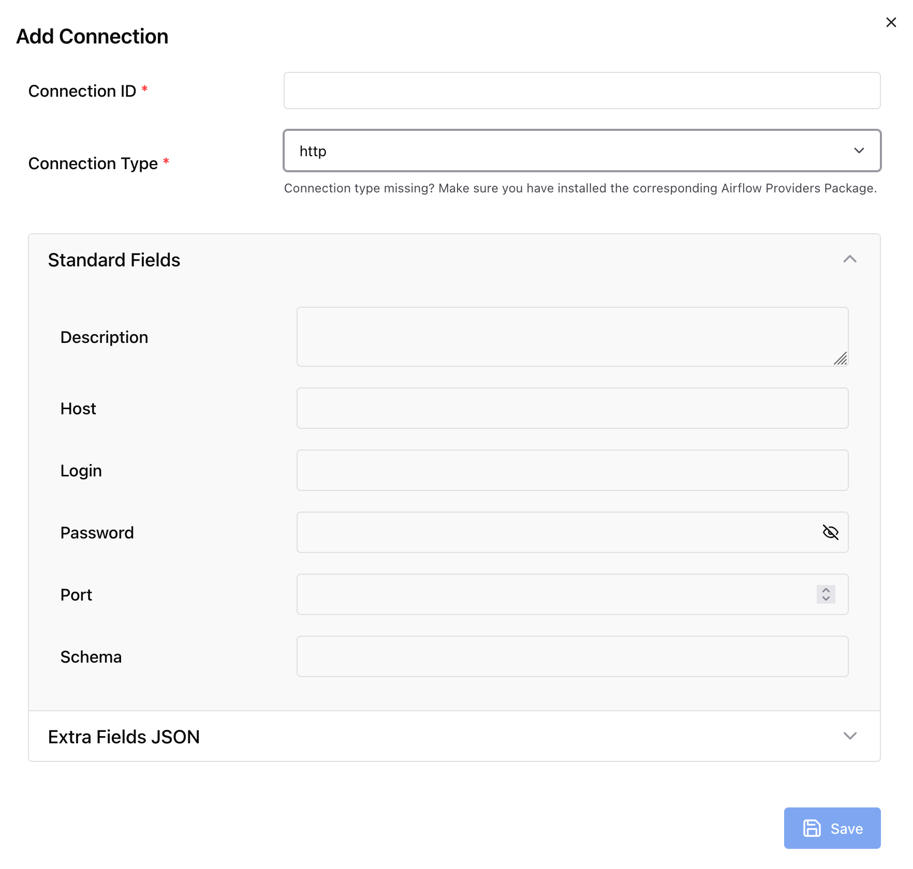
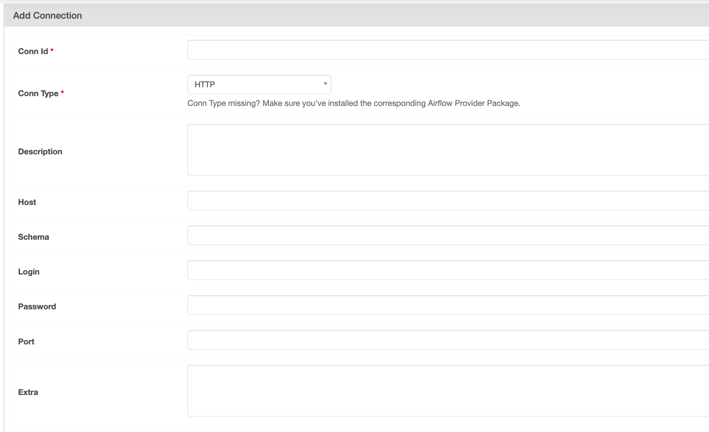
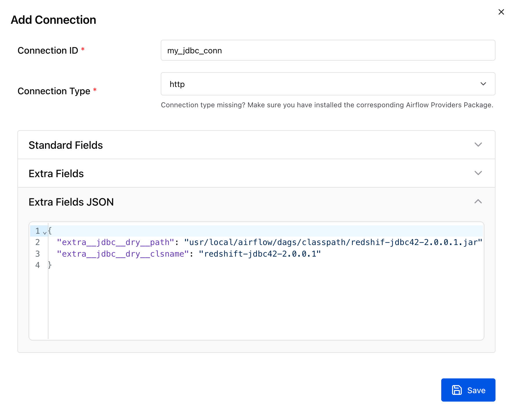
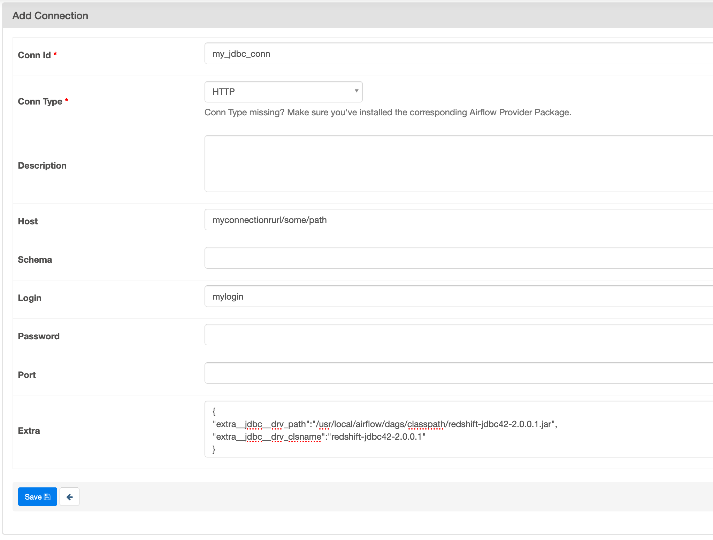

# Overview of connection types

Apache Airflow stores connections as a connection URI string. It provides a connections template in the Apache Airflow UI to generate the connection URI string, regardless of the connection type.
If a connection template is not available in the Apache Airflow UI, an alternate connection template can be used to generate this connection URI string, such as using the HTTP connection template.
The primary difference is the URI prefix, such as `my-conn-type://`, which Apache Airflow providers typically ignore for a connection. This page describes how to use connection templates
in the Apache Airflow UI interchangeably for different connection types.

###### Warning

Don't overwrite the [`aws_default`](https://airflow.apache.org/docs/apache-airflow-providers-amazon/stable/connections/aws.html "https://airflow.apache.org/docs/apache-airflow-providers-amazon/stable/connections/aws.html")
connection in Amazon MWAA. Amazon MWAA uses this connection to perform a variety of critical tasks, such as collecting task logs. Overwriting this connection might result
in data loss and disruptions to your environment availability.

###### Topics

- [Example connection URI string](#manage-connection-types-string-example "#manage-connection-types-string-example")
- [Example connection template](#manage-connection-types-template-example "#manage-connection-types-template-example")
- [Example using an HTTP connection template for a Jdbc connection](#manage-connection-types-example "#manage-connection-types-example")

## Example connection URI string

The following example presents a connection URI string for the MySQL connection type.

```
'mysql://288888a0-50a0-888-9a88-1a111aaa0000.a1.us-east-1.airflow.amazonaws.com%2Fhome?role_arn=arn%3Aaws%3Aiam%3A%3A001122332255%3Arole%2Fservice-role%2FAmazonMWAA-MyAirflowEnvironment-iAaaaA&region_name=us-east-1'
```

## Example connection template

The following examples depict the HTTP connection template in the Apache Airflow UI.

Apache Airflow v3



Apache Airflow v2



## Example using an HTTP connection template for a Jdbc connection

Use the following example to apply the **HTTP** connection template for a _Jdbc_ connection type in the Apache Airflow UI.

Apache Airflow v3
The following example displays the connection URI string generated by Apache Airflow for the example in this section.

```
http://myconnectionurl/some/path&login=mylogin&extra__jdbc__dry__path=usr/local/airflow/dags/classpath/redshif-jdbc42-2.0.0.1.jar&extra__jdbc__dry__clsname=redshift-jdbc42-2.0.0.1
```

Use the following example to apply the HTTP connection template for a _Jdbc_ connection for Apache Airflow v3 in the Apache Airflow UI.



Apache Airflow v2
The following example displays the connection URI string generated by Apache Airflow for the example in this section.

```
http://myconnectionurl/some/path&login=mylogin&extra__jdbc__dry__path=usr/local/airflow/dags/classpath/redshif-jdbc42-2.0.0.1.jar&extra__jdbc__dry__clsname=redshift-jdbc42-2.0.0.1
```

Use the following example to apply the HTTP connection template for a _Jdbc_ connection for Apache Airflow v2 in the Apache Airflow UI.


