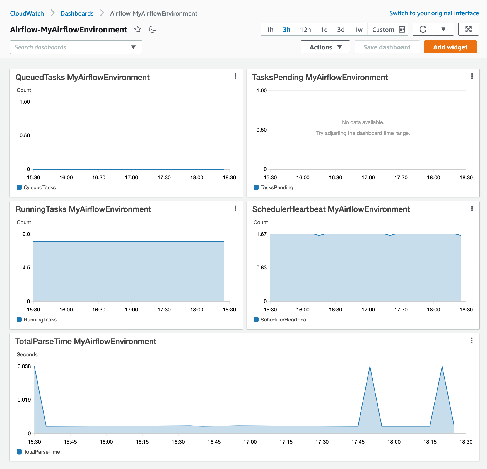

# Monitoring dashboards and alarms on Amazon MWAA

You can create a custom dashboard in Amazon CloudWatch and add alarms for a particular metric to monitor the health status of an Amazon Managed Workflows for Apache Airflow environment. When an alarm is on a dashboard, it turns red when it's in the `ALARM` state, making it easier to monitor the health of an Amazon MWAA environment proactively.

Apache Airflow exposes metrics for several processes, including the number of DAG processes, DAG bag size, currently running tasks, task failures, and successes. When you create an environment, Airflow automatically sends metrics for an Amazon MWAA environment to CloudWatch. This page describes how to create a health status dashboard for the Airflow metrics in CloudWatch for an Amazon MWAA environment.

###### Contents

- [Metrics](monitoring-dashboard.md#monitoring-dashboard-metrics "monitoring-dashboard.md#monitoring-dashboard-metrics")
- [Alarm states overview](monitoring-dashboard.md#monitoring-dashboard-states "monitoring-dashboard.md#monitoring-dashboard-states")
- [Example custom dashboards and alarms](monitoring-dashboard.md#monitoring-dashboard-custom "monitoring-dashboard.md#monitoring-dashboard-custom")
  - [About these metrics](monitoring-dashboard.md#monitoring-dashboard-custom-about "monitoring-dashboard.md#monitoring-dashboard-custom-about")
  - [About the dashboard](monitoring-dashboard.md#monitoring-dashboard-custom-about-dash "monitoring-dashboard.md#monitoring-dashboard-custom-about-dash")
  - [Using AWS tutorials](monitoring-dashboard.md#monitoring-dashboard-tutorials "monitoring-dashboard.md#monitoring-dashboard-tutorials")
  - [Using CloudFormation](monitoring-dashboard.md#monitoring-dashboard-cfn "monitoring-dashboard.md#monitoring-dashboard-cfn")

- [Deleting metrics and dashboards](monitoring-dashboard.md#monitoring-dashboard-delete "monitoring-dashboard.md#monitoring-dashboard-delete")
- [What's next?](monitoring-dashboard.md#monitoring-dashboard-next-up "monitoring-dashboard.md#monitoring-dashboard-next-up")

## Metrics

You can create a custom dashboard and alarm for any of the metrics available for your Apache Airflow version. Each metric corresponds to an Apache Airflow key performance indicator (KPI).
To access a list of metrics, refer to:

- [Apache Airflow environment metrics in CloudWatch](access-metrics-cw.md "access-metrics-cw.md")

## Alarm states overview

A metric alarm has the following possible states:

- `OK` – The metric or expression is within the defined threshold.
- `ALARM` – The metric or expression is outside of the defined threshold.
- `INSUFFICIENT_DATA` – The alarm has just started, the metric is not available, or not enough data is available for
  the metric to determine the alarm state.

## Example custom dashboards and alarms

You can build a custom monitoring dashboard that displays charts of selected metrics for your Amazon MWAA environment.

### About these metrics

The following list describes each of the metrics created in the custom dashboard by the tutorial and template definitions in this section.

- _QueuedTasks_ - The number of tasks with queued state. Corresponds to the `executor.queued_tasks` Apache Airflow metric.
- _TasksPending_ - The number of tasks pending in executor. Corresponds to the `scheduler.tasks.pending` Apache Airflow metric.

###### Note

Does not apply to Apache Airflow v2.2 and later.

- _RunningTasks_ - The number of tasks running in executor. Corresponds to the `executor.running_tasks` Apache Airflow metric.
- _SchedulerHeartbeat_ - The number of check-ins Apache Airflow performs on the scheduler job. Corresponds to the `scheduler_heartbeat` Apache Airflow metrics.
- _TotalParseTime_ - The number of seconds taken to scan and import all DAG files once. Corresponds to the `dag_processing.total_parse_time` Apache Airflow metric.

### About the dashboard

The following image displays the monitoring dashboard created by the tutorial and template definition in this section.



### Using AWS tutorials

You can use the following AWS tutorial to automatically create a health status dashboard for any Amazon MWAA environments that are currently deployed. It also creates CloudWatch alarms for unhealthy workers and scheduler heartbeat failures across all Amazon MWAA environments.

- [CloudWatch Dashboard Automation for Amazon MWAA](https://github.com/aws-samples/mwaa-dashboard "https://github.com/aws-samples/mwaa-dashboard")

### Using CloudFormation

You can use the CloudFormation template definition in this section to create a monitoring dashboard in CloudWatch, then add alarms on the CloudWatch console to receive notifications when a metric surpasses a particular threshold. To create the stack using this template definition, refer to [Creating a stack on the CloudFormation console](../../../AWSCloudFormation/latest/UserGuide/cfn-console-create-stack.md "../../../AWSCloudFormation/latest/UserGuide/cfn-console-create-stack.md"). To add an alarm to the dashboard, refer to [Using alarms](../../../AmazonCloudWatch/latest/monitoring/AlarmThatSendsEmail.md "../../../AmazonCloudWatch/latest/monitoring/AlarmThatSendsEmail.md").

```
AWSTemplateFormatVersion: "2010-09-09"
Description: Creates MWAA Cloudwatch Dashboard
Parameters:
  DashboardName:
    Description: Enter the name of the CloudWatch Dashboard
    Type: String
  EnvironmentName:
    Description: Enter the name of the MWAA Environment
    Type: String
Resources:
  BasicDashboard:
    Type: AWS::CloudWatch::Dashboard
    Properties:
      DashboardName: !Ref DashboardName
      DashboardBody:
        Fn::Sub: '{
              "widgets": [
                  {
                      "type": "metric",
                      "x": 0,
                      "y": 0,
                      "width": 12,
                      "height": 6,
                      "properties": {
                          "view": "timeSeries",
                          "stacked": true,
                          "metrics": [
                              [
                                  "AmazonMWAA",
                                  "QueuedTasks",
                                  "Function",
                                  "Executor",
                                  "Environment",
                                  "${EnvironmentName}"
                              ]
                          ],
                          "region": "${AWS::Region}",
                          "title": "QueuedTasks ${EnvironmentName}",
                          "period": 300
                      }
                  },
                  {
                      "type": "metric",
                      "x": 0,
                      "y": 6,
                      "width": 12,
                      "height": 6,
                      "properties": {
                          "view": "timeSeries",
                          "stacked": true,
                          "metrics": [
                              [
                                  "AmazonMWAA",
                                  "RunningTasks",
                                  "Function",
                                  "Executor",
                                  "Environment",
                                  "${EnvironmentName}"
                              ]
                          ],
                          "region": "${AWS::Region}",
                          "title": "RunningTasks ${EnvironmentName}",
                          "period": 300
                      }
                  },
                  {
                      "type": "metric",
                      "x": 12,
                      "y": 6,
                      "width": 12,
                      "height": 6,
                      "properties": {
                          "view": "timeSeries",
                          "stacked": true,
                          "metrics": [
                              [
                                  "AmazonMWAA",
                                  "SchedulerHeartbeat",
                                  "Function",
                                  "Scheduler",
                                  "Environment",
                                  "${EnvironmentName}"
                              ]
                          ],
                          "region": "${AWS::Region}",
                          "title": "SchedulerHeartbeat ${EnvironmentName}",
                          "period": 300
                      }
                  },
                  {
                      "type": "metric",
                      "x": 12,
                      "y": 0,
                      "width": 12,
                      "height": 6,
                      "properties": {
                          "view": "timeSeries",
                          "stacked": true,
                          "metrics": [
                              [
                                  "AmazonMWAA",
                                  "TasksPending",
                                  "Function",
                                  "Scheduler",
                                  "Environment",
                                  "${EnvironmentName}"
                              ]
                          ],
                          "region": "${AWS::Region}",
                          "title": "TasksPending ${EnvironmentName}",
                          "period": 300
                      }
                  },
                  {
                      "type": "metric",
                      "x": 0,
                      "y": 12,
                      "width": 24,
                      "height": 6,
                      "properties": {
                          "view": "timeSeries",
                          "stacked": true,
                          "region": "${AWS::Region}",
                          "metrics": [
                              [
                                  "AmazonMWAA",
                                  "TotalParseTime",
                                  "Function",
                                  "DAG Processing",
                                  "Environment",
                                  "${EnvironmentName}"
                              ]
                          ],
                          "title": "TotalParseTime  ${EnvironmentName}",
                          "period": 300
                      }
                  }
              ]
          }'
```

## Deleting metrics and dashboards

If you delete an Amazon MWAA environment, the corresponding dashboard is also deleted. CloudWatch metrics are stored for fifteen (15) months and can not be deleted. The CloudWatch console limits the search of metrics to two (2) weeks after a metric is last ingested to ensure that the most up to date instances are shown for your Amazon MWAA environment. To learn more, refer to [Amazon CloudWatch FAQs](https://aws.amazon.com/cloudwatch/faqs/ "https://aws.amazon.com/cloudwatch/faqs/").

## What's next?

- Learn how to create a DAG that queries the Amazon Aurora PostgreSQL metadata database for your environment and publishes custom metrics to CloudWatch in [Using a DAG to write custom metrics in CloudWatch](samples-custom-metrics.md "samples-custom-metrics.md").
