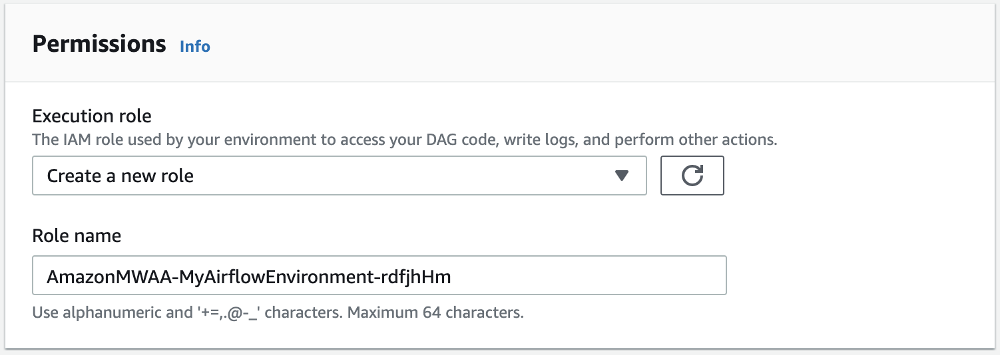

# Amazon MWAA execution role

An execution role is an AWS Identity and Access Management (IAM) role with a permissions policy that grants Amazon Managed Workflows for Apache Airflow permission to invoke the resources of other AWS services on your behalf. This can include resources such as your Amazon S3 bucket, [AWS-owned key](../../../kms/latest/developerguide/concepts.md#aws-owned-cmk "../../../kms/latest/developerguide/concepts.md#aws-owned-cmk"), and CloudWatch Logs. Amazon MWAA environments need one execution role per environment. This topic describes how to use and configure the execution role for your environment to allow Amazon MWAA to access other AWS resources used by your environment.

###### Contents

- [Execution role overview](mwaa-create-role.md#mwaa-create-role-how "mwaa-create-role.md#mwaa-create-role-how")
  - [Permissions attached by default](mwaa-create-role.md#mwaa-create-role-how-create-role "mwaa-create-role.md#mwaa-create-role-how-create-role")
  - [How to add permission to use other AWS services](mwaa-create-role.md#mwaa-create-role-how-adding "mwaa-create-role.md#mwaa-create-role-how-adding")
  - [How to associate a new execution role](mwaa-create-role.md#mwaa-create-role-how-associating "mwaa-create-role.md#mwaa-create-role-how-associating")

- [Create a new role](mwaa-create-role.md#mwaa-create-role-mwaa-onconsole "mwaa-create-role.md#mwaa-create-role-mwaa-onconsole")
- [Access and update an execution role policy](mwaa-create-role.md#mwaa-create-role-update "mwaa-create-role.md#mwaa-create-role-update")
  - [Attach a JSON policy to use other AWS services](mwaa-create-role.md#mwaa-create-role-attach-json-policy "mwaa-create-role.md#mwaa-create-role-attach-json-policy")

- [Grant access to Amazon S3 bucket with account-level public access block](mwaa-create-role.md#mwaa-create-role-s3-publicaccessblock "mwaa-create-role.md#mwaa-create-role-s3-publicaccessblock")
- [Use Apache Airflow connections](mwaa-create-role.md#mwaa-create-role-airflow-connections "mwaa-create-role.md#mwaa-create-role-airflow-connections")
- [Sample JSON policies for an execution role](mwaa-create-role.md#mwaa-create-role-json "mwaa-create-role.md#mwaa-create-role-json")
  - [Sample policy for a customer-managed key](mwaa-create-role.md#mwaa-create-role-cmk "mwaa-create-role.md#mwaa-create-role-cmk")
  - [Sample policy for an AWS-owned key](mwaa-create-role.md#mwaa-create-role-aocmk "mwaa-create-role.md#mwaa-create-role-aocmk")

- [What's next?](mwaa-create-role.md#mwaa-create-role-next-up "mwaa-create-role.md#mwaa-create-role-next-up")

## Execution role overview

Permission for Amazon MWAA to use other AWS services used by your environment comes from the execution role. An Amazon MWAA execution role needs permission to the following AWS services used by an environment:

- Amazon CloudWatch (CloudWatch) – to send Apache Airflow metrics and logs.
- Amazon Simple Storage Service (Amazon S3) – to parse your environment's DAG code and supporting files (such as a `requirements.txt`).
- Amazon Simple Queue Service (Amazon SQS) – to queue your environment's Apache Airflow tasks in an Amazon SQS queue owned by Amazon MWAA.
- AWS Key Management Service (AWS KMS) – for your environment's data encryption (using either an [AWS-owned key](../../../kms/latest/developerguide/concepts.md#aws-owned-cmk "../../../kms/latest/developerguide/concepts.md#aws-owned-cmk") or your [Customer-managed key](../../../kms/latest/developerguide/concepts.md#customer-cmk "../../../kms/latest/developerguide/concepts.md#customer-cmk")).

###### Note

If you have elected for Amazon MWAA to use an AWS owned KMS key to encrypt
your data, then you must define permissions in a policy attached to your
Amazon MWAA execution role that grant access to arbitrary KMS keys stored
outside of your account through Amazon SQS. The following two conditions are required
in order for your environment's execution role to access arbitrary
KMS keys:

    + A KMS key in a third-party account needs to allow this cross account access through its resource policy.
    + Your DAG code needs to access an Amazon SQS queue that starts with `airflow-celery-` in the third-party account
     and uses the same KMS key for encryption.To mitigate the risks associated with cross-account access to resources, we recommend reviewing the code placed in your DAGs

to ensure that your workflows are not accessing arbitrary Amazon SQS queues outside your account. Furthermore, you can use a customer-managed
KMS key stored in your own account to manage encryption on Amazon MWAA. This limits your environment's execution role
to access only the KMS key in your account.

Keep in mind that after you choose an encryption option, you cannot change your selection for an existing environment.

An execution role also needs permission to the following IAM actions:

- `airflow:PublishMetrics` – to allow Amazon MWAA to monitor the health of an environment.

### Permissions attached by default

You can use the default options on the Amazon MWAA console to create an execution role and an [AWS-owned key](../../../kms/latest/developerguide/concepts.md#aws-owned-cmk "../../../kms/latest/developerguide/concepts.md#aws-owned-cmk"), then use the steps on this page to add permission policies to your execution role.

- When you choose the **Create new role** option on the console, Amazon MWAA attaches the minimal permissions needed by an environment to your execution role.
- In some cases, Amazon MWAA attaches the maximum permissions. For example, we recommend choosing the option on the Amazon MWAA console to create an execution role when you create an environment. Amazon MWAA adds the permissions policies for all CloudWatch Logs groups automatically by using the regex pattern in the execution role as `"arn:aws:logs:`us-east-1`:`111122223333`:log-group:`airflow-your-environment-name-\*`"`.

### How to add permission to use other AWS services

Amazon MWAA can't add or edit permission policies to an existing execution role after an environment is created. You must update your execution role with additional permission policies needed by your environment. For example, if your DAG requires access to AWS Glue, Amazon MWAA can't automatically detect these permissions are required by your environment, or add the permissions to your execution role.

You can add permissions to an execution role in two ways:

- By modifying the JSON policy for your execution role inline. You can use the sample [JSON policy documents](../../../IAM/latest/UserGuide/reference_policies_grammar.md "../../../IAM/latest/UserGuide/reference_policies_grammar.md") on this page to either add to or replace the JSON policy of your execution role on the IAM console.
- By creating a JSON policy for an AWS service and attaching it to your execution role. You can use the steps on this page to associate a new JSON policy document for an AWS service to your execution role on the IAM console.

Assuming the execution role is already associated to your environment, Amazon MWAA can start using the added permission policies immediately. This also means if you remove any required permissions from an execution role, your DAGs might fail.

### How to associate a new execution role

You can change the execution role for your environment at any time. If a new execution role is not already associated with your environment, use the steps on this page to create a new execution role policy, and associate the role to your environment.

## Create a new role

By default, Amazon MWAA creates an [AWS-owned key](../../../kms/latest/developerguide/concepts.md#aws-owned-cmk "../../../kms/latest/developerguide/concepts.md#aws-owned-cmk") for data encryption and an execution role on your behalf. You can choose the default options on the Amazon MWAA console when you create an environment. The following image displays the default option to create an execution role for an environment.



###### Important

When you create a new execution role, do not reuse the name of a deleted execution role. Unique names can help prevent conflicts and ensure proper resource management.

## Access and update an execution role policy

You can access the execution role for your environment on the Amazon MWAA console, and update the JSON policy for the role on the IAM console.

###### To update an execution role policy

1. Open the [Environments](https://console.aws.amazon.com/mwaa/home#/environments "https://console.aws.amazon.com/mwaa/home#/environments") page on the Amazon MWAA console.
2. Choose an environment.
3. Choose the execution role on the **Permissions** pane to open the permissions page in IAM.
4. Choose the execution role name to open the permissions policy.
5. Choose **Edit policy**.
6. Choose the **JSON** tab.
7. Update your JSON policy.
8. Choose **Review policy**.
9. Choose **Save changes**.

### Attach a JSON policy to use other AWS services

You can create a JSON policy for an AWS service and attach it to your execution role. For example, you can attach the following JSON policy to grant read-only access to all resources in AWS Secrets Manager.

JSON

```
`{
 "Version":"2012-10-17",
 "Statement":[
 {
 "Effect":"Allow",
 "Action":[
 "secretsmanager:GetResourcePolicy",
 "secretsmanager:GetSecretValue",
 "secretsmanager:DescribeSecret",
 "secretsmanager:ListSecretVersionIds"
 ],
 "Resource":[
 "*"
 ]
 }
 ]
}`

```

###### To attach a policy to your execution role

1. Open the [Environments](https://console.aws.amazon.com/mwaa/home#/environments "https://console.aws.amazon.com/mwaa/home#/environments") page on the Amazon MWAA console.
2. Choose an environment.
3. Choose your execution role on the **Permissions** pane.
4. Choose **Attach policies**.
5. Choose **Create policy**.
6. Choose **JSON**.
7. Paste the JSON policy.
8. Choose **Next: Tags**, **Next: Review**.
9. Enter a descriptive name (such as `SecretsManagerReadPolicy`) and a description for the policy.
10. Choose **Create policy**.

## Grant access to Amazon S3 bucket with account-level public access block

You might want to block access to all buckets in your account by using the [`PutPublicAccessBlock`](../../../AmazonS3/latest/API/API_control_PutPublicAccessBlock.md "../../../AmazonS3/latest/API/API_control_PutPublicAccessBlock.md") Amazon S3 operation.
When you block access to all buckets in your account, your environment execution role must include the `s3:GetAccountPublicAccessBlock` action in a permission policy.

The following example demonstrates the policy you must attach to your execution role when blocking access to all Amazon S3 buckets in your account.

JSON

```
`{
 "Version":"2012-10-17",
 "Statement": [
 {
 "Effect": "Allow",
 "Action": "s3:GetAccountPublicAccessBlock",
 "Resource": "*"
 }
 ]
}`

```

For more information about restricting access to your Amazon S3 buckets, refer to [Blocking public access to your Amazon S3 storage](../../../index.md "../../../index.md") in the _Amazon Simple Storage Service User Guide_.

## Use Apache Airflow connections

You can also create an Apache Airflow connection and specify your execution role and its ARN in your Apache Airflow connection object. To learn more, refer to [Managing connections to Apache Airflow](manage-connections.md "manage-connections.md").

## Sample JSON policies for an execution role

You can use the two sample permission policies in this section to replace the permissions policy used for your existing execution role, or to create a new execution role and use for your environment. These policies contain [Resource ARN](../../../IAM/latest/UserGuide/reference_policies_elements_resource.md "../../../IAM/latest/UserGuide/reference_policies_elements_resource.md") placeholders for Apache Airflow log groups, an [Amazon S3 bucket](mwaa-s3-bucket.md "mwaa-s3-bucket.md"), and an [Amazon MWAA environment](create-environment.md "create-environment.md").

We recommend copying the example policy, replacing the sample ARNs or placeholders, then using the JSON policy to create or update an execution role.

### Sample policy for a customer-managed key

The following example presents an execution role policy you can use for an [Customer-managed key](../../../kms/latest/developerguide/concepts.md#customer-cmk "../../../kms/latest/developerguide/concepts.md#customer-cmk").

JSON

```
`{
 "Version":"2012-10-17",
 "Statement": [
 {
 "Effect": "Deny",
 "Action": "s3:ListAllMyBuckets",
 "Resource": [
 "arn:aws:s3:::`amzn-s3-demo-bucket`",
 "arn:aws:s3:::`amzn-s3-demo-bucket`/*"
 ]
 },
 {
 "Effect": "Allow",
 "Action": [
 "s3:GetObject*",
 "s3:GetBucket*",
 "s3:List*"
 ],
 "Resource": [
 "arn:aws:s3:::`amzn-s3-demo-bucket`",
 "arn:aws:s3:::`amzn-s3-demo-bucket`/*"
 ]
 },
 {
 "Effect": "Allow",
 "Action": [
 "logs:CreateLogStream",
 "logs:CreateLogGroup",
 "logs:PutLogEvents",
 "logs:GetLogEvents",
 "logs:GetLogRecord",
 "logs:GetLogGroupFields",
 "logs:GetQueryResults"
 ],
 "Resource": [
 "arn:aws:logs:`us-east-1`:`111122223333`:log-group:airflow-`your-environment-name`:*"
 ]
 },
 {
 "Effect": "Allow",
 "Action": [
 "logs:DescribeLogGroups"
 ],
 "Resource": [
 "*"
 ]
 },
 {
 "Effect": "Allow",
 "Action": [
 "s3:GetAccountPublicAccessBlock"
 ],
 "Resource": [
 "*"
 ]
 },
 {
 "Effect": "Allow",
 "Action": "cloudwatch:PutMetricData",
 "Resource": "*"
 },
 {
 "Effect": "Allow",
 "Action": [
 "sqs:ChangeMessageVisibility",
 "sqs:DeleteMessage",
 "sqs:GetQueueAttributes",
 "sqs:GetQueueUrl",
 "sqs:ReceiveMessage",
 "sqs:SendMessage"
 ],
 "Resource": "arn:aws:sqs:`us-east-1`:*:airflow-celery-*"
 },
 {
 "Effect": "Allow",
 "Action": [
 "kms:Decrypt",
 "kms:DescribeKey",
 "kms:GenerateDataKey*",
 "kms:Encrypt"
 ],
 "Resource": "arn:aws:kms:`us-east-1`:`111122223333`:key/`your-kms-cmk-id`",
 "Condition": {
 "StringLike": {
 "kms:ViaService": [
 `"sqs.`us-east-1`.amazonaws.com"`,
 `"s3.`us-east-1`.amazonaws.com"`
 ]
 }
 }
 }
 ]
}`

```

Next, you need to allow Amazon MWAA to assume this role to perform actions on your behalf. This can be done by adding `"airflow.amazonaws.com"` and `"airflow-env.amazonaws.com"` service principals to the list of trusted entities for this execution role [using the IAM console](../../../IAM/latest/UserGuide/id_roles_create_for-service.md#roles-creatingrole-service-console "../../../IAM/latest/UserGuide/id_roles_create_for-service.md#roles-creatingrole-service-console"), or by placing these service principals in the assume role policy document for this execution role through the IAM [create-role](../../../cli/latest/reference/iam/create-role.md "../../../cli/latest/reference/iam/create-role.md") command using the AWS CLI. Refer to the following sample assume role policy document:

JSON

```
`{
 "Version":"2012-10-17",
 "Statement": [
 {
 "Effect": "Allow",
 "Principal": {
 "Service": ["airflow.amazonaws.com","airflow-env.amazonaws.com"]
 },
 "Action": "sts:AssumeRole"
 }
 ]
}`

```

Then attach the following JSON policy to your [Customer-managed key](../../../kms/latest/developerguide/concepts.md#customer-cmk "../../../kms/latest/developerguide/concepts.md#customer-cmk"). This policy uses the [`kms:EncryptionContext`](../../../kms/latest/developerguide/policy-conditions.md#conditions-kms-encryption-context "../../../kms/latest/developerguide/policy-conditions.md#conditions-kms-encryption-context") condition key prefix to permit access to your Apache Airflow logs group in CloudWatch Logs.

```
{
  "Sid": "Allow logs access",
  "Effect": "Allow",
  "Principal": {
    "Service": "logs.`us-east-1`.amazonaws.com"
  },
  "Action": [
    "kms:Encrypt*",
    "kms:Decrypt*",
    "kms:ReEncrypt*",
    "kms:GenerateDataKey*",
    "kms:Describe*"
  ],
  "Resource": "*",
  "Condition": {
    "ArnLike": {
      `"kms:EncryptionContext:aws:logs:arn": "arn:aws:logs:`us-east-1`:`111122223333`:*"`
    }
  }
}
```

### Sample policy for an AWS-owned key

The following example presents an execution role policy you can use for an [AWS-owned key](../../../kms/latest/developerguide/concepts.md#aws-owned-cmk "../../../kms/latest/developerguide/concepts.md#aws-owned-cmk").

JSON

```
`{
 "Version":"2012-10-17",
 "Statement": [
 {
 "Effect": "Allow",
 "Action": "airflow:PublishMetrics",
 "Resource": "arn:aws:airflow:`us-east-1`:`111122223333`:environment/{your-environment-name}"
 },
 {
 "Effect": "Deny",
 "Action": "s3:ListAllMyBuckets",
 "Resource": [
 `"arn:aws:s3:::amzn-s3-demo-bucket"`,
 `"arn:aws:s3:::amzn-s3-demo-bucket/*"`
 ]
 },
 {
 "Effect": "Allow",
 "Action": [
 "s3:GetObject*",
 "s3:GetBucket*",
 "s3:List*"
 ],
 "Resource": [
 `"arn:aws:s3:::amzn-s3-demo-bucket"`,
 `"arn:aws:s3:::amzn-s3-demo-bucket/*"`
 ]
 },
 {
 "Effect": "Allow",
 "Action": [
 "logs:CreateLogStream",
 "logs:CreateLogGroup",
 "logs:PutLogEvents",
 "logs:GetLogEvents",
 "logs:GetLogRecord",
 "logs:GetLogGroupFields",
 "logs:GetQueryResults"
 ],
 "Resource": [
 "arn:aws:logs:`us-east-1`:`111122223333`:log-group:airflow-{your-environment-name}-*"
 ]
 },
 {
 "Effect": "Allow",
 "Action": [
 "logs:DescribeLogGroups"
 ],
 "Resource": [
 "*"
 ]
 },
 {
 "Effect": "Allow",
 "Action": [
 "s3:GetAccountPublicAccessBlock"
 ],
 "Resource": [
 "*"
 ]
 },
 {
 "Effect": "Allow",
 "Action": "cloudwatch:PutMetricData",
 "Resource": "*"
 },
 {
 "Effect": "Allow",
 "Action": [
 "sqs:ChangeMessageVisibility",
 "sqs:DeleteMessage",
 "sqs:GetQueueAttributes",
 "sqs:GetQueueUrl",
 "sqs:ReceiveMessage",
 "sqs:SendMessage"
 ],
 "Resource": "arn:aws:sqs:`us-east-1`:*:airflow-celery-*"
 },
 {
 "Effect": "Allow",
 "Action": [
 "kms:Decrypt",
 "kms:DescribeKey",
 "kms:GenerateDataKey*",
 "kms:Encrypt"
 ],
 "NotResource": "arn:aws:kms:*:`111122223333`:key/*",
 "Condition": {
 "StringLike": {
 "kms:ViaService": [
 "sqs.`us-east-1`.amazonaws.com"
 ]
 }
 }
 }
 ]
}`

```

## What's next?

- Learn about the required permissions you and your Apache Airflow users need to access your environment in [Accessing an Amazon MWAA environment](access-policies.md "access-policies.md").
- Learn about [Using customer-managed keys for encryption](custom-keys-certs.md "custom-keys-certs.md").
- Explore more [Customer-managed policy examples](../../../kms/latest/developerguide/customer-managed-policies.md "../../../kms/latest/developerguide/customer-managed-policies.md").
