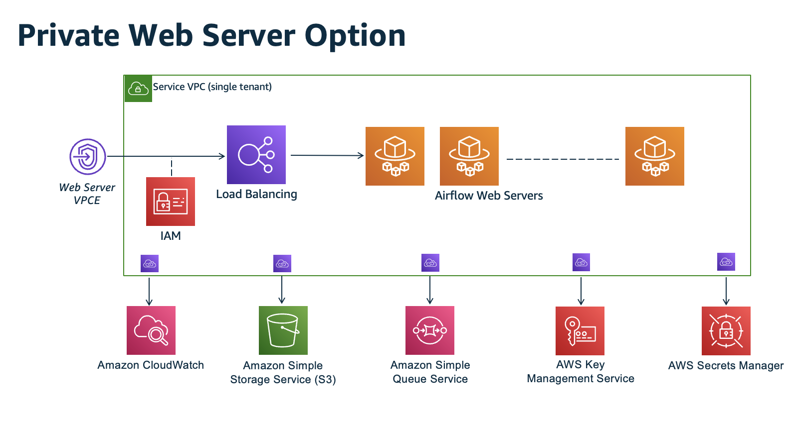
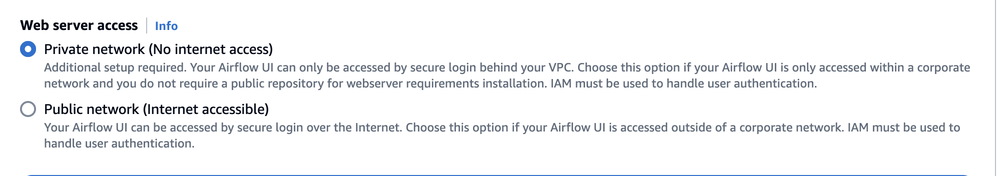

# Tutorial: Configuring private network access using an AWS Client VPN

This tutorial walks you through the steps to create a VPN tunnel from your computer to the Apache Airflow webserver for your Amazon Managed Workflows for Apache Airflow environment. To connect to the internet through a VPN tunnel, you'll first need to create a AWS Client VPN endpoint. Once set up, a Client VPN endpoint acts as a VPN server allowing a secure connection from your computer to the resources in your VPC. You'll then connect to the Client VPN from your computer using the [AWS Client VPN for Desktop](https://aws.amazon.com/vpn/client-vpn-download/ "https://aws.amazon.com/vpn/client-vpn-download/").

###### Sections

- [Private network](#private-network-vpn-onconsole "#private-network-vpn-onconsole")
- [Use cases](#private-network-vpn-usecases "#private-network-vpn-usecases")
- [Before you begin](#private-network-vpn-prereqs "#private-network-vpn-prereqs")
- [Objectives](#private-network-vpn-objectives "#private-network-vpn-objectives")
- [(Optional) Step one: Identify your VPC, CIDR rules, and VPC security](#private-network-vpn-optional "#private-network-vpn-optional")
- [Step two: Create the server and client certificates](#private-network-vpn-certs "#private-network-vpn-certs")
- [Step three: Save the CloudFormation template locally](#private-network-vpn-template "#private-network-vpn-template")
- [Step four: Create the Client VPN CloudFormation stack](#private-network-vpn-create "#private-network-vpn-create")
- [Step five: Associate subnets to your Client VPN](#private-network-vpn-associate "#private-network-vpn-associate")
- [Step six: Add an authorization ingress rule to your Client VPN](#private-network-vpn-autho "#private-network-vpn-autho")
- [Step seven: Download the Client VPN endpoint configuration file](#private-network-vpn-download "#private-network-vpn-download")
- [Step eight: Connect to the AWS Client VPN](#private-network-vpn-connect "#private-network-vpn-connect")
- [What's next?](#create-vpc-vpn-next-up "#create-vpc-vpn-next-up")

## Private network

This tutorial assumes you've chosen the **Private network** access mode for your Apache Airflow webserver.



The private network access mode limits access to the Apache Airflow UI to users _within your Amazon VPC_ who have been granted access to the
[IAM policy for your environment](access-policies.md "access-policies.md").

When you create an environment with private webserver access, you must package all of your dependencies in a Python wheel archive (`.whl`), then
reference the `.whl` in your `requirements.txt`. For instructions on packaging and installing your dependencies
using wheel, refer to [Managing dependencies using Python wheel](best-practices-dependencies.md#best-practices-dependencies-python-wheels "best-practices-dependencies.md#best-practices-dependencies-python-wheels").

The following image depicts where to find the **Private network** option on the Amazon MWAA console.



## Use cases

You can use this tutorial before or after you've created an Amazon MWAA environment. You must use the same Amazon VPC, VPC security groups, and private subnets as your environment. If you use this tutorial after you've created an Amazon MWAA environment, once you've completed the steps, you can return to the Amazon MWAA console and change your Apache Airflow webserver access mode to **Private network**.

## Before you begin

1. Check for user permissions. Be sure that your account in AWS Identity and Access Management (IAM) has sufficient permissions to create and manage VPC resources.
2. Use your Amazon MWAA VPC. This tutorial assumes that you are associating the Client VPN to an existing VPC. The Amazon VPC must be in the same AWS Region as an Amazon MWAA environment and have two private subnets. If you haven't created an Amazon VPC, use the CloudFormation template in [Option three: Creating an Amazon VPC network without internet access](vpc-create.md#vpc-create-template-private-only "vpc-create.md#vpc-create-template-private-only").

## Objectives

In this tutorial, you'll do the following:

1. Create a AWS Client VPN endpoint using a CloudFormation template for an existing Amazon VPC.
2. Generate server and client certificates and keys, and then upload the server certificate and key to AWS Certificate Manager in the same AWS Region as an Amazon MWAA environment.
3. Download and modify a Client VPN endpoint configuration file for your Client VPN, and use the file to create a VPN profile to connect using the Client VPN for Desktop.

## (Optional) Step one: Identify your VPC, CIDR rules, and VPC security

The following section describes how to find IDs for your Amazon VPC, VPC security group, and a way to identify the CIDR rules you'll need to create your Client VPN in subsequent steps.

### Identify your CIDR rules

The following section explains how to identify the CIDR rules, which you'll need to create your Client VPN.

###### To identify the CIDR for your Client VPN

1.  Open the [Your Amazon VPCs page](https://console.aws.amazon.com/vpc/home#/vpcs: "https://console.aws.amazon.com/vpc/home#/vpcs:") on the Amazon VPC console.
2.  Use the region selector in the navigation bar to choose the same AWS Region as an Amazon MWAA environment.
3.  Choose your Amazon VPC.
4.  Assuming the CIDRs for your private subnets are:

        * Private Subnet 1: 10.192.10.0`/24`
        * Private Subnet 2: 10.192.11.0`/24`

    If the CIDR for your Amazon VPC is 10.192.0.0`/16`, then the **Client IPv4 CIDR** you'd specify for your Client VPN would be 10.192.0.0`/22`.

5.  Save this CIDR value, and the value of your VPC ID for subsequent steps.

### Identify your VPC and security groups

The following section explains how to find the ID of your Amazon VPC and security groups, which you'll need to create your Client VPN.

###### Note

You might be using more than one security group. You'll need to specify all of your VPC's security groups in subsequent steps.

###### To identify the security groups

1. Open the [Security Groups page](https://console.aws.amazon.com/vpc/home#/securityGroups: "https://console.aws.amazon.com/vpc/home#/securityGroups:") on the Amazon VPC console.
2. Use the region selector in the navigation bar to choose the AWS Region.
3. Search for the Amazon VPC in **VPC ID**, and identify the security groups associated with the VPC.
4. Save the ID of your security groups and VPC for subsequent steps.

## Step two: Create the server and client certificates

A Client VPN endpoint supports 1024-bit and 2048-bit RSA key sizes only. The following section explains how to use OpenVPN easy-rsa to generate the server and client certificates and keys, and then upload the certificates to ACM using the AWS Command Line Interface (AWS CLI).

###### To create the client certificates

1. Follow these quick steps to create and upload the certificates to ACM through the AWS CLI in [Client authentication and authorization: Mutual authentication](../../../vpn/latest/clientvpn-admin/client-authentication.md#mutual "../../../vpn/latest/clientvpn-admin/client-authentication.md#mutual").
2. In these steps, you **must** specify the same AWS Region as an Amazon MWAA environment in the AWS CLI command when uploading your server and client certificates. Here's some examples of how to specify the region in these commands:
   1. ###### Example region for server certificate

   ```
   aws acm import-certificate --certificate fileb://server.crt --private-key fileb://server.key --certificate-chain fileb://ca.crt `--region us-west-2`
   ```

   2. ###### Example region for client certificate

   ```
   aws acm import-certificate --certificate fileb://client1.domain.tld.crt --private-key fileb://client1.domain.tld.key --certificate-chain fileb://ca.crt `--region us-west-2`
   ```

   3. After these steps, save the value returned in the AWS CLI response for the server certificate and client certificate ARNs. You'll be specifying these ARNs in your CloudFormation template to create the Client VPN.

3. In these steps, a client certificate and a private key are saved to your computer. Here's an example of where to find these credentials:
   1. ###### Example on macOS

   On macOS the contents are saved at `/Users/`your-user`/custom_folder`. If you list all (`ls -a`) contents of this directory, you get something similar to the following:

   ```
   .
   ..
   ca.crt
   client1.domain.tld.crt
   client1.domain.tld.key
   server.crt
   server.key
   ```

   2. After these steps, save the contents or note the location of the client certificate in `client1.domain.tld.crt`, and the private key in `client1.domain.tld.key`. You'll be adding these values to the configuration file for your Client VPN.

## Step three: Save the CloudFormation template locally

The following section contains the CloudFormation template to create the Client VPN. You must specify the same Amazon VPC, VPC security groups, and private subnets as your Amazon MWAA environment.

- Copy the contents of the following template and save locally as `mwaa_vpn_client.yaml`. You can also [download the template](samples/mwaa_vpn_client.md "samples/mwaa_vpn_client.md").

Substitute the following values:

    + `YOUR_CLIENT_ROOT_CERTIFICATE_ARN` – The ARN for your **client1.domain.tld** certificate in `ClientRootCertificateChainArn`.
    + `YOUR_SERVER_CERTIFICATE_ARN` – The ARN for your **server** certificate in `ServerCertificateArn`.
    + The Client IPv4 CIDR rule in `ClientCidrBlock`. A CIDR rule of `10.192.0.0/22` is provided.
    + Your Amazon VPC ID in `VpcId`. A VPC of `vpc-010101010101` is provided.
    + Your VPC security group IDs in `SecurityGroupIds`. A security group of `sg-0101010101` is provided.

```
AWSTemplateFormatVersion: 2010-09-09
Description: This template deploys a VPN Client Endpoint.
Resources:
  ClientVpnEndpoint:
    Type: 'AWS::EC2::ClientVpnEndpoint'
    Properties:
      AuthenticationOptions:
        - Type: "certificate-authentication"
          MutualAuthentication:
            ClientRootCertificateChainArn: "YOUR_CLIENT_ROOT_CERTIFICATE_ARN"
      ClientCidrBlock: 10.192.0.0/22
      ClientConnectOptions:
        Enabled: false
      ConnectionLogOptions:
        Enabled: false
      Description: "MWAA Client VPN"
      DnsServers: []
      SecurityGroupIds:
        - sg-0101010101
      SelfServicePortal: ''
      ServerCertificateArn: "YOUR_SERVER_CERTIFICATE_ARN"
      SplitTunnel: true
      TagSpecifications:
        - ResourceType: "client-vpn-endpoint"
          Tags:
          - Key: Name
            Value: MWAA-Client-VPN
      TransportProtocol: udp
      VpcId: vpc-010101010101
      VpnPort: 443
```

###### Note

If you're using more than one security group for your environment, you can specify multiple security groups in the following format:

```
SecurityGroupIds:
 - sg-0112233445566778b
 - sg-0223344556677889f
```

## Step four: Create the Client VPN CloudFormation stack

###### To create the AWS Client VPN

1. Open the [AWS CloudFormation console](https://console.aws.amazon.com/cloudformation/home# "https://console.aws.amazon.com/cloudformation/home#").
2. Choose **Template is ready**, **Upload a template file**.
3. Choose **Choose file**, and select your `mwaa_vpn_client.yaml` file.
4. Choose **Next**, **Next**.
5. Select the acknowledgement, and then choose **Create stack**.

## Step five: Associate subnets to your Client VPN

###### To associate private subnets to the AWS Client VPN

1. Open the [Amazon VPC console](https://console.aws.amazon.com/vpc/home# "https://console.aws.amazon.com/vpc/home#").
2. Choose the **Client VPN Endpoints** page.
3. Select your Client VPN, and then choose the **Associations** tab, **Associate**.
4. Choose the following in the dropdown list:
   - Your Amazon VPC in **VPC**.
   - One of your private subnets in **Choose a subnet to associate**.

5. Choose **Associate**.

###### Note

It takes several minutes for the VPC and subnet to be associated to the Client VPN.

## Step six: Add an authorization ingress rule to your Client VPN

You need to add an authorization ingress rule using the CIDR rule for your VPC to your Client VPN. If you want to authorize specific users or groups from your Active Directory Group or SAML-based Identity Provider (IdP), refer to the [Authorization rules](../../../vpn/latest/clientvpn-admin/cvpn-working-rules.md "../../../vpn/latest/clientvpn-admin/cvpn-working-rules.md") in the _Client VPN guide_.

###### To add the CIDR to the AWS Client VPN

1. Open the [Amazon VPC console](https://console.aws.amazon.com/vpc/home# "https://console.aws.amazon.com/vpc/home#").
2. Choose the **Client VPN Endpoints** page.
3. Select your Client VPN, and then choose the **Authorization** tab, **Authorize Ingress**.
4. Specify the following:
   - Your Amazon VPC's CIDR rule in **Destination network to enable**. For example:

   ```
   10.192.0.0/16
   ```

   - Choose **Allow access to all users** in **Grant access to**.
   - Enter a descriptive name in **Description**.

5. Choose **Add Authorization rule**.

###### Note

Depending on the networking components for your Amazon VPC, you might also need to this authorization ingress rule to your network access control list (NACL).

## Step seven: Download the Client VPN endpoint configuration file

###### To download the configuration file

1. Follow these quick steps to download the Client VPN configuration file at [Download the Client VPN endpoint configuration file](../../../vpn/latest/clientvpn-admin/cvpn-getting-started.md#cvpn-getting-started-config "../../../vpn/latest/clientvpn-admin/cvpn-getting-started.md#cvpn-getting-started-config").
2. In these steps, you're asked to prepend a string to your Client VPN endpoint DNS name. Here's an example:
   1. ###### Example endpoint DNS name

   If your Client VPN endpoint DNS name is:

   ```
   remote cvpn-endpoint-0909091212aaee1.prod.clientvpn.us-west-1.amazonaws.com 443
   ```

   You can add a string to identify your Client VPN endpoint like this:

   ```
   remote `mwaavpn`.cvpn-endpoint-0909091212aaee1.prod.clientvpn.us-west-1.amazonaws.com 443
   ```

3. In these steps, you're asked to add the contents of the client certificate between a new set of `<cert></cert>` tags and the contents of the private key between a new set of `<key></key>` tags. Here's an example:
   1. Open a command prompt and change directories to the location of your client certificate and private key.
   2. ###### Example macOS client1.domain.tld.crt

   To show the contents of the `client1.domain.tld.crt` file on macOS, you can use `cat client1.domain.tld.crt`.

   Copy the value from terminal and paste in `downloaded-client-config.ovpn` like this:

   ```
   ZZZ1111dddaBBB
   -----END CERTIFICATE-----
   </ca>
   <cert>
   -----BEGIN CERTIFICATE-----
   `YOUR client1.domain.tld.crt`
   -----END CERTIFICATE-----
   </cert>
   ```

   3. ###### Example macOS client1.domain.tld.key

   To show the contents of the `client1.domain.tld.key`, you can use `cat client1.domain.tld.key`.

   Copy the value from terminal and paste in `downloaded-client-config.ovpn` like this:

   ```
   ZZZ1111dddaBBB
   -----END CERTIFICATE-----
   </ca>
   <cert>
   -----BEGIN CERTIFICATE-----
   `YOUR client1.domain.tld.crt`
   -----END CERTIFICATE-----
   </cert>
   <key>
   -----BEGIN CERTIFICATE-----
   `YOUR client1.domain.tld.key`
   -----END CERTIFICATE-----
   </key>
   ```

## Step eight: Connect to the AWS Client VPN

The client for AWS Client VPN is provided free of charge. You can connect your computer directly to AWS Client VPN for an end-to-end VPN experience.

###### To connect to the Client VPN

1. Download and install the [AWS Client VPN for Desktop](https://aws.amazon.com/vpn/client-vpn-download/ "https://aws.amazon.com/vpn/client-vpn-download/").
2. Open the AWS Client VPN.
3. Choose **File**, **Managed profiles** in the VPN client menu.
4. Choose **Add profile**, and then choose the `downloaded-client-config.ovpn`.
5. Enter a descriptive name in **Display Name**.
6. Choose **Add profile**, **Done**.
7. Choose **Connect**.

After you connect to the Client VPN, you'll need to disconnect from other VPNs to access any of the resources in your Amazon VPC.

###### Note

You might need to quit the client, and start again before you're able to get connected.

## What's next?

- Learn how to create an Amazon MWAA environment in [Get started with Amazon Managed Workflows for Apache Airflow](get-started.md "get-started.md"). You must create an environment in the same AWS Region as the Client VPN, and using the same VPC, private subnets, and security group as the Client VPN.
