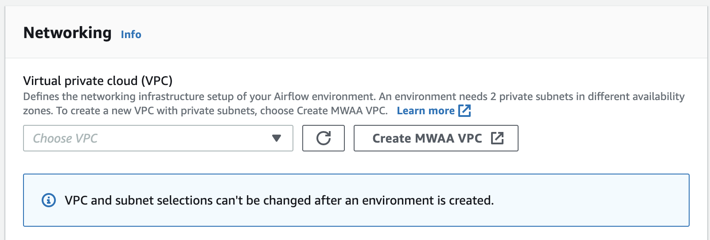

# Create the VPC network

Amazon Managed Workflows for Apache Airflow requires an Amazon VPC and specific networking components to support an environment. This guide describes the different options to create the Amazon VPC network for an Amazon Managed Workflows for Apache Airflow environment.

###### Note

Apache Airflow works best in a low-latency network environment. If you are using an existing Amazon VPC
which routes traffic to another region or to an on-premise environment, we recommended adding
AWS PrivateLink endpoints for Amazon SQS, CloudWatch, Amazon S3, and AWS KMS. For more information about
configuring AWS PrivateLink for Amazon MWAA, refer to [Creating an Amazon VPC network without internet access](#vpc-create-template-private-only "#vpc-create-template-private-only").

###### Contents

- [Prerequisites](vpc-create.md#vpc-create-prereqs "vpc-create.md#vpc-create-prereqs")
- [Before you begin](vpc-create.md#vpc-create-how-networking "vpc-create.md#vpc-create-how-networking")
- [Options to create the Amazon VPC network](vpc-create.md#vpc-create-options "vpc-create.md#vpc-create-options")
  - [Option one: Creating the VPC network on the Amazon MWAA console](vpc-create.md#vpc-create-mwaa-console "vpc-create.md#vpc-create-mwaa-console")
  - [Option two: Creating an Amazon VPC network with internet access](vpc-create.md#vpc-create-template-private-or-public "vpc-create.md#vpc-create-template-private-or-public")
  - [Option three: Creating an Amazon VPC network without internet access](vpc-create.md#vpc-create-template-private-only "vpc-create.md#vpc-create-template-private-only")

- [What's next?](vpc-create.md#create-vpc-next-up "vpc-create.md#create-vpc-next-up")

## Prerequisites

The AWS Command Line Interface (AWS CLI) is an open source tool that you can use to interact with AWS services using commands in your command-line shell. To complete the steps on this page, you need the following:

- [AWS CLI – Install version 2](../../../cli/latest/userguide/install-cliv2.md "../../../cli/latest/userguide/install-cliv2.md").
- [AWS CLI – Quick configuration with `aws configure`](../../../cli/latest/userguide/cli-chap-configure.md "../../../cli/latest/userguide/cli-chap-configure.md").

## Before you begin

- The [VPC network](vpc-create.md "vpc-create.md") you specify for your environment can't be changed after the environment is created.
- You can use private or public routing for your Amazon VPC and Apache Airflow webserver. To access a list of options, refer to [Example use cases for an Amazon VPC and Apache Airflow access mode](networking-about.md#networking-about-network-usecase "networking-about.md#networking-about-network-usecase").

## Options to create the Amazon VPC network

The following section describes the options available to create the Amazon VPC network for an environment.

###### Note

Amazon MWAA does not support the use of `use1-az3` Availability Zone (AZ) in the
US East (N. Virginia) Region. When creating the VPC for Amazon MWAA in the US East (N. Virginia)
region, you must explicitly assign the `AvailabilityZone` in the CloudFormation (CFN)
template. The assigned availability zone name must not be mapped to `use1-az3`.
You can retrieve the detailed mapping of AZ names to their corresponding AZ IDs by running
the following command:

```
aws ec2 describe-availability-zones --region us-east-1
```

### Option one: Creating the VPC network on the Amazon MWAA console

The following section explains how to create an Amazon VPC network on the Amazon MWAA console. This option uses [Public routing over the internet](networking-about.md#networking-about-overview-public "networking-about.md#networking-about-overview-public"). It can be used for an Apache Airflow webserver with the **Private network** or **Public network** access modes.

The following image depicts where you can find the **Create MWAA VPC** button on the Amazon MWAA console.



### Option two: Creating an Amazon VPC network _with_ internet access

The following CloudFormation template creates an Amazon VPC network with internet access in your default AWS Region. This option uses [Public routing over the internet](networking-about.md#networking-about-overview-public "networking-about.md#networking-about-overview-public"). This template can be used for an Apache Airflow webserver with the **Private network** or **Public network** access modes.

1. Copy the contents of the following template and save locally as `cfn-vpc-public-private.yaml`. You can also [download the template](samples/cfn-vpc-public-private.md "samples/cfn-vpc-public-private.md").

```
Description:  This template deploys a VPC, with a pair of public and private subnets spread
  across two Availability Zones. It deploys an internet gateway, with a default
  route on the public subnets. It deploys a pair of NAT gateways (one in each AZ),
  and default routes for them in the private subnets.

Parameters:
  EnvironmentName:
    Description: An environment name that is prefixed to resource names
    Type: String
    Default: mwaa-

  VpcCIDR:
    Description: Please enter the IP range (CIDR notation) for this VPC
    Type: String
    Default: 10.192.0.0/16

  PublicSubnet1CIDR:
    Description: Please enter the IP range (CIDR notation) for the public subnet in the first Availability Zone
    Type: String
    Default: 10.192.10.0/24

  PublicSubnet2CIDR:
    Description: Please enter the IP range (CIDR notation) for the public subnet in the second Availability Zone
    Type: String
    Default: 10.192.11.0/24

  PrivateSubnet1CIDR:
    Description: Please enter the IP range (CIDR notation) for the private subnet in the first Availability Zone
    Type: String
    Default: 10.192.20.0/24

  PrivateSubnet2CIDR:
    Description: Please enter the IP range (CIDR notation) for the private subnet in the second Availability Zone
    Type: String
    Default: 10.192.21.0/24

Resources:
  VPC:
    Type: AWS::EC2::VPC
    Properties:
      CidrBlock: !Ref VpcCIDR
      EnableDnsSupport: true
      EnableDnsHostnames: true
      Tags:
        - Key: Name
          Value: !Ref EnvironmentName

  InternetGateway:
    Type: AWS::EC2::InternetGateway
    Properties:
      Tags:
        - Key: Name
          Value: !Ref EnvironmentName

  InternetGatewayAttachment:
    Type: AWS::EC2::VPCGatewayAttachment
    Properties:
      InternetGatewayId: !Ref InternetGateway
      VpcId: !Ref VPC

  PublicSubnet1:
    Type: AWS::EC2::Subnet
    Properties:
      VpcId: !Ref VPC
      AvailabilityZone: !Select [ 0, !GetAZs '' ]
      CidrBlock: !Ref PublicSubnet1CIDR
      MapPublicIpOnLaunch: true
      Tags:
        - Key: Name
          Value: !Sub ${EnvironmentName} Public Subnet (AZ1)

  PublicSubnet2:
    Type: AWS::EC2::Subnet
    Properties:
      VpcId: !Ref VPC
      AvailabilityZone: !Select [ 1, !GetAZs  '' ]
      CidrBlock: !Ref PublicSubnet2CIDR
      MapPublicIpOnLaunch: true
      Tags:
        - Key: Name
          Value: !Sub ${EnvironmentName} Public Subnet (AZ2)

  PrivateSubnet1:
    Type: AWS::EC2::Subnet
    Properties:
      VpcId: !Ref VPC
      AvailabilityZone: !Select [ 0, !GetAZs  '' ]
      CidrBlock: !Ref PrivateSubnet1CIDR
      MapPublicIpOnLaunch: false
      Tags:
        - Key: Name
          Value: !Sub ${EnvironmentName} Private Subnet (AZ1)

  PrivateSubnet2:
    Type: AWS::EC2::Subnet
    Properties:
      VpcId: !Ref VPC
      AvailabilityZone: !Select [ 1, !GetAZs  '' ]
      CidrBlock: !Ref PrivateSubnet2CIDR
      MapPublicIpOnLaunch: false
      Tags:
        - Key: Name
          Value: !Sub ${EnvironmentName} Private Subnet (AZ2)

  NatGateway1EIP:
    Type: AWS::EC2::EIP
    DependsOn: InternetGatewayAttachment
    Properties:
      Domain: vpc

  NatGateway2EIP:
    Type: AWS::EC2::EIP
    DependsOn: InternetGatewayAttachment
    Properties:
      Domain: vpc

  NatGateway1:
    Type: AWS::EC2::NatGateway
    Properties:
      AllocationId: !GetAtt NatGateway1EIP.AllocationId
      SubnetId: !Ref PublicSubnet1

  NatGateway2:
    Type: AWS::EC2::NatGateway
    Properties:
      AllocationId: !GetAtt NatGateway2EIP.AllocationId
      SubnetId: !Ref PublicSubnet2

  PublicRouteTable:
    Type: AWS::EC2::RouteTable
    Properties:
      VpcId: !Ref VPC
      Tags:
        - Key: Name
          Value: !Sub ${EnvironmentName} Public Routes

  DefaultPublicRoute:
    Type: AWS::EC2::Route
    DependsOn: InternetGatewayAttachment
    Properties:
      RouteTableId: !Ref PublicRouteTable
      DestinationCidrBlock: 0.0.0.0/0
      GatewayId: !Ref InternetGateway

  PublicSubnet1RouteTableAssociation:
    Type: AWS::EC2::SubnetRouteTableAssociation
    Properties:
      RouteTableId: !Ref PublicRouteTable
      SubnetId: !Ref PublicSubnet1

  PublicSubnet2RouteTableAssociation:
    Type: AWS::EC2::SubnetRouteTableAssociation
    Properties:
      RouteTableId: !Ref PublicRouteTable
      SubnetId: !Ref PublicSubnet2


  PrivateRouteTable1:
    Type: AWS::EC2::RouteTable
    Properties:
      VpcId: !Ref VPC
      Tags:
        - Key: Name
          Value: !Sub ${EnvironmentName} Private Routes (AZ1)

  DefaultPrivateRoute1:
    Type: AWS::EC2::Route
    Properties:
      RouteTableId: !Ref PrivateRouteTable1
      DestinationCidrBlock: 0.0.0.0/0
      NatGatewayId: !Ref NatGateway1

  PrivateSubnet1RouteTableAssociation:
    Type: AWS::EC2::SubnetRouteTableAssociation
    Properties:
      RouteTableId: !Ref PrivateRouteTable1
      SubnetId: !Ref PrivateSubnet1

  PrivateRouteTable2:
    Type: AWS::EC2::RouteTable
    Properties:
      VpcId: !Ref VPC
      Tags:
        - Key: Name
          Value: !Sub ${EnvironmentName} Private Routes (AZ2)

  DefaultPrivateRoute2:
    Type: AWS::EC2::Route
    Properties:
      RouteTableId: !Ref PrivateRouteTable2
      DestinationCidrBlock: 0.0.0.0/0
      NatGatewayId: !Ref NatGateway2

  PrivateSubnet2RouteTableAssociation:
    Type: AWS::EC2::SubnetRouteTableAssociation
    Properties:
      RouteTableId: !Ref PrivateRouteTable2
      SubnetId: !Ref PrivateSubnet2

  SecurityGroup:
    Type: AWS::EC2::SecurityGroup
    Properties:
      GroupName: "mwaa-security-group"
      GroupDescription: "Security group with a self-referencing inbound rule."
      VpcId: !Ref VPC

  SecurityGroupIngress:
    Type: AWS::EC2::SecurityGroupIngress
    Properties:
      GroupId: !Ref SecurityGroup
      IpProtocol: "-1"
      SourceSecurityGroupId: !Ref SecurityGroup

Outputs:
  VPC:
    Description: A reference to the created VPC
    Value: !Ref VPC

  PublicSubnets:
    Description: A list of the public subnets
    Value: !Join [ ",", [ !Ref PublicSubnet1, !Ref PublicSubnet2 ]]

  PrivateSubnets:
    Description: A list of the private subnets
    Value: !Join [ ",", [ !Ref PrivateSubnet1, !Ref PrivateSubnet2 ]]

  PublicSubnet1:
    Description: A reference to the public subnet in the 1st Availability Zone
    Value: !Ref PublicSubnet1

  PublicSubnet2:
    Description: A reference to the public subnet in the 2nd Availability Zone
    Value: !Ref PublicSubnet2

  PrivateSubnet1:
    Description: A reference to the private subnet in the 1st Availability Zone
    Value: !Ref PrivateSubnet1

  PrivateSubnet2:
    Description: A reference to the private subnet in the 2nd Availability Zone
    Value: !Ref PrivateSubnet2

  SecurityGroupIngress:
    Description: Security group with self-referencing inbound rule
    Value: !Ref SecurityGroupIngress
```

2. In your command prompt, navigate to the directory where `cfn-vpc-public-private.yaml` is stored. For example:

```
cd mwaaproject
```

3. Use the [`aws cloudformation create-stack`](../../../cli/latest/reference/cloudformation/create-stack.md "../../../cli/latest/reference/cloudformation/create-stack.md") command to create the stack using the AWS CLI.

```
aws cloudformation create-stack --stack-name mwaa-environment --template-body file://cfn-vpc-public-private.yaml
```

###### Note

It takes about 30 minutes to create the Amazon VPC infrastructure.

### Option three: Creating an Amazon VPC network _without_ internet access

The following CloudFormation template creates an Amazon VPC network _without internet access_ in your default AWS Region.

This option uses [Private routing without internet access](networking-about.md#networking-about-overview-private "networking-about.md#networking-about-overview-private").
This template can be used for an Apache Airflow webserver with the **Private network** access mode only. It creates the required
[VPC endpoints for the AWS services used by an environment](vpc-vpe-create-access.md#vpc-vpe-create-view-endpoints-attach-services "vpc-vpe-create-access.md#vpc-vpe-create-view-endpoints-attach-services").

1. Copy the contents of the following template and save locally as `cfn-vpc-private.yaml`. You can also [download the template](samples/cfn-vpc-private-no-ops.md "samples/cfn-vpc-private-no-ops.md").

```
AWSTemplateFormatVersion: "2010-09-09"

Parameters:
   VpcCIDR:
     Description: The IP range (CIDR notation) for this VPC
     Type: String
     Default: 10.192.0.0/16

   PrivateSubnet1CIDR:
     Description: The IP range (CIDR notation) for the private subnet in the first Availability Zone
     Type: String
     Default: 10.192.10.0/24

   PrivateSubnet2CIDR:
     Description: The IP range (CIDR notation) for the private subnet in the second Availability Zone
     Type: String
     Default: 10.192.11.0/24

Resources:
   VPC:
     Type: AWS::EC2::VPC
     Properties:
       CidrBlock: !Ref VpcCIDR
       EnableDnsSupport: true
       EnableDnsHostnames: true
       Tags:
        - Key: Name
          Value: !Ref AWS::StackName

   RouteTable:
     Type: AWS::EC2::RouteTable
     Properties:
       VpcId: !Ref VPC
       Tags:
        - Key: Name
          Value: !Sub "${AWS::StackName}-route-table"

   PrivateSubnet1:
     Type: AWS::EC2::Subnet
     Properties:
       VpcId: !Ref VPC
       AvailabilityZone: !Select [ 0, !GetAZs  '' ]
       CidrBlock: !Ref PrivateSubnet1CIDR
       MapPublicIpOnLaunch: false
       Tags:
        - Key: Name
          Value: !Sub "${AWS::StackName} Private Subnet (AZ1)"

   PrivateSubnet2:
     Type: AWS::EC2::Subnet
     Properties:
       VpcId: !Ref VPC
       AvailabilityZone: !Select [ 1, !GetAZs  '' ]
       CidrBlock: !Ref PrivateSubnet2CIDR
       MapPublicIpOnLaunch: false
       Tags:
        - Key: Name
          Value: !Sub "${AWS::StackName} Private Subnet (AZ2)"

   PrivateSubnet1RouteTableAssociation:
     Type: AWS::EC2::SubnetRouteTableAssociation
     Properties:
       RouteTableId: !Ref RouteTable
       SubnetId: !Ref PrivateSubnet1

   PrivateSubnet2RouteTableAssociation:
     Type: AWS::EC2::SubnetRouteTableAssociation
     Properties:
       RouteTableId: !Ref RouteTable
       SubnetId: !Ref PrivateSubnet2

   S3VpcEndoint:
     Type: AWS::EC2::VPCEndpoint
     Properties:
       ServiceName: !Sub "com.amazonaws.${AWS::Region}.s3"
       VpcEndpointType: Gateway
       VpcId: !Ref VPC
       RouteTableIds:
        - !Ref RouteTable

   SecurityGroup:
     Type: AWS::EC2::SecurityGroup
     Properties:
       VpcId: !Ref VPC
       GroupDescription: Security Group for Amazon MWAA Environments to access VPC endpoints
       GroupName: !Sub "${AWS::StackName}-mwaa-vpc-endpoints"

   SecurityGroupIngress:
     Type: AWS::EC2::SecurityGroupIngress
     Properties:
       GroupId: !Ref SecurityGroup
       IpProtocol: "-1"
       SourceSecurityGroupId: !Ref SecurityGroup

   SqsVpcEndoint:
     Type: AWS::EC2::VPCEndpoint
     Properties:
       ServiceName: !Sub "com.amazonaws.${AWS::Region}.sqs"
       VpcEndpointType: Interface
       VpcId: !Ref VPC
       PrivateDnsEnabled: true
       SubnetIds:
        - !Ref PrivateSubnet1
        - !Ref PrivateSubnet2
       SecurityGroupIds:
        - !Ref SecurityGroup

   CloudWatchLogsVpcEndoint:
     Type: AWS::EC2::VPCEndpoint
     Properties:
       ServiceName: !Sub "com.amazonaws.${AWS::Region}.logs"
       VpcEndpointType: Interface
       VpcId: !Ref VPC
       PrivateDnsEnabled: true
       SubnetIds:
        - !Ref PrivateSubnet1
        - !Ref PrivateSubnet2
       SecurityGroupIds:
        - !Ref SecurityGroup

   CloudWatchMonitoringVpcEndoint:
     Type: AWS::EC2::VPCEndpoint
     Properties:
       ServiceName: !Sub "com.amazonaws.${AWS::Region}.monitoring"
       VpcEndpointType: Interface
       VpcId: !Ref VPC
       PrivateDnsEnabled: true
       SubnetIds:
        - !Ref PrivateSubnet1
        - !Ref PrivateSubnet2
       SecurityGroupIds:
        - !Ref SecurityGroup

   KmsVpcEndoint:
     Type: AWS::EC2::VPCEndpoint
     Properties:
       ServiceName: !Sub "com.amazonaws.${AWS::Region}.kms"
       VpcEndpointType: Interface
       VpcId: !Ref VPC
       PrivateDnsEnabled: true
       SubnetIds:
        - !Ref PrivateSubnet1
        - !Ref PrivateSubnet2
       SecurityGroupIds:
        - !Ref SecurityGroup


Outputs:
   VPC:
     Description: A reference to the created VPC
     Value: !Ref VPC

   MwaaSecurityGroupId:
     Description: Associates the Security Group to the environment to allow access to the VPC endpoints
     Value: !Ref SecurityGroup

   PrivateSubnets:
     Description: A list of the private subnets
     Value: !Join [ ",", [ !Ref PrivateSubnet1, !Ref PrivateSubnet2 ]]

   PrivateSubnet1:
     Description: A reference to the private subnet in the 1st Availability Zone
     Value: !Ref PrivateSubnet1

   PrivateSubnet2:
     Description: A reference to the private subnet in the 2nd Availability Zone
     Value: !Ref PrivateSubnet2
```

2. In your command prompt, navigate to the directory where `cfn-vpc-private.yml` is stored. For example:

```
cd mwaaproject
```

3. Use the [`aws cloudformation create-stack`](../../../cli/latest/reference/cloudformation/create-stack.md "../../../cli/latest/reference/cloudformation/create-stack.md") command to create the stack using the AWS CLI.

```
aws cloudformation create-stack --stack-name mwaa-private-environment --template-body file://cfn-vpc-private.yml
```

###### Note

It takes about 30 minutes to create the Amazon VPC infrastructure. 4. You'll need to create a mechanism to access these VPC endpoints from your computer. To learn more, refer to [Managing access to service-specific Amazon VPC endpoints on Amazon MWAA](vpc-vpe-access.md "vpc-vpe-access.md").

###### Note

You can further restrict outbound access in the CIDR of your Amazon MWAA security group. For example, you can restrict to itself by adding a self-referencing outbound rule,
the [prefix list](../../../vpc/latest/privatelink/vpce-gateway.md "../../../vpc/latest/privatelink/vpce-gateway.md") for Amazon S3, and the CIDR of your Amazon VPC.

## What's next?

- Learn how to create an Amazon MWAA environment in [Create an Amazon MWAA environment](create-environment.md "create-environment.md").
- Learn how to create a VPN tunnel from your computer to your Amazon VPC with private routing in [Tutorial: Configuring private network access using an AWS Client VPN](tutorials-private-network-vpn-client.md "tutorials-private-network-vpn-client.md").
