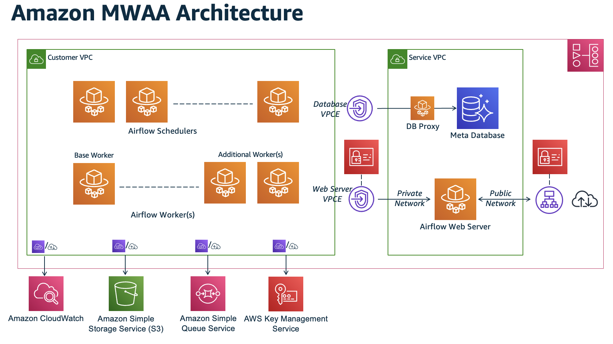

# What Is Amazon Managed Workflows for Apache Airflow?

Use Amazon Managed Workflows for Apache Airflow, a managed service for [Apache Airflow](https://airflow.apache.org/ "https://airflow.apache.org/"), to set up and run data pipelines in the cloud at scale. Apache Airflow is an open-source tool used to create, schedule, and monitor _workflows_.

With Amazon MWAA, you can use Apache Airflow and Python to create workflows without managing infrastructure for scalability, availability, and security. Amazon MWAA automatically scales to meet your workflow needs. It integrates with AWS security services to provide fast, secure access to your data.

###### Content

- [Features](#benefits-mwaa "#benefits-mwaa")
- [Architecture](#architecture-mwaa "#architecture-mwaa")
- [Integration](#integrations-mwaa "#integrations-mwaa")
- [Supported versions](#versions-support "#versions-support")
- [What's next?](#whatis-next-up "#whatis-next-up")

## Features

Review the following features to learn how Amazon MWAA can simplify managing your Apache Airflow workflows.

- **Automatic Airflow setup** – Quickly set up Apache Airflow by choosing an [Apache Airflow version](airflow-versions.md "airflow-versions.md") when you create an Amazon MWAA environment. Amazon MWAA sets up Apache Airflow for you using the same Apache Airflow user interface and open-source code available on the internet.
- **Automatic scaling** – Automatically scale Apache Airflow workers (the compute resources that run your tasks) by setting minimum and maximum limits. Amazon MWAA monitors the workers in your environment and uses its [autoscaling component](mwaa-autoscaling.md "mwaa-autoscaling.md") to add workers to meet demand, up to the maximum number you defined.
- **Built-in authentication** – Enable role-based authentication and authorization for your Apache Airflow webserver by defining the [access control policies](environment-class.md "environment-class.md") in AWS Identity and Access Management (IAM). The Apache Airflow workers assume these policies for secure access to AWS services.
- **Built-in security** – The Apache Airflow workers and schedulers run in [Amazon MWAA's Amazon VPC](vpc-vpe-access.md "vpc-vpe-access.md"). Data is also automatically encrypted using AWS Key Management Service, so your environment is secure by default.
- **Public or private access modes** – Access your Apache Airflow webserver using a private, or public [access mode](configuring-networking.md "configuring-networking.md"). The **Public network** access mode uses a VPC endpoint for your Apache Airflow webserver that is accessible over the internet. The **Private network** access mode uses a VPC endpoint for your Apache Airflow webserver that is accessible _in your VPC_. In both cases, access for your Apache Airflow users is controlled by the access control policy you define in AWS Identity and Access Management (IAM), and AWS SSO.
- **Streamlined upgrades and patches** – Amazon MWAA provides new versions of Apache Airflow periodically. The Amazon MWAA team will update and patch the images for these versions.
- **Workflow monitoring** – access Apache Airflow logs and [Apache Airflow metrics](cw-metrics.md "cw-metrics.md") in Amazon CloudWatch to identify Apache Airflow task delays or workflow errors without the need for additional third-party tools. Amazon MWAA automatically sends environment metrics—and if enabled—Apache Airflow logs to CloudWatch.
- **AWS integration** – Amazon MWAA supports open-source integrations with Amazon Athena, AWS Batch, Amazon CloudWatch, Amazon DynamoDB, AWS DataSync, Amazon EMR, AWS Fargate, Amazon EKS, Amazon Data Firehose, AWS Glue, AWS Lambda, Amazon Redshift, Amazon SQS, Amazon SNS, Amazon SageMaker AI, and Amazon S3, as well as hundreds of built-in and community-created operators and sensors.
- **Worker fleets** – Amazon MWAA offers support for using containers to scale the worker fleet on demand and reduce scheduler outages using [Amazon ECS on AWS Fargate](../../../AmazonECS/latest/developerguide/AWS_Fargate.md "../../../AmazonECS/latest/developerguide/AWS_Fargate.md"). Operators that invoke tasks on Amazon ECS containers, and Kubernetes operators that create and run pods on a Kubernetes cluster are supported.

## Architecture

All of the components contained in the outer box (in the following image) are shown as a single Amazon MWAA environment in your account. The Apache Airflow scheduler and workers are AWS Fargate containers that connect to the private subnets in the Amazon VPC for your environment. Each environment has its own Apache Airflow metadatabase managed by AWS that is accessible to the scheduler and workers Fargate containers through a privately-secured VPC endpoint.

Amazon CloudWatch, Amazon S3, Amazon SQS, and AWS KMS are separate from Amazon MWAA and need to be accessible from the Apache Airflow schedulers and workers in the Fargate containers. Multiple Apache Airflow schedulers are only available with Apache Airflow v2 and later. Learn more about the Apache Airflow task lifecycle at [Concepts](https://airflow.apache.org/docs/apache-airflow/stable/concepts.html#task-lifecycle "https://airflow.apache.org/docs/apache-airflow/stable/concepts.html#task-lifecycle") in the _Apache Airflow reference guide_.

The Apache Airflow webserver can be accessed either through the internet by selecting the **Public network** Apache Airflow access mode, or _within your VPC_ by selecting the **Private network** Apache Airflow access mode. In both cases, access for your Apache Airflow users is controlled by the access control policy you define in AWS Identity and Access Management (IAM).

###### Note

Starting with Apache Airflow v3, the Amazon MWAA webserver also hosts Apache Airflow’s execution API server.

## Integration

The active and growing Apache Airflow open-source community provides operators (plugins that simplify connections to services) for Apache Airflow to integrate with AWS services. This includes services such as Amazon S3, Amazon Redshift, Amazon EMR, AWS Batch, and Amazon SageMaker AI, as well as services on other cloud platforms.

Using Apache Airflow with Amazon MWAA fully supports integration with AWS services and popular third-party tools such as Apache Hadoop, Presto, Hive, and Spark to perform data processing tasks. Amazon MWAA is committed to maintaining compatibility with the Apache Airflow API, and Amazon MWAA intends to provide reliable integrations to AWS services and make them available to the community, and be involved in community feature development.

For sample code, refer to [Code examples for Amazon Managed Workflows for Apache Airflow](sample-code.md "sample-code.md").

## Supported versions

Amazon MWAA supports multiple versions of Apache Airflow. For more information about the Apache Airflow versions we support and the Apache Airflow components included with each version, refer to [Apache Airflow versions on Amazon Managed Workflows for Apache Airflow](airflow-versions.md "airflow-versions.md").

## What's next?

- Get started with a single AWS CloudFormation template that creates an Amazon S3 bucket for your Airflow DAGs and supporting files, an Amazon VPC with public routing, and an Amazon MWAA environment in [Quick start tutorial for Amazon Managed Workflows for Apache Airflow](quick-start.md "quick-start.md").
- Get started incrementally by creating an Amazon S3 bucket for your Airflow DAGs and supporting files, choosing from one of three Amazon VPC networking options, and creating an Amazon MWAA environment in [Get started with Amazon Managed Workflows for Apache Airflow](get-started.md "get-started.md").
