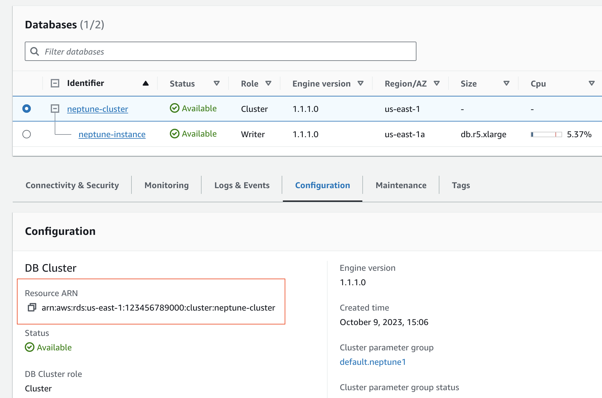
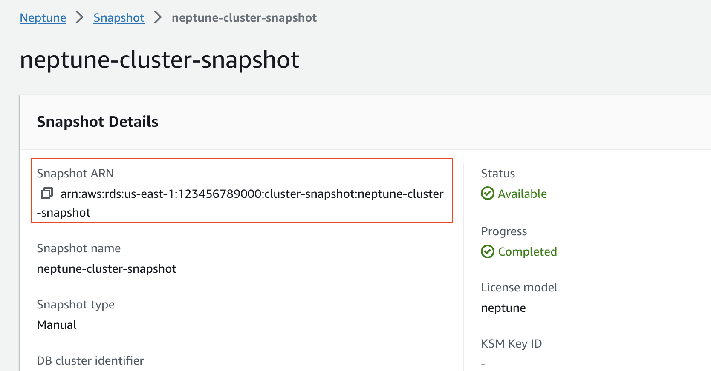

# Creating a Neptune Analytics graph from Neptune cluster or snapshot

Neptune Analytics provides an easy way to bulk import data from an existing Neptune Database cluster or snapshot into a new Neptune Analytics graph,
using the `CreateGraphUsingImportTask` API. Data from your source cluster or snapshot is bulk exported
into an Amazon S3 bucket that you configure, analyzed to find the right memory configuration, and bulk imported into a
new Neptune Analytics graph. You can check the progress of your bulk import at any time using the `GetImportTask`
API as well.

A few things to consider while using this feature:

- You can only import from Neptune Database clusters and snapshots running on a version newer than or equal to 1.3.0.
- Import from an existing Neptune Database cluster only supports the ingest of property graph data. RDF data within
  a Neptune Database cluster cannot be ingested using an import task. If looking to ingest RDF data into Neptune Analytics,
  this data needs to be manually exported from the Neptune Database cluster to an Amazon S3 bucket before it can be
  ingested using an import task with an Amazon S3 bucket source.
- The exported data from your source Neptune Database cluster or snapshot will reside in your buckets only, and will be
  encrypted using a KMS key that you provide. The exported data is not directly consumable in any other way into
  Neptune outside of the `CreateGraphUsingImportTask` API. The exported data is not used after the
  lifetime of the request, and can be deleted by the user.
- You need to provide permissions to perform the export task on the Neptune Database cluster or snapshot, write to your Amazon S3
  bucket, and use your KMS key while writing data.
- If your source is a Neptune Database cluster, a clone is taken from it and used for export. The original Neptune Database cluster will
  not be impacted. The cloned cluster is internally managed by the service and is deleted upon completion.
- If your source is a Neptune snapshot, a restored DBCluster is created from it, and used for export. The restored
  cluster is internally managed by the service and is deleted upon completion.
- This process is not recommended for small sized graphs. The export process is async, and works best for medium/large
  sized graphs with a size greater than 25GB. For smaller graphs, a better alternative is to use the
  [Neptune export](../../../neptune/latest/userguide/neptune-export.md "../../../neptune/latest/userguide/neptune-export.md")
  feature to generate CSV data directly from your source, upload that to Amazon S3 and then use the
  [Batch load](batch-load.md "batch-load.md") API instead.

A quick summary of steps to import from a Neptune cluster or a Neptune snapshot:

1. [Obtain the ARN of your Neptune cluster or snapshot](#obtain-arn-of-neptune-cluster "#obtain-arn-of-neptune-cluster"): This can be done
   from the AWS console or using the Neptune CLI.
2. [Create an IAM role with permissions to export
   from Neptune to Neptune Analytics](#iam-create-role-export-neptune-analytics "#iam-create-role-export-neptune-analytics"):
   Create an IAM role that has permissions to perform an export of your Neptune graph, write to Amazon S3 and use your
   KMS key for writing data in Amazon S3.
3. Use the `CreateGraphUsingImportTask` API with source = NEPTUNE, and provide the ARN of your source,
   Amazon S3 path to export the data, KMS key to use for exporting data and additional arguments for your Neptune Analytics graph.
   This should return a `task-id`.
4. Use `GetImportTask` API to get the details of your task.

## Obtain the ARN of your Neptune cluster or snapshot

The following instructions demonstrate how to obtain the Amazon Resource Name (ARN) for an existing Amazon Neptune
database cluster or snapshot using the AWS Command Line Interface (CLI). The ARN is a unique identifier for an
AWS resource, such as a Neptune cluster or snapshot, and is commonly used when interacting with AWS services
programmatically or through the AWS management console.

**Via the CLI:**

```
# Obtaining the ARN of an existing DB Cluster
  aws neptune describe-db-clusters   \
      --db-cluster-identifier *<name> \
      --query 'DBClusters[0].DBClusterArn'


  # Obtaining the ARN of an existing DB Cluster Snapshot
  aws neptune describe-db-cluster-snapshots \
      --db-cluster-snapshot-identifier <snapshot name> \
      --query 'DBClusterSnapshots[0].DBClusterSnapshotArn'
```

**Via the AWS console. The ARN can be found on the cluster details page.**





## Create an IAM role with permissions to export

from Neptune to Neptune Analytics

1. Open the IAM console at [https://console.aws.amazon.com/iam/](https://console.aws.amazon.com/iam/ "https://console.aws.amazon.com/iam/"). Choose **Roles**, and
   then choose **Create Role**.
2. Provide a role name.
3. Choose **Amazon S3** as the AWS service.
4. In the **permissions** section, choose:
   - `AmazonS3FullAccess`
   - `NeptuneFullAccess`
   - `AmazonRDSFullAccess`

5. Also create a custom policy with at least the following permissions for the AWS KMS key used:
   - `kms:ListGrants`
   - `kms:CreateGrant`
   - `kms:RevokeGrant`
   - `kms:DescribeKey`
   - `kms:GenerateDataKey`
   - `kms:Encrypt`
   - `kms:ReEncrypt*`
   - `kms:Decrypt`

###### Note

Make sure there are no resource-level `Deny` policies attached to your AWS KMS key. If there are,
explicitly allow the AWS KMS permissions for the `Export` role. 6. On the **Trust Relationships** tab, choose **Edit trust relationship**, and paste
the following trust policy. Choose **Save** to save the trust relationship.

JSON

```
`{
 "Version":"2012-10-17",
 "Statement": [
 {
 "Effect": "Allow",
 "Principal": {
 "Service": [
 "export.rds.amazonaws.com",
 "neptune-graph.amazonaws.com"
 ]
 },
 "Action": "sts:AssumeRole"
 }
 ]
 }`

```

Your IAM role is now ready for import.

**Via CLI/SDK**

For importing data via Neptune , the API expects additional import-options as defined here
[NeptuneImportOptions](../apiref/API_NeptuneImportOptions.md "../apiref/API_NeptuneImportOptions.md") .

Example 1: Create a graph from a Neptune cluster.

```
aws neptune-graph create-graph-using-import-task \
   --graph-name <graph-name>
   --source arn:aws:rds:<region>:123456789101:cluster:neptune-cluster \
   --min-provisioned-memory 1024 \
   --max-provisioned-memory 1024 \
   --role-arn <role-arn> \
   --import-options '{"neptune": {
      "s3ExportKmsKeyId":"arn:aws:kms:<region>:<account>:key/<key>",
      "s3ExportPath": :"<s3 path for exported data>"
   }}'
```

Example 2: Create a graph from a Neptune cluster with the default vertex preserved.

```
aws neptune-graph create-graph-using-import-task \
   --graph-name <graph-name>
   --source arn:aws:rds:<region>:123456789101:cluster:neptune-cluster \
   --min-provisioned-memory 1024 \
   --max-provisioned-memory 1024 \
   --role-arn <role-arn> \
   --import-options '{"neptune": {
      "s3ExportKmsKeyId":"arn:aws:kms:<region>:<account>:key/<key>",
      "s3ExportPath": :"<s3 path for exported data>",
      "preserveDefaultVertexLabels" : true
   }}'
```

Example 3: Create a graph from Neptune cluster with the default edge Id preserved

```
aws neptune-graph create-graph-using-import-task \
   --graph-name <graph-name>
   --source arn:aws:rds:<region>:123456789101:cluster:neptune-cluster \
   --min-provisioned-memory 1024 \
   --max-provisioned-memory 1024 \
   --role-arn <role-arn> \
   --import-options '{"neptune": {
      "s3ExportKmsKeyId":"arn:aws:kms:<region>:<account>:key/<key>",
      "s3ExportPath": :"<s3 path for exported data>",
      "preserveEdgeIds" : true
   }}'
```
