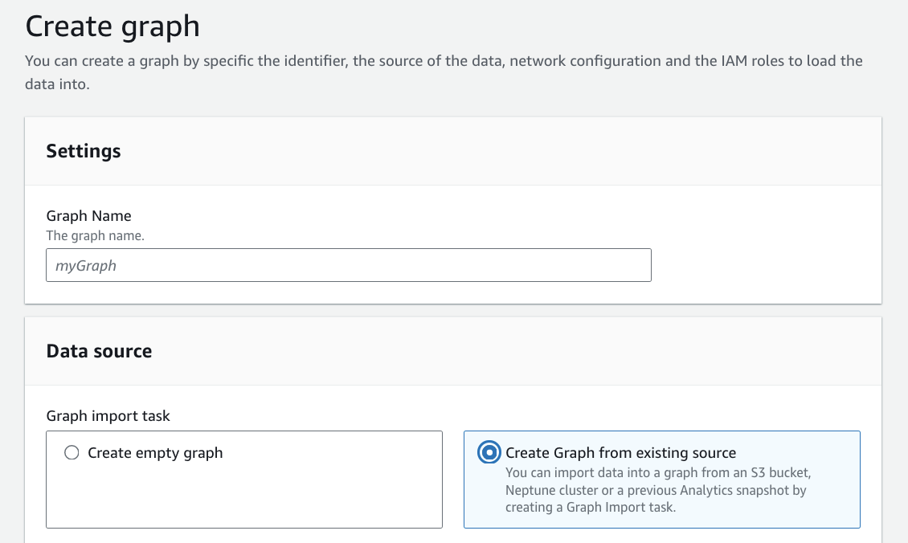
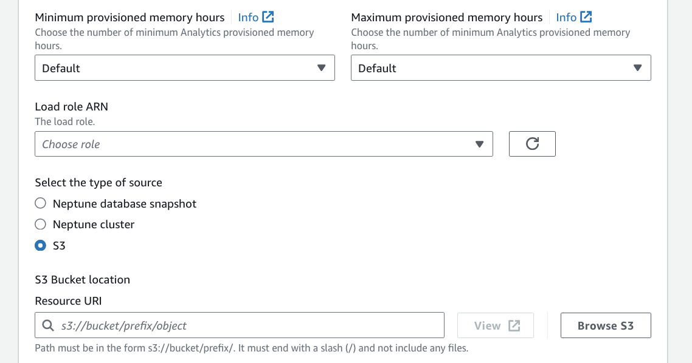
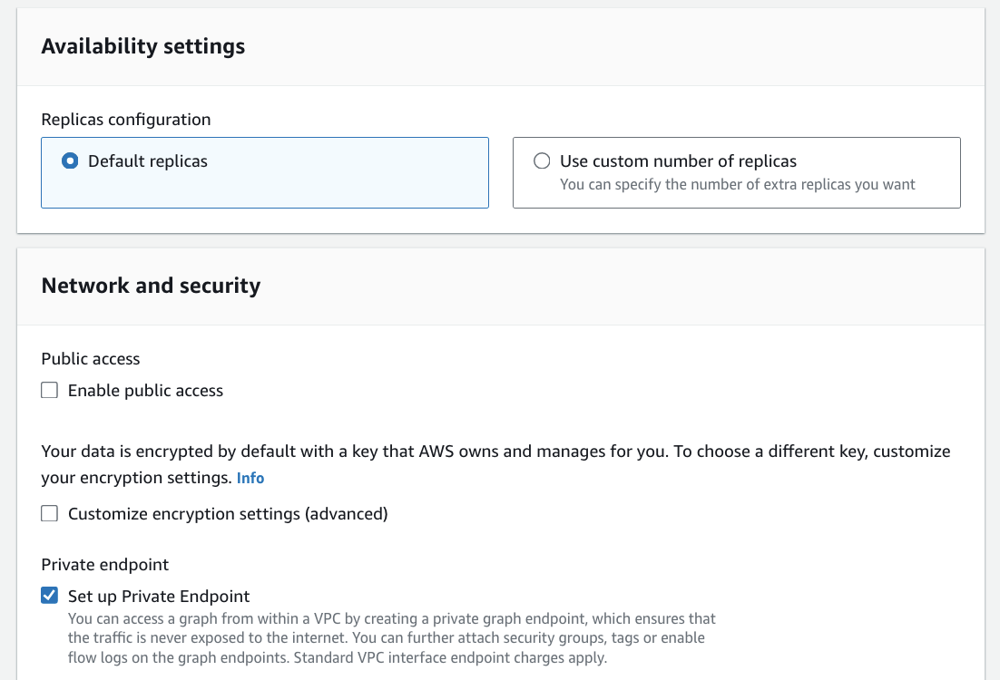

# Creating a Neptune Analytics graph from Amazon S3

Neptune Analytics supports bulk importing of CSV, ntriples, and Parquet data directly from Amazon S3 into a Neptune Analytics graph using the
`CreateGraphUsingImportTask` API. The data formats supported are listed in
[Data format for loading from Amazon S3 into Neptune Analytics](loading-data-formats.md "loading-data-formats.md"). It is
recommended that you try the batch load process with a subset of your data first to validate that it is correctly
formatted. Once you have validated that your data files are fully compatible with Neptune Analytics, you can prepare your full
dataset and perform the bulk import using the steps below.

A quick summary of steps needed to import a graph from Amazon S3:

- [Copy the data files to an Amazon S3 bucket](#create-bucket-copy-data "#create-bucket-copy-data"): Copy the data files to an Amazon Simple Storage Service bucket in the same region where
  you want the Neptune Analytics graph to be created. See [Data format for loading from Amazon S3 into Neptune Analytics](loading-data-formats.md "loading-data-formats.md") for the details of the format when loading data from Amazon S3 into Neptune Analytics.
- [Create your IAM role for Amazon S3 access](#create-iam-role-for-s3-access "#create-iam-role-for-s3-access"):
  Create an IAM role with `read` and `list` access to the bucket and a trust relationship
  that allows Neptune Analytics graphs to use your IAM role for importing.
- Use the `CreateGraphUsingImportTask` API to import from Amazon S3: Create a graph using the
  `CreateGraphUsingImportTask` API. This will generate a `taskId` for the operation.
- Use the `GetImportTask` API to get the details of the import task. The response will indicate the status
  of the task (ie. INITIALIZING, ANALYZING_DATA, IMPORTING etc.).
- Once the task has completed successfully, you will see a `COMPLETED` status for the import task and
  also the `graphId` for the newly created graph.
- Use the `GetGraphs` API to fetch all the details about your new graph, including the ARN, endpoint, etc.

###### Note

If you're creating a private graph endpoint, the following permissions are required:

- ec2:CreateVpcEndpoint

- ec2:DescribeAvailabilityZones

- ec2:DescribeSecurityGroups

- ec2:DescribeSubnets

- ec2:DescribeVpcAttribute

- ec2:DescribeVpcEndpoints

- ec2:DescribeVpcs

- ec2:ModifyVpcEndpoint

- route53:AssociateVPCWithHostedZone

For more information about required permissions, see
[Actions defined by Neptune Analytics](../../../service-authorization/latest/reference/list_amazonneptuneanalytics.md#amazonneptuneanalytics-actions-as-permissions "../../../service-authorization/latest/reference/list_amazonneptuneanalytics.md#amazonneptuneanalytics-actions-as-permissions").

## Copy the data files to an Amazon S3 bucket

The Amazon S3 bucket must be in the same AWS region as the cluster that loads the data. You can use the following AWS
CLI command to copy the files to the bucket.

```
aws s3 cp data-file-name s3://bucket-name/object-key-name
```

###### Note

In Amazon S3, an object key name is the entire path of a file, including the file name.

In the command

```
aws s3 cp datafile.txt s3://examplebucket/mydirectory/datafile.txt
```

the object key name is `mydirectory/datafile.txt`

You can also use the AWS management console to upload files to the Amazon S3 bucket. Open the Amazon S3
[console](https://console.aws.amazon.com/s3/ "https://console.aws.amazon.com/s3/"), and choose a bucket. In the upper-left corner,
choose **Upload** to upload files.

## Create your IAM role for Amazon S3 access

Create an IAM role with permissions to `read` and `list` the contents of your bucket.
Add a trust relationship that allows Neptune Analytics to assume this role for doing the import task. You could do this using
the AWS console, or through the CLI/SDK.

1. Open the IAM console at [https://console.aws.amazon.com/iam/](https://console.aws.amazon.com/iam/ "https://console.aws.amazon.com/iam/"). Choose **Roles**, and
   then choose **Create Role**.
2. Provide a role name.
3. Choose **Amazon S3** as the AWS service.
4. In the **permissions** section, choose `AmazonS3ReadOnlyAccess`.

###### Note

This policy grants s3:Get\* and s3:List\* permissions to all buckets. Later steps restrict access to the role
using the trust policy. The loader only requires s3:Get\* and s3:List\* permissions to the bucket you are loading
from, so you can also restrict these permissions by the Amazon S3 resource. If your Amazon S3 bucket is encrypted, you
need to add `kms:Decrypt` permissions as well. `kms:Decrypt` permission is needed for
the exported data from Neptune Database 5. On the **Trust Relationships** tab, choose **Edit trust relationship**, and paste
the following trust policy. Choose **Save** to save the trust relationship.

JSON

```
`{
 "Version":"2012-10-17",
 "Statement": [
 {
 "Effect": "Allow",
 "Principal": {
 "Service": [
 "neptune-graph.amazonaws.com"
 ]
 },
 "Action": "sts:AssumeRole"
 }
 ]
 }`

```

Your IAM role is now ready for import.

## Use the CreateGraphUsingImportTask API to import from Amazon S3

You can perform this operation from the Neptune console as well as from AWS CLI/SDK. For more information on
different parameters, see [https://docs.aws.amazon.com//neptune-analytics/latest/apiref/API_CreateGraphUsingImportTask.html](../apiref/API_CreateGraphUsingImportTask.md "../apiref/API_CreateGraphUsingImportTask.md")

**Via CLI/SDK**

```
aws neptune-graph create-graph-using-import-task \
  --graph-name <name> \
  --format <format> \
  --source <s3 path> \
  --role-arn <role arn> \
  [--blank-node-handling "convertToIri"--] \
  [--fail-on-error | --no-fail-on-error] \
  [--deletion-protection | --no-deletion-protection]
  [--public-connectivity | --no-public-connectivity]
  [--min-provisioned-memory]
  [--max-provisioned-memory]
  [--vector-search-configuration]
```

- **Different Minimum and Maximum Provisioned Memory**: When the
  `--min-provisioned-memory` and `--max-provisioned-memory` values are specified differently,
  the graph is created with the maximum provisioned memory specified by `--max-provisioned-memory`.
- **Single Provisioned Memory Value**: When only one of `--min-provisioned-memory`
  or `--max-provisioned-memory` is provided, the graph is created with the specified memory value.
- **No Provisioned Memory Values**: If neither `--min-provisioned-memory`
  nor `--max-provisioned-memory` is provided, the graph is created with a default provisioned memory
  of 128 m-NCU (memory optimized Neptune Compute Units).

Example 1: Create a graph from Amazon S3, with no min/max provisioned memory.

```
aws neptune-graph create-graph-using-import-task \
  --graph-name 'graph-1' \
  --source "s3://bucket-name/gremlin-format-dataset/" \
  --role-arn "arn:aws:iam::<account-id>:role/<role-name>" \
  --format CSV
```

Example 2: Create a graph from Amazon S3, with min & max provisioned memory. A graph with m-NCU of 1024 is
created.

```
aws neptune-graph create-graph-using-import-task \
  --graph-name 'graph-1' \
  --source "s3://bucket-name/gremlin-format-dataset/" \
  --role-arn "arn:aws:iam::<account-id>:role/<role-name>" \
  --format CSV
  --min-provisioned-memory 128 \
  --max-provisioned-memory 1024
```

Example 3: Create a graph from Amazon S3, and not fail on parsing errors.

```
aws neptune-graph create-graph-using-import-task \
  --graph-name 'graph-1' \
  --source "s3://bucket-name/gremlin-format-dataset/" \
  --role-arn "arn:aws:iam::<account-id>:role/<role-name>" \
  --format CSV
  --no-fail-on-error
```

Example 4: Create a graph from Amazon S3, with 2 replicas.

```
aws neptune-graph create-graph-using-import-task \
  --graph-name 'graph-1' \
  --source "s3://bucket-name/gremlin-format-dataset/" \
  --role-arn "arn:aws:iam::<account-id>:role/<role-name>" \
  --format CSV
  --replica-count 2
```

Example 5: Create a graph from Amazon S3 with vector search index.

###### Note

The `dimension` must match the dimension of the embeddings in the vertex files.

```
aws neptune-graph create-graph-using-import-task \
  --graph-name 'graph-1' \
  --source "s3://bucket-name/gremlin-format-dataset/" \
  --role-arn "arn:aws:iam::<account-id>:role/<role-name>" \
  --format CSV
  --replica-count 2 \
  --vector-search-configuration "{\"dimension\":768}"
```

**Via Neptune console**

1. Start the Create Graph wizard and choose **Create graph from existing source**.

 2. Choose type of source as Amazon S3, minimum and maximum provisioned memory, Amazon S3 path, and load role ARN.

 3. Choose the Network Settings and Replica counts.

 4. Create graph.
