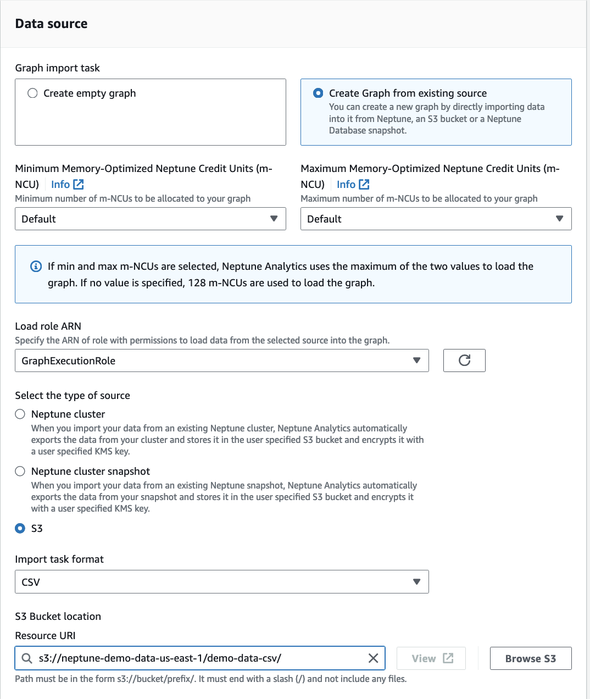

# Create a Neptune graph from existing sources

You can load data into a Neptune graph from another Neptune database, Neptune database cluster snapshot,
or from Amazon S3 files. Select the data sources and an IAM role for the data import accordingly. For more
information about loading data, see [Create a graph from Amazon S3, a Neptune cluster, or a snapshot](bulk-import-into-a-graph.md "bulk-import-into-a-graph.md").

AWS console



AWS CLI

The following example creates a graph and loads data from Amazon S3.

```
aws neptune-graph create-graph-using-import-task \
--graph-name "neptune-graph-from-s3-source" \
--region "us-east-1" \
--format "CSV" \
--role-arn "arn:aws:iam::1234567890124:role/GraphExecutionRole" \
--source "s3://neptune-demo-test-us-east-1/test-data-csv/" \
--public-connectivity \
--min-provisioned-memory 256 \
--max-provisioned-memory 256
```
