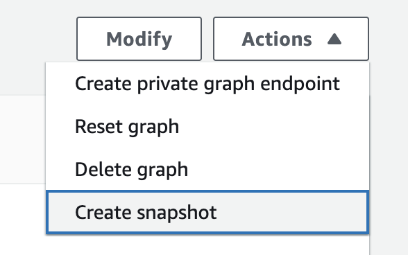
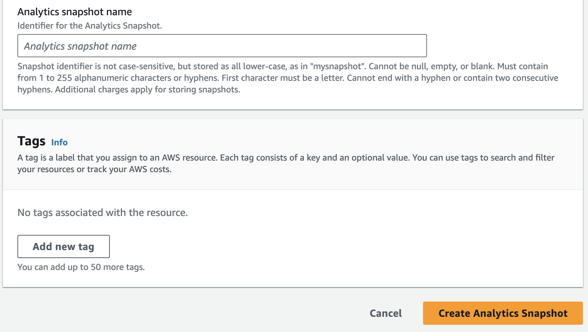

# Creating a graph snapshot

Creating a graph snapshot is a crucial step in managing and maintaining your data within the Neptune graph database.
This process allows you to capture a point-in-time snapshot of your graph, which can be useful for various purposes
such as backup, restoration, or analysis. The provided instructions outline the steps to create a graph snapshot
using either the AWS Command Line Interface (CLI) or the AWS SDK, as well as the Neptune console. By
following these steps, you can easily identify the graph you want to snapshot, provide a unique name for the
snapshot, and initiate the creation process.

CLI/SDK
**Find the id of your graph**

```
aws neptune-graph list-graphs
```

This command will give you a list of your graphs. Find the graph id of the graph you want to take
a snapshot of and write it down.

**Create a graph snapshot**

```
aws neptune-graph create-graph-snapshot \
--graph-identifier <GRAPH_ID> \
--snapshot-name <SNAPSHOT_NAME>
```

Parameters:

1. `graph-identifier` - The graph id you want to take the snapshot from.
2. `snapshot-name` - The name you want to use for your graph snapshot.

Neptune Console

1. Select the graph you want to take a snapshot of in **Analytics**,
   **Graphs**.
2. Choose **Actions**, and choose **Create snapshot**.

 3. Give the snapshot a name and choose **Create Analytics Snapshot**.


