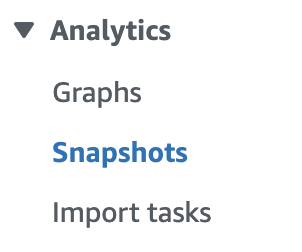

# Listing existing graph snapshots

The following information outlines the various methods and commands for managing graph snapshots in the
Amazon Neptune database service. It covers the steps to list all existing graph snapshots, as well as how to
retrieve details of a specific snapshot. The information also explains the different status states that a
graph snapshot can have, such as "CREATING," "AVAILABLE," "FAILED," and "DELETING."

CLI/SDK
**List all graph snapshots**

```
aws neptune-graph list-graph-snapshots
```

**Look up a single graph snapshot**

```
aws neptune-graph get-graph-snapshot \
--snapshot-id <SNAPSHOT_ID>
```

Status:

- CREATING: The snapshot is currently being created.
- AVAILABLE: The snapshot is available and can be restored from.
- FAILED: The snapshot failed to create.
- DELETING: The snapshot is currently being deleted.

Neptune Console

You can view your snapshots by expanding **Analytics** and choosing
**Snapshots**.


