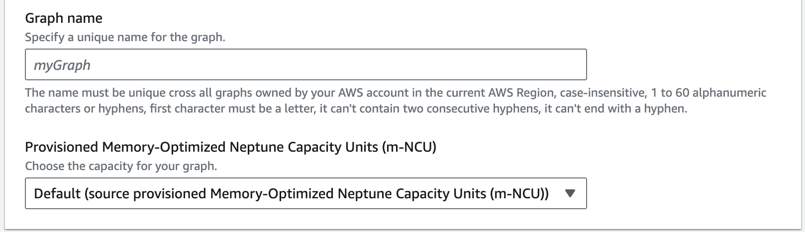
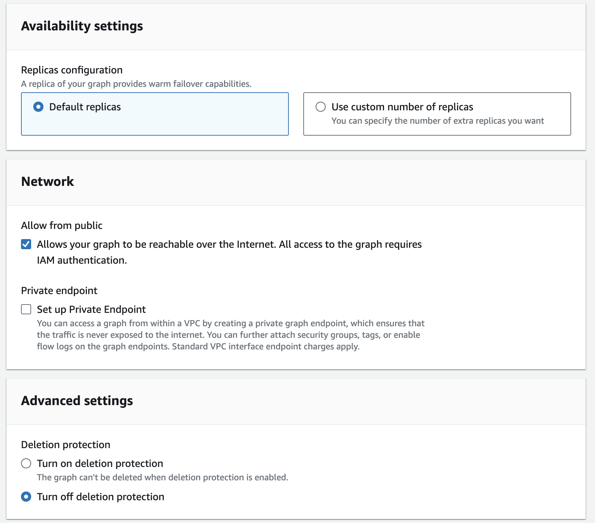

# Restoring from a graph snapshot

When you create a snapshot of a graph, Neptune Analytics creates a storage volume snapshot of the graph, backing up all of its
data. You can later create a new Neptune Analytics graph by restoring from this snapshot. When you restore the graph, you
provide the name of the graph snapshot to restore from, and then provide a name for the new graph that is created
by the restore.

CLI/SDK
**Restore an analytics graph from a snapshot**

```
aws neptune-graph restore-graph-from-snapshot \
--graph-name <NEW_GRAPH_NAME> \
--snapshot-id <SNAPSHOT_ID>
```

Parameters:

1. `graph-name` - The name of the new Neptune Analytics graph that will be created from the snapshot.
2. `snapshot-id` - The snapshot identifier you want to restore from.

Optional parameters:

1. `min-provisioned-memory` - The minimum provisioned memory to use for the new graph.
   Default: 64.
2. `max-provisioned-memory` - The maximum provisioned memory to use for the new graph.
   Default: 1024, or the approved upper limit for your account. Neptune Analytics will analyze the data to find
   the best memory configuration between min-provisioned-memory and max-provisioned-memory to create
   the graph.
3. `public-access, no-public-access` - Whether connectivity over public networks (internet)
   is enabled or not. Default: `no-public-access`.
4. `replica-count` - The number of replicas to provision on the new graph after import.
   Default: 0, Min: 0, Max:2.

Neptune Console

1. Find the snapshot you want to restore by expanding **Analytics** and choosing
   **Snapshots**.
2. Select the snapshot and choose **Restore snapshot**.
3. Give the graph a unique name, and choose provisioned m-NCU.

 4. Update availibility, network, and advanced settings if necessary, and choose the
**Restore snapshot** button.

 5. You can review the status of your restored graph by expanding **Analytics** and
choosing **Graphs**.
