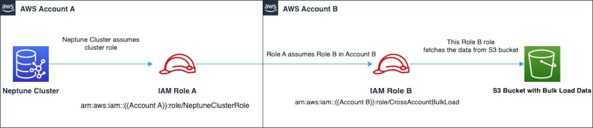

# Chaining IAM roles in Amazon Neptune

###### Important

The new bulk load cross-account feature introduced in [engine release 1.2.1.0.R3](engine-releases-1.2.1.0.md "engine-releases-1.2.1.0.md") that takes
advantage of chaining IAM roles may in some cases cause you to observe degraded bulk
load performance. As a result, upgrades to engine releases that support this feature
have been temporarily suspended until this problem is resolved.

When you attach a role to your cluster, your cluster can assume that role to
gain access to data stored in Amazon S3. Starting with [engine
release 1.2.1.0.R3](engine-releases-1.2.1.0.md "engine-releases-1.2.1.0.md"), if that role doesn't have access to all the resources you need,
you can chain one or more additional roles that your cluster can assume to gain access to
other resources. Each role in the chain assumes the next role in the chain, until your cluster
has assumed the role at the end of chain.

To chain roles, you establish a trust relationship between them. For example,
to chain `RoleB` onto `RoleA`, `RoleA` must
have a permissions policy that allows it to assume `RoleB`, and
`RoleB` must have a trust policy that allows it to pass its permissions
back to `RoleA`. For more information, see [Using IAM roles](../../../IAM/latest/UserGuide/id_roles_use.md "../../../IAM/latest/UserGuide/id_roles_use.md").

The first role in a chain must be attached to the cluster that is loading
data.

The first role, and each subsequent role that assumes the following role in the
chain, must have:

- A policy that includes a specific statement with the `Allow`
  effect on the `sts:AssumeRole` action.
- The Amazon Resource Name (ARN) of the next role in a
  `Resource` element.

###### Note

The target Amazon S3 bucket must be in the same AWS Region as the cluster.

## Cross-account access using chained roles

You can grant cross-account access by chaining a role or roles that belong to
another account. When your cluster temporarily assumes a role belonging to another
account, it can gain access to resources there.

For example, suppose **Account A** wants to access data in an
Amazon S3 bucket that belongs to **Account B**:

- **Account A** creates an AWS service role for
  Neptune named `RoleA` and attaches it to a cluster.
- **Account B** creates a role named `RoleB`
  that's authorized to access the data in an **Account B** bucket.
- **Account A** attaches a permissions policy to
  `RoleA` that allows it to assume `RoleB`.
- **Account B** attaches a trust policy to `RoleB`
  that allows it to pass its permissions back to `RoleA`.
- To access the data in the **Account B** bucket,
  **Account A** runs a loader command using an `iamRoleArn`
  parameter that chains `RoleA` and `RoleB`. For the duration
  of the loader operation, `RoleA` then temporarily assumes `RoleB`
  to access the Amazon S3 bucket in **Account B**.



For example, `RoleA` would have a trust policy that establishes a
trust relationship with Neptune:

JSON

```
`{
 "Version":"2012-10-17",
 "Statement": [
 {
 "Effect": "Allow",
 "Principal": {
 "Service": "rds.amazonaws.com"
 },
 "Action": "sts:AssumeRole"
 }
 ]
}`

```

`RoleA` would also have a permission policy that allows it to
assume `RoleB`, which is owned by **Account B**:

JSON

```
`{
 "Version":"2012-10-17",
 "Statement": [
 {
 "Sid": "Stmt1487639602000",
 "Effect": "Allow",
 "Action": [
 "sts:AssumeRole"
 ],
 "Resource": "arn:aws:iam::`111122223333`:role/RoleB"
 }
 ]
}`

```

Conversely, `RoleB` would have a trust policy to establish a
trust relationship with `RoleA`:

JSON

```
`{
 "Version":"2012-10-17",
 "Statement": [
 {
 "Effect": "Allow",
 "Action": "sts:AssumeRole",
 "Principal": {
 "AWS": "arn:aws:iam::`111122223333`:role/RoleA"
 }
 }
 ]
}`

```

`RoleB` would also need permission to access data in the Amazon S3 bucket
located in **Account B**.

## Creating an AWS Security Token Service (STS) VPC endpoint

The Neptune loader requires a VPC endpoint for AWS STS when you are chaining IAM
roles to privately access AWS STS APIs through private IP addresses. You can connect
directly from an Amazon VPC to AWS STS through a VPC Endpoint in a secure and scalable
manner. When you use an interface VPC endpoint, it provides a better security posture
because you don't need to open outbound traffic firewalls. It also provides the other
benefits of using Amazon VPC endpoints.

When using a VPC Endpoint, traffic to AWS STS does not transmit over the internet
and never leaves the Amazon network. Your VPC is securely connected to AWS STS without
availability risks or bandwidth constraints on your network traffic. For more information,
see [Using
AWS STS interface VPC endpoints](../../../IAM/latest/UserGuide/id_credentials_sts_vpce.md "../../../IAM/latest/UserGuide/id_credentials_sts_vpce.md").

###### To set up access for AWS Security Token Service (STS)

1. Sign in to the AWS Management Console and open the Amazon VPC console at
   [https://console.aws.amazon.com/vpc/](https://console.aws.amazon.com/vpc/ "https://console.aws.amazon.com/vpc/").
2. In the navigation pane, choose **Endpoints**.
3. Choose **Create Endpoint**.
4. Choose the **Service Name**: `com.amazonaws.region.sts`
   for the Interface type endpoint.
5. Choose the **VPC** that contains your Neptune DB instance and EC2 instance.
6. Select the check box next to the subnet in which your EC2 instance is present.
   You can't select multiple subnets from the same Availability Zone.
7. For IP address type, choose from the following options:
   - **IPv4** – Assign IPv4 addresses to your endpoint
     network interfaces. This option is supported only if all selected subnets have IPv4 address
     ranges.
   - **IPv6** – Assign IPv6 addresses to your endpoint
     network interfaces. This option is supported only if all selected subnets are IPv6-only subnets.
   - **Dualstack** – Assign both IPv4 and IPv6 addresses to
     your endpoint network interfaces. This option is supported only if all selected subnets have both
     IPv4 and IPv6 address ranges.

8. For **Security groups**, select the security groups to
   associate with the endpoint network interfaces for the VPC endpoint. You would need
   to select all the security groups that is attached to your Neptune DB instance and
   EC2 instance.
9. For **Policy**, select **Full access** to allow
   all operations by all principals on all resources over the VPC endpoint. Otherwise, select
   **Custom** to attach a VPC endpoint policy that controls the permissions
   that principals have for performing actions on resources over the VPC endpoint. This option
   is available only if the service supports VPC endpoint policies. For more information,
   see [Endpoint
   policies](../../../vpc/latest/privatelink/vpc-endpoints-access.md "../../../vpc/latest/privatelink/vpc-endpoints-access.md").
10. (_Optional_) To add a tag, choose **Add new tag**
    and enter the tag key and the tag value you want.
11. Choose **Create endpoint**.

For information about creating the endpoint, see [VPC Endpoints](../../../vpc/latest/privatelink/create-interface-endpoint.md "../../../vpc/latest/privatelink/create-interface-endpoint.md") in the Amazon
VPC User Guide. Please note that Amazon STS VPC Endpoint is a required prerequisite for IAM
role chaining.

Now that you have granted access to the AWS STS endpoint, you can prepare to load data.
For information about supported formats, see [Load
Data Formats](bulk-load-tutorial-format.md "bulk-load-tutorial-format.md").

## Chaining roles within a loader command

You can specify role chaining when you run a loader command by including a
comma-separated list of role ARNs in the `iamRoleArn` parameter.

Although you'll mostly only need to have two roles in a chain, it is certainly
possible to chain three or more together. For example, this loader command chains
three roles:

```
curl -X POST https://localhost:8182/loader \
  -H 'Content-Type: application/json' \
  -d '{
        "source" : "s3://`(the target bucket name)`/`(the target date file name)`",
        "iamRoleArn" : "arn:aws:iam::`(Account A ID)`:role/`(RoleA)`,arn:aws:iam::`(Account B ID)`:role/`(RoleB)`,arn:aws:iam::`(Account C ID)`:role/`(RoleC)`",
        "format" : "csv",
        "region" : "us-east-1"
      }'
```
