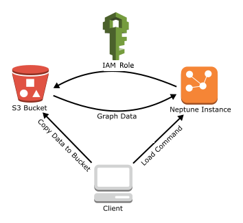

# Using the Amazon Neptune bulk loader to ingest data

Amazon Neptune provides a `Loader` command for loading data from
external files directly into a Neptune DB cluster. You can use this command instead of
executing a large number of `INSERT` statements, `addV`
and `addE` steps, or other API calls.

The Neptune **Loader** command is faster,
has less overhead, is optimized for large datasets, and supports both Gremlin
data and the RDF (Resource Description Framework) data used by SPARQL.

The following diagram shows an overview of the load process:

Here are the steps of the loading process:

1. Copy the data files to an Amazon Simple Storage Service (Amazon S3) bucket.
2. Create an IAM role with Read and List access to the bucket.
3. Create an Amazon S3 VPC endpoint.
4. Start the Neptune loader by sending a request via HTTP to the Neptune DB instance.
5. The Neptune DB instance assumes the IAM role to load the data from the bucket.

###### Note

You can load encrypted data from Amazon S3 if it was encrypted using either the Amazon S3
`SSE-S3` or the `SSE-KMS` mode, provided that the role you
use for bulk load has access to the Amazon S3 object, and also in the case of SSE-KMS,
to `kms:decrypt`. Neptune can then impersonate your credentials and
issue `s3:getObject` calls on your behalf.

However, Neptune does not currently support loading data encrypted using
the `SSE-C` mode.

The following sections provide instructions for preparing and loading data into
Neptune.

###### Topics

- [Prerequisites: IAM Role and Amazon S3 Access](bulk-load-tutorial-IAM.md "bulk-load-tutorial-IAM.md")
- [Load Data Formats](bulk-load-tutorial-format.md "bulk-load-tutorial-format.md")
- [Example: Loading Data into a Neptune DB Instance](bulk-load-data.md "bulk-load-data.md")
- [Optimizing an Amazon Neptune bulk load](bulk-load-optimize.md "bulk-load-optimize.md")
- [Neptune Loader Reference](load-api-reference.md "load-api-reference.md")
