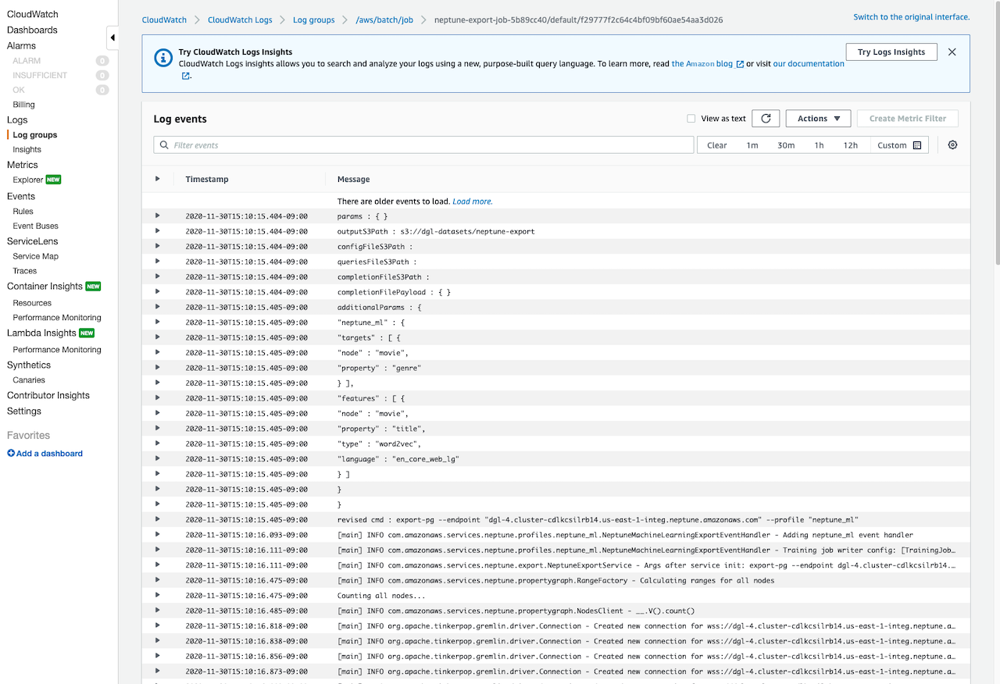

# Run a Neptune-Export job using the Neptune-Export API

The **Outputs** tab of the CloudFormation stack also includes the
`NeptuneExportApiUri`. Use this URI whenever you send a request to
the Neptune-Export endpoint.

###### Run an export job

- Be sure that the user or role under which the export runs has
  been granted `execute-api:Invoke` permission.
- If you set the `EnableIAM` parameter to `true` in the CloudFormation
  stack when you installed Neptune-Export, you need to `Sigv4` sign all requests to
  the Neptune-Export API. We recommend using [awscurl](https://github.com/okigan/awscurl "https://github.com/okigan/awscurl")
  to make requests to the API. All the examples here assume that IAM auth is enabled.
- If you set the `VPCOnly` parameter to `true` in the CloudFormation
  stack when you installed Neptune-Export, you must call the Neptune-Export API from within
  the VPC, typically from an Amazon EC2 instance located in the VPC.
  To start exporting data, send a request to the `NeptuneExportApiUri`
  endpoint with `command` and `outputS3Path` request parameters
  and an `endpoint` export parameter.

The following is an example of a request that exports property-graph data
from Neptune and publishes it to Amazon S3:

```
curl \
  `(your NeptuneExportApiUri)` \
  -X POST \
  -H 'Content-Type: application/json' \
  -d '{
        "command": "export-pg",
        "outputS3Path": "s3://`(your Amazon S3 bucket)`/neptune-export",
        "params": { "endpoint": "`(your Neptune endpoint DNS name)`" }
      }'
```

Similarly, here is an example of a request that exports RDF data from Neptune
to Amazon S3:

```
curl \
  `(your NeptuneExportApiUri)` \
  -X POST \
  -H 'Content-Type: application/json' \
  -d '{
        "command": "export-rdf",
        "outputS3Path": "s3://`(your Amazon S3 bucket)`/neptune-export",
        "params": { "endpoint": "`(your Neptune endpoint DNS name)`" }
      }'
```

If you omit the `command` request parameter, by default Neptune-Export
attempts to export property-graph data from Neptune.

If the previous command ran successfully, the output would look like this:

```
{
  "jobName": "neptune-export-abc12345-1589808577790",
  "jobId": "c86258f7-a9c9-4f8c-8f4c-bbfe76d51c8f"
}
```

## Monitor the export job you just started

To monitor a running job, append its jobID to your `NeptuneExportApiUri`,
something like this:

```
curl \
  `(your NeptuneExportApiUri)`/`(the job ID)`
```

If the service had not yet started the export job, the response would look like this:

```
{
  "jobId": "c86258f7-a9c9-4f8c-8f4c-bbfe76d51c8f",
  "status": "pending"
}
```

When you repeat the command after the export job has started, the response
would look something like this:

```
{
  "jobId": "c86258f7-a9c9-4f8c-8f4c-bbfe76d51c8f",
  "status": "running",
  "logs": "https://us-east-1.console.aws.amazon.com/cloudwatch/home?..."
}
```

If you open the logs in CloudWatch Logs using the URI provided by the status call, you can
then monitor the progress of the export in detail:



## Cancel a running export job

###### To cancel a running export job using the AWS Management Console

1. Open the AWS Batch console at
   [https://console.aws.amazon.com/batch/](https://console.aws.amazon.com/batch/ "https://console.aws.amazon.com/batch/").
2. Choose **Jobs**.
3. Locate the running job that you want to cancel, based on its `jobID`.
4. Select **Cancel job**.

**To cancel a running export job using the Neptune export API**:

Send an `HTTP DELETE` request to the
`NeptuneExportApiUri` with the `jobID` appended, like this:

```
curl -X DELETE \
  `(your NeptuneExportApiUri)`/`(the job ID)`
```
