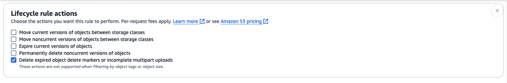
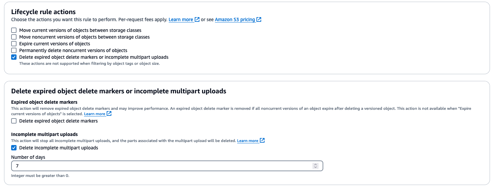

# Exporting Gremlin query results to Amazon S3

Starting in engine release 1.4.3.0, Amazon Neptune supports exporting Gremlin query results directly to Amazon S3. This
feature allows you to handle large query results efficiently by exporting them to an Amazon S3 bucket instead of
returning them as a query response.

To export query results to Amazon S3, use the `call()` step with the `neptune.query.exportToS3`
service name as the final step in your Gremlin query. Terminal step in
[Tinkerpop drivers using Bytecode](https://tinkerpop.apache.org/docs/current/reference/#terminal-steps "https://tinkerpop.apache.org/docs/current/reference/#terminal-steps")
can be added after the `call()` step. The export parameters must be provided as string values.

###### Note

The query with the `call()` step having `neptune.query.exportToS3` will fail if not used
as the final step. The Gremlin clients using bytecode can use terminal steps. See
[Gremlin best practices](best-practices-gremlin-java-bytecode.md "best-practices-gremlin-java-bytecode.md") in the Amazon Neptune documentation for more information.

```
g.V()
  ...
  .call('neptune.query.exportToS3', [
    'destination': '`s3://your-bucket/path/result.json`',
    'format': 'GraphSONv3',
    'kmskeyArn': '`optional-kms-key-arn`'
  ])
```

###### Parameters

- `destination`: required - The Amazon S3 URI where results will be written.
- `format`: required - The output format, currently only supports
  '[GraphSONv3](https://tinkerpop.apache.org/docs/3.7.3/dev/io/#graphson-3d0 "https://tinkerpop.apache.org/docs/3.7.3/dev/io/#graphson-3d0")'.
- `keyArn`: optional - The ARN of a AWS KMS key for Amazon S3
  [server-side encryption](../../../AmazonS3/latest/userguide/serv-side-encryption.md "../../../AmazonS3/latest/userguide/serv-side-encryption.md").

## Examples

**Example query**

```
g.V().
    hasLabel('Comment').
    valueMap().
    call('neptune.query.exportToS3', [
    'destination': '`s3://your-bucket/path/result.json`',
    'format': 'GraphSONv3',
    'keyArn': '`optional-kms-key-arn`'
  ])
```

**Example query response**

```
{
    "destination":"`s3://your-bucket/path/result.json`,
    "exportedResults": 100,
    "exportedBytes": 102400
}
```

## Prerequisites

- Your Neptune DB instance must have access to Amazon S3 through a VPC endpoint of type gateway.
- To use custom AWS KMS encryption in the query, an Interface-type VPC endpoint for AWS KMS is required
  to allow Neptune to communicate with AWS KMS.
- You must enable IAM auth on Neptune, and have appropriate IAM permissions to write to the target
  Amazon S3 bucket. Not having this will cause a 400 bad request error "Cluster must have IAM authentication
  enabled for S3 Export".
- The target Amazon S3 bucket:
  - The target Amazon S3 bucket must not be public. `Block public access` must be enabled.
  - The target Amazon S3 destination must be empty.
  - The target Amazon S3 bucket must have a lifecycle rule on `Delete expired object delete 
markers or incomplete multipart uploads` with `Delete incomplete multipart 
uploads`. See
    [Amazon S3 lifecycle management update - support for multipart uploads and delete markers](https://aws.amazon.com/blogs/aws/s3-lifecycle-management-update-support-for-multipart-uploads-and-delete-markers/ "https://aws.amazon.com/blogs/aws/s3-lifecycle-management-update-support-for-multipart-uploads-and-delete-markers/")
    for more information.

  
  - The target Amazon S3 bucket must have the a lifecycle rule on `Delete expired object 
delete markers or incomplete multipart uploads` with `Delete incomplete multipart 
uploads` set to a value higher than query evaluation will take (e.g., 7 days). This
    is required for deleting incomplete uploads (which are not directly visible but would incur costs)
    in case they cannot be completed or aborted by Neptune (e.g., due to instance/engine failures).
    See [Amazon S3 lifecycle management update - support for multipart uploads and delete markers](https://aws.amazon.com/blogs/aws/s3-lifecycle-management-update-support-for-multipart-uploads-and-delete-markers/ "https://aws.amazon.com/blogs/aws/s3-lifecycle-management-update-support-for-multipart-uploads-and-delete-markers/")
    for more information.

  

###### Important considerations

- The export step must be the last step in your Gremlin query.
- If an object already exists at the specified Amazon S3 location, the query will fail.
- Maximum query execution time for export queries is limited to 11 hours and 50 minutes. This feature uses
  [Forward access sessions](../../../IAM/latest/UserGuide/access_forward_access_sessions.md "../../../IAM/latest/UserGuide/access_forward_access_sessions.md"). It is
  currently limited to 11 hours and 50 minutes to avoid token expiry issues.

###### Note

The export query still honors the query timeout. For large exports, you should use an appropriate query
timeout.

- All new object uploads to Amazon S3 are automatically encrypted.
- To avoid storage costs from incomplete multipart uploads in the event of errors or crashes, we recommend
  setting up a lifecycle rule with `Delete incomplete multipart uploads` on your Amazon S3 bucket.

## Response format

Rather than returning the query results directly, the query returns metadata about the export operation, including
status and export details. The query results in Amazon S3 will be in
[GraphSONv3](https://tinkerpop.apache.org/docs/3.7.3/dev/io/#graphson-3d0 "https://tinkerpop.apache.org/docs/3.7.3/dev/io/#graphson-3d0") format.

```
{
  "data": {
    "@type": "g:List",
    "@value": [
      {
        "@type": "g:Map",
        "@value": [
          "browserUsed",
          {
            "@type": "g:List",
            "@value": [
              "Safari"
            ]
          },
          "length",
          {
            "@type": "g:List",
            "@value": [
              {
                "@type": "g:Int32",
                "@value": 7
              }
            ]
          },
          "locationIP",
          {
            "@type": "g:List",
            "@value": [
              "192.0.2.0/24"
            ]
          },
          "creationDate",
          {
            "@type": "g:List",
            "@value": [
              {
                "@type": "g:Date",
                "@value": 1348341961000
              }
            ]
          },
          "content",
          {
            "@type": "g:List",
            "@value": [
              "no way!"
            ]
          }
        ]
      },
      {
        "@type": "g:Map",
        "@value": [
          "browserUsed",
          {
            "@type": "g:List",
            "@value": [
              "Firefox"
            ]
          },
          "length",
          {
            "@type": "g:List",
            "@value": [
              {
                "@type": "g:Int32",
                "@value": 2
              }
            ]
          },
          "locationIP",
          {
            "@type": "g:List",
            "@value": [
              "203.0.113.0/24"
            ]
          },
          "creationDate",
          {
            "@type": "g:List",
            "@value": [
              {
                "@type": "g:Date",
                "@value": 1348352960000
              }
            ]
          },
          "content",
          {
            "@type": "g:List",
            "@value": [
              "ok"
            ]
          }
        ]
      },


      ...


    ]
  }
}
```

###### Security

- All data transferred to Amazon S3 is encrypted in transit using SSL.
- You can specify a AWS KMS key for server-side encryption of the exported data. Amazon S3 encrypts new data by
  default. If the bucket is configured to use a specific AWS KMS key, then that key is used.
- Neptune verifies that the target bucket is not public before starting the export.
- Cross-account and cross-region exports are not supported.

###### Error handling

- The target Amazon S3 bucket is public.
- The specified object already exists.
- You don't have sufficient permissions to write to the Amazon S3 bucket.
- The query execution exceeds the maximum time limit.

###### Best practices

- Use Amazon S3 bucket lifecycle rules to clean up incomplete multipart uploads.
- Monitor your export operations using Neptune logs and metrics. You can check the
  [Gremlin status endpoint](gremlin-api-status.md "gremlin-api-status.md")
  to see if a query is currently running. As long as the client has not received a response,
  the query will be assumed to be running.
