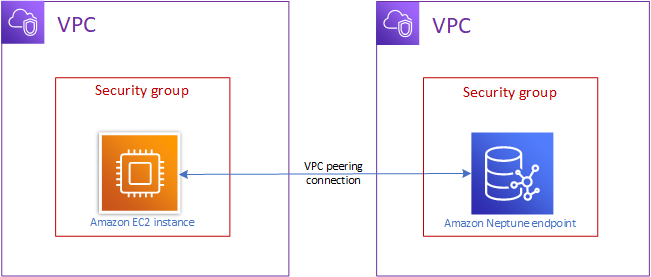

# Connecting an Amazon EC2 instance to an Amazon Neptune cluster in a different VPC

An Amazon Neptune DB cluster can _only_ be created in an Amazon Virtual Private Cloud
(Amazon VPC), and its endpoints are accessible within that VPC, usually from an Amazon Elastic Compute Cloud
(Amazon EC2) instance running in that VPC. Alternatively, it can be accessed using a public endpoint. For more
information on public endpoints, see
[Neptune public endpoints](neptune-public-endpoints.md "neptune-public-endpoints.md").

When your DB cluster is in a different VPC from the EC2 instance you are using
to access it, you can use [VPC peering](../../../vpc/latest/peering/what-is-vpc-peering.md "../../../vpc/latest/peering/what-is-vpc-peering.md") to make
the connection:

A VPC peering connection is a networking connection between two VPCs that
routes traffic between them privately, so that instances in either VPC can
communicate as if they are within the same network. You can create a VPC
peering connection between VPCs in your account, between a VPC in your AWS
account and a VPC in another AWS account, or with a VPC in a different AWS
Region.

AWS uses the existing infrastructure of a VPC to create a VPC peering
connection. It is neither a gateway nor an AWS Site-to-Site VPN connection,
and it does not rely on a separate piece of physical hardware. It has no
single point of failure for communication and no bandwidth bottleneck.

See the [Amazon VPC Peering Guide](../../../vpc/latest/peering.md "../../../vpc/latest/peering.md") for more information about how use VPC peering.
