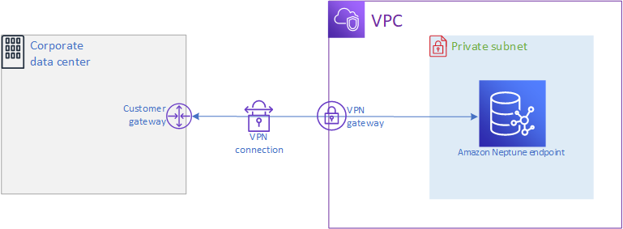

# Connecting to an Amazon Neptune cluster over a private network

You can access a Neptune DB cluster from a private network in two different
ways:

- Using an [AWS Site-to-Site VPN](../../../vpn/latest/s2svpn/VPC_VPN.md "../../../vpn/latest/s2svpn/VPC_VPN.md") connection.
- Using an [AWS Direct Connect](../../../directconnect/latest/UserGuide.md "../../../directconnect/latest/UserGuide.md") connection.
  The links above have information about these connection methods and how to set them
  up. The configuration of an AWS Site-to-Site connection might look like this:

