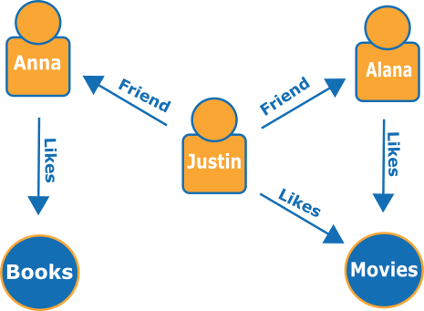
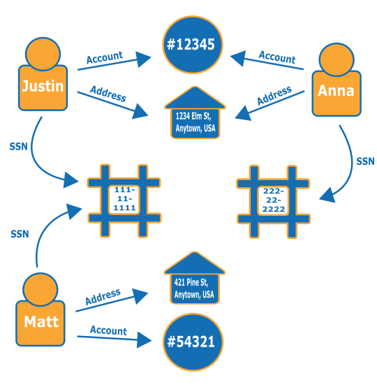
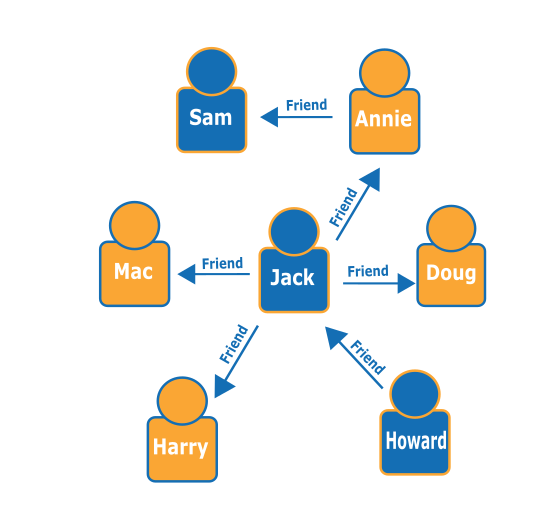

# Getting started with Amazon Neptune

Amazon Neptune is a fully managed graph database service that scales to handle
billions of relationships and lets you query them with milliseconds latency, at a
low cost for that kind of capacity.

If you're looking for more detailed information about Neptune, see [Overview of Amazon Neptune features](feature-overview.md "feature-overview.md").

If you know about graphs already, jump ahead to [Using Neptune with graph notebooks](graph-notebooks.md "graph-notebooks.md"). Or, if you want to
create a Neptune database right away, see [Creating an Amazon Neptune cluster using AWS CloudFormation](get-started-cfn-create.md "get-started-cfn-create.md").

Otherwise, you may want to know a little more about graph databases before you start.

## Graph database key concepts

Graph databases are optimized to store and query the _relationships_
between data items.

They store data items themselves as _vertices_ of the
graph, and the relationships between them as _edges_.
Each edge has a type, and is directed from one vertex (the start) to another
(the end). Relationships can be called _predicates_ as well
as edges, and vertices are also sometimes referred to as _nodes_.
In so-called property graphs, both vertices and edges can have additional
_properties_ associated with them too.

Here is a small graph representing friends and hobbies in a
social network:



The edges are shown as named arrows, and the vertices represent specific people
and hobbies that they connect.

A simple traversal of this graph can tell you what Justin's friends like.

## Why use a graph database?

Whenever connections or relationships between entities are at the core of the
data that you're trying to model, a graph database is your natural choice.

For one thing, it's easy to model data interconnections as a graph, and then
write complex queries that extract real-world information from the graph.

Building an equivalent application using a relational database requires you to
create many tables with multiple foreign keys and then write nested SQL queries
and complex joins. Not only does that approach quickly become unwieldy from a
coding perspective, its performance degrades quickly as the amount of data increases.

By contrast, a graph database like Neptune can query relationships between
billions of vertices without bogging down.

## What can you do with a graph database?

Graphs can represent the interrelationships of real-world entities in many ways,
in terms of actions, ownership, parentage, purchase choices, personal connections,
family ties, and so on.

Here are some of the most common areas where graph databases are used:

- **Knowledge graphs**   –  
  Knowledge graphs let you organize and query all kinds of connected information
  to answer general questions. Using a knowledge graph, you can add topical
  information to product catalogs, and model diverse information such as is
  contained in [Wikidata](https://www.wikidata.org/wiki/Wikidata:Main_Page "https://www.wikidata.org/wiki/Wikidata:Main_Page").

To learn more about how knowledge graphs work and where they are being used,
see [Knowledge
Graphs on AWS](https://aws.amazon.com/neptune/knowledge-graphs-on-aws/ "https://aws.amazon.com/neptune/knowledge-graphs-on-aws/").

- **Identity graphs**   –  
  In a graph database, you can store relationships between information categories
  such as customer interests, friends, and purchase history, and then query
  that data to make recommendations which are personalized and relevant.

For example, you can use a graph database to make product recommendations
to a user based on which products are purchased by others who follow the same
sport and have a similar purchase history. Or, you can identify people who
have a friend in common but don’t yet know each other, and make a friendship
recommendation.

Graphs of this kind are known as identity graphs, and are widely used
for personalizing interactions with users. To find out more, see [Identity Graphs on
AWS](https://aws.amazon.com/neptune/identity-graphs-on-aws/ "https://aws.amazon.com/neptune/identity-graphs-on-aws/"). To get started building your own identity graph, you can
begin with the [Identity
Graph Using Amazon Neptune](https://github.com/aws-samples/aws-admartech-samples/tree/master/identity-resolution "https://github.com/aws-samples/aws-admartech-samples/tree/master/identity-resolution") sample.

- **Fraud graphs**   –  
  This is a common use for graph databases. They can help you track credit card
  purchases and purchase locations to detect uncharacteristic use, or to detect
  a purchaser is trying to use the same email address and credit card as was
  used in a known fraud case. They can let you check for multiple people
  associated with a personal email address, or multiple people in different
  physical locations who share the same IP address.

Consider the following graph. It shows the relationship of three people and
their identity-related information. Each person has an address, a bank account,
and a social security number. However, we can see that Matt and Justin share the
same social security number, which is irregular and indicates possible fraud by
one of them. A query to a fraud graph can reveal connections of this kind so that they
can be reviewed.



To learn out more about fraud graphs and where they are being used, see [Fraud Graphs on AWS](https://aws.amazon.com/neptune/fraud-graphs-on-aws/ "https://aws.amazon.com/neptune/fraud-graphs-on-aws/").

- **Social networking**   –  
  One of the first and most common areas where graph databases are used
  is in social networking applications.

For example, suppose that you want to build a social feed into a web site.
You can easily use a graph database on the back end to deliver results to users that
reflect the latest updates from their families, their friends, from people
whose updates they "like," and from people who live close to them.

- **Driving directions**   –  
  A graph can help find the best route from a starting point to a destination,
  given current traffic and typical traffic patterns.
- **Logistics**   –  
  Graphs can help identify the most efficient way to use available shipping
  and distribution resources to meet customer requirements.
- **Diagnostics**   –  
  Graphs can represent complex diagnostic trees that can be queried to identify
  the source of observed problems and failures.
- **Scientific research**   –  
  With a graph database, you can build applications that store and navigate scientific
  data and even sensitive medical information using encryption at rest. For example,
  you can store models of disease and gene interactions. You can search for graph
  patterns within protein pathways to find other genes that might be associated with
  a disease. You can model chemical compounds as a graph and query for patterns in
  molecular structures. You can correlate patient data from medical records in
  different systems. You can topically organize research publications to find relevant
  information quickly.
- **Regulatory rules**   –  
  You can store complex regulatory requirements as graphs, and query them to detect
  situations where they might apply to your day-to-day business operations.
- **Network topology and events**   –  
  A graph database can help you manage and protect an IT network. When you store
  the network topology as a graph, you can also store and process many different
  kinds of events on the network. You can answer questions such as how many hosts
  are running a given application. You can query for patterns that might show
  that a given host has been compromised by a malicious program, and query for
  connection data that can help trace the program to the original host that
  downloaded it.

## How do you query a graph?

Neptune supports three special-purpose query languages designed for querying
graph data of different kinds. You can use these languages to add, modify, delete
and query data in a Neptune graph database:

- [Gremlin](access-graph-gremlin.md "access-graph-gremlin.md") is a graph traversal language
  for property graphs. A query in Gremlin is a traversal made up of discrete steps,
  each of which follows an edge to a node. See Gremlin documentation at [Apache TinkerPop3](https://tinkerpop.apache.org/docs/current/reference/ "https://tinkerpop.apache.org/docs/current/reference/")
  for more information.

The Neptune implementation of Gremlin has some differences from other implementations,
especially when you are using Gremlin-Groovy (Gremlin queries sent as serialized text). For
more information, see [Gremlin standards compliance in Amazon Neptune](access-graph-gremlin-differences.md "access-graph-gremlin-differences.md").

- [openCypher](access-graph-opencypher.md "access-graph-opencypher.md")   –  
  openCypher is a declarative query language for property graphs that was originally
  developed by Neo4j, then open-sourced in 2015, and contributed to the [openCypher](http://www.opencypher.org/ "http://www.opencypher.org/") project under an Apache 2
  open-source license. See the [Cypher Query
  Language Reference (Version 9)](https://s3.amazonaws.com/artifacts.opencypher.org/openCypher9.pdf "https://s3.amazonaws.com/artifacts.opencypher.org/openCypher9.pdf") for the language specification, as well as the [Cypher
  Style Guide](https://s3.amazonaws.com/artifacts.opencypher.org/M15/docs/style-guide.pdf "https://s3.amazonaws.com/artifacts.opencypher.org/M15/docs/style-guide.pdf") for additional information.
- [SPARQL](access-graph-sparql.md "access-graph-sparql.md") is a declarative query
  language for [RDF](https://www.w3.org/2001/sw/wiki/RDF "https://www.w3.org/2001/sw/wiki/RDF") data, based
  on the graph pattern matching that is standardized by the World Wide Web Consortium (W3C)
  and described in [SPARQL 1.1
  Overview](https://www.w3.org/TR/sparql11-overview/ "https://www.w3.org/TR/sparql11-overview/")) and the [SPARQL
  1.1 Query Language](https://www.w3.org/TR/sparql11-query/ "https://www.w3.org/TR/sparql11-query/") specification. See [SPARQL standards compliance in Amazon Neptune](feature-sparql-compliance.md "feature-sparql-compliance.md")
  for specific details about the Neptune implementation of SPARQL.

### Examples of matching Gremlin and SPARQL queries

Given the following graph of people (nodes) and their relationships (edges), you can
find out who the "friends of friends" of a particular person are— for example, the
friends of Howard's friends.



Looking at the graph, you can see that Howard has one friend, Jack, and Jack has four
friends: Annie, Harry, Doug, and Mac. This is a simple example with a simple graph, but
these types of queries can scale in complexity, dataset size, and result size.

Here is a Gremlin traversal query that returns the names of the friends of
Howard's friends:

```
g.V().has('name', 'Howard').out('friend').out('friend').values('name')
```

Here is a SPARQL query that returns the names of the friends of Howard's friends:

```
prefix : <#>

  select ?names where {
    ?howard :name "Howard" .
    ?howard :friend/:friend/:name ?names .
  }
```

###### Note

Each part of any Resource Description Framework (RDF) triple has a URI associated
with it. In the example above, the URI prefix is intentionally short.

## Take an online course in using Amazon Neptune

If you like learning with videos, AWS offers online courses in the [AWS Online Tech Talks](https://aws.amazon.com/events/online-tech-talks/ "https://aws.amazon.com/events/online-tech-talks/") to
help you get going. One that introduces graph databases is:

    [Graph
Database introduction, deep-dive and demo with Amazon Neptune](https://pages.awscloud.com/Graph-Database-introduction-deep-dive-and-demo-with-Amazon-Neptune-_2022_VW_s46e01-DAT_OD.html "https://pages.awscloud.com/Graph-Database-introduction-deep-dive-and-demo-with-Amazon-Neptune-_2022_VW_s46e01-DAT_OD.html").

## Digging deeper into graph reference architecture

As you think about what problems a graph database could solve for you, and how
to approach them, one of the best places to start is the [Neptune graph reference
architectures GitHub project](https://github.com/aws-samples/aws-dbs-refarch-graph "https://github.com/aws-samples/aws-dbs-refarch-graph").

There you can find detailed descriptions of graph workload types, and three
sections to help you design an effective graph database:

- [Data
  Models and Query Languages](https://github.com/aws-samples/aws-dbs-refarch-graph/tree/master/src/data-models-and-query-languages "https://github.com/aws-samples/aws-dbs-refarch-graph/tree/master/src/data-models-and-query-languages")   –   This section walks you through
  the differences between Gremlin and SPARQL and how to choose between them.
- [Graph
  Data Modeling](https://github.com/aws-samples/aws-dbs-refarch-graph/tree/master/src/graph-data-modelling "https://github.com/aws-samples/aws-dbs-refarch-graph/tree/master/src/graph-data-modelling")   –   This is a thorough discussion of
  how to make graph data modeling decisions, including detailed walkthroughs
  of property graph modeling using Gremlin and RDF modeling using SPARQL.
- [Converting
  Other Data Models to a Graph Model](https://github.com/aws-samples/aws-dbs-refarch-graph/tree/master/src/converting-to-graph "https://github.com/aws-samples/aws-dbs-refarch-graph/tree/master/src/converting-to-graph")   –   Here you can find
  out how to go about translating a relational data model into a graph model.

There are also three sections that walk you through specific steps for using
Neptune:

- [Connecting
  to Amazon Neptune from Clients Outside the Neptune VPC](https://github.com/aws-samples/aws-dbs-refarch-graph/tree/master/src/connecting-using-a-load-balancer "https://github.com/aws-samples/aws-dbs-refarch-graph/tree/master/src/connecting-using-a-load-balancer")   –  
  This section shows you several options for connecting to Neptune from outside
  the VPC where your DB cluster is located.
- [Accessing
  Amazon Neptune from AWS Lambda Functions](https://github.com/aws-samples/aws-dbs-refarch-graph/tree/master/src/accessing-from-aws-lambda "https://github.com/aws-samples/aws-dbs-refarch-graph/tree/master/src/accessing-from-aws-lambda")   –   Here you'll
  find out how to connect reliably to Neptune from Lambda functions.
- [Writing
  to Amazon Neptune from an Amazon Kinesis Data Stream](https://github.com/aws-samples/aws-dbs-refarch-graph/tree/master/src/writing-from-amazon-kinesis-data-streams "https://github.com/aws-samples/aws-dbs-refarch-graph/tree/master/src/writing-from-amazon-kinesis-data-streams")   –  
  This section can help you handle high write throughput scenarios with Neptune.
