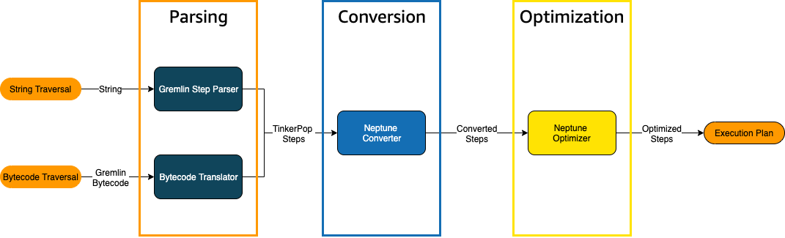
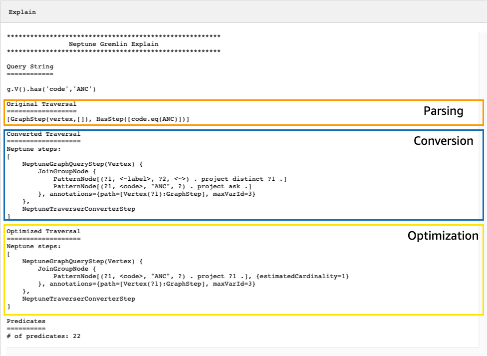
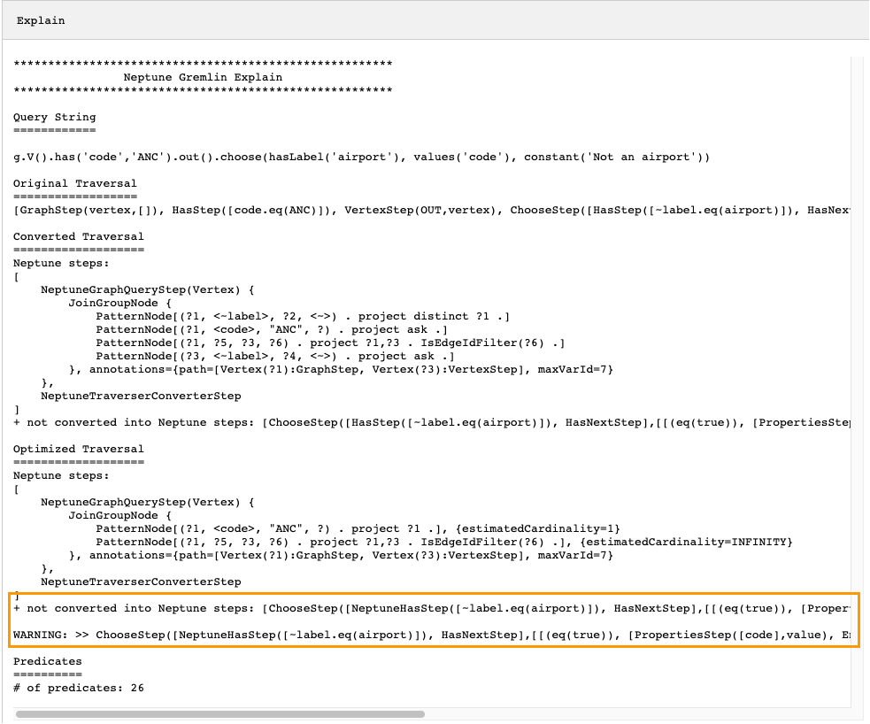
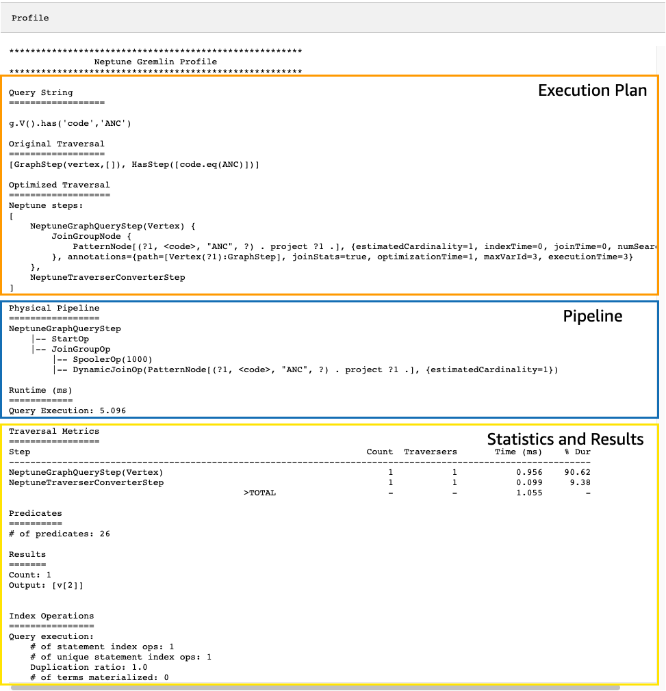

# Tuning Gremlin queries using `explain` and `profile`

You can often tune your Gremlin queries in Amazon Neptune to get better
performance, using the information available to you in the reports you get from
the Neptune [explain](gremlin-explain-api.md "gremlin-explain-api.md") and [profile](gremlin-profile-api.md "gremlin-profile-api.md") APIs. To do so, it helps to
understand how Neptune processes Gremlin traversals.

###### Important

A change was made in TinkerPop version 3.4.11 that improves correctness of
how queries are processed, but for the moment can sometimes seriously impact
query performance.

For example, a query of this sort may run significantly slower:

```
g.V().hasLabel('airport').
  order().
    by(out().count(),desc).
  limit(10).
  out()
```

The vertices after the limit step are now fetched in a non-optimal way beause
of the TinkerPop 3.4.11 change. To avoid this, you can modify the query by adding
the barrier() step at any point after the `order().by()`.
For example:

```
g.V().hasLabel('airport').
  order().
    by(out().count(),desc).
  limit(10).
  barrier().
  out()
```

TinkerPop 3.4.11 was enabled in Neptune [engine version 1.0.5.0](engine-releases-1.0.5.md "engine-releases-1.0.5.md").

## Understanding Gremlin traversal processing in Neptune

When a Gremlin traversal is sent to Neptune, there are three main processes
that transform the traversal into an underlying execution plan for the engine
to execute. These are parsing, conversion, and optimization:



### The traversal parsing process

The first step in processing a traversal is to parse it into a common language. In
Neptune, that common language is the set of TinkerPop steps that are part of the [TinkerPop
API](http://tinkerpop.apache.org/javadocs/3.4.8/full/org/apache/tinkerpop/gremlin/process/traversal/Step.html "http://tinkerpop.apache.org/javadocs/3.4.8/full/org/apache/tinkerpop/gremlin/process/traversal/Step.html"). Each of these steps represents a unit of computation within the traversal.

You can send a Gremlin traversal to Neptune either as a string or as bytecode.
The REST endpoint and the Java client driver `submit()` method send
traversals as strings, as in this example:

```
client.submit("g.V()")
```

Applications and language drivers using [Gremlin
language variants (GLV)](https://tinkerpop.apache.org/docs/current/tutorials/gremlin-language-variants/ "https://tinkerpop.apache.org/docs/current/tutorials/gremlin-language-variants/") send traversals in bytecode.

### The traversal conversion process

The second step in processing a traversal is to convert its TinkerPop steps
into a set of converted and non-converted Neptune steps. Most steps in the Apache
TinkerPop Gremlin query language are converted to Neptune-specific steps that are
optimized to run on the underlying Neptune engine. When a TinkerPop step without
a Neptune equivalent is encountered in a traversal, that step and all subsequent
steps in the traversal are processed by the TinkerPop query engine.

For more information about what steps can be converted under what circumstances,
see [Gremlin step support](gremlin-step-support.md "gremlin-step-support.md").

### The traversal optimization process

The final step in traversal processing is to run the series of converted and
non-converted steps through the optimizer, to try to determine the best execution
plan. The output of this optimization is the execution plan that the Neptune
engine processes.

## Using the Neptune Gremlin

`explain` API to tune queries

The Neptune explain API is not the same as the Gremlin `explain()` step.
It returns the final execution plan that the Neptune engine would process when executing
the query. Because it does not perform any processing, it returns the same plan regardless
of the parameters used, and its output contains no statistics about actual execution.

Consider the following simple traversal that finds all the airport vertices
for Anchorage:

```
g.V().has('code','ANC')
```

There are two ways you can run this traversal through the Neptune `explain`
API. The first way is to make a REST call to the explain endpoint, like this:

```
curl -X POST https://`your-neptune-endpoint`:`port`/gremlin/explain -d '{"gremlin":"g.V().has('code','ANC')"}'
```

The second way is to use the Neptune workbench's [%%gremlin](notebooks-magics.md#notebooks-cell-magics-gremlin "notebooks-magics.md#notebooks-cell-magics-gremlin")
cell magic with the `explain` parameter. This passes the traversal contained
in the cell body to the Neptune `explain` API and then displays the resulting
output when you run the cell:

```
%%gremlin explain

g.V().has('code','ANC')
```

The resulting `explain` API output describes Neptune's
execution plan for the traversal. As you can see in the image below, the
plan includes each of the 3 steps in the processing pipeline:



### Tuning a traversal by looking at steps that are not converted

One of the first things to look for in the Neptune `explain` API output
is for Gremlin steps that are not converted to Neptune native steps. In a query plan,
when a step is encountered that cannot be converted to a Neptune native step, it and all
subsequent steps in the plan are processed by the Gremlin server.

In the example above, all steps in the traversal were converted. Let's examine
`explain` API output for this traversal:

```
g.V().has('code','ANC').out().choose(hasLabel('airport'), values('code'), constant('Not an airport'))
```

As you can see in the image below, Neptune could not convert the `choose()`
step:



There are several things you could do to tune the performance of the traversal.
The first would be to rewrite it in such a way as to eliminate the step that could
not be converted. Another would be to move the step to the end of the traversal
so that all other steps can be converted to native ones.

A query plan with steps that are not converted does not always need to
be tuned. If the steps that cannot be converted are at the end of the traversal,
and are related to how output is formatted rather than how the graph is traversed,
they may have little effect on performance.

###

Another thing to look for when examining output from the Neptune
`explain` API is steps that do not use indexes. The following traversal
finds all airports with flights that land in Anchorage:

```
g.V().has('code','ANC').in().values('code')
```

Output from the explain API for this traversal is:

```
*******************************************************
                Neptune Gremlin Explain
*******************************************************

Query String
============

g.V().has('code','ANC').in().values('code')

Original Traversal
==================
[GraphStep(vertex,[]), HasStep([code.eq(ANC)]), VertexStep(IN,vertex), PropertiesStep([code],value)]

Converted Traversal
===================
Neptune steps:
[
    NeptuneGraphQueryStep(PropertyValue) {
        JoinGroupNode {
            PatternNode[(?1, <~label>, ?2, <~>) . project distinct ?1 .]
            PatternNode[(?1, <code>, "ANC", ?) . project ask .]
            PatternNode[(?3, ?5, ?1, ?6) . project ?1,?3 . IsEdgeIdFilter(?6) .]
            PatternNode[(?3, <~label>, ?4, <~>) . project ask .]
            PatternNode[(?3, ?7, ?8, <~>) . project ?3,?8 . ContainsFilter(?7 in (<code>)) .]
        }, annotations={path=[Vertex(?1):GraphStep, Vertex(?3):VertexStep, PropertyValue(?8):PropertiesStep], maxVarId=9}
    },
    NeptuneTraverserConverterStep
]

Optimized Traversal
===================
Neptune steps:
[
    NeptuneGraphQueryStep(PropertyValue) {
        JoinGroupNode {
            PatternNode[(?1, <code>, "ANC", ?) . project ?1 .], {estimatedCardinality=1}
            PatternNode[(?3, ?5, ?1, ?6) . project ?1,?3 . IsEdgeIdFilter(?6) .], {estimatedCardinality=INFINITY}
            PatternNode[(?3, ?7=<code>, ?8, <~>) . project ?3,?8 .], {estimatedCardinality=7564}
        }, annotations={path=[Vertex(?1):GraphStep, Vertex(?3):VertexStep, PropertyValue(?8):PropertiesStep], maxVarId=9}
    },
    NeptuneTraverserConverterStep
]

Predicates
==========
# of predicates: 26

WARNING: reverse traversal with no edge label(s) - .in() / .both() may impact query performance
```

The `WARNING` message at the bottom of the output occurs because
the `in()` step in the traversal cannot be handled using one of the
3 indexes that Neptune maintains (see [How Statements Are Indexed in Neptune](feature-overview-storage-indexing.md "feature-overview-storage-indexing.md") and [Gremlin statements in Neptune](gremlin-explain-background-statements.md "gremlin-explain-background-statements.md")). Because the `in()` step
contains no edge filter, it cannot be resolved using the `SPOG`,
`POGS` or `GPSO` index. Instead, Neptune must perform
a union scan to find the requested vertices, which is much less efficient.

There are two ways to tune the traversal in this situation. The first is to
add one or more filtering criteria to the `in()` step so that an
indexed lookup can be used to resolve the query. For the example above, this
might be:

```
g.V().has('code','ANC').in('route').values('code')
```

Output from the Neptune `explain` API for the revised traversal
no longer contains the `WARNING` message:

```
*******************************************************
                Neptune Gremlin Explain
*******************************************************

Query String
============

g.V().has('code','ANC').in('route').values('code')

Original Traversal
==================
[GraphStep(vertex,[]), HasStep([code.eq(ANC)]), VertexStep(IN,[route],vertex), PropertiesStep([code],value)]

Converted Traversal
===================
Neptune steps:
[
    NeptuneGraphQueryStep(PropertyValue) {
        JoinGroupNode {
            PatternNode[(?1, <~label>, ?2, <~>) . project distinct ?1 .]
            PatternNode[(?1, <code>, "ANC", ?) . project ask .]
            PatternNode[(?3, ?5, ?1, ?6) . project ?1,?3 . IsEdgeIdFilter(?6) . ContainsFilter(?5 in (<route>)) .]
            PatternNode[(?3, <~label>, ?4, <~>) . project ask .]
            PatternNode[(?3, ?7, ?8, <~>) . project ?3,?8 . ContainsFilter(?7 in (<code>)) .]
        }, annotations={path=[Vertex(?1):GraphStep, Vertex(?3):VertexStep, PropertyValue(?8):PropertiesStep], maxVarId=9}
    },
    NeptuneTraverserConverterStep
]

Optimized Traversal
===================
Neptune steps:
[
    NeptuneGraphQueryStep(PropertyValue) {
        JoinGroupNode {
            PatternNode[(?1, <code>, "ANC", ?) . project ?1 .], {estimatedCardinality=1}
            PatternNode[(?3, ?5=<route>, ?1, ?6) . project ?1,?3 . IsEdgeIdFilter(?6) .], {estimatedCardinality=32042}
            PatternNode[(?3, ?7=<code>, ?8, <~>) . project ?3,?8 .], {estimatedCardinality=7564}
        }, annotations={path=[Vertex(?1):GraphStep, Vertex(?3):VertexStep, PropertyValue(?8):PropertiesStep], maxVarId=9}
    },
    NeptuneTraverserConverterStep
]

Predicates
==========
# of predicates: 26
```

Another option if you are running many traversals of this kind is to
run them in a Neptune DB cluster that has the optional `OSGP`
index enabled (see [Enabling an OSGP Index](feature-overview-storage-indexing.md#feature-overview-storage-indexing-osgp "feature-overview-storage-indexing.md#feature-overview-storage-indexing-osgp")). Enabling
an `OSGP` index has drawbacks:

- It must be enabled in a DB cluster before any data is loaded.
- Insertion rates for vertices and edges may slow by up to 23%.
- Storage usage will increase by around 20%.
- Read queries that scatter requests across all indexes may have
  increased latencies.

Having an `OSGP` index makes a lot of sense for a restricted
set of query patterns, but unless you are running those frequently, it is
usually preferable to try to ensure that the traversals you write can be
resolved using the three primary indexes.

### Using a large number of predicates

Neptune treats each edge label and each distinct vertex or edge property
name in your graph as a predicate, and is designed by default to work with a
relatively low number of distinct predicates. When you have more than a few
thousand predicates in your graph data, performance can degrade.

Neptune `explain` output will warn you if this is the case:

```
Predicates
==========
# of predicates: 9549
WARNING: high predicate count (# of distinct property names and edge labels)
```

If it is not convenient to rework your data model to reduce the number of
labels and properties, and therefore the number of predicates, the best way to
tune traversals is to run them in a DB cluster that has the `OSGP`
index enabled, as discussed above.

## Using the Neptune Gremlin `profile` API to tune traversals

The Neptune `profile` API is quite different from the Gremlin
`profile()` step. Like the `explain` API, its output includes
the query plan that the Neptune engine uses when executing the traversal. In addition,
the `profile` output includes actual execution statistics for the traversal,
given how its parameters are set.

Again, take the simple traversal that finds all airport vertices for Anchorage:

```
g.V().has('code','ANC')
```

As with the `explain` API, you can invoke the `profile` API using
a REST call:

```
curl -X POST https://`your-neptune-endpoint`:`port`/gremlin/profile -d '{"gremlin":"g.V().has('code','ANC')"}'
```

You use also the Neptune workbench's [%%gremlin](notebooks-magics.md#notebooks-cell-magics-gremlin "notebooks-magics.md#notebooks-cell-magics-gremlin") cell magic with the `profile`
parameter. This passes the traversal contained in the cell body to the Neptune
`profile` API and then displays the resulting output when you run the cell:

```
%%gremlin profile

g.V().has('code','ANC')
```

The resulting `profile` API output contains both Neptune's execution
plan for the traversal and statistics about the plan's execution, as you can see in
this image:



In `profile` output, the execution plan section only contains the final execution
plan for the traversal, not the intermediate steps. The pipeline section contains the physical
pipeline operations that were performed as well as the actual time (in milliseconds) that traversal
execution took. The runtime metric is extremely helpful in comparing the times that two different
versions of a traversal take as you are optimizing them.

###### Note

The initial runtime of a traversal is generally longer than subsequent runtimes, because
the first one causes the relevant data to be cached.

The third section of the `profile` output contains execution statistics and
the results of the traversal. To see how this information can be useful in tuning a traversal,
consider the following traversal, which finds every airport whose name begins with "Anchora",
and all the airports reachable in two hops from those airports, returning airport codes,
flight routes, and distances:

```
%%gremlin profile

g.withSideEffect("Neptune#fts.endpoint", "{your-OpenSearch-endpoint-URL").
    V().has("city", "Neptune#fts Anchora~").
    repeat(outE('route').inV().simplePath()).times(2).
    project('Destination', 'Route').
        by('code').
        by(path().by('code').by('dist'))
```

### Traversal metrics in Neptune `profile` API output

The first set of metrics that is available in all `profile` output is
the traversal metrics. These are similar to the Gremlin `profile()` step
metrics, with a few differences:

```
Traversal Metrics
=================
Step                                                               Count  Traversers       Time (ms)    % Dur
-------------------------------------------------------------------------------------------------------------
NeptuneGraphQueryStep(Vertex)                                       3856        3856          91.701     9.09
NeptuneTraverserConverterStep                                       3856        3856          38.787     3.84
ProjectStep([Destination, Route],[value(code), ...                  3856        3856         878.786    87.07
  PathStep([value(code), value(dist)])                              3856        3856         601.359
                                            >TOTAL                     -           -        1009.274        -
```

The first column of the traversal-metrics table lists the steps executed by the traversal.
The first two steps are generally the Neptune-specific steps,
`NeptuneGraphQueryStep` and `NeptuneTraverserConverterStep`.

`NeptuneGraphQueryStep` represents the execution time for the entire
portion of the traversal that could be converted and executed natively by the Neptune
engine.

`NeptuneTraverserConverterStep` represents the process of converting
the output of those converted steps into TinkerPop traversers which allow steps that
could not be converted steps, if any, to be processed, or to return the results in
a TinkerPop-compatible format.

In the example above, we have several non-converted steps, so we see that each
of these TinkerPop steps (`ProjectStep`, `PathStep`) then appears
as a row in the table.

The second column in the table, `Count`, reports the number of
_represented_ traversers that passed through the step, while
the third column, `Traversers`, reports the number of
traversers which passed through that step, as explained in the [TinkerPop
profile step documentation](https://tinkerpop.apache.org/docs/current/reference/#profile-step "https://tinkerpop.apache.org/docs/current/reference/#profile-step").

In our example there are 3,856 vertices and 3,856 traversers
returned by the `NeptuneGraphQueryStep`, and these numbers remain the same
throughout the remaining processing because `ProjectStep` and
`PathStep` are formatting the results, not filtering them.

###### Note

Unlike TinkerPop, the Neptune engine does not optimize performance by
_bulking_ in its `NeptuneGraphQueryStep` and
`NeptuneTraverserConverterStep` steps. Bulking is the TinkerPop
operation that combines traversers on the same vertex to reduce operational
overhead, and that is what causes the `Count` and `Traversers`
numbers to differ. Because bulking only occurs in steps that Neptune delegates
to TinkerPop, and not in steps that Neptune handles natively, the `Count`
and `Traverser` columns seldom differ.

The Time column reports the number of milliseconds that the step took, and the
the `% Dur` column reports what percent of the total processing time the
step took. These are the metrics that tell you where to focus your tuning efforts
by showing the steps that took the most time.

### Index operation metrics in Neptune `profile` API output

Another set of metrics in the output of the Neptune profile API is the
index operations:

```
Index Operations
================
Query execution:
    # of statement index ops: 23191
    # of unique statement index ops: 5960
    Duplication ratio: 3.89
    # of terms materialized: 0
```

These report:

- The total number of index lookups.
- The number of unique index lookups performed.
- The ratio of total index lookups to unique ones. A lower
  ratio indicates less redundancy.
- The number of terms materialized from the term dictionary.

### Repeat metrics in Neptune `profile` API output

If your traversal uses a `repeat()` step as in the example above, then
a section containing repeat metrics appears in the `profile` output:

```
Repeat Metrics
==============
Iteration  Visited   Output    Until     Emit     Next
------------------------------------------------------
        0        2        0        0        0        2
        1       53        0        0        0       53
        2     3856     3856     3856        0        0
------------------------------------------------------
              3911     3856     3856        0       55
```

These report:

- The loop count for a row (the `Iteration` column).
- The number of elements visited by the loop (the `Visited` column).
- The number of elements output by the loop (the `Output` column).
- The last element output by the loop (the `Until` column).
- The number of elements emitted by the loop (the `Emit` column).
- The number of elements passed from the loop to the subsequent loop (the `Next` column).

These repeat metrics are very helpful in understanding the branching
factor of your traversal, to get a feeling for how much work is being done
by the database. You can use these numbers to diagnose performance problems,
especially when the same traversal performs dramatically differently with
different parameters.

### Full-text search metrics in Neptune `profile` API output

When a traversal uses a [full-text search](full-text-search.md "full-text-search.md")
lookup, as in the example above, then a section containing the full-text search (FTS)
metrics appears in the `profile` output:

```
FTS Metrics
==============
SearchNode[(idVar=?1, query=Anchora~, field=city) . project ?1 .],
    {endpoint=your-OpenSearch-endpoint-URL, incomingSolutionsThreshold=1000, estimatedCardinality=INFINITY,
    remoteCallTimeSummary=[total=65, avg=32.500000, max=37, min=28],
    remoteCallTime=65, remoteCalls=2, joinTime=0, indexTime=0, remoteResults=2}

    2 result(s) produced from SearchNode above
```

This shows the query sent to the ElasticSearch (ES) cluster and reports
several metrics about the interaction with ElasticSearch that can help you
pinpoint performance problems relating to full-text search:

- Summary information about the calls into the ElasticSearch index:
  - The total number of milliseconds required by all
    remoteCalls to satisfy the query (`total`).
  - The average number of milliseconds spent in
    a remoteCall (`avg`).
  - The minimum number of milliseconds spent in
    a remoteCall (`min`).
  - The maximum number of milliseconds spent in
    a remoteCall (`max`).

- Total time consumed by remoteCalls to ElasticSearch (`remoteCallTime`).
- The number of remoteCalls made to ElasticSearch (`remoteCalls`).
- The number of milliseconds spent in joins of ElasticSearch results (`joinTime`).
- The number of milliseconds spent in index lookups (`indexTime`).
- The total number of results returned by ElasticSearch (`remoteResults`).
