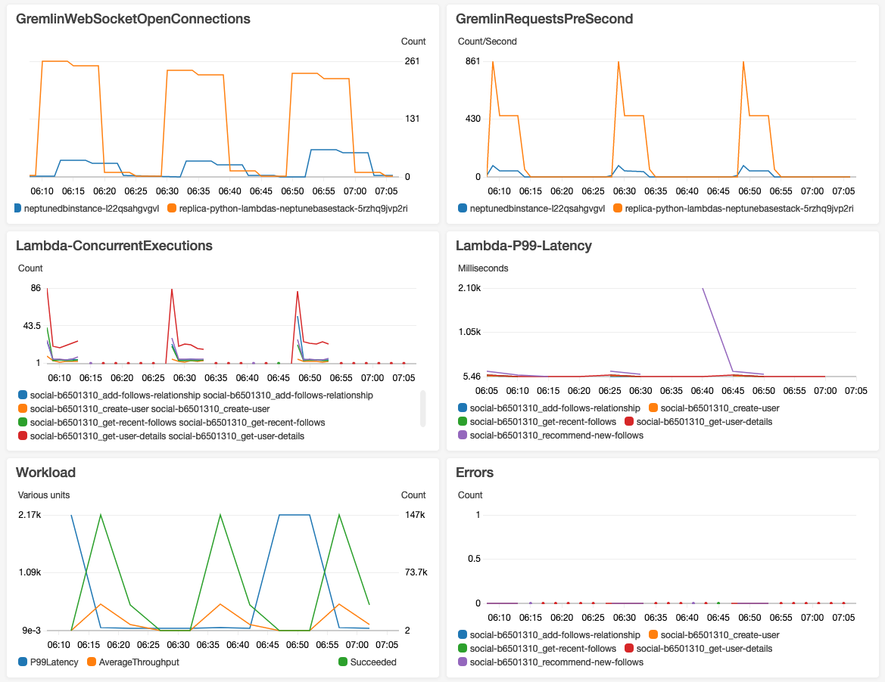

# AWS Lambda function examples for Amazon Neptune

The following example AWS Lambda functions, written in Java, JavaScript and Python,
illustrate upserting a single vertex with a randomly generated ID using the
`fold().coalesce().unfold()` idiom.

Much of the code in each function is boilerplate code, responsible for managing
connections and retrying connections and queries if an error occurs. The real application
logic and the Gremlin query are implemented in `doQuery()` and
`query()` methods respectively. If you use these examples as a basis for
your own Lambda functions, you can concentrate on modifying `doQuery()`
and `query()`.

The functions are configured to retry failed queries 5 times, waiting 1 second
between retries.

The functions require values to be present in the following Lambda environment
variables:

- **`NEPTUNE_ENDPOINT`**   –  
  Your Neptune DB cluster endpoint. For Python, this should be `neptuneEndpoint`.
- **`NEPTUNE_PORT`**   –  
  The Neptune port. For Python, this should be `neptunePort`.
- **`USE_IAM`**   –  
  (`true` or `false`) If your database has AWS Identity and Access Management (IAM)
  database authentication enabled, set the `USE_IAM` environment variable
  to `true`. This causes the Lambda function to Sigv4-sign connection
  requests to Neptune. For such IAM DB auth requests, ensure that the Lambda function's
  execution role has an appropriate IAM policy attached that allows the function to
  connect to your Neptune DB cluster (see [Types of IAM policies](security-iam-access-manage.md#iam-auth-policy "security-iam-access-manage.md#iam-auth-policy")).

## Java Lambda function example for Amazon Neptune

Here are some things to keep in mind about Java AWS Lambda functions:

- The Java driver maintains its own connection pool, which you do not
  need, so configure your `Cluster` object with `minConnectionPoolSize(1)`
  and `maxConnectionPoolSize(1)`.
- The `Cluster` object can be slow to build because it creates one
  or more serializers (Gyro by default, plus another if you’ve configured it for additional
  output formats such as `binary`). These can take a while to instantiate.
- The connection pool is initialized with the first request. At this point, the
  driver sets up the `Netty` stack, allocates byte buffers, and creates a signing
  key if you are using IAM DB auth. All of which can add to the cold-start latency.
- The Java driver's connection pool monitors the availability of server hosts
  and automatically attempts to reconnect if a connection fails. It starts a background
  task to try to re-establish the connection. Use `reconnectInterval( )` to
  configure the interval between reconnection attempts. While the driver is attempting
  to reconnect, your Lambda function can simply retry the query.

If the interval between retries is smaller than the interval between reconnect attempts,
retries on a failed connection fail again because the host is considered unavailable. This
does not apply to retries for a `ConcurrentModificationException`.

- Use Java 8 rather than Java 11. `Netty` optimizations are not
  enabled by default in Java 11.
- This example uses [Retry4j](https://github.com/elennick/retry4j "https://github.com/elennick/retry4j")
  for retries.
- To use the `Sigv4` signing driver in your Java Lambda function,
  see the dependency requirements in [Connecting to Amazon Neptune databases using IAM with
  Gremlin Java](iam-auth-connecting-gremlin-java.md "iam-auth-connecting-gremlin-java.md").

###### Warning

The `CallExecutor` from Retry4j may not be thread-safe. Consider
having each thread use its own `CallExecutor` instance.

###### Note

The following example has been updated to include the use of requestInterceptor(). This was added in TinkerPop 3.6.6.
Prior to TinkerPop version 3.6.6, the code example used handshakeInterceptor(), which was deprecated with that release.

```
package com.amazonaws.examples.social;

import com.amazonaws.services.lambda.runtime.Context;
import com.amazonaws.services.lambda.runtime.RequestStreamHandler;
import com.evanlennick.retry4j.CallExecutor;
import com.evanlennick.retry4j.CallExecutorBuilder;
import com.evanlennick.retry4j.Status;
import com.evanlennick.retry4j.config.RetryConfig;
import com.evanlennick.retry4j.config.RetryConfigBuilder;
import org.apache.tinkerpop.gremlin.driver.Cluster;
import com.amazonaws.auth.DefaultAWSCredentialsProviderChain;
import com.amazonaws.neptune.auth.NeptuneNettyHttpSigV4Signer;
import org.apache.tinkerpop.gremlin.driver.remote.DriverRemoteConnection;
import org.apache.tinkerpop.gremlin.driver.ser.Serializers;
import org.apache.tinkerpop.gremlin.process.traversal.AnonymousTraversalSource;
import org.apache.tinkerpop.gremlin.process.traversal.dsl.graph.GraphTraversalSource;
import org.apache.tinkerpop.gremlin.structure.T;

import java.io.*;
import java.time.temporal.ChronoUnit;
import java.util.HashMap;
import java.util.Map;
import java.util.Random;
import java.util.concurrent.Callable;
import java.util.function.Function;

import static java.nio.charset.StandardCharsets.UTF_8;
import static org.apache.tinkerpop.gremlin.process.traversal.dsl.graph.__.addV;
import static org.apache.tinkerpop.gremlin.process.traversal.dsl.graph.__.unfold;

public class MyHandler implements RequestStreamHandler {

  private final GraphTraversalSource g;
  private final CallExecutor<Object> executor;
  private final Random idGenerator = new Random();

  public MyHandler() {

    this.g = AnonymousTraversalSource
            .traversal()
            .withRemote(DriverRemoteConnection.using(createCluster()));


    this.executor = new CallExecutorBuilder<Object>()
            .config(createRetryConfig())
            .build();

  }

  @Override
  public void handleRequest(InputStream input,
                            OutputStream output,
                            Context context) throws IOException {

    doQuery(input, output);
  }

  private void doQuery(InputStream input, OutputStream output) throws IOException {
    try {

      Map<String, Object> args = new HashMap<>();
      args.put("id", idGenerator.nextInt());

      String result = query(args);

      try (Writer writer = new BufferedWriter(new OutputStreamWriter(output, UTF_8))) {
          writer.write(result);
      }

    } finally {
        input.close();
        output.close();
    }
  }

  private String query(Map<String, Object> args) {
    int id = (int) args.get("id");

    @SuppressWarnings("unchecked")
    Callable<Object> query = () -> g.V(id)
      .fold()
      .coalesce(
        unfold(),
        addV("Person").property(T.id, id))
      .id().next();

    Status<Object> status = executor.execute(query);

    return status.getResult().toString();
  }

  private Cluster createCluster() {
    Cluster.Builder builder = Cluster.build()
                                     .addContactPoint(System.getenv("NEPTUNE_ENDPOINT"))
                                     .port(Integer.parseInt(System.getenv("NEPTUNE_PORT")))
                                     .enableSsl(true)
                                     .minConnectionPoolSize(1)
                                     .maxConnectionPoolSize(1)
                                     .serializer(Serializers.GRAPHBINARY_V1D0)
                                     .reconnectInterval(2000);

  if (Boolean.parseBoolean(getOptionalEnv("USE_IAM", "true"))) {
    // For versions of TinkerPop 3.4.11 or higher:
    builder.requestInterceptor( r ->
      {
        NeptuneNettyHttpSigV4Signer sigV4Signer = new NeptuneNettyHttpSigV4Signer(region, new DefaultAWSCredentialsProviderChain());
        sigV4Signer.signRequest(r);
        return r;
      }
    )

    // Versions of TinkerPop prior to 3.4.11 should use the following approach.
    // Be sure to adjust the  imports to include:
    //   import org.apache.tinkerpop.gremlin.driver.SigV4WebSocketChannelizer;
    //   builder = builder.channelizer(SigV4WebSocketChannelizer.class);

    return builder.create();
  }

  private RetryConfig createRetryConfig() {
    return new RetryConfigBuilder().retryOnCustomExceptionLogic(retryLogic())
                                   .withDelayBetweenTries(1000, ChronoUnit.MILLIS)
                                   .withMaxNumberOfTries(5)
                                   .withFixedBackoff()
                                   .build();
  }

  private Function<Exception, Boolean> retryLogic() {
    return e -> {
      StringWriter stringWriter = new StringWriter();
      e.printStackTrace(new PrintWriter(stringWriter));
      String message = stringWriter.toString();

      // Check for connection issues
      if ( message.contains("Timed out while waiting for an available host") ||
           message.contains("Timed-out waiting for connection on Host") ||
           message.contains("Connection to server is no longer active") ||
           message.contains("Connection reset by peer") ||
           message.contains("SSLEngine closed already") ||
           message.contains("Pool is shutdown") ||
           message.contains("ExtendedClosedChannelException") ||
           message.contains("Broken pipe")) {
        return true;
      }

      // Concurrent writes can sometimes trigger a ConcurrentModificationException.
      // In these circumstances you may want to backoff and retry.
      if (message.contains("ConcurrentModificationException")) {
          return true;
      }

      // If the primary fails over to a new instance, existing connections to the old primary will
      // throw a ReadOnlyViolationException. You may want to back and retry.
      if (message.contains("ReadOnlyViolationException")) {
          return true;
      }

      return false;
    };
  }

  private String getOptionalEnv(String name, String defaultValue) {
    String value = System.getenv(name);
    if (value != null && value.length() > 0) {
      return value;
    } else {
      return defaultValue;
    }
  }
}
```

If you want to include reconnect logic in your function, see [Java reconnect sample](access-graph-gremlin-java-reconnect-example.md "access-graph-gremlin-java-reconnect-example.md").

## JavaScript Lambda function example for Amazon Neptune

###### Notes about this example

- The JavaScript driver doesn't maintain a connection pool. It always
  opens a single connection.
- The example function uses the Sigv4 signing utilities from
  [gremlin-aws-sigv4](https://github.com/shutterstock/gremlin-aws-sigv4 "https://github.com/shutterstock/gremlin-aws-sigv4")
  for signing requests to an IAM authentication-enabled database.
- It uses the [retry( )](https://caolan.github.io/async/v3/docs.html#retry "https://caolan.github.io/async/v3/docs.html#retry") function from the open-source [async
  utility module](https://github.com/caolan/async "https://github.com/caolan/async") to handle backoff-and-retry attempts.
- Gremlin terminal steps return a JavaScript `promise` (see the [TinkerPop documentation](https://tinkerpop.apache.org/docs/current/reference/#gremlin-javascript-connecting "https://tinkerpop.apache.org/docs/current/reference/#gremlin-javascript-connecting")). For `next()`, this is a
  `{value, done}` tuple.
- Connection errors are raised inside the handler, and dealt with
  using some backoff-and-retry logic in line with the recommendations outlined
  here, with one exception. There is one kind of connection issue that the driver
  does not treat as an exception, and which cannot therefore be accommodated by
  this backoff-and-retry logic.

The problem is that if a connection is closed after a driver sends a request
but before the driver receives a response, the query appears to complete but returns
a null value. As far as the lambda function client is concerned, the function
appears to complete successfully, but with an empty response.

The impact of this issue depends on how your application treats an empty
response. Some applications may treat an empty response from a read request
as an error, but others may mistakenly treat it as an empty result.

Write requests that encounter this connection issue will also return
an empty response. Does a successful invocation with an empty response signal
success or failure? If the client invoking a write function simply treats the
successful invocation of the function to mean the write to the database has
been committed, rather than inspecting the body of the response, the system
may appear to lose data.

This issue results from how the driver treats events emitted by the
underlying socket. When the underlying network socket is closed with an
`ECONNRESET` error, the WebSocket used by the driver is closed
and emits a `'ws close'` event. There's nothing in the driver,
however, to handle that event in a way that could be used to raise an
exception. As a result, the query simply disappears.

To work around this issue, the example lambda function here adds a
`'ws close'` event handler that throws an exception to the
driver when creating a remote connection. This exception is not, however,
raised along the Gremlin query's request-response path, and can't
therefore be used to trigger any backoff-and-retry logic within the
lambda function itself. Instead, the exception thrown by the
`'ws close'` event handler results in an unhandled exception
that causes the lambda invocation to fail. This allows the client that
invokes the function to handle the error and retry the lambda invocation
if appropriate.

We recommend that you implement backoff-and-retry logic in the
lambda function itself to protect your clients from intermittent
connection issues. However, the workaround for the above issue
requires the client to implement retry logic too, to handle failures
that result from this particular connection issue.

### Javascript code

```
const gremlin = require('gremlin');
const async = require('async');
const {getUrlAndHeaders} = require('gremlin-aws-sigv4/lib/utils');

const traversal = gremlin.process.AnonymousTraversalSource.traversal;
const DriverRemoteConnection = gremlin.driver.DriverRemoteConnection;
const t = gremlin.process.t;
const __ = gremlin.process.statics;

let conn = null;
let g = null;

async function query(context) {

  const id = context.id;

  return g.V(id)
    .fold()
    .coalesce(
      __.unfold(),
      __.addV('User').property(t.id, id)
    )
    .id().next();
}

async function doQuery() {
  const id = Math.floor(Math.random() * 10000).toString();

  let result = await query({id: id});
  return result['value'];
}

exports.handler = async (event, context) => {

  const getConnectionDetails = () => {
    if (process.env['USE_IAM'] == 'true'){
       return getUrlAndHeaders(
         process.env['NEPTUNE_ENDPOINT'],
         process.env['NEPTUNE_PORT'],
         {},
         '/gremlin',
         'wss');
    } else {
      const database_url = 'wss://' + process.env['NEPTUNE_ENDPOINT'] + ':' + process.env['NEPTUNE_PORT'] + '/gremlin';
      return { url: database_url, headers: {}};
    }
  };


  const createRemoteConnection = () => {
    const { url, headers } = getConnectionDetails();

    const c = new DriverRemoteConnection(
      url,
      {
        headers: headers
      });

     c._client._connection.on('close', (code, message) => {
         console.info(`close - ${code} ${message}`);
         if (code == 1006){
           console.error('Connection closed prematurely');
           throw new Error('Connection closed prematurely');
         }
       });

     return c;
  };

  const createGraphTraversalSource = (conn) => {
    return traversal().withRemote(conn);
  };

  if (conn == null){
    console.info("Initializing connection")
    conn = createRemoteConnection();
    g = createGraphTraversalSource(conn);
  }

  return async.retry(
    {
      times: 5,
      interval: 1000,
      errorFilter: function (err) {

        // Add filters here to determine whether error can be retried
        console.warn('Determining whether retriable error: ' + err.message);

        // Check for connection issues
        if (err.message.startsWith('WebSocket is not open')){
          console.warn('Reopening connection');
          conn.close();
          conn = createRemoteConnection();
          g = createGraphTraversalSource(conn);
          return true;
        }

        // Check for ConcurrentModificationException
        if (err.message.includes('ConcurrentModificationException')){
          console.warn('Retrying query because of ConcurrentModificationException');
          return true;
        }

        // Check for ReadOnlyViolationException
        if (err.message.includes('ReadOnlyViolationException')){
          console.warn('Retrying query because of ReadOnlyViolationException');
          return true;
        }

        return false;
      }

    },
    doQuery);
};
```

## Python Lambda function example for Amazon Neptune

Here are some things to notice about the following Python AWS Lambda
example function:

- It uses the [backoff module](https://pypi.org/project/backoff/ "https://pypi.org/project/backoff/").
- It sets `pool_size=1` to keep from creating an unnecessary
  connection pool.

```
import os, sys, backoff, math
from random import randint
from gremlin_python import statics
from gremlin_python.driver.driver_remote_connection import DriverRemoteConnection
from gremlin_python.driver.protocol import GremlinServerError
from gremlin_python.driver import serializer
from gremlin_python.process.anonymous_traversal import traversal
from gremlin_python.process.graph_traversal import __
from gremlin_python.process.strategies import *
from gremlin_python.process.traversal import T
from aiohttp.client_exceptions import ClientConnectorError
from botocore.auth import SigV4Auth
from botocore.awsrequest import AWSRequest
from botocore.credentials import ReadOnlyCredentials
from types import SimpleNamespace

import logging
logger = logging.getLogger()
logger.setLevel(logging.INFO)


reconnectable_err_msgs = [
    'ReadOnlyViolationException',
    'Server disconnected',
    'Connection refused',
    'Connection was already closed',
    'Connection was closed by server',
    'Failed to connect to server: HTTP Error code 403 - Forbidden'
]

retriable_err_msgs = ['ConcurrentModificationException'] + reconnectable_err_msgs

network_errors = [OSError, ClientConnectorError]

retriable_errors = [GremlinServerError, RuntimeError, Exception] + network_errors

def prepare_iamdb_request(database_url):

    service = 'neptune-db'
    method = 'GET'

    access_key = os.environ['AWS_ACCESS_KEY_ID']
    secret_key = os.environ['AWS_SECRET_ACCESS_KEY']
    region = os.environ['AWS_REGION']
    session_token = os.environ['AWS_SESSION_TOKEN']


    creds = SimpleNamespace(
        access_key=access_key, secret_key=secret_key, token=session_token, region=region,
    )

    request = AWSRequest(method=method, url=database_url, data=None)
    SigV4Auth(creds, service, region).add_auth(request)

    return database_url, request.headers.items()

def is_retriable_error(e):

    is_retriable = False
    err_msg = str(e)

    if isinstance(e, tuple(network_errors)):
        is_retriable = True
    else:
        is_retriable = any(retriable_err_msg in err_msg for retriable_err_msg in retriable_err_msgs)

    logger.error('error: [{}] {}'.format(type(e), err_msg))
    logger.info('is_retriable: {}'.format(is_retriable))

    return is_retriable

def is_non_retriable_error(e):
    return not is_retriable_error(e)

def reset_connection_if_connection_issue(params):

    is_reconnectable = False

    e = sys.exc_info()[1]
    err_msg = str(e)

    if isinstance(e, tuple(network_errors)):
        is_reconnectable = True
    else:
        is_reconnectable = any(reconnectable_err_msg in err_msg for reconnectable_err_msg in reconnectable_err_msgs)

    logger.info('is_reconnectable: {}'.format(is_reconnectable))

    if is_reconnectable:
        global conn
        global g
        conn.close()
        conn = create_remote_connection()
        g = create_graph_traversal_source(conn)

@backoff.on_exception(backoff.constant,
                      tuple(retriable_errors),
                      max_tries=5,
                      jitter=None,
                      giveup=is_non_retriable_error,
                      on_backoff=reset_connection_if_connection_issue,
                      interval=1)
def query(**kwargs):

    id = kwargs['id']

    return (g.V().hasLabel('column').has('column_name', 'amhstr_ag_type').in_('hascolumn').dedup().valueMap().limit(10).toList())

def doQuery(event):
    return query(id=str(randint(0, 10000)))

def lambda_handler(event, context):
    result = doQuery(event)
    logger.info('result – {}'.format(result))
    return result

def create_graph_traversal_source(conn):
    return traversal().withRemote(conn)

def create_remote_connection():
    logger.info('Creating remote connection')

    (database_url, headers) = connection_info()

    # Convert headers to a dictionary if it's not already
    headers_dict = dict(headers) if isinstance(headers, list) else headers

    print(headers)
    return DriverRemoteConnection(
        database_url,
        'g',
        pool_size=1,
        headers=headers_dict)


def connection_info():

    database_url = 'wss://{}:{}/gremlin'.format(os.environ['neptuneEndpoint'], os.environ['neptunePort'])

    if 'USE_IAM' in os.environ and os.environ['USE_IAM'] == 'true':
        return prepare_iamdb_request(database_url)
    else:
        return (database_url, {})

conn = create_remote_connection()
g = create_graph_traversal_source(conn)
```

Here are sample results, showing alternating periods of heavy and light load:


