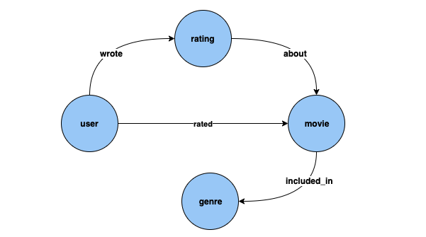

# Gremlin inference queries in Neptune ML

As described in [Neptune ML capabilities](machine-learning.md#machine-learning-capabilities "machine-learning.md#machine-learning-capabilities"), Neptune ML supports
training models that can do the following kinds of inference tasks:

- **Node classification**   –  
  Predicts the categorical feature of a vertex property.
- **Node regression**   –  
  Predicts a numerical property of a vertex.
- **Edge classification**   –  
  Predicts the categorical feature of an edge property.
- **Edge regression**   –  
  Predicts a numerical property of an edge.
- **Link prediction**   –  
  Predicts destination nodes given a source node and outgoing edge, or source
  nodes given a destination node and incoming edge.
  We can illustrate these different tasks with examples that use the [MovieLens 100k dataset](https://grouplens.org/datasets/movielens/100k/ "https://grouplens.org/datasets/movielens/100k/") provided
  by [GroupLens Research](https://grouplens.org/datasets/movielens/ "https://grouplens.org/datasets/movielens/").
  This dataset consists of movies, users, and ratings of the movies by the users,
  from which we've created a property graph like this:

**Node classification**: In the dataset above, `Genre`
is a vertex type which is connected to vertex type `Movie` by edge `included_in`.
However, if we tweak the dataset to make `Genre` a [categorical](https://en.wikipedia.org/wiki/Categorical_variable "https://en.wikipedia.org/wiki/Categorical_variable") feature
for vertex type `Movie`, then the problem of inferring `Genre`
for new movies added to our knowledge graph can be solved using node classification
models.

**Node regression**: If we consider the vertex type `Rating`,
which has properties like `timestamp` and `score`, then the problem of inferring
the numerical value `Score` for a `Rating` can be solved using node regression models.

**Edge classification**: Similarly, for a `Rated` edge, if we
have a property `Scale` that can have one of the values, `Love`, `Like`,
`Dislike`, `Neutral`, `Hate`, then the problem of inferring `Scale`
for the `Rated` edge for new movies/ratings can be solved using edge classification models.

**Edge regression**: Similarly, for the same `Rated` edge,
if we have a property `Score` that holds a numerical value for the rating, then this can be
inferred from edge regression models.

**Link prediction**: Problems like, find the top ten users who are most
likely to rate a given movie, or find the top ten Movies that a given user is most likely to rate, falls
under link prediction.

###### Note

For Neptune ML use-cases, we have a very rich set of notebooks designed to give you a
hands-on understanding of each use-case. You can create these notebooks along with your Neptune
cluster when you use the [Neptune ML AWS CloudFormation template](machine-learning-quick-start.md "machine-learning-quick-start.md")
to create a Neptune ML cluster. These notebooks are also available on [github](https://github.com/aws/graph-notebook/tree/main/src/graph_notebook/notebooks/04-Machine-Learning "https://github.com/aws/graph-notebook/tree/main/src/graph_notebook/notebooks/04-Machine-Learning")
as well.

###### Topics

- [Neptune ML predicates used in Gremlin inference queries](machine-learning-gremlin-inference-query-predicates.md "machine-learning-gremlin-inference-query-predicates.md")
- [Gremlin node classification queries in Neptune ML](machine-learning-gremlin-vertex-classification-queries.md "machine-learning-gremlin-vertex-classification-queries.md")
- [Gremlin node regression queries in Neptune ML](machine-learning-gremlin-vertex-regression-queries.md "machine-learning-gremlin-vertex-regression-queries.md")
- [Gremlin edge classification queries in Neptune ML](machine-learning-gremlin-edge-classification-queries.md "machine-learning-gremlin-edge-classification-queries.md")
- [Gremlin edge regression queries in Neptune ML](machine-learning-gremlin-edge-regression.md "machine-learning-gremlin-edge-regression.md")
- [Gremlin link prediction queries using link-prediction models in Neptune ML](machine-learning-gremlin-link-prediction-queries.md "machine-learning-gremlin-link-prediction-queries.md")
- [List of exceptions for Neptune ML Gremlin inference queries](machine-learning-gremlin-exceptions.md "machine-learning-gremlin-exceptions.md")
