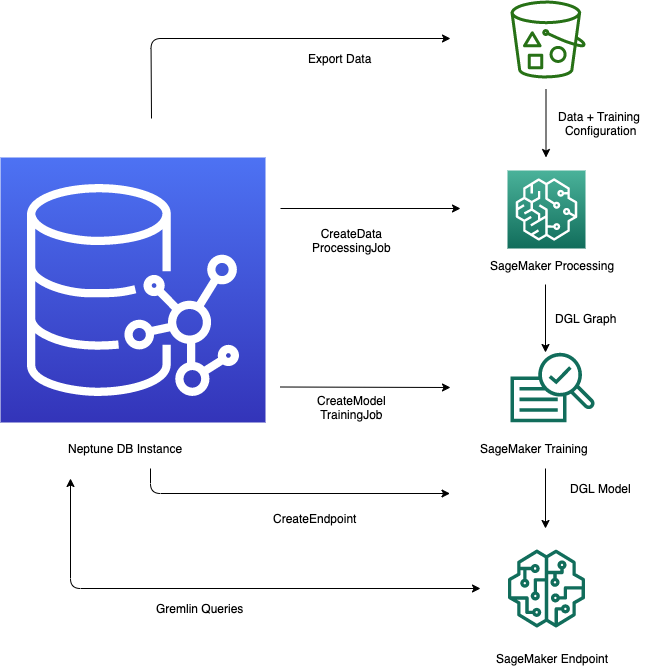

# Overview of how to use the Neptune ML feature

The Neptune ML feature in Amazon Neptune provides a streamlined workflow for leveraging machine learning models within a
graph database. The process involves several key steps - exporting data from Neptune into CSV format, preprocessing the
data to prepare it for model training, training the machine learning model using Amazon SageMaker AI, creating an inference endpoint
to serve predictions, and then querying the model directly from Gremlin queries. The Neptune workbench provides convenient
line and cell magic commands to help manage and automate these steps. By integrating machine learning capabilities directly
into the graph database, Neptune ML enables users to derive valuable insights and make predictions using the rich
relational data stored in the Neptune graph.

## Starting workflow for using Neptune ML

Using the Neptune ML feature in Amazon Neptune generally involves the
following five steps to begin with:

1. **Data export and configuration**   –  
   The data-export step uses the Neptune-Export service or the `neptune-export`
   command line tool to export data from Neptune into Amazon Simple Storage Service (Amazon S3) in CSV form.
   A configuration file named `training-data-configuration.json` is automatically
   generated at the same time, which specifies how the exported data can be loaded into a
   trainable graph.
2. **Data preprocessing**   –  
   In this step, the exported dataset is preprocessed using standard techniques to prepare it
   for model training. Feature normalization can be performed for numeric data, and
   text features can be encoded using `word2vec`. At the end of this step,
   a DGL (Deep Graph library) graph is generated from the exported dataset for the model
   training step to use.

This step is implemented using a SageMaker AI processing job in your account, and the
resulting data is stored in an Amazon S3 location that you have specified. 3. **Model training**   –  
The model training step trains the machine learning model that will be used for
predictions.

Model training is done in two stages:

    * The first stage uses a SageMaker AI processing job to generate a model training strategy
     configuration set that specifies what type of model and model hyperparameter ranges will
     be used for the model training.
    * The second stage then uses a SageMaker AI model tuning job to try different
     hyperparameter configurations and select the training job that produced the
     best-performing model. The tuning job runs a pre-specified number of model
     training job trials on the processed data. At the end of this stage, the trained
     model parameters of the best training job are used to generate model artifacts
     for inference.

4. **Create an inference endpoint in Amazon SageMaker AI**   –  
   The inference endpoint is a SageMaker AI endpoint instance that is launched with the model
   artifacts produced by the best training job. Each model is tied to a single endpoint. The
   endpoint is able to accept incoming requests from the graph database and return the model
   predictions for inputs in the requests. After you have created the endpoint, it stays active
   until you delete it.
5. **Query the machine learning model using Gremlin**   –  
   You can use extensions to the Gremlin query language to query predictions from the inference
   endpoint.

###### Note

The [Neptune workbench](graph-notebooks.md#graph-notebooks-workbench "graph-notebooks.md#graph-notebooks-workbench") contains a line magic
and a cell magic that can save you a lot of time managing these steps, namely:

- [%neptune_ml](notebooks-magics.md#notebooks-line-magics-neptune_ml "notebooks-magics.md#notebooks-line-magics-neptune_ml")
- [%%neptune_ml](notebooks-magics.md#notebooks-cell-magics-neptune_ml "notebooks-magics.md#notebooks-cell-magics-neptune_ml")
