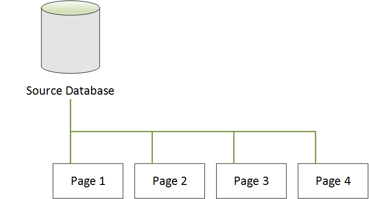
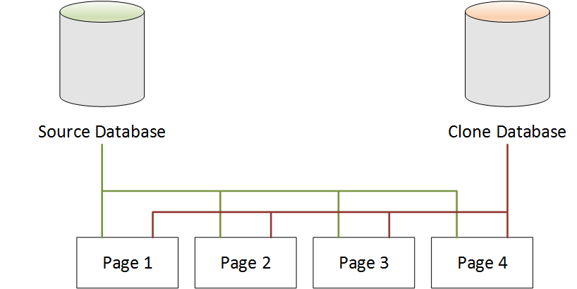
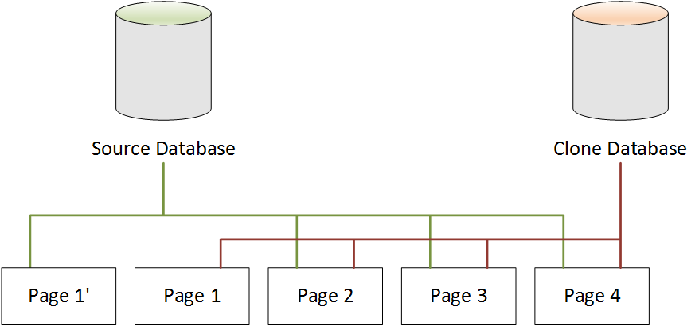
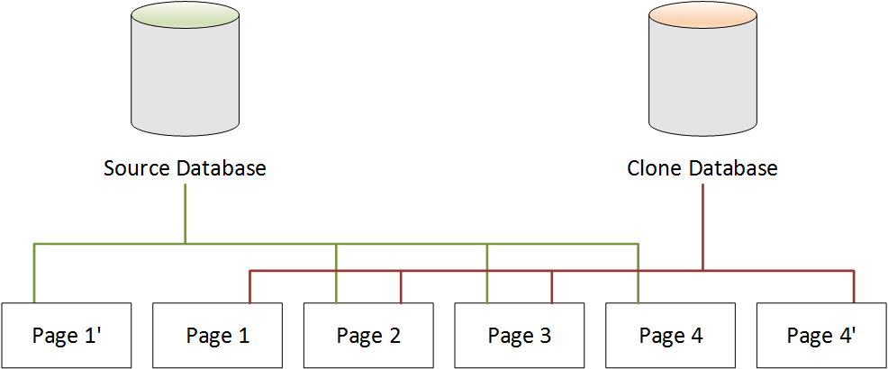

# Database Cloning in Neptune

Using DB cloning, you can quickly and cost-effectively create clones of all your databases
in Amazon Neptune. The clone databases require only minimal additional space when they are first
created. Database cloning uses a _copy-on-write protocol_. Data is copied at
the time that it changes, either on the source databases or the clone databases. You can make
multiple clones from the same DB cluster. You can also create additional clones from other
clones. For more information about how the copy-on-write protocol works in the context of
Neptune storage, see [Copy-on-Write Protocol](#manage-console-cloning-protocol "#manage-console-cloning-protocol").

You can use DB cloning in a variety of use cases, especially where you don't
want to have an impact on your production environment, such as the following:

- Experiment with and assess the impact of changes, such as schema changes or parameter group
  changes.
- Perform workload-intensive operations, such as exporting data or running analytical
  queries.
- Create a copy of a production DB cluster in a non-production environment for development or
  testing.

###### To create a clone of a DB cluster using the AWS Management Console

1. Sign in to the AWS Management Console, and open the Amazon Neptune console at [https://console.aws.amazon.com/neptune/home](https://console.aws.amazon.com/neptune/home "https://console.aws.amazon.com/neptune/home").
2. In the navigation pane, choose **Instances**. Choose the
   primary instance for the DB cluster that you want to create a clone of.
3. Choose **Instance actions**, and then choose
   **Create clone**.
4. On the **Create Clone** page, enter a name for the primary instance of
   the clone DB cluster as the **DB instance identifier**.

If you want to, configure any other settings for the clone DB cluster. For information
about the different DB cluster settings, see [Launch using the console](manage-console-launch-console.md "manage-console-launch-console.md"). 5. Choose **Create Clone** to launch the clone DB cluster.

###### To create a clone of a DB cluster using the AWS CLI

- Call the Neptune
  [restore-db-cluster-to-point-in-time](api-snapshots.md#RestoreDBClusterToPointInTime "api-snapshots.md#RestoreDBClusterToPointInTime")
  AWS CLI command and supply the following values:
  - `--source-db-cluster-identifier`   –  
    The name of the source DB cluster to create a clone of.
  - `--db-cluster-identifier`   –  
    The name of the clone DB cluster.
  - `--restore-type copy-on-write`   –  
    The `copy-on-write` value indicates that a clone DB cluster should be created.
  - `--use-latest-restorable-time`   –  
    This specifies that the latest restorable backup time should be used.

###### Note

The [restore-db-cluster-to-point-in-time](api-snapshots.md#RestoreDBClusterToPointInTime "api-snapshots.md#RestoreDBClusterToPointInTime")
AWS CLI command only clones the DB cluster, not the DB instances for that DB cluster.

The following Linux/UNIX example creates a clone from the `source-db-cluster-id`
DB cluster and names the clone `db-clone-cluster-id`.

```
aws neptune restore-db-cluster-to-point-in-time \
  --region us-east-1 \
  --source-db-cluster-identifier source-db-cluster-id \
  --db-cluster-identifier db-clone-cluster-id \
  --restore-type copy-on-write \
  --use-latest-restorable-time
```

The same example works on Windows if the `\` line-end escape character is
replaced by the Windows `^` equivalent:

```
aws neptune restore-db-cluster-to-point-in-time ^
  --region us-east-1 ^
  --source-db-cluster-identifier source-db-cluster-id ^
  --db-cluster-identifier db-clone-cluster-id ^
  --restore-type copy-on-write ^
  --use-latest-restorable-time
```

## Limitations

DB cloning in Neptune has the following limitations:

- You can't create clone databases across AWS Regions. The clone databases
  must be created in the same Region as the source databases.
- A cloned database always uses the most recent patch of the Neptune
  engine version being used by the database it was cloned from. This is true even
  if the source database has not yet been upgraded to that patch version. The engine
  version itself does not change, however.
- Currently, you are limited to no more than 15 clones per copy
  of your Neptune DB cluster, including clones based on other clones. After reaching
  that limit, you must make another copy of your database rather than cloning it.
  However, if you make a new copy, it can also have up to 15 clones.
- Cross-account DB cloning is not currently supported.
- You can provide a different virtual private cloud (VPC) for your clone.
  However, the subnets in those VPCs must map to the same set of Availability
  Zones.

## Copy-on-Write Protocol for DB Cloning

The following scenarios illustrate how the copy-on-write protocol works.

- [Neptune Database Before Cloning](#manage-console-cloning-protocol-before "#manage-console-cloning-protocol-before")
- [Neptune Database After Cloning](#manage-console-cloning-protocol-after "#manage-console-cloning-protocol-after")
- [When a Change Is Made to the Source Database](#manage-console-cloning-protocol-source-write "#manage-console-cloning-protocol-source-write")
- [When a Change Is Made to the Clone Database](#manage-console-cloning-protocol-clone-write "#manage-console-cloning-protocol-clone-write")

### Neptune Database Before Cloning

Data in a source database is stored in pages. In the following diagram, the source
database has four pages.



### Neptune Database After Cloning

As shown in the following diagram, there are no changes in the source database after DB
cloning. Both the source database and the clone database point to the same four pages. No
pages have been physically copied, so no additional storage is required.



### When a Change Is Made to the Source Database

In the following example, the source database makes a change to the data in `Page
 1`. Instead of writing to the original `Page 1`, it uses additional
storage to create a new page, called `Page 1'`. The source database now points to
the new `Page 1'`, and also to `Page 2`, `Page 3`, and
`Page 4`. The clone database continues to point to `Page 1` through
`Page 4`.



### When a Change Is Made to the Clone Database

In the following diagram, the clone database has also changed, this time
in `Page 4`. Instead of writing to the original `Page 4`,
additional storage is used to create a new page, called `Page 4'`.
The source database continues to point to `Page 1'`, and also
`Page 2` through `Page 4`, but the clone database now points to
`Page 1` through `Page 3`, and also `Page 4'`.



As shown in the second scenario, after DB cloning, there is no additional storage
required at the point of clone creation. However, as changes occur in the source database
and clone database, only the changed pages are created, as shown in the third and fourth
scenarios. As more changes occur over time in both the source database and clone database,
you need incrementally more storage to capture and store the changes.

## Deleting a Source Database

Deleting a source database does not affect the clone databases that are associated with
it. The clone databases continue to point to the pages that were previously owned by the
source database.
