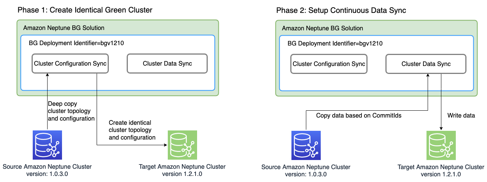

# Using the Neptune Blue/Green solution to perform blue-green updates

Amazon Neptune engine upgrades can require application downtime because the
database is unavailable while the updates are being installed and verified.
This is true whether they are initiated manually or automatically.

Neptune provides a Blue/Green deployment solution that you can run using
an AWS CloudFormation stack and that greatly reduces such downtime. It creates a green staging
environment that is synchronized with your blue production environment. You can
then update that staging environment to perform a minor or major engine version upgrade,
a graph data model change, or an operating-system update, and test the result.
Finally, you can switch it over quickly to become your production environment, with very
little downtime.

The Neptune Blue/Green solution goes through two phases, as illustrated in
this diagram:

**Phase 1 creates a Green DB cluster identical to your production cluster**

The solution creates a DB cluster with a unique blue/green deployment
identifier and with the same cluster topology as your production cluster. That
is, it has the same number and sizes of DB instances, the same parameter groups
and all the same configurations as the production (blue) DB cluster except that
it has been upgraded to the target engine version that you specified, which must
be higher than your current (blue) engine version. You can specify a minor and
major engine version for the target. If necessary, the solution will perform any
intermediate upgrades required to reach the specified target engine version.
This new cluster becomes the green staging environment.

**Phase 2 sets up continuous data synchronization**

After the green environment has been fully prepared, the solution sets up continuous
replication between the source (blue) cluster and the target (green) cluster using
Neptune streams. When the replication difference between them reaches zero, the
staging environment is ready for testing. At that point you must pause writing to
the blue cluster to avoid any further replication lag.

Your target engine version may have new features or dependencies that affect
your applications. Check the target engine release page and intervening engine
release pages under [Engine releases](engine-releases.md "engine-releases.md") to see
what has changed since your current engine version. It's best to run integration
tests or verify your applications manually on the green cluster before promoting
it to the production environment.

After you have tested and qualified the changes in the green cluster, just switch
the database endpoint in your applications from the blue to the green cluster.

After switchover, the Neptune Blue/Green solution does not delete the old blue
production environment. You will still have access to it for additional validation
and testing if needed. Standard billing charges do apply to its instances until you
delete them. The Blue/Green solution also uses other AWS services, the costs for
which are billed at normal prices. Details on deleting the solution when you're done
with it are covered in the [clean up section](neptune-BG-cleanup.md "neptune-BG-cleanup.md").

## Prerequisites for running the Neptune Blue/Green stack

Before launching the Neptune Blue/Green stack:

- Be sure to [enable Neptune streams](streams-using.md "streams-using.md")
  on your production (blue) cluster.
- All the instances in your blue cluster must be in the **available** state. You can check instance states in the
  [Neptune console](https://console.aws.amazon.com/neptune "https://console.aws.amazon.com/neptune") or by using the [describe-db-instances](../../../cli/latest/reference/neptune/describe-db-instances.md "../../../cli/latest/reference/neptune/describe-db-instances.md")
  API.
- All instances must also be in sync with the [DB cluster parameter group](parameter-groups.md "parameter-groups.md").
- The Neptune Blue/Green solution requires a DynamoDB VPC
  endpoint in the VPC where your blue cluster is located. See [Using
  Amazon VPC endpoints to access DynamoDB](../../../amazondynamodb/latest/developerguide/vpc-endpoints-dynamodb.md "../../../amazondynamodb/latest/developerguide/vpc-endpoints-dynamodb.md").
- Choose at time to run the solution when the write workload on
  your blue production DB cluster will be as light as possible. Avoid, for example,
  running the solution when a bulk load will be taking place, or when there's
  likely to be a large number of write operations for any other reason.
