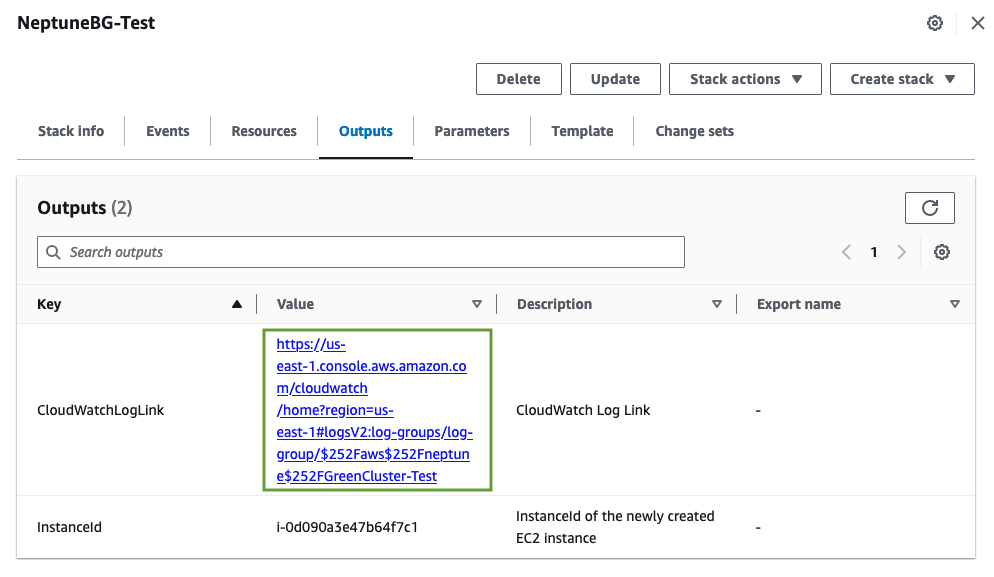
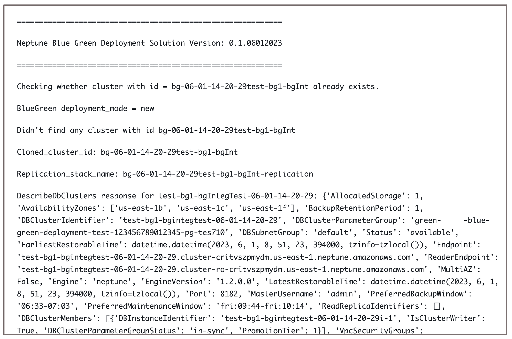
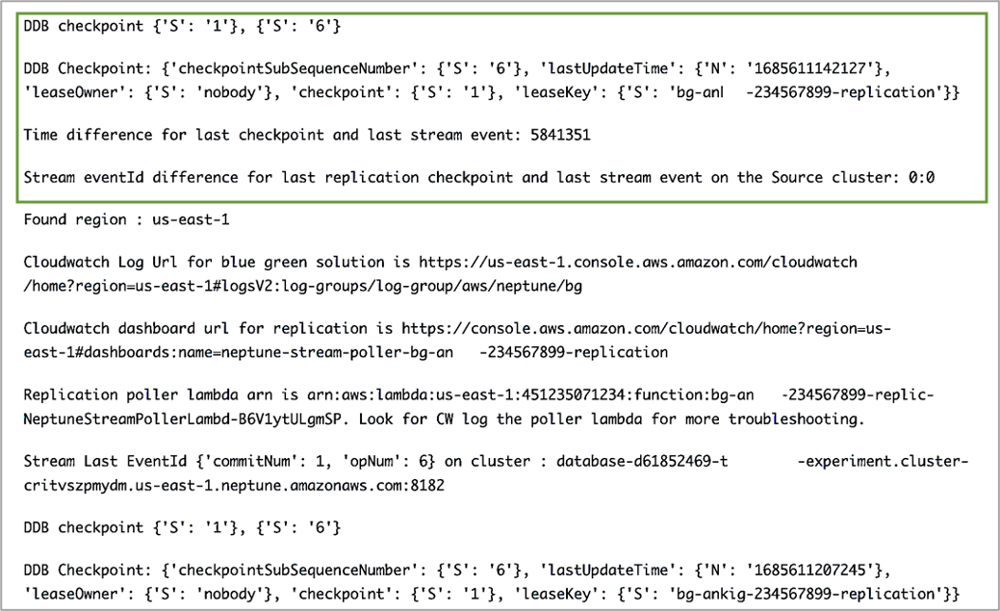

# Monitoring the progress of a Neptune Blue/Green deployment

You can monitor the progress of the Neptune Blue/Green solution by going to the [CloudWatch console](https://console.aws.amazon.com/cloudwatch/ "https://console.aws.amazon.com/cloudwatch/") and looking at logs in the
`/aws/neptune/`(Neptune Blue/Green deployment ID)``
CloudWatch log group. You can find a link to the CloudWatch logs in the outputs of the solution's
CloudFormation stack:

If you provided a public subnet as a stack parameter, you can also SSH to your
Amazon EC2 instance created as part of the stack and refer to the log in
`/var/log/cloud-init-output.log`.

The log shows the actions taken by the Neptune Blue/Green solution, as
shown in this screenshot:

Log messages show the sync status between the blue and green clusters:

The sync process checks the replication lag by computing the difference
between the latest stream `eventID` on the blue cluster and
the replication checkpoint present in the DynamoDB checkpoint table created
by the Neptune-to-Neptune replication stack. Using these messages, you can
monitor the current replication difference.
