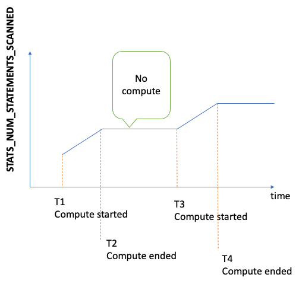

# Managing statistics for the Neptune DFE to use

###### Note

Support for openCypher depends on the DFE query engine in Neptune.

The DFE engine was first available in lab mode in [Neptune
engine release 1.0.3.0](engine-releases-1.0.3.md "engine-releases-1.0.3.md"), and starting in [Neptune
engine release 1.0.5.0](engine-releases-1.0.5.md "engine-releases-1.0.5.md"), it became enabled by default, but only for use with
query hints and for openCypher support.

Beginning with [Neptune engine release 1.1.1.0](engine-releases-1.1.1.md "engine-releases-1.1.1.md")
the DFE engine is no longer in lab mode, and is now controlled using
the [neptune_dfe_query_engine](parameters.md#parameters-instance-parameters-neptune_dfe_query_engine "parameters.md#parameters-instance-parameters-neptune_dfe_query_engine")
instance parameter in an instance's DB parameter group.

The DFE engine uses information about the data in your Neptune graph
to make effective trade-offs when planning query execution. This information takes the
form of statistics that include so-called characteristic sets and predicate statistics
that can guide query planning.

Starting with [engine release 1.2.1.0](engine-releases-1.2.1.md "engine-releases-1.2.1.md"),
you can retrieve [summary information](neptune-graph-summary.md "neptune-graph-summary.md") about your graph from these statistics
using the [GetGraphSummary](iam-dp-actions.md#getgraphsummary "iam-dp-actions.md#getgraphsummary") API or the
`summary` endpoint.

These DFE statistics are currently re-generated whenever either more than 10% of data in
your graph has changed or when the latest statistics are more than 10 days old. However,
these triggers may change in the future.

###### Note

Statistics generation is disabled on `T3` and `T4g`
instances because it can exceed the memory capacity of those instance types.

You can manage the generation of DFE statistics through one of the following
endpoints:

- `https://`your-neptune-host`:`port`/rdf/statistics`     (for SPARQL).
- `https://`your-neptune-host`:`port`/propertygraph/statistics`    (for Gremlin and openCypher),
  and its alternate version: `https://`your-neptune-host`:`port`/pg/statistics`.

###### Note

As of [engine release 1.1.1.0](engine-releases-1.1.1.md "engine-releases-1.1.1.md"),
the Gremlin statistics endpoint (`https://`your-neptune-host`:`port`/gremlin/statistics`)
is being deprecated in favor of the `propertygraph` or `pg` endpoint.
It is still supported for backward compatibility but may be
removed in future releases.

As of [engine release 1.2.1.0](engine-releases-1.2.1.md "engine-releases-1.2.1.md"),
the SPARQL statistics endpoint (`https://`your-neptune-host`:`port`/sparql/statistics`)
is being deprecated in favor of the `rdf` endpoint. It is still supported
for backward compatibility but may be
removed in future releases.

In the examples below, `$STATISTICS_ENDPOINT` stands for any of these
endpoint URLs.

###### Note

If a DFE statistics endpoint is on a reader instance, the only requests that it
can process are [status requests](#neptune-dfe-statistics-status "#neptune-dfe-statistics-status").
Other requests will fail with a `ReadOnlyViolationException`.

## Size limits for DFE statistic generation

Currently, DFE statistics generation halts if either of the following size
limits is reached:

- The number of characteristic sets generated may not exceed 50,000.
- The number of predicate statistics generated may not exceed one million.

These limits may change.

## Current status of DFE statistics

You can check the current status of DFE statistics using the following
`curl` request:

```
curl -G "$STATISTICS_ENDPOINT"
```

The response to a status request contains the following fields:

- `status`  –   the HTTP return code of
  the request. If the request succeeded, the code is `200`. See [Common errors](#neptune-dfe-statistics-errors "#neptune-dfe-statistics-errors")
  for a list of common errors.
- `payload`:
  - `autoCompute`  –   (Boolean) Indicates
    whether or not automatic statistics generation is enabled.
  - `active`  –   (Boolean) Indicates
    whether or not DFE statistics generation is enabled at all.
  - `statisticsId`   –   Reports the ID
    of the current statistics generation run. A value of `-1` indicates
    that no statistics have been generated.
  - `date`  –   The UTC time at which DFE
    statistics have most recently been generated, in ISO 8601 format.

  ###### Note

  Prior to [engine release
  1.2.1.0](engine-releases-1.2.1.md "engine-releases-1.2.1.md"), this was represented with minute precision, but from engine
  release 1.2.1.0 forward, it is represented with millisecond precision
  (for example, `2023-01-24T00:47:43.319Z`).
  - `note`  –   A note about
    problems in the case where statistics are invalid.
  - `signatureInfo`  –   Contains information about
    the characteristic sets generated in the statistics (prior to [engine release 1.2.1.0](engine-releases-1.2.1.md "engine-releases-1.2.1.md"), this field
    was named `summary`). These are generally not directly actionable:
    - `signatureCount`  –   The total
      number of signatures across all characteristic sets.
    - `instanceCount`  –   The total
      number of characteristic-set instances.
    - `predicateCount`  –   The total
      number of unique predicates.

The response to a status request when no statistics have been generated looks
like this:

```

{
  "status" : "200 OK",
  "payload" : {
    "autoCompute" : true,
    "active" : false,
    "statisticsId" : -1
   }
}
```

If DFE statistics are available, the response looks like this:

```
{
  "status" : "200 OK",
  "payload" : {
    "autoCompute" : true,
    "active" : true,
    "statisticsId" : 1588893232718,
    "date" : "2020-05-07T23:13Z",
    "summary" : {
      "signatureCount" : 5,
      "instanceCount" : 1000,
      "predicateCount" : 20
    }
  }
}
```

If the generation of DFE statistics failed, for example because it exceeded the
[statistics size limitation](#neptune-dfe-statistics-limits "#neptune-dfe-statistics-limits"), the
response looks like this:

```
{
  "status" : "200 OK",
  "payload" : {
    "autoCompute" : true,
    "active" : false,
    "statisticsId" : 1588713528304,
    "date" : "2020-05-05T21:18Z",
    "note" : "Limit reached: Statistics are not available"
  }
}
```

## Disabling automatic generation of DFE statistics

By default, auto-generation of DFE statistics is enabled when you enable DFE.

You can disable auto-generation as follows:

```
curl -X POST "$STATISTICS_ENDPOINT" -d '{ "mode" : "disableAutoCompute" }'
```

If the request is successful, the HTTP response code is `200` and the response is:

```
{
  "status" : "200 OK"
}
```

You can confirm that automatic generation is disabled by issuing a [status request](#neptune-dfe-statistics-status "#neptune-dfe-statistics-status") and checking that
the `autoCompute` field in the response is set to `false`.

Disabling auto-generation of statistics does not terminate a statistics compution that
is in progress.

If you make a request to disable auto-generation to a reader instance rather than the writer
instance of your DB cluster, the request fails with an HTTP return code of 400 and output
like the following:

```
{
  "detailedMessage" : "Writes are not permitted on a read replica instance",
  "code" : "ReadOnlyViolationException",
  "requestId":"8eb8d3e5-0996-4a1b-616a-74e0ec32d5f7"
}
```

See [Common errors](#neptune-dfe-statistics-errors "#neptune-dfe-statistics-errors")
for a list of other common errors.

## Re-enabling automatic generation of DFE statistics

By default, auto-generation of DFE statistics is already enabled when you enable DFE.
If you disable auto-generation, you can re-enable it later as follows:

```
curl -X POST "$STATISTICS_ENDPOINT" -d '{ "mode" : "enableAutoCompute" }'
```

If the request is successful, the HTTP response code is `200` and the response is:

```
{
  "status" : "200 OK"
}
```

You can confirm that automatic generation is enabled by issuing a [status request](#neptune-dfe-statistics-status "#neptune-dfe-statistics-status") and checking that
the `autoCompute` field in the response is set to `true`.

## Manually triggering the generation of DFE statistics

You can initiate DFE statistics generation manually as follows:

```
curl -X POST "$STATISTICS_ENDPOINT" -d '{ "mode" : "refresh" }'
```

If the request succeeds, the output is as follows, with an HTTP return code of 200:

```
{
  "status" : "200 OK",
  "payload" : {
    "statisticsId" : 1588893232718
  }
}
```

The `statisticsId` in the output is the ID of the statistics generation run
that is currently occurring. If a run was already in process at the time of the request,
the request returns the ID of that run rather than initiating a new one. Only one statistics
generation run can occur at a time.

If a fail-over happens while DFE statistics are being generated, the new writer
node will pick up the last processed checkpoint and resume the statistics run from there.

## Using the `StatsNumStatementsScanned` CloudWatch metric to monitor statistics computation

The `StatsNumStatementsScanned` CloudWatch metric returns the total number
of statements scanned for statistics computation since the server started. It
is updated at each statistics computation slice.

Every time statistics computation is triggered, this number increases, and when
no computation is happening, it remains constant. Looking at a plot of
`StatsNumStatementsScanned` values over time therefore gives you a
pretty clear picture of when statistics computation was happening and how fast:



When computation is happening, the slope of the graph shows you how fast (the
steeper the slope, the faster statistics are being computed).

If the graph is simply a flat line at 0, the statistics feature has been enabled,
but no statistics have been computed at all. If the statistics feature has been
disabled, or if you're using an engine version that does not support statistics
computation, the `StatsNumStatementsScanned` does not exist.

As mentioned earlier, you can disable statistics computation using the
statistics API, but leaving it off can result in statistics not being up to date,
which in turn can result in poor query plan generation for the DFE engine.

See [Monitoring Neptune Using Amazon CloudWatch](cloudwatch.md "cloudwatch.md") for information
about how to use CloudWatch.

## Using AWS Identity and Access Management (IAM) authentication with DFE statistics endpoints

You can access DFE statistics endpoints securely with IAM authentication by using
[awscurl](https://github.com/okigan/awscurl "https://github.com/okigan/awscurl") or any other tool
that works with HTTPS and IAM. See [Using awscurl with temporary
credentials to securely connect to a DB cluster with IAM authentication enabled](iam-auth-connect-command-line.md#iam-auth-connect-awscurl "iam-auth-connect-command-line.md#iam-auth-connect-awscurl") to see how to set up the proper
credentials. Once you have done that, you can then make a status request like this:

```
awscurl "$STATISTICS_ENDPOINT" \
    --region `(your region)` \
    --service neptune-db
```

Or, for example, you can create a JSON file named `request.json` that contains:

```
{ "mode" : "refresh" }
```

You can then manually initiate statistics generation like this:

```
awscurl "$STATISTICS_ENDPOINT" \
    --region `(your region)` \
    --service neptune-db \
    -X POST -d @request.json
```

## Deleting DFE statistics

You can delete all statistics in the database by making an HTTP DELETE request to
the statistics endpoint:

```
curl -X "DELETE" "$STATISTICS_ENDPOINT"
```

Valid HTTP return codes are:

- `200`   –   the delete was successful.

In this case, a typical response would look like:

```
{
  "status" : "200 OK",
  "payload" : {
      "active" : false,
      "statisticsId" : -1
  }
}
```

- `204`   –   there were no statistics to delete.

In this case, the response is blank (no response).

If you send a delete request to a statistics endpoint on a reader node, a
`ReadOnlyViolationException` is thrown.

## Common error codes for DFE statistics request

The following is a list of common errors that can occur when you make a request
to a statistics endpoint:

- `AccessDeniedException`   –  
  _Return code:_ `400`.
  _Message:_ `Missing Authentication Token`.
- `BadRequestException` (for Gremlin and openCypher)   –  
  _Return code:_ `400`.
  _Message:_ `Bad route: /pg/statistics`.
- `BadRequestException` (for RDF data)   –  
  _Return code:_ `400`.
  _Message:_ `Bad route: /rdf/statistics`.
- `InvalidParameterException`   –  
  _Return code:_ `400`.
  _Message:_ `Statistics command parameter 'mode' has
unsupported value '`the invalid value`'`.
- `MissingParameterException`   –  
  _Return code:_ `400`.
  _Message:_ `Content-type header not specified.`.
- `ReadOnlyViolationException`   –  
  _Return code:_ `400`.
  _Message:_ `Writes are not permitted on a read replica instance`.

For example, if you make a request when the DFE and statistics are not enabled,
you would get a response like the following:

```
{
  "code" : "BadRequestException",
  "requestId" : "b2b8f8ee-18f1-e164-49ea-836381a3e174",
  "detailedMessage" : "Bad route: /sparql/statistics"
}
```
