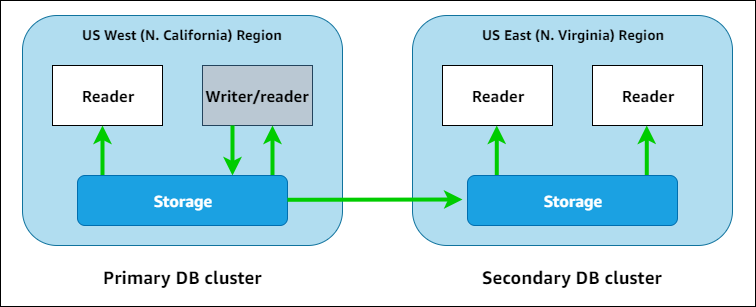

# Using Amazon Neptune with a global database

An Amazon Neptune global database spans multiple AWS Regions, enabling low-latency
global reads and providing fast recovery in the rare case where an outage affects an
entire AWS Region.

A Neptune global database consists of a primary DB cluster in
one region, and up to five secondary DB clusters in different regions.

Writes can only occur in the primary region. Secondary regions only support
reads. Each secondary region can have up to 16 reader instances.

## Global databases in Amazon Neptune

Using a Neptune global database, you can run your globally distributed applications
on a single database that spans multiple AWS Regions.

A Neptune global database consists of one DB cluster in a primary AWS Region
where data is written, and up to five read-only DB clusters in secondary AWS Regions.
When you perform a write operation on the primary DB cluster, Neptune replicates the
written data to all the secondary DB clusters using dedicated infrastructure, with
latency typically under a second.

The following diagram shows an example global database that spans two AWS Regions:

You can scale each secondary cluster independently to handle read-only workloads
by adding one or more read-replica instances.

To perform a write operations, you must connect to the DB cluster endpoint of the
primary DB cluster. Only the primary cluster can perform write operations. Then, as
shown in the diagram above, replication is performed by the
[cluster storage volume](feature-overview-storage.md "feature-overview-storage.md"), not the database engine.

Neptune global databases are designed for applications with a worldwide footprint.
The read-only secondary DB clusters support read operations closer to application users.

A Neptune global database supports two different approaches to failover:

- To recover from an outage in the primary region, use the [manual unplanned detach-and-promote](neptune-gdb-disaster-recovery.md#neptune-gdb-detach-and-promote "neptune-gdb-disaster-recovery.md#neptune-gdb-detach-and-promote")
  process, where you detach one the secondary clusters, turning it into a standalone
  cluster, and then promote it to be the new primary cluster.
- For planned operational procedures such as maintenance, use [managed planned failover](neptune-gdb-disaster-recovery.md#neptune-gdb-managed-failover "neptune-gdb-disaster-recovery.md#neptune-gdb-managed-failover"), where you
  relocate the primary cluster to one of its secondary regions with no data loss.

## Advantages of using global databases in Amazon Neptune

Using a global database, has the following advantages:

- **Global reads with local latency**   —  
  If you have offices around the world, a global database lets your offices in secondary regions
  access data in their own region with local latency.
- **Scalable secondary Neptune DB clusters**   —  
  You can scale secondary clusters by adding read-replica DB instances. Because secondary
  clusters are read-only, they can each support up to 16 read-replicas rather than the
  usual limit of 15.
- **Fast replication to secondary DB clusters**   —  
  Replication from primary to secondary DB clusters is fast, with latency typically under a second,
  with little performance impact on the primary DB cluster. Because the replication is performed at
  the storage level, DB instance resources are fully available for application read and write
  workloads.
- **Recovery from region-wide outages**   —  
  The secondary DB clusters allow you to move the primary cluster to a new region more quickly,
  with lower RTO and less data loss (lower RPO) than traditional replication solutions.

## Limitations of global databases in Amazon Neptune

The following limitations currently apply to global databases:

- Neptune global databases are only available in the following
  AWS Regions:
  - US East (N. Virginia):   `us-east-1`
  - US East (Ohio):   `us-east-2`
  - US West (N. California):   `us-west-1`
  - US West (Oregon):   `us-west-2`
  - Canada West (Calgary):   `ca-west-1`
  - Europe (Spain):   `eu-south-2`
  - Europe (Ireland):   `eu-west-1`
  - Europe (London):   `eu-west-2`
  - Europe (Frankfurt):   `eu-central-1`
  - Europe (Zurich):   `eu-central-2`
  - Asia Pacific (Tokyo):   `ap-northeast-1`
  - Asia Pacific (Osaka):   `ap-northeast-3`
  - Asia Pacific (Singapore):   `ap-southeast-1`
  - Asia Pacific (Jakarta):   `ap-southeast-3`
  - Asia Pacific (Melbourne):   `ap-southeast-4`
  - Asia Pacific (Malaysia):   `ap-southeast-5`
  - Israel (Tel Aviv):   `il-central-1`

- Neptune global databases doesn't support `db.t3.medium` or `db.t4g.medium` instance types.
- Neptune global databases don't support auto-scaling for secondary
  DB clusters.
- You can't apply a custom parameter group to the global database
  cluster while you're performing a major version upgrade of that global database.
  Instead, create your custom parameter groups in each region of the global cluster
  and then apply them manually to the regional clusters after the upgrade.
- You can't stop or start the DB clusters in a global database individually.
- Read-replica instances in a secondary DB cluster can restart under certain
  circumstances, including planned upgrades during your maintenance window. If the primary cluster's writer
  instance restarts or fails over, all the instances in secondary regions also restart. The secondary
  cluster is then unavailable until all its instances are back in sync with the primary DB cluster's writer
  instance.
