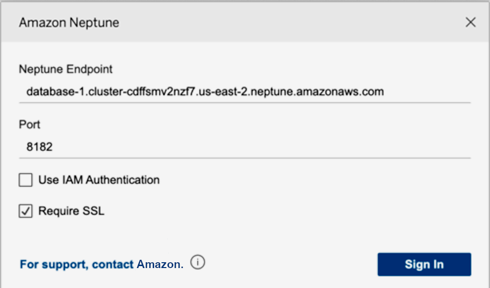

# Using Tableau with the Neptune JDBC driver

To use Tableau with the Neptune JDBC driver, start by downloading and installing
the most recent version of [Tableau
Desktop](https://www.tableau.com/products/desktop "https://www.tableau.com/products/desktop"). Download the JAR file for the Neptune JDBC driver, and also the Neptune
Tableau connector file (a `.taco` file).

###### To connect to Tableau for Neptune on a Mac

1. Place the Neptune JDBC driver JAR file in the
   `/Users/`(your user name)`/Library/Tableau/Drivers`
   folder.
2. Place the Neptune Tableau connector `.taco` file in the
   `/Users/`(your user name)`/Documents/My Tableau Repository/Connectors`
   folder.
3. If you have IAM authentication enabled, set up the environment for it.
   Note that environment variables set in `.zprofile/`, `.zshenv/`,
   `.bash_profile`, and so forth, will not work. The environment variables
   must be set so that they can be loaded by a GUI application.

One way to set your credentials is by placing your access key and secret key in the
`/Users/`(your user name)`/.aws/credentials`
file.

An easy way to set the service region is to open a terminal and enter the following
command, using your application's region (for example, `us-east-1`):

```
launchctl setenv SERVICE_REGION `region name`
```

There are other ways to set environment variables that persist after a restart,
but whatever technique you use must set variables that are accessible to a GUI
application. 4. To get environment variables to load into a GUI on the Mac, enter this command
on a terminal:

```
/Applications/Tableau/Desktop/2021.1.app/Contents/MacOS/Tableau
```

###### To connect to Tableau for Neptune on a Windows machine

1. Place the Neptune JDBC driver JAR file in the
   `C:\Program Files\Tableau\Drivers` folder.
2. Place the Neptune Tableau connector `.taco` file in the
   `C:\Users\`(your user name)`\Documents\My Tableau Repository\Connectors`
   folder.
3. If you have IAM authentication enabled, set up the environment for it.

This can be as simple as setting user `ACCESS_KEY`, `SECRET_KEY`,
and `SERVICE_REGION` environment variables.
With Tableau open, select **More** on the left side of the window.
If the Tableau connector file is properly located, you can select **Amazon Neptune
by AWS** in the list that appears:


You should not have to edit the port, or add any connection options. Enter
your Neptune endpoint and set your IAM and SSL configuration (you must enable
SSL if you are using IAM).

When you select **Sign In**, it may take more than 30 seconds
to connect if your graph is large. Tableau is collecting vertex and edge tables and
join vertices on edges, as well as creating visualizations.
