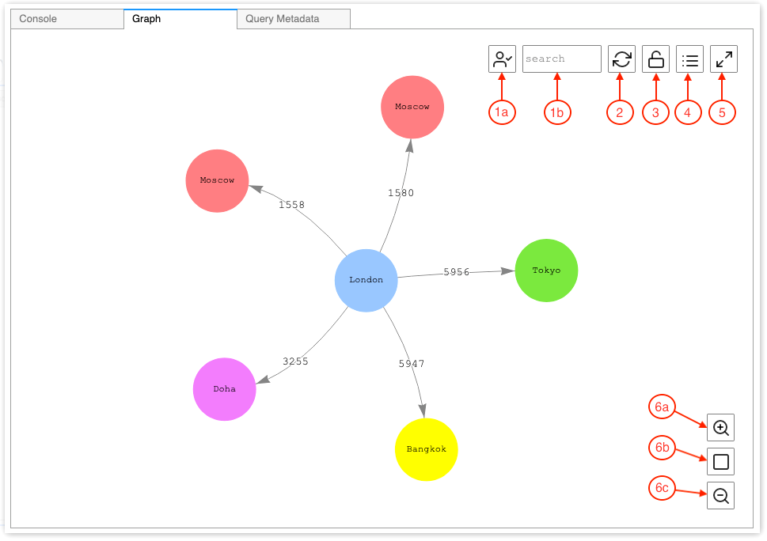
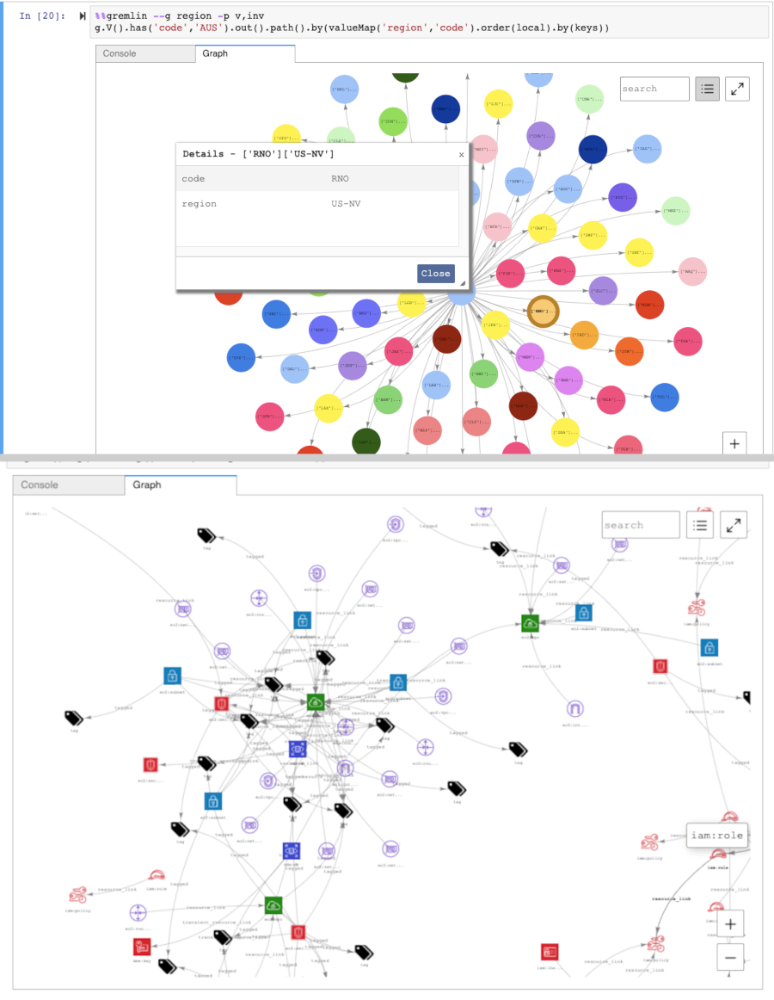

# Visualizing graph data in Amazon Neptune notebooks

In many cases the Neptune workbench can create a visual diagram of your query
results as well as returning them in tabular form. The graph visualization is available
in the **Graph** tab in the query results whenever visualization is
possible.

In addition to the built-in visualization capabilities described here, you can also
use [more advanced visualization tools](visualization-tools.md "visualization-tools.md")
with Neptune graph-notebooks.

###### Note

To get access to recently added functionality and fixes in notebooks that
you are already using, first stop and then re-start your notebook instance.

## Exploring the Graph Tab interface in Amazon Neptune

This diagram identifies user-interface elements present in the Graph tab:



1. **Graph search**
   1. **UUID toggle**:  
      Toggles inclusion of ID property values in the graph search. By default,
      ID inclusion is enabled. If disabled, matches on ID properties, including
      edge properties referencing node IDs, do not result in element
      highlighting.
   2. **Search text field**:  
      Highlights all vertex and edge property values that contain the
      text string that you specify here.

2. **Graph reset**   –    
   Re-runs the graph physics simulation, and sets zoom to fit the graph in the
   window.
3. **Toggle graph physics**   –    
   Toggles running of the graph physics simulation. Physics are enabled by default,
   letting the graph change dynamically. If disabled, vertices stay locked in position
   when other vertices are moved.
4. **Details view**   –    
   When a node or edge is selected, this displays a list of the element’s property keys
   and values, if available in the query results.
5. **Fullscreen view**   –    
   Expands the graph tab window to fit the screen. Clicking again minimizes the graph tab.
6. **Zoom options**
   1. **Zoom in**
   2. **Zoom reset**:  
      Sets the zoom to fit all vertices innto the graph tab window.
   3. **Zoom out**

## Visualizing Gremlin query results

Neptune workbench creates a visualization of the query results for any
Gremlin query that returns a `path`. To see the visualization, select
the **Graph** tab to the right of the **Console**
tab under the query after you run it.

You can use query visualization hints to control how the visualizer diagrams
query output. These hints follow the `%%gremlin` cell magic and are
preceded by the `--path-pattern` (or its short form, `-p`)
parameter name:

```
%%gremlin -p `comma-separated hints`
```

You can also use the `--group-by` (or `-g`) flag to specify a
property of the vertices to group them by. This allows specifying a color or icon for
different groups of vertices.

The names of the hints reflect the Gremlin steps commonly used when traversing
between vertices, and they behave accordingly. Multiple hints can be used in combination,
separated by commas, without any spaces between them. The hints used should match
the corresponding Gremlin steps in the query being visualized. Here is an example:

```
%%gremlin -p v,oute,inv
g.V().hasLabel('airport').outE().inV().path().by('code').by('dist').limit(5)
```

Available visualization hints are as follows:

```
v
inv
outv
e
ine
oute
```

Here are some examples of graph visualizations using groups:



## Visualizing SPARQL query results

Neptune workbench creates a visualization of the query results for any
SPARQL query that takes either one of these forms:

- `SELECT ?subject ?predicate ?object`
- `SELECT ?s ?p ?o`

To see the visualization, select the **Graph** tab to the right
of the **Table** tab under the query after you run it.

By default, a SPARQL visualization only includes triple patterns where the
`o?` is a `uri` or a `bnode` (blank node).
All other `?o` binding types such as literal strings or integers
are treated as properties of the `?s` node that can be viewed using
the **Details** pane in the **Graph** tab.

In many cases, however, you may want to include such literal values as vertices
in the visualization. To do that, use the `--expand-all` query hint after the
`%%sparql` cell magic:

```
%%sparql --expand-all
```

This tells the visualizer to include all `?s ?p ?o` results
in the graph diagram regardless of binding type.

You can see this hint used throughout the `Air-Routes-SPARQL.ipynb`
notebook and you can experiment by running the queries with and without the
hint to see what difference it makes in the visualization.

## Accessing visualization tutorial notebooks in the Neptune workbench

The two visualization tutorial notebooks that come with the Neptune workbench
provide a wealth of examples in Gremlin and in SPARQL of how to query graph data
effectively and visualize the results.

###### Navigate to the Visualization notebooks

1.  In the navigation pane on the left, choose the **Open Notebook**
    button to the right.
2.  Once the Neptune workbench opens, running Jupyter, you will see
    a **Neptune** folder at the top level. Choose it to open
    the folder.
3.  At the next level is a folder named **02-Visualization**.
    Open this folder. Inside are several notebooks that walk you through different
    ways to query your graph data, in Gremlin and in SPARQL, and how to visualize
    the query results:

        * [Air-Routes-Gremlin](https://github.com/aws/graph-notebook/blob/main/src/graph_notebook/notebooks/02-Visualization/Air-Routes-Gremlin.ipynb "https://github.com/aws/graph-notebook/blob/main/src/graph_notebook/notebooks/02-Visualization/Air-Routes-Gremlin.ipynb")
        * [Air-Routes-SPARQL](https://github.com/aws/graph-notebook/blob/main/src/graph_notebook/notebooks/02-Visualization/Air-Routes-SPARQL.ipynb "https://github.com/aws/graph-notebook/blob/main/src/graph_notebook/notebooks/02-Visualization/Air-Routes-SPARQL.ipynb")
        * [Workbench Visualization blog](https://github.com/aws/graph-notebook/blob/main/src/graph_notebook/notebooks/01-Neptune-Database/02-Visualization/Blog%20Workbench%20Visualization.ipynb "https://github.com/aws/graph-notebook/blob/main/src/graph_notebook/notebooks/01-Neptune-Database/02-Visualization/Blog%20Workbench%20Visualization.ipynb")
        * [EPL-Gremlin](https://github.com/aws/graph-notebook/blob/main/src/graph_notebook/notebooks/02-Visualization/EPL-Gremlin.ipynb "https://github.com/aws/graph-notebook/blob/main/src/graph_notebook/notebooks/02-Visualization/EPL-Gremlin.ipynb")
        * [EPL-SPARQL](https://github.com/aws/graph-notebook/blob/main/src/graph_notebook/notebooks/02-Visualization/EPL-SPARQL.ipynb "https://github.com/aws/graph-notebook/blob/main/src/graph_notebook/notebooks/02-Visualization/EPL-SPARQL.ipynb")

    Select a notebook to experiment with the queries it contains.
