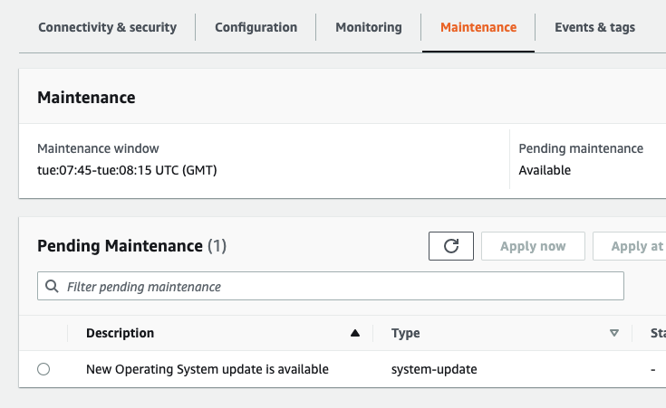

# Amazon Neptune operating system upgrades

Amazon Neptune ensures continuous improvements in database performance, security, and stability through regular OS
upgrades. These upgrades are applied to both Neptune Databases and Neptune Analytics, following a structured update
process. Amazon Neptune releases OS upgrades at least once per month.

Neptune Database OS updates that do not require downtime are
automatically applied during the maintenance window. Certain OS updates (eg: kernel version upgrade) requires an instance
restart. These updates are optional and don't have a set date to apply them. However, if you don't apply these updates,
they may eventually become required and automatically applied during your instance's maintenance window.

**Neptune Analytics** - Neptune Analytics OS upgrades are seamless and require no customer
action. These updates are automatically applied in the background without downtime.

To maintain security and compliance, we recommend that you apply all updates made available by Amazon Neptune routinely
during your maintenance window. Staying current on all optional and mandatory updates helps incorporate critical security
patches and ensures alignment with various compliance obligations. Outdated OS versions may result in non-compliance with
regulatory requirements.

## Minimizing downtime for OS upgrades that require a restart

For OS upgrades that require a restart, we recommend that you update the reader instances in a cluster first, then the
writer instance to maximize the availability of your cluster. We don't recommend updating reader and writer instances
at the same time, because you could incur longer downtime in the event of a failover.

## Applying OS upgrades to your Neptune DB instance

Neptune DB instances occasionally require operating system updates. Amazon Neptune upgrades the operating system to
a newer version to improve database performance and customers overall security posture. Typically, the updates take
about 10 minutes. Operating system updates don't change the DB engine version or DB instance class of a DB instance.

To be notified when a new optional update becomes available, you can subscribe to `RDS-EVENT-0230` in the
security patching event category. For information about subscribing to Amazon Neptune events, see
[Subscribing to Neptune event notification](events-subscribing.md "events-subscribing.md").

###### Important

Your Amazon Neptune DB instance will be taken offline during the operating system upgrade. You can minimize cluster
downtime by having a multi-instance cluster. If you do not have a multi-instance cluster then you can choose to
temporarily create one by adding secondary instance(s) to perform this maintenance, then deleting the additional
reader instance(s) once the maintenance is completed (regular charges for the secondary instance will apply).

You can use the AWS Management Console or the AWS CLI to determine whether an update is available.

### Using the AWS Management Console

To determine whether an update is available using the AWS Management Console:

1. Sign in to the AWS Management Console, and open the Amazon Neptune console at [https://console.aws.amazon.com/neptune/home](https://console.aws.amazon.com/neptune/home "https://console.aws.amazon.com/neptune/home").
2. In the navigation pane, choose **Clusters**, and then select the instance.
3. Choose **Maintenance**.
4. In the **Pending Maintenance** section, find the operating system update.



You can select the operating system update and click **Apply now** or
**Apply at next maintenance window** in the **Pending Maintenance** section. If
the maintenance value is **next window**, defer the maintenance items by choosing
**Defer upgrade**. You can't defer a maintenance action if it has already started.

Alternatively, you can choose the instance from a list of clusters by clicking on **Clusters** in
the navigation pane and select **Apply now** or **Apply at next maintenance window**
from the **Actions** menu.

### Using the AWS CLI

To determine whether an update is available using the AWS CLI, call the `describe-pending-maintenance-actions`
command:

```
aws neptune describe-pending-maintenance-actions
```

```
{
    "ResourceIdentifier": "arn:aws:rds:us-east-1:123456789012:db:myneptune",
    "PendingMaintenanceActionDetails": [
        {
            "Action": "system-update",
            "Description": "New Operating System update is available"
        }
    ]
}
```

To apply the Operating system updates, call the `apply-pending-maintenance-action` command:

```
aws neptune apply-pending-maintenance-action \
    --apply-action system-update \
    --resource-identifier (`ARN of your DB instance`) \
    --opt-in-type immediate
```
