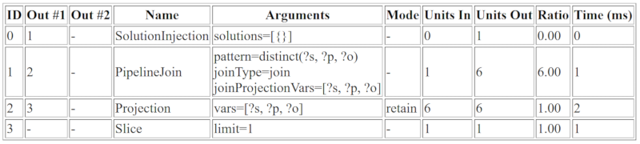

# Examples of invoking SPARQL `explain` in Neptune

The examples in this section show the various kinds of output you can produce by invoking
the SPARQL `explain` feature to analyze query execution in Amazon Neptune.

###### Topics

- [Understanding Explain Output](#sparql-explain-example-output "#sparql-explain-example-output")
- [Example of details mode output](#sparql-explain-example-details "#sparql-explain-example-details")
- [Example of static mode output](#sparql-explain-example-static "#sparql-explain-example-static")
- [Different ways of encoding parameters](#sparql-explain-example-parameters "#sparql-explain-example-parameters")
- [Other output types besides text/plain](#sparql-explain-output-options "#sparql-explain-output-options")
- [Example of SPARQL explain output when the DFE is enabled](#sparql-explain-output-dfe "#sparql-explain-output-dfe")

## Understanding Explain Output

In this example, Jane Doe knows two people, namely John Doe and Richard Roe:

```
@prefix ex: <http://example.com> .
@prefix foaf: <http://xmlns.com/foaf/0.1/> .

ex:JaneDoe foaf:knows ex:JohnDoe .
ex:JohnDoe foaf:firstName "John" .
ex:JohnDoe foaf:lastName "Doe" .
ex:JaneDoe foaf:knows ex:RichardRoe .
ex:RichardRoe foaf:firstName "Richard" .
ex:RichardRoe foaf:lastName "Roe" .
.
```

To determine the first names of all the people whom Jane Doe knows, you can write the
following query:

```
 curl `http(s)://your_server:your_port`/sparql \
   -d "query=PREFIX foaf: <https://xmlns.com/foaf/0.1/> PREFIX ex: <https://www.example.com/> \
       SELECT ?firstName WHERE { ex:JaneDoe foaf:knows ?person . ?person foaf:firstName ?firstName }" \
   -H "Accept: text/csv"
```

This simple query returns the following:

```
firstName
John
Richard
```

Next, change the `curl` command to invoke `explain` by adding
`-d "explain=dynamic"` and using the default output type instead of
`text/csv`:

```
 curl `http(s)://your_server:your_port`/sparql \
   -d "query=PREFIX foaf: <https://xmlns.com/foaf/0.1/> PREFIX ex: <https://www.example.com/> \
       SELECT ?firstName WHERE { ex:JaneDoe foaf:knows ?person . ?person foaf:firstName ?firstName }" \
   -d "explain=dynamic"
```

The query now returns output in pretty-printed ASCII format (HTTP content type
`text/plain`), which is the default output type:

```
╔════╤════════╤════════╤═══════════════════╤═══════════════════════════════════════════════════════╤══════════╤══════════╤═══════════╤═══════╤═══════════╗
║ ID │ Out #1 │ Out #2 │ Name              │ Arguments                                             │ Mode     │ Units In │ Units Out │ Ratio │ Time (ms) ║
╠════╪════════╪════════╪═══════════════════╪═══════════════════════════════════════════════════════╪══════════╪══════════╪═══════════╪═══════╪═══════════╣
║ 0  │ 1      │ -      │ SolutionInjection │ solutions=[{}]                                        │ -        │ 0        │ 1         │ 0.00  │ 0         ║
╟────┼────────┼────────┼───────────────────┼───────────────────────────────────────────────────────┼──────────┼──────────┼───────────┼───────┼───────────╢
║ 1  │ 2      │ -      │ PipelineJoin      │ pattern=distinct(ex:JaneDoe, foaf:knows, ?person)     │ -        │ 1        │ 2         │ 2.00  │ 1         ║
║    │        │        │                   │ joinType=join                                         │          │          │           │       │           ║
║    │        │        │                   │ joinProjectionVars=[?person]                          │          │          │           │       │           ║
╟────┼────────┼────────┼───────────────────┼───────────────────────────────────────────────────────┼──────────┼──────────┼───────────┼───────┼───────────╢
║ 2  │ 3      │ -      │ PipelineJoin      │ pattern=distinct(?person, foaf:firstName, ?firstName) │ -        │ 2        │ 2         │ 1.00  │ 1         ║
║    │        │        │                   │ joinType=join                                         │          │          │           │       │           ║
║    │        │        │                   │ joinProjectionVars=[?person, ?firstName]              │          │          │           │       │           ║
╟────┼────────┼────────┼───────────────────┼───────────────────────────────────────────────────────┼──────────┼──────────┼───────────┼───────┼───────────╢
║ 3  │ 4      │ -      │ Projection        │ vars=[?firstName]                                     │ retain   │ 2        │ 2         │ 1.00  │ 0         ║
╟────┼────────┼────────┼───────────────────┼───────────────────────────────────────────────────────┼──────────┼──────────┼───────────┼───────┼───────────╢
║ 4  │ -      │ -      │ TermResolution    │ vars=[?firstName]                                     │ id2value │ 2        │ 2         │ 1.00  │ 1         ║
╚════╧════════╧════════╧═══════════════════╧═══════════════════════════════════════════════════════╧══════════╧══════════╧═══════════╧═══════╧═══════════╝
```

For details about the operations in the `Name` column and their arguments, see
[explain operators](sparql-explain-operators.md "sparql-explain-operators.md").

The following describes the output row by row:

1. The first step in the main query always uses the `SolutionInjection`
   operator to inject a solution. The solution is then expanded to the final result through
   the evaluation process.

In this case, it injects the so-called universal solution `{ }`. In the
presence of `VALUES` clauses or a `BIND`, this step might also
inject more complex variable bindings to start out with.

The `Units Out` column indicates that this single solution flows out of the
operator. The `Out #1` column specifies the operator into which this operator
feeds the result. In this example, all operators are connected to the operator that
follows in the table. 2. The second step is a `PipelineJoin`. It receives as input the single
universal (fully unconstrained) solution produced by the previous operator (`Units In
 := 1`). It joins it against the tuple pattern defined by its `pattern`
argument. This corresponds to a simple lookup for the pattern. In this case, the triple
pattern is defined as the following:

```
distinct( ex:JaneDoe, foaf:knows, ?person )
```

The `joinType := join` argument indicates that this is a normal join (other
types include `optional` joins, `existence check` joins, and so on).

The `distinct := true` argument says that you extract only distinct matches
from the database (no duplicates), and you bind the distinct matches to the variable
`joinProjectionVars := ?person`, deduplicated.

The fact that the `Units Out` column value is 2 indicates that there are
two solutions flowing out. Specifically, these are the bindings for the
`?person` variable, reflecting the two people that the data shows that Jane
Doe knows:

```
 ?person
 -------------
 ex:JohnDoe
 ex:RichardRoe
```

3. The two solutions from stage 2 flow as input (`Units In := 2`)
   into the second `PipelineJoin`. This operator joins the two previous
   solutions with the following triple pattern:

```
distinct(?person, foaf:firstName, ?firstName)
```

The `?person` variable is known to be bound either to `ex:JohnDoe`
or to `ex:RichardRoe` by the operator's incoming solution.
Given that, the `PipelineJoin` extracts the first names, John and Richard. The
outgoing two solutions (Units Out := 2) are then as follows:

```
 ?person       | ?firstName
 ---------------------------
 ex:JohnDoe    | John
 ex:RichardRoe | Richard
```

4. The next projection operator takes as input the two solutions from stage 3
   (`Units In := 2`) and projects onto the `?firstName` variable.
   This eliminates all other variable bindings in the mappings and passes on the two
   bindings (`Units Out := 2`):

```
 ?firstName
 ----------
 John
 Richard
```

5. To improve performance, Neptune operates where possible on internal identifiers that
   it assigns to terms such as URIs and string literals, rather than on the strings
   themselves. The final operator, `TermResolution`, performs a mapping from these
   internal identifiers back to the corresponding term strings.

In regular (non-explain) query evaluation, the result computed by the last operator is
then serialized into the requested serialization format and streamed to the client.

## Example of details mode output

###### Note

SPARQL explain details mode is available starting in [Neptune engine release 1.0.2.1](engine-releases-1.0.2.md "engine-releases-1.0.2.md").

Suppose that you run the same query as the previous in _details_ mode
instead of _dynamic_ mode:

```
 curl `http(s)://your_server:your_port`/sparql \
   -d "query=PREFIX foaf: <https://xmlns.com/foaf/0.1/> PREFIX ex: <https://www.example.com/> \
       SELECT ?firstName WHERE { ex:JaneDoe foaf:knows ?person . ?person foaf:firstName ?firstName }" \
   -d "explain=details"
```

As this example shows, the output is the same with some additional details such as
the query string at the top of the output, and the `patternEstimate` count for
the `PipelineJoin` operator:

```
Query:
PREFIX foaf: <https://xmlns.com/foaf/0.1/> PREFIX ex: <https://www.example.com/>
SELECT ?firstName WHERE { ex:JaneDoe foaf:knows ?person . ?person foaf:firstName ?firstName }

╔════╤════════╤════════╤═══════════════════╤═══════════════════════════════════════════════════════╤══════════╤══════════╤═══════════╤═══════╤═══════════╗
║ ID │ Out #1 │ Out #2 │ Name              │ Arguments                                             │ Mode     │ Units In │ Units Out │ Ratio │ Time (ms) ║
╠════╪════════╪════════╪═══════════════════╪═══════════════════════════════════════════════════════╪══════════╪══════════╪═══════════╪═══════╪═══════════╣
║ 0  │ 1      │ -      │ SolutionInjection │ solutions=[{}]                                        │ -        │ 0        │ 1         │ 0.00  │ 0         ║
╟────┼────────┼────────┼───────────────────┼───────────────────────────────────────────────────────┼──────────┼──────────┼───────────┼───────┼───────────╢
║ 1  │ 2      │ -      │ PipelineJoin      │ pattern=distinct(ex:JaneDoe, foaf:knows, ?person)     │ -        │ 1        │ 2         │ 2.00  │ 13        ║
║    │        │        │                   │ joinType=join                                         │          │          │           │       │           ║
║    │        │        │                   │ joinProjectionVars=[?person]                          │          │          │           │       │           ║
║    │        │        │                   │ patternEstimate=2                                     │          │          │           │       │           ║
╟────┼────────┼────────┼───────────────────┼───────────────────────────────────────────────────────┼──────────┼──────────┼───────────┼───────┼───────────╢
║ 2  │ 3      │ -      │ PipelineJoin      │ pattern=distinct(?person, foaf:firstName, ?firstName) │ -        │ 2        │ 2         │ 1.00  │ 3         ║
║    │        │        │                   │ joinType=join                                         │          │          │           │       │           ║
║    │        │        │                   │ joinProjectionVars=[?person, ?firstName]              │          │          │           │       │           ║
║    │        │        │                   │ patternEstimate=2                                     │          │          │           │       │           ║
╟────┼────────┼────────┼───────────────────┼───────────────────────────────────────────────────────┼──────────┼──────────┼───────────┼───────┼───────────╢
║ 3  │ 4      │ -      │ Projection        │ vars=[?firstName]                                     │ retain   │ 2        │ 2         │ 1.00  │ 1         ║
╟────┼────────┼────────┼───────────────────┼───────────────────────────────────────────────────────┼──────────┼──────────┼───────────┼───────┼───────────╢
║ 4  │ -      │ -      │ TermResolution    │ vars=[?firstName]                                     │ id2value │ 2        │ 2         │ 1.00  │ 7         ║
╚════╧════════╧════════╧═══════════════════╧═══════════════════════════════════════════════════════╧══════════╧══════════╧═══════════╧═══════╧═══════════╝
```

## Example of static mode output

Suppose that you run the same query as the previous in _static_ mode
(the default) instead of _details_ mode:

```
 curl `http(s)://your_server:your_port`/sparql \
   -d "query=PREFIX foaf: <https://xmlns.com/foaf/0.1/> PREFIX ex: <https://www.example.com/> \
       SELECT ?firstName WHERE { ex:JaneDoe foaf:knows ?person . ?person foaf:firstName ?firstName }" \
   -d "explain=static"
```

As this example shows, the output is the same, except that it omits the last three
columns:

```
╔════╤════════╤════════╤═══════════════════╤═══════════════════════════════════════════════════════╤══════════╗
║ ID │ Out #1 │ Out #2 │ Name              │ Arguments                                             │ Mode     ║
╠════╪════════╪════════╪═══════════════════╪═══════════════════════════════════════════════════════╪══════════╣
║ 0  │ 1      │ -      │ SolutionInjection │ solutions=[{}]                                        │ -        ║
╟────┼────────┼────────┼───────────────────┼───────────────────────────────────────────────────────┼──────────╢
║ 1  │ 2      │ -      │ PipelineJoin      │ pattern=distinct(ex:JaneDoe, foaf:knows, ?person)     │ -        ║
║    │        │        │                   │ joinType=join                                         │          ║
║    │        │        │                   │ joinProjectionVars=[?person]                          │          ║
╟────┼────────┼────────┼───────────────────┼───────────────────────────────────────────────────────┼──────────╢
║ 2  │ 3      │ -      │ PipelineJoin      │ pattern=distinct(?person, foaf:firstName, ?firstName) │ -        ║
║    │        │        │                   │ joinType=join                                         │          ║
║    │        │        │                   │ joinProjectionVars=[?person, ?firstName]              │          ║
╟────┼────────┼────────┼───────────────────┼───────────────────────────────────────────────────────┼──────────╢
║ 3  │ 4      │ -      │ Projection        │ vars=[?firstName]                                     │ retain   ║
╟────┼────────┼────────┼───────────────────┼───────────────────────────────────────────────────────┼──────────╢
║ 4  │ -      │ -      │ TermResolution    │ vars=[?firstName]                                     │ id2value ║
╚════╧════════╧════════╧═══════════════════╧═══════════════════════════════════════════════════════╧══════════╝
```

## Different ways of encoding parameters

The following example queries illustrate two different ways to encode parameters when
invoking SPARQL `explain`.

**Using URL encoding** – This example uses URL
encoding of parameters, and specifies _dynamic_ output:

```
curl -XGET "`http(s)://your_server:your_port`/sparql?query=SELECT%20*%20WHERE%20%7B%20%3Fs%20%3Fp%20%3Fo%20%7D%20LIMIT%20%31&explain=dynamic"
```

**Specifying the parameters directly** – This is the
same as the previous query except that it passes the parameters through POST directly:

```
 curl `http(s)://your_server:your_port`/sparql \
   -d "query=SELECT * WHERE { ?s ?p ?o } LIMIT 1" \
   -d "explain=dynamic"
```

## Other output types besides text/plain

The preceding examples use the default `text/plain` output type. Neptune can
also format SPARQL `explain` output in two other MIME-type formats, namely
`text/csv` and `text/html`. You invoke them by setting the HTTP
`Accept` header, which you can do using the `-H` flag in
`curl`, as follows:

```
  -H "Accept: `output type`"
```

Here are some examples:

###### `text/csv` Output

This query calls for CSV MIME-type output by specifying `-H "Accept: text/csv"`:

```
 curl `http(s)://your_server:your_port`/sparql \
   -d "query=SELECT * WHERE { ?s ?p ?o } LIMIT 1" \
   -d "explain=dynamic" \
   -H "Accept: text/csv"
```

The CSV format, which is handy for importing into a spreadsheet or database, separates the
fields in each `explain` row by semicolons ( `;` ), like this:

```
ID;Out #1;Out #2;Name;Arguments;Mode;Units In;Units Out;Ratio;Time (ms)
0;1;-;SolutionInjection;solutions=[{}];-;0;1;0.00;0
1;2;-;PipelineJoin;pattern=distinct(?s, ?p, ?o),joinType=join,joinProjectionVars=[?s, ?p, ?o];-;1;6;6.00;1
2;3;-;Projection;vars=[?s, ?p, ?o];retain;6;6;1.00;2
3;-;-;Slice;limit=1;-;1;1;1.00;1
```

 

###### `text/html` Output

If you specify `-H "Accept: text/html"`, then `explain` generates
an HTML table:

```
<!DOCTYPE html>
<html>
  <body>
    <table border="1px">
      <thead>
        <tr>
          <th>ID</th>
          <th>Out #1</th>
          <th>Out #2</th>
          <th>Name</th>
          <th>Arguments</th>
          <th>Mode</th>
          <th>Units In</th>
          <th>Units Out</th>
          <th>Ratio</th>
          <th>Time (ms)</th>
        </tr>
      </thead>

      <tbody>
        <tr>
          <td>0</td>
          <td>1</td>
          <td>-</td>
          <td>SolutionInjection</td>
          <td>solutions=[{}]</td>
          <td>-</td>
          <td>0</td>
          <td>1</td>
          <td>0.00</td>
          <td>0</td>
        </tr>

        <tr>
          <td>1</td>
          <td>2</td>
          <td>-</td>
          <td>PipelineJoin</td>
          <td>pattern=distinct(?s, ?p, ?o)<br>
              joinType=join<br>
              joinProjectionVars=[?s, ?p, ?o]</td>
          <td>-</td>
          <td>1</td>
          <td>6</td>
          <td>6.00</td>
          <td>1</td>
        </tr>

        <tr>
          <td>2</td>
          <td>3</td>
          <td>-</td>
          <td>Projection</td>
          <td>vars=[?s, ?p, ?o]</td>
          <td>retain</td>
          <td>6</td>
          <td>6</td>
          <td>1.00</td>
          <td>2</td>
        </tr>

        <tr>
          <td>3</td>
          <td>-</td>
          <td>-</td>
          <td>Slice</td>
          <td>limit=1</td>
          <td>-</td>
          <td>1</td>
          <td>1</td>
          <td>1.00</td>
          <td>1</td>
        </tr>
      </tbody>
    </table>
  </body>
</html>
```

The HTML renders in a browser something like the following:



## Example of SPARQL `explain` output when the DFE is enabled

The following is an example of SPARQL `explain` output when the
Neptune DFE alternative query engine is enabled:

```
╔════╤════════╤════════╤═══════════════════╤═════════════════════════════════════════════════════════════════════════════════════════════════════════════════════════════════════════════════════════════════════════════════════════════════════════════════════════╤══════════╤══════════╤═══════════╤═══════╤═══════════╗
║ ID │ Out #1 │ Out #2 │ Name              │ Arguments                                                                                                                                                                                                               │ Mode     │ Units In │ Units Out │ Ratio │ Time (ms) ║
╠════╪════════╪════════╪═══════════════════╪═════════════════════════════════════════════════════════════════════════════════════════════════════════════════════════════════════════════════════════════════════════════════════════════════════════════════════════╪══════════╪══════════╪═══════════╪═══════╪═══════════╣
║ 0  │ 1      │ -      │ SolutionInjection │ solutions=[{}]                                                                                                                                                                                                          │ -        │ 0        │ 1         │ 0.00  │ 0         ║
╟────┼────────┼────────┼───────────────────┼─────────────────────────────────────────────────────────────────────────────────────────────────────────────────────────────────────────────────────────────────────────────────────────────────────────────────────────┼──────────┼──────────┼───────────┼───────┼───────────╢
║ 1  │ 2      │ -      │ HashIndexBuild    │ solutionSet=solutionSet1                                                                                                                                                                                                │ -        │ 1        │ 1         │ 1.00  │ 22        ║
║    │        │        │                   │ joinVars=[]                                                                                                                                                                                                             │          │          │           │       │           ║
║    │        │        │                   │ sourceType=pipeline                                                                                                                                                                                                     │          │          │           │       │           ║
╟────┼────────┼────────┼───────────────────┼─────────────────────────────────────────────────────────────────────────────────────────────────────────────────────────────────────────────────────────────────────────────────────────────────────────────────────────┼──────────┼──────────┼───────────┼───────┼───────────╢
║ 2  │ 3      │ -      │ DFENode           │ DFE Stats=                                                                                                                                                                                                                    │ -        │ 101      │ 100       │ 0.99  │ 32        ║
║    │        │        │                   │ ====> DFE execution time (measured by DFEQueryEngine)                                                                                                                                                                   │          │          │           │       │           ║
║    │        │        │                   │ accepted [micros]=127                                                                                                                                                                                                   │          │          │           │       │           ║
║    │        │        │                   │ ready [micros]=2                                                                                                                                                                                                        │          │          │           │       │           ║
║    │        │        │                   │ running [micros]=5627                                                                                                                                                                                                   │          │          │           │       │           ║
║    │        │        │                   │ finished [micros]=0                                                                                                                                                                                                     │          │          │           │       │           ║
║    │        │        │                   │                                                                                                                                                                                                                         │          │          │           │       │           ║
║    │        │        │                   │                                                                                                                                                                                                                         │          │          │           │       │           ║
║    │        │        │                   │ ===> DFE execution time (measured in DFENode)                                                                                                                                                                           │          │          │           │       │           ║
║    │        │        │                   │ -> setupTime [ms]=1                                                                                                                                                                                                     │          │          │           │       │           ║
║    │        │        │                   │ -> executionTime [ms]=14                                                                                                                                                                                                │          │          │           │       │           ║
║    │        │        │                   │ -> resultReadTime [ms]=0                                                                                                                                                                                                │          │          │           │       │           ║
║    │        │        │                   │                                                                                                                                                                                                                         │          │          │           │       │           ║
║    │        │        │                   │                                                                                                                                                                                                                         │          │          │           │       │           ║
║    │        │        │                   │ ===> Static analysis statistics                                                                                                                                                                                         │          │          │           │       │           ║
║    │        │        │                   │ --> 35907 micros spent in parser.                                                                                                                                                                                       │          │          │           │       │           ║
║    │        │        │                   │ --> 7643 micros spent in range count estimation                                                                                                                                                                         │          │          │           │       │           ║
║    │        │        │                   │ --> 2895 micros spent in value resolution                                                                                                                                                                               │          │          │           │       │           ║
║    │        │        │                   │                                                                                                                                                                                                                         │          │          │           │       │           ║
║    │        │        │                   │ --> 39974925 micros spent in optimizer loop                                                                                                                                                                             │          │          │           │       │           ║
║    │        │        │                   │                                                                                                                                                                                                                         │          │          │           │       │           ║
║    │        │        │                   │                                                                                                                                                                                                                         │          │          │           │       │           ║
║    │        │        │                   │ DFEJoinGroupNode[ children={                                                                                                                                                                                            │          │          │           │       │           ║
║    │        │        │                   │   DFEPatternNode[(?1, TERM[117442062], ?2, ?3) . project DISTINCT[?1, ?2] {rangeCountEstimate=100},                                                                                                                     │          │          │           │       │           ║
║    │        │        │                   │     OperatorInfoWithAlternative[                                                                                                                                                                                        │          │          │           │       │           ║
║    │        │        │                   │       rec=OperatorInfo[                                                                                                                                                                                                 │          │          │           │       │           ║
║    │        │        │                   │         type=INCREMENTAL_PIPELINE_JOIN,                                                                                                                                                                                 │          │          │           │       │           ║
║    │        │        │                   │         costEstimates=OperatorCostEstimates[                                                                                                                                                                            │          │          │           │       │           ║
║    │        │        │                   │           costEstimate=OperatorCostEstimate[in=1.0000,out=100.0000,io=0.0002,comp=0.0000,mem=0],                                                                                                                        │          │          │           │       │           ║
║    │        │        │                   │           worstCaseCostEstimate=OperatorCostEstimate[in=1.0000,out=100.0000,io=0.0002,comp=0.0000,mem=0]]],                                                                                                             │          │          │           │       │           ║
║    │        │        │                   │       alt=OperatorInfo[                                                                                                                                                                                                 │          │          │           │       │           ║
║    │        │        │                   │         type=INCREMENTAL_HASH_JOIN,                                                                                                                                                                                     │          │          │           │       │           ║
║    │        │        │                   │         costEstimates=OperatorCostEstimates[                                                                                                                                                                            │          │          │           │       │           ║
║    │        │        │                   │           costEstimate=OperatorCostEstimate[in=1.0000,out=100.0000,io=0.0003,comp=0.0000,mem=3212],                                                                                                                     │          │          │           │       │           ║
║    │        │        │                   │           worstCaseCostEstimate=OperatorCostEstimate[in=1.0000,out=100.0000,io=0.0003,comp=0.0000,mem=3212]]]]],                                                                                                        │          │          │           │       │           ║
║    │        │        │                   │   DFEPatternNode[(?1, TERM[150997262], ?4, ?5) . project DISTINCT[?1, ?4] {rangeCountEstimate=100},                                                                                                                     │          │          │           │       │           ║
║    │        │        │                   │     OperatorInfoWithAlternative[                                                                                                                                                                                        │          │          │           │       │           ║
║    │        │        │                   │       rec=OperatorInfo[                                                                                                                                                                                                 │          │          │           │       │           ║
║    │        │        │                   │         type=INCREMENTAL_HASH_JOIN,                                                                                                                                                                                     │          │          │           │       │           ║
║    │        │        │                   │         costEstimates=OperatorCostEstimates[                                                                                                                                                                            │          │          │           │       │           ║
║    │        │        │                   │           costEstimate=OperatorCostEstimate[in=100.0000,out=100.0000,io=0.0003,comp=0.0000,mem=6400],                                                                                                                   │          │          │           │       │           ║
║    │        │        │                   │           worstCaseCostEstimate=OperatorCostEstimate[in=100.0000,out=100.0000,io=0.0003,comp=0.0000,mem=6400]]],                                                                                                        │          │          │           │       │           ║
║    │        │        │                   │       alt=OperatorInfo[                                                                                                                                                                                                 │          │          │           │       │           ║
║    │        │        │                   │         type=INCREMENTAL_PIPELINE_JOIN,                                                                                                                                                                                 │          │          │           │       │           ║
║    │        │        │                   │         costEstimates=OperatorCostEstimates[                                                                                                                                                                            │          │          │           │       │           ║
║    │        │        │                   │           costEstimate=OperatorCostEstimate[in=100.0000,out=100.0000,io=0.0010,comp=0.0000,mem=0],                                                                                                                      │          │          │           │       │           ║
║    │        │        │                   │           worstCaseCostEstimate=OperatorCostEstimate[in=100.0000,out=100.0000,io=0.0010,comp=0.0000,mem=0]]]]]                                                                                                          │          │          │           │       │           ║
║    │        │        │                   │ },                                                                                                                                                                                                                      │          │          │           │       │           ║
║    │        │        │                   │ ]                                                                                                                                                                                                                       │          │          │           │       │           ║
║    │        │        │                   │                                                                                                                                                                                                                         │          │          │           │       │           ║
║    │        │        │                   │ ===> DFE configuration:                                                                                                                                                                                                 │          │          │           │       │           ║
║    │        │        │                   │ solutionChunkSize=5000                                                                                                                                                                                                  │          │          │           │       │           ║
║    │        │        │                   │ ouputQueueSize=20                                                                                                                                                                                                       │          │          │           │       │           ║
║    │        │        │                   │ numComputeCores=3                                                                                                                                                                                                       │          │          │           │       │           ║
║    │        │        │                   │ maxParallelIO=10                                                                                                                                                                                                        │          │          │           │       │           ║
║    │        │        │                   │ numInitialPermits=12                                                                                                                                                                                                    │          │          │           │       │           ║
║    │        │        │                   │                                                                                                                                                                                                                         │          │          │           │       │           ║
║    │        │        │                   │                                                                                                                                                                                                                         │          │          │           │       │           ║
║    │        │        │                   │ ====> DFE configuration (reported back)                                                                                                                                                                                 │          │          │           │       │           ║
║    │        │        │                   │ numComputeCores=3                                                                                                                                                                                                       │          │          │           │       │           ║
║    │        │        │                   │ maxParallelIO=2                                                                                                                                                                                                         │          │          │           │       │           ║
║    │        │        │                   │ numInitialPermits=12                                                                                                                                                                                                    │          │          │           │       │           ║
║    │        │        │                   │                                                                                                                                                                                                                         │          │          │           │       │           ║
║    │        │        │                   │ ===> Statistics & operator histogram                                                                                                                                                                                    │          │          │           │       │           ║
║    │        │        │                   │ ==> Statistics                                                                                                                                                                                                          │          │          │           │       │           ║
║    │        │        │                   │ -> 3741 / 3668 micros total elapsed (incl. wait / excl. wait)                                                                                                                                                           │          │          │           │       │           ║
║    │        │        │                   │ -> 3741 / 3 millis total elapse (incl. wait / excl. wait)                                                                                                                                                               │          │          │           │       │           ║
║    │        │        │                   │ -> 3741 / 0 secs total elapsed (incl. wait / excl. wait)                                                                                                                                                                │          │          │           │       │           ║
║    │        │        │                   │ ==> Operator histogram                                                                                                                                                                                                  │          │          │           │       │           ║
║    │        │        │                   │ -> 47.66% of total time (excl. wait): pipelineScan (2 instances)                                                                                                                                                        │          │          │           │       │           ║
║    │        │        │                   │ -> 10.99% of total time (excl. wait): merge (1 instances)                                                                                                                                                               │          │          │           │       │           ║
║    │        │        │                   │ -> 41.17% of total time (excl. wait): symmetricHashJoin (1 instances)                                                                                                                                                   │          │          │           │       │           ║
║    │        │        │                   │ -> 0.19% of total time (excl. wait): drain (1 instances)                                                                                                                                                                │          │          │           │       │           ║
║    │        │        │                   │                                                                                                                                                                                                                         │          │          │           │       │           ║
║    │        │        │                   │ nodeId | out0   | out1 | opName            | args                                             | rowsIn | rowsOut | chunksIn | chunksOut | elapsed* | outWait | outBlocked | ratio    | rate* [M/s] | rate [M/s] | %     │          │          │           │       │           ║
║    │        │        │                   │ ------ | ------ | ---- | ----------------- | ------------------------------------------------ | ------ | ------- | -------- | --------- | -------- | ------- | ---------- | -------- | ----------- | ---------- | ----- │          │          │           │       │           ║
║    │        │        │                   │ node_0 | node_2 | -    | pipelineScan      | (?1, TERM[117442062], ?2, ?3) DISTINCT [?1, ?2]  | 0      | 100     | 0        | 1         | 874      | 0       | 0          | Infinity | 0.1144      | 0.1144     | 23.83 │          │          │           │       │           ║
║    │        │        │                   │ node_1 | node_2 | -    | pipelineScan      | (?1, TERM[150997262], ?4, ?5) DISTINCT [?1, ?4]  | 0      | 100     | 0        | 1         | 874      | 0       | 0          | Infinity | 0.1144      | 0.1144     | 23.83 │          │          │           │       │           ║
║    │        │        │                   │ node_2 | node_4 | -    | symmetricHashJoin |                                                  | 200    | 100     | 2        | 2         | 1510     | 73      | 0          | 0.50     | 0.0662      | 0.0632     | 41.17 │          │          │           │       │           ║
║    │        │        │                   │ node_3 | -      | -    | drain             |                                                  | 100    | 0       | 1        | 0         | 7        | 0       | 0          | 0.00     | 0.0000      | 0.0000     | 0.19  │          │          │           │       │           ║
║    │        │        │                   │ node_4 | node_3 | -    | merge             |                                                  | 100    | 100     | 2        | 1         | 403      | 0       | 0          | 1.00     | 0.2481      | 0.2481     | 10.99 │          │          │           │       │           ║
╟────┼────────┼────────┼───────────────────┼─────────────────────────────────────────────────────────────────────────────────────────────────────────────────────────────────────────────────────────────────────────────────────────────────────────────────────────┼──────────┼──────────┼───────────┼───────┼───────────╢
║ 3  │ 4      │ -      │ HashIndexJoin     │ solutionSet=solutionSet1                                                                                                                                                                                                │ -        │ 100      │ 100       │ 1.00  │ 4         ║
║    │        │        │                   │ joinType=join                                                                                                                                                                                                           │          │          │           │       │           ║
╟────┼────────┼────────┼───────────────────┼─────────────────────────────────────────────────────────────────────────────────────────────────────────────────────────────────────────────────────────────────────────────────────────────────────────────────────────┼──────────┼──────────┼───────────┼───────┼───────────╢
║ 4  │ 5      │ -      │ Distinct          │ vars=[?s, ?o, ?o1]                                                                                                                                                                                                      │ -        │ 100      │ 100       │ 1.00  │ 9         ║
╟────┼────────┼────────┼───────────────────┼─────────────────────────────────────────────────────────────────────────────────────────────────────────────────────────────────────────────────────────────────────────────────────────────────────────────────────────┼──────────┼──────────┼───────────┼───────┼───────────╢
║ 5  │ 6      │ -      │ Projection        │ vars=[?s, ?o, ?o1]                                                                                                                                                                                                      │ retain   │ 100      │ 100       │ 1.00  │ 2         ║
╟────┼────────┼────────┼───────────────────┼─────────────────────────────────────────────────────────────────────────────────────────────────────────────────────────────────────────────────────────────────────────────────────────────────────────────────────────┼──────────┼──────────┼───────────┼───────┼───────────╢
║ 6  │ -      │ -      │ TermResolution    │ vars=[?s, ?o, ?o1]                                                                                                                                                                                                      │ id2value │ 100      │ 100       │ 1.00  │ 11        ║
╚════╧════════╧════════╧═══════════════════╧═════════════════════════════════════════════════════════════════════════════════════════════════════════════════════════════════════════════════════════════════════════════════════════════════════════════════════════╧══════════╧══════════╧═══════════╧═══════╧═══════════╝
```
