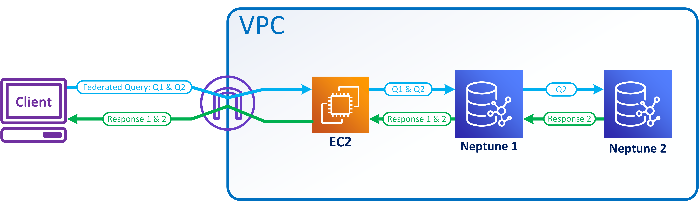

# SPARQL federated queries in Neptune using the `SERVICE` extension

Amazon Neptune fully supports the SPARQL federated query extension that uses the
`SERVICE` keyword. (For more information, see [SPARQL 1.1 Federated
Query](https://www.w3.org/TR/sparql11-federated-query/ "https://www.w3.org/TR/sparql11-federated-query/").)

###### Note

This feature is available starting in [Release 1.0.1.0.200463.0 (2019-10-15)](engine-releases-1.0.1.0.200463.md "engine-releases-1.0.1.0.200463.md").

The `SERVICE` keyword instructs the SPARQL query engine to execute a
portion of the query against a remote SPARQL endpoint and compose the final query result. Only
`READ` operations are possible. `WRITE` and `DELETE`
operations are not supported. Neptune can only run federated queries against SPARQL endpoints
that are accessible within its virtual private cloud (VPC). However, you can also use
a reverse proxy in the VPC to make an external data source accessible within the VPC.

###### Note

When SPARQL `SERVICE` is used to federate a query to two or more
Neptune clusters in the same VPC, the security groups must be configured to allow
all those Neptune clusters to talk to each another.

###### Important

SPARQL 1.1 Federation makes service requests on your behalf when passing
queries and parameters to external SPARQL endpoints. It is your responsibility to verify
that the external SPARQL endpoints satisfy your application's data handling and security
requirements.

## Example of a Neptune federated query

The following simple example shows how SPARQL federated queries work.

Suppose that a customer sends the following query to _Neptune-1_ at
`http://neptune-1:8182/sparql`.

```
SELECT * WHERE {
   ?person rdf:type foaf:Person .
   SERVICE <http://neptune-2:8182/sparql> {
       ?person foaf:knows ?friend .
    }
}
```

1. _Neptune-1_ evaluates the first query pattern
   (_Q-1_) which is `?person rdf:type foaf:Person`,
   uses the results to resolve `?person` in _Q-2_
   (`?person foaf:knows ?friend`), and forwards the resulting pattern to
   _Neptune-2_ at `http://neptune-2:8182/sparql`.
2. _Neptune-2_ evaluates _Q-2_
   and sends the results back to _Neptune-1_.
3. _Neptune-1_ joins the solutions for both patterns
   and sends the results back to the customer.

This flow is shown in the following diagram.



###### Note

"By default, the optimizer determines at what point in query execution that the
`SERVICE` instruction is executed. You can override this placement using the
[joinOrder](sparql-query-hints-joinOrder.md "sparql-query-hints-joinOrder.md")
query hint.

## Access control for federated queries in Neptune

Neptune uses AWS Identity and Access Management (IAM) for authentication and authorization. Access control for
a federated query can involve more than one Neptune DB instance. These instances might
have different requirements for access control. In certain circumstances, this can limit
your ability to make a federated query.

Consider the simple example presented in the previous section.
_Neptune-1_ calls _Neptune-2_ with the same
credentials it was called with.

- If _Neptune-1_ requires IAM authentication and authorization, but
  _Neptune-2_ does not, all you need is appropriate IAM permissions
  for _Neptune-1_ to make the federated query.
- If _Neptune-1_ and _Neptune-2_ both require IAM
  authentication and authorization, you need to attach IAM permissions for both databases to
  make the federated query. Both clusters must also be in the same AWS account and in the same region.
  Cross-region and/or cross-account federated query architectures are not currently supported.
- However, in the case where _Neptune-1_ is not IAM-enabled but
  _Neptune-2_ is, you can't make a federated query. The reason is
  that _Neptune-1_ can't retrieve your IAM credentials and pass them
  on to _Neptune-2_ to authorize the second part of the query.
