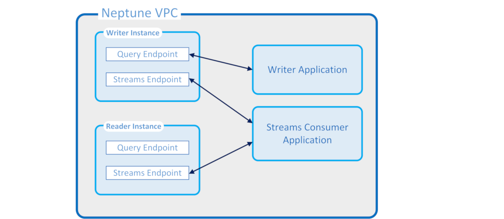

# Capturing graph changes in real time using Neptune streams

Neptune Streams logs every change to your graph as it happens, in the order that it is
made, in a fully managed way. Once you enable Streams, Neptune takes care of availability,
backup, security and expiry.

###### Note

This feature was available in [Lab Mode](features-lab-mode.md "features-lab-mode.md")
starting with [Release 1.0.1.0.200463.0 (2019-10-15)](engine-releases-1.0.1.0.200463.md "engine-releases-1.0.1.0.200463.md"), and is available for
production use starting with [Neptune engine
release 1.0.2.2.R2](engine-releases-1.0.2.2.md "engine-releases-1.0.2.2.md").

The following are some of the many use cases where you might want to capture changes to a
graph as they occur:

- You might want your application to notify people automatically when
  certain changes are made.
- You might want to maintain a current version of your graph data in another data store also,
  such as Amazon OpenSearch Service, Amazon ElastiCache, or Amazon Simple Storage Service (Amazon S3).
  Neptune uses the same native storage for the change-log stream as for graph data. It
  writes change log entries synchronously together with the transaction that makes those changes.
  You retrieve these change records from the log stream using an HTTP REST API. (For information,
  see [Calling the Streams API](streams-using-api-call.md "streams-using-api-call.md").)

The following diagram shows how change-log data can be retrieved from Neptune Streams.

###### Neptune streams guarantees

- Changes made by a transaction are immediately available for reading from both writer and
  readers as soon as the transaction is complete (aside from any normal replication lag in
  readers).
- Change records appear strictly sequentially, in the order in which
  they occurred (this includes the changes made within a transaction).
- The changes streams contain no duplicates. Each change is
  logged only once.
- The changes streams are complete. No changes are lost or omitted.
- The changes streams contain all the information needed to
  determine the complete state of the database itself at any point in time,
  provided that the starting state is known.
- Streams can be turned on or off at any time.

###### Neptune streams operational properties

- The change-log stream is fully managed.
- Change-log data is written synchronously as part of the same
  transaction that makes a change.
- When Neptune Streams are enabled, you incur I/O and storage
  charges associated with the change-log data.
- By default, change records are automatically purged one week after they
  are created. Starting with [engine release
  1.2.0.0](engine-releases-1.2.0.md "engine-releases-1.2.0.md"), this retention period can be changed using the the [neptune_streams_expiry_days](parameters.md#parameters-db-cluster-parameters-neptune_streams_expiry_days "parameters.md#parameters-db-cluster-parameters-neptune_streams_expiry_days")
  DB cluster parameter to any number of days between 1 and 90.
- Read performance on the streams scales with instances.
- You can achieve high availability and read throughput using read replicas. There is no limit
  on the number of stream readers that you can create and use concurrently.
- Change-log data is replicated across multiple Availability Zones, making it highly
  durable.
- The log data is as secure as your graph data itself. It can be encrypted at rest and in
  transit. Access can be controlled using IAM, Amazon VPC, and AWS Key Management Service (AWS KMS). Like the graph
  data, it can be backed up and later restored using point-in-time restores (PITR).
- The synchronous writing of stream data as part of each transaction
  causes a slight degradation in overall write performance.
- Stream data is not sharded, because Neptune is single-sharded
  by design.
- The log stream `GetRecords` API uses the same resources as all other Neptune
  graph operations. This means that clients need to load balance between stream requests and
  other DB requests.
- When streams are disabled, all log data becomes inaccessible immediately. This means that you
  must read all log data of interest to you before you disable logging.
- There is currently no native integration with AWS Lambda. The log stream
  does not generate an event that can trigger a Lambda function.

###### Topics

- [Using Neptune Streams](streams-using.md "streams-using.md")
- [Serialization Formats in Neptune Streams](streams-change-formats.md "streams-change-formats.md")
- [Neptune Streams Examples](streams-examples.md "streams-examples.md")
- [Using AWS CloudFormation to Set Up Neptune-to-Neptune
  Replication with the Streams Consumer Application](streams-consumer-setup.md "streams-consumer-setup.md")
- [Using Neptune streams cross-region replication for disaster recovery](streams-disaster-recovery.md "streams-disaster-recovery.md")
