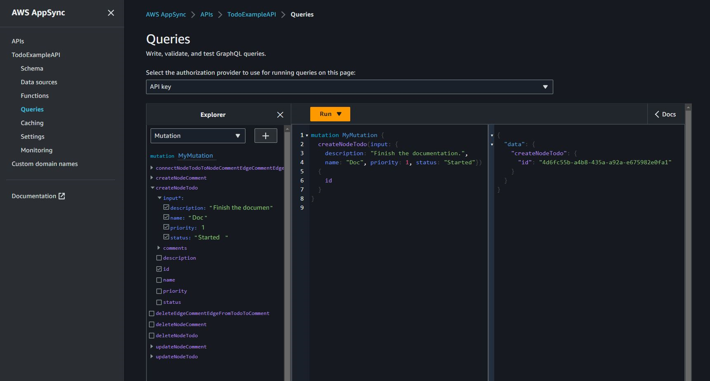
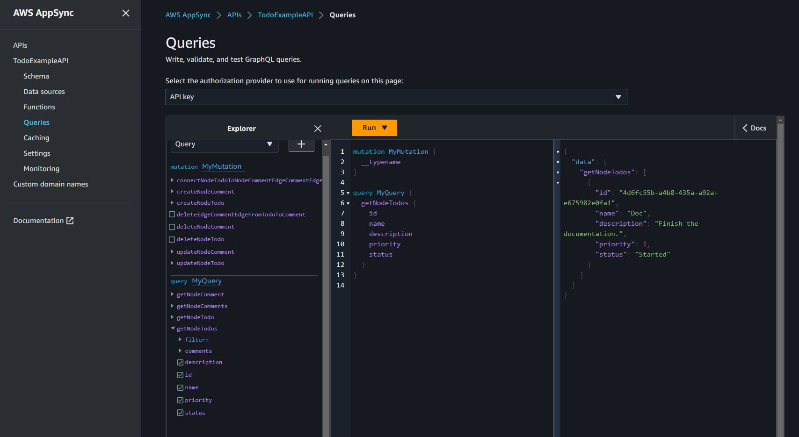
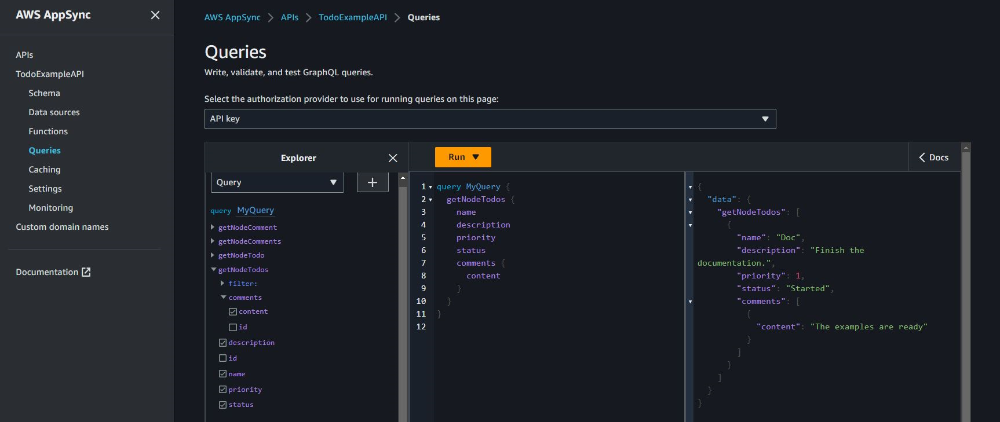

# Starting from a GraphQL schema with no directives

You can start from an empty Neptune database and use a GraphQL schema with no
directives to create the data and query it. The command below automatically creates
AWS resources to do this:

```
neptune-for-graphql \
  --input-schema-file `(your GraphQL schema file)`
  --create-update-aws-pipeline \
  --create-update-aws-pipeline-name `(name for your new GraphQL API)` \
  --create-update-aws-pipeline-neptune-endpoint `(your Neptune database endpoint)`:`(port number)` \
  --output-resolver-query-https
```

The GraphQL schema file must include the GraphQL schema types, as shown in the TODO
example below. The utility analyzes your schema and creates an extended version based
on your types. It adds queries and mutations for the nodes stored in the graph database,
and if your schema has nested types, it adds relationships between the types stored
as edges in the database.

The utility creates an AppSync GraphQL API, and all the AWS resources required.
These include a pair of IAM roles and a Lambda function that contains the GraphQL
resolver code. When the command completes, you can find a new GraphQL API with the
name you specified in the AppSync console. To test it, use **Queries**
in the AppSync menu.

The example below illustrates how this works:

## Todo example, starting from a GraphQL schema with no directives

In this example we start from a Todo GraphQL schema with no directives, which you
can find in the `???samples???` directory. It includes
these two types:

```
type Todo {
  name: String
  description: String
  priority: Int
  status: String
  comments: [Comment]
}

type Comment {
  content: String
}
```

This command processes the Todo schema and an endpoint of an empty Neptune
database to create a GraphQL API in AWS AppSync:

```
neptune-for-graphql /
  --input-schema-file ./samples/todo.schema.graphql \
  --create-update-aws-pipeline \
  --create-update-aws-pipeline-name TodoExample \
  --create-update-aws-pipeline-neptune-endpoint `(empty Neptune database endpoint)`:`(port number)` \
  --output-resolver-query-https
```

The utility creates a new file in the output folder called `TodoExample.source.graphql`,
and the GraphQL API in AppSync. The utility infers the following:

- In the Todo type it added `@relationship` for a new CommentEdge type.
  This instructs the resolver to connect Todo to Comment using a graph database edge called
  CommentEdge.
- It added a new input called TodoInput to help the queries and mutations.
- It added two queries for each type (Todo, Comment): one to retrieve a
  single type using an `id` or any of the type fields listed in the input, and the
  other to retrieve multiple values, filtered using the input for that type.
- It added three mutations for each type: create, update and delete.
  The type to delete is specified using an `id` or the input for that type.
  These mutations affect the data stored in the Neptune database.
- It added two mutations for connections: connect and delete.
  They take as input the node ids of the from and to vertices used by Neptune
  and the connection are edges in the database.

The resolver recognizes the queries and mutations by their names, but you can
customize them as shown [below](tools.md "tools.md").

Here is the content of the `TodoExample.source.graphql` file:

```
type Todo {
  _id: ID! @id
  name: String
  description: String
  priority: Int
  status: String
  comments(filter: CommentInput, options: Options): [Comment] @relationship(type: "CommentEdge", direction: OUT)
  bestComment: Comment @relationship(type: "CommentEdge", direction: OUT)
  commentEdge: CommentEdge
}

type Comment {
  _id: ID! @id
  content: String
}

input Options {
  limit: Int
}

input TodoInput {
  _id: ID @id
  name: String
  description: String
  priority: Int
  status: String
}

type CommentEdge {
  _id: ID! @id
}

input CommentInput {
  _id: ID @id
  content: String
}

input Options {
  limit: Int
}

type Query {
  getNodeTodo(filter: TodoInput, options: Options): Todo
  getNodeTodos(filter: TodoInput): [Todo]
  getNodeComment(filter: CommentInput, options: Options): Comment
  getNodeComments(filter: CommentInput): [Comment]
}

type Mutation {
  createNodeTodo(input: TodoInput!): Todo
  updateNodeTodo(input: TodoInput!): Todo
  deleteNodeTodo(_id: ID!): Boolean
  connectNodeTodoToNodeCommentEdgeCommentEdge(from_id: ID!, to_id: ID!): CommentEdge
  deleteEdgeCommentEdgeFromTodoToComment(from_id: ID!, to_id: ID!): Boolean
  createNodeComment(input: CommentInput!): Comment
  updateNodeComment(input: CommentInput!): Comment
  deleteNodeComment(_id: ID!): Boolean
}

schema {
  query: Query
  mutation: Mutation
}
```

Now you can create and query data. Here is a snapshot of the AppSync
**Queries** console used to test the new GraphQL API, named
`TodoExampleAPI` in this case. In the middle window, the Explorer
shows you a list of queries and mutations from which you can pick a query,
the input parameters, and the return fields. This screenshot shows the
the creation of a Todo node type using the `createNodeTodo`
mutation:



This screenshot shows querying all Todo nodes using the `getNodeTodos`
query:



After having created a Comment using `createNodeComment`, you can use
the `connectNodeTodoToNodeCommentEdgeCommentEdge` mutation to connect them
by specifying their ids. Here is a nested query to retrieve Todos and their attached
comments:



If you want to make changes to the `TodoExample.source.graphql` file as
described in [Working with directives](tools-graphql-schema-with-directives.md "tools-graphql-schema-with-directives.md"),
you can then use the edited schema as input and run the utility again. The utility
will then modify the GraphQL API accordingly.
