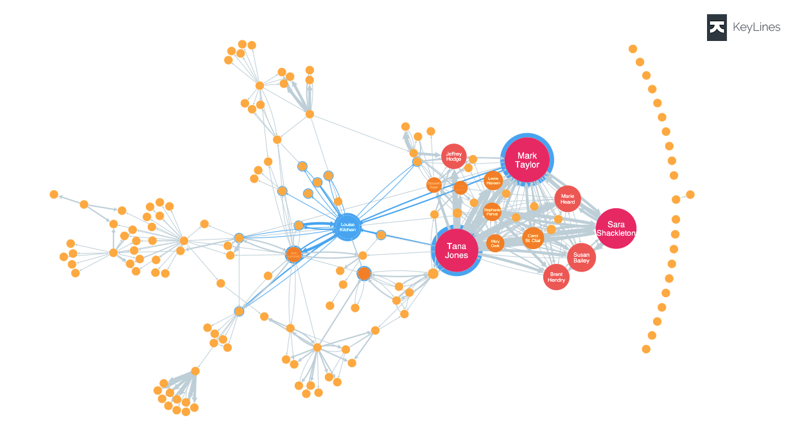

# Cambridge Intelligence

[Cambridge Intelligence](https://cambridge-intelligence.com/ "https://cambridge-intelligence.com/")
provides data visualization technologies for exploring and understanding Amazon Neptune
data. The graph visualization toolkits ([KeyLines](https://cambridge-intelligence.com/keylines/ "https://cambridge-intelligence.com/keylines/")
for JavaScript developers and [ReGraph](https://cambridge-intelligence.com/regraph/ "https://cambridge-intelligence.com/regraph/")
for React developers) offer an easy way to build highly interactive and customizable tools
for web applications. These toolkits leverage WebGL and HTML5 Canvas for fast performance, they support
advanced graph analysis functions, and combine flexibility and scalability with a secure,
robust architecture. These SDKs work with both Neptune Gremlin and RDF data.

Check out these integration tutorials for [Gremlin data](https://cambridge-intelligence.com/keylines/amazon-neptune/tutorial/ "https://cambridge-intelligence.com/keylines/amazon-neptune/tutorial/"),
[SPARQL
data](https://cambridge-intelligence.com/visualizing-the-amazon-neptune-database-with-keylines/ "https://cambridge-intelligence.com/visualizing-the-amazon-neptune-database-with-keylines/"), and [Neptune
architecture](https://cambridge-intelligence.com/aws-neptune-regraph-tutorial/ "https://cambridge-intelligence.com/aws-neptune-regraph-tutorial/").

Here is a sample KeyLines visualization:

